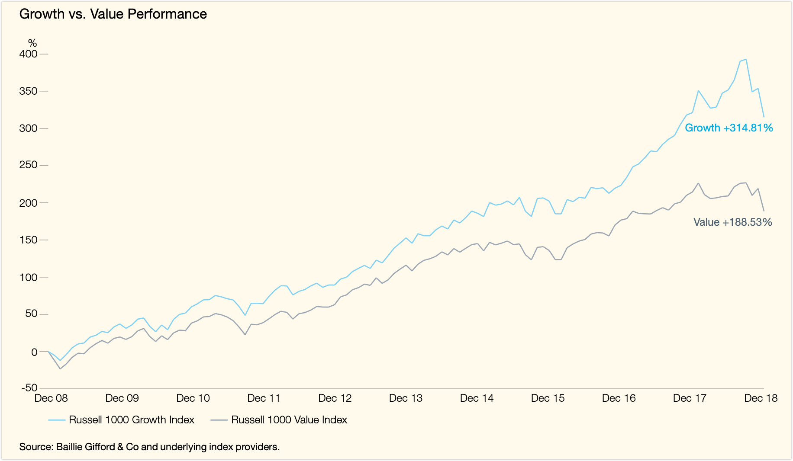
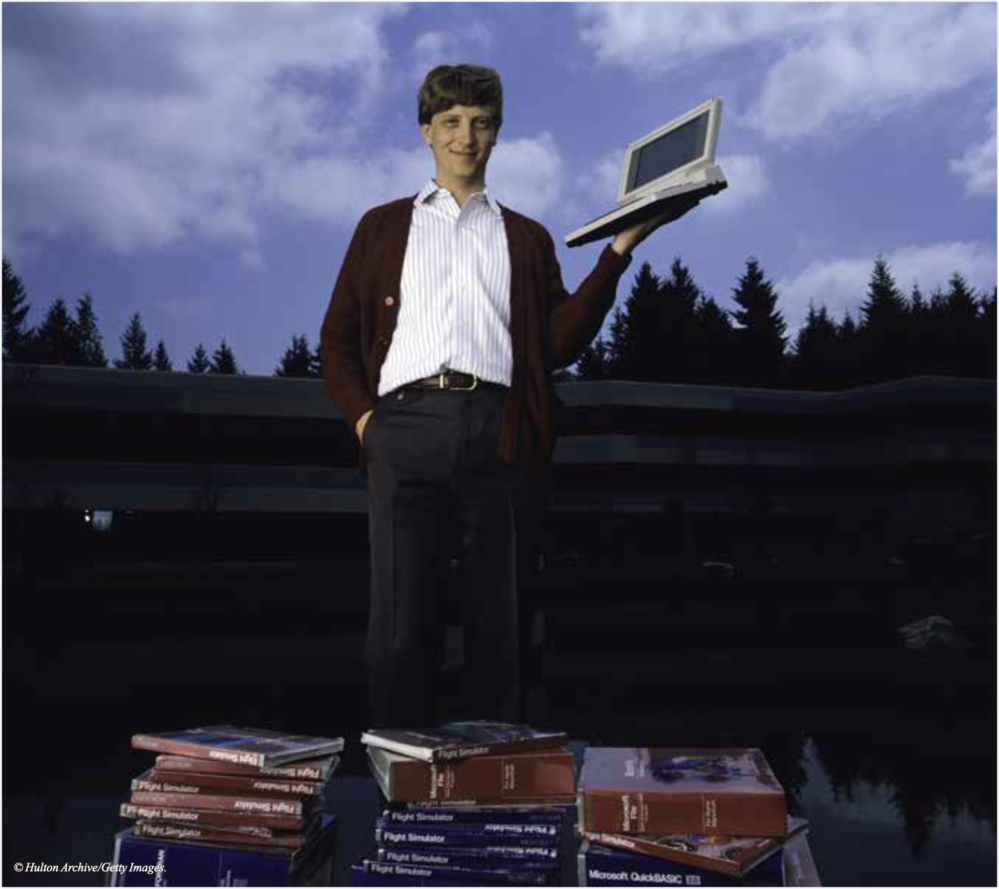
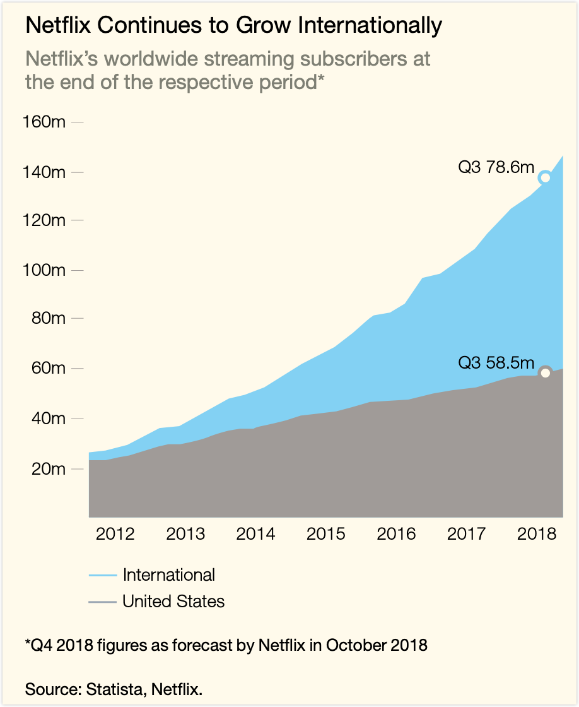
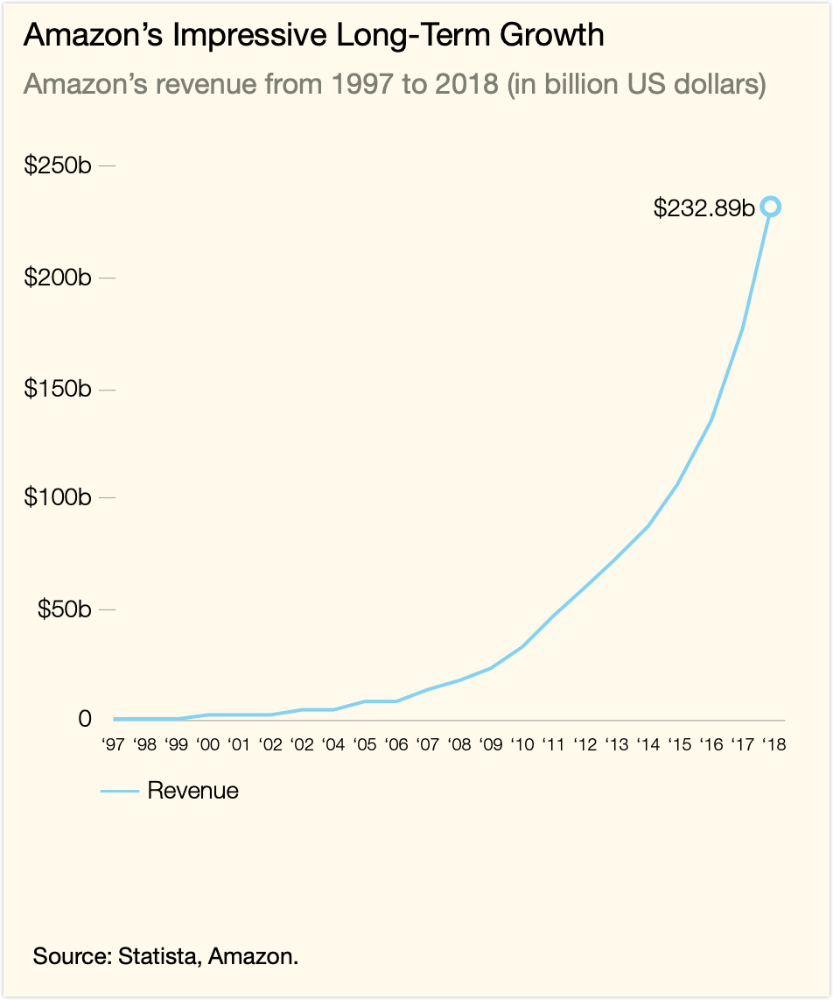
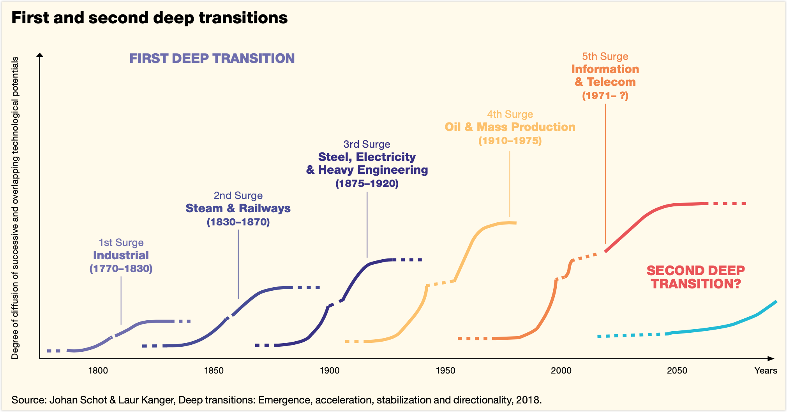
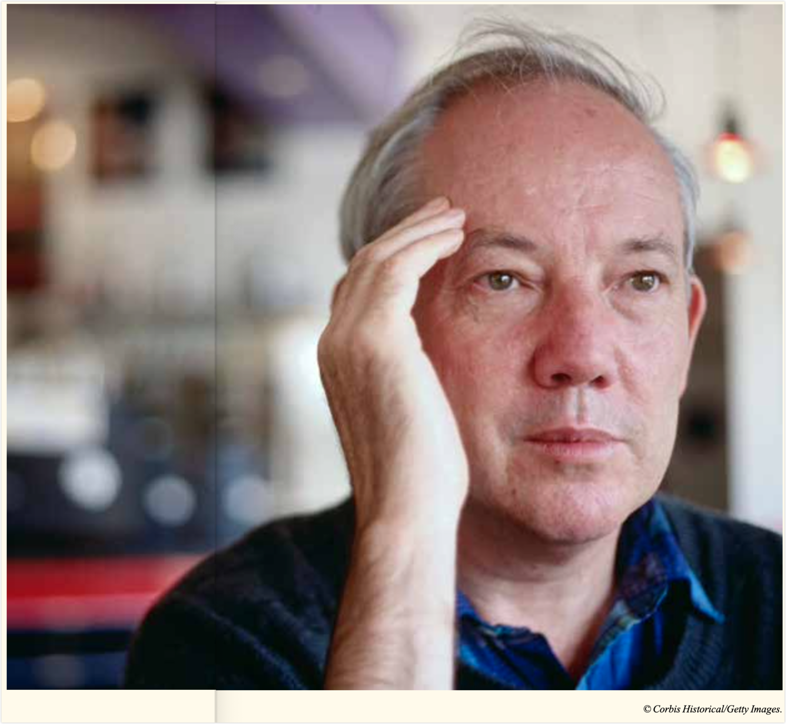
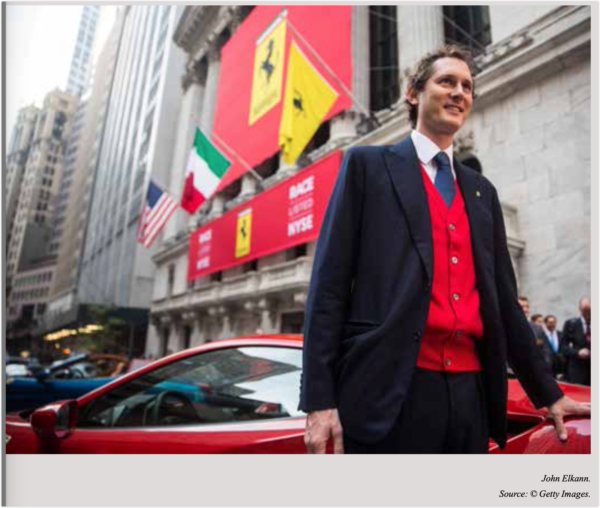

原文信息：

- 链接：[PDF](https://media.bailliegifford.com/mws/ilun0y0u/20240530084113_baillie-gifford-graham-or-growth-48392.pdf)
- 翻译：ChatGPT、Gemini、Claude、DeepL
- 统稿&编辑：Ponge

---

# Graham or Growth? 格雷厄姆还是高成长性？

> We need to do a better job of articulating the case for high-growth investing and questioning damaging assumptions about the workings of equity markets. This is one attempt to do so. 我们必须更清晰有力地说明为什么要坚持高成长投资，同时也要对股票市场运作中那些有害且根深蒂固的假设提出质疑。这篇文章，正是我们迈出的其中一步。
> 
> James Anderson 詹姆斯 · 安德森

# Part 1: Will The Mean Revert? 第一部分：均值终将回归？

## Two Traditions, But Only One Literature 两种投资传统，却只有一种理论体系

> When we first attempted to explore and explain our enthusiasm for Growth Investing 15 years ago it was natural to try to learn from our predecessors. The problem was that there was very little literature to guide us. The only text in the canon of investment that espoused Growth Investing was Philip Fisher's ‘Common Stocks and Uncommon Profits’. It dates from 1958. 15 年前，当我们第一次试图探寻并解释自己对成长投资的热情时，自然而然地想从前辈那里寻找灵感。但当时的问题是，能参考的文献实在太少了。在整个投资领域中，唯一真正站在成长投资立场上的经典，只有菲利普 · 费雪（Philip Fisher）1958 年出版的《普通股与非凡的利润》（Common Stocks and Uncommon Profits）。

Fifteen years on, markets and facts have been generally kind to the cause of Growth Investing. But there is still a shortage of material, whether written, internet or podcast, available that makes the case for a serious and consistent commitment to Growth investing. There's little evidence here that when the facts change investment opinion adapts. There's equally little evidence given for the widespread presumption that time will inevitably and eventually ride to the rescue of value. All too often this is accompanied by a disconcerting sub-text of moral superiority that Growth investors are momentum junkies with no serious commitment or beliefs. Perhaps as a consequence the great majority of clients still seem set on rebalancing away from Growth in determined manner, despite or because of long-term performance well ahead of supposedly unbeatable passive benchmarks.

15 年过去了，市场和事实大体上对成长投资是友善的。但令人遗憾的是，不论是书面、网络还是播客，真正能够系统论证、坚定支持成长投资理念的材料仍然非常稀少。我们几乎看不到，当现实发生变化后，投资界的主流观点能随之调整。同样，也很难找到确凿证据支撑一种普遍存在的信念——即时间终将站在价值投资的这一边。更令人不适的是，这种信念往往暗含一种道德优越感：好像成长投资者只是追涨杀跌、毫无信念的投机客（momentum junkies）。或许正因为如此，很多客户依然坚定地选择把资金从成长投资中撤出，重新配置资产——即便成长投资在长期表现上，早已远远甩开了那些被誉为「不可战胜」的被动基准（passive benchmarks）。

But in marked contrast to the poverty of the Growth literature there is an intellectual tradition, a canon of classics, that surrounds Value investing. This is very much intact in our era from Buffett and Munger to Klarman and Marks. In addition the doctrine of Value has a bible or at very least an Old Testament. So I reread Ben Graham's The Intelligent Investor (in the edition with Jason Zweig's excellent commentary).1 Of course it is wonderful. Of course it has fathered magnificent interpreters and investors. But I don't believe that it invalidates Growth investing. I do believe that transformations in our economic and corporate structures open serious alternative interpretations.

而与成长投资资料的贫瘠形成鲜明对比的是，价值投资拥有一套完整而厚重的知识传统。从巴菲特、芒格到卡拉曼（Klarman）、马克斯（Marks），这一体系至今仍然鲜活。而且，价值投资甚至拥有一本真正意义上的「圣经」，那就是本杰明 · 格雷厄姆（Ben Graham）的《聪明的投资者》（The Intelligent Investor）——尤其是杰森 · 茨威格（Jason Zweig）撰写注释的版本。我重新读了一遍，毫无疑问，这本书精彩绝伦，也确实培养了无数伟大的投资者。但我并不认为它否定了成长投资。我相信，随着经济结构和企业形态的演变，成长投资完全可以在新的环境下，开辟出属于自己的严肃解释空间。

## The Intelligent Investor 聪明的投资者

What are the main tenets of Graham's philosophy? Early on he sets out his case:

格雷厄姆（Graham）投资哲学的核心是什么？在开篇，他就清晰地阐述了自己的观点：

> "We shall suggest as one of our chief requirements here that readers limit themselves to issues selling not far above their tangible asset value...The ultimate result of such a conservative policy is likely to work out better than exciting adventures into the glamorous and dangerous fields of anticipated growth." “我们在此提出的主要要求之一是，读者应将目光聚焦于那些股价不比其有形资产价值高出太多的公司……相比于在充满诱惑但也潜藏风险的预期成长领域进行令人兴奋的冒险，这种保守的投资策略最终更有可能带来稳健的回报。”
> 
> Ben Graham 本 · 格雷厄姆

This summarises his position and requires little embellishment but a few further quotations may be worthwhile. Graham regards "true growth” as meaning per share earnings "should at least double" in 10 years but that any such stocks are commonly subject to “excessive” enthusiasm that has "introduced a speculative element of considerable weight". This means that growth stocks are subject to losses in market downdraughts. Such volatility saw IBM twice losing 50 per cent of its value in its era as the 'best' growth stock. Better therefore to invest in a “group of large companies that are relatively unpopular”. Later this evolves into a verdict that:

这段话精炼地概括了他的投资理念，无需赘述，但进一步引用他的观点或许能加深理解。格雷厄姆认为，「真正的成长」是指一家公司的每股收益在十年内「至少应该翻一番」，但他同时指出，这类股票往往会被「过度的」市场热情追捧，从而「引入了相当程度的投机性」。这种特性使得成长股在市场下行时特别脆弱。例如，曾经被誉为「顶级」成长股的 IBM，就曾在其发展历程中两次遭遇股价腰斩。因此，与其去追逐光鲜亮丽的热门股票，格雷厄姆更主张投资于「一篮子相对不受欢迎的大公司」。他的观点后来演变为这样一个结论：

“Extremely few companies have been able to show a high rate of uninterrupted growth for long periods. Remarkably few, also, of the larger companies suffer ultimate extinction. For most, their history is one of vicissitudes, of ups and downs...”.

「极少有公司能长期持续高速增长。同样地，大多数大公司也不会真正灭绝。企业的命运，大多是波动起伏、跌宕沉浮。」

This formulation is, I think, the closest Graham comes to explicitly endorsing what has become the extraordinarily influential belief in the return to the mean as a fundamental principle of investing. Not though quite as fundamental to Graham as to where he concludes that "to distill the secret of sound investment into three words, we venture the motto, MARGIN OF SAFETY.” Most uncharacteristically the capitals are his.

这其实是格雷厄姆对「均值回归」理念的一种隐性认可——也就是企业最终总会回到某种平均状态。不过，相比均值回归，他心中最核心的信条还是「安全边际（MARGIN OF SAFETY）」，而且是格外强调的（原文甚至用了大写字母）。

As these quotations make clear, Graham was willing to set out broad statements of principle and philosophy. But he always backed these by references to specific examples and overall market outcomes over a period of time. He tells of market declines, of the inability of Growth mutual funds to outperform. In the background is the knowledge of his own superior performance which is not trumpeted as much as the failure of others.

正如以上引述所清晰表明的，格雷厄姆乐于提出宏观的投资原则和哲学理念。但他总是通过引用具体的案例以及一段时间内的整体市场表现来佐证自己的观点。他讲述了市场下跌的案例，以及成长型共同基金难以跑赢大盘的现象。他的分析背后是他自己卓越的投资业绩，但他并没有过多炫耀，而是着重强调了其他投资者的失利。

So let's start with performance. It's quite plain that in the last decade the situation has not been the same as that Graham points to and that many of his clumsier successors point to as an iron rule. It hasn't been better to invest in "a group of large companies that are relatively unpopular”. It's been much better to participate in the "glamorous and dangerous fields of anticipated growth."

那么，让我们首先审视投资业绩。显而易见的是，在过去的十年里，情况已经不同于格雷厄姆所描述的，也不同于他许多不够精明的追随者奉为铁律的情况。「投资于一群相对不被市场追捧的大型公司」的策略并没有带来更好的回报，反而是参与「充满诱惑但也潜藏风险的预期成长领域」的投资表现更为出色。

It becomes still more troublesome if we turn to individual stocks and to far longer periods. Graham believed that doubling earnings over 10 years was a reasonable definition of growth and that such is difficult to achieve — especially for an already large company. At least by implication extending such a record was highly improbable.

如果我们将目光转向个股和更长的时间维度，情况就变得更加复杂。格雷厄姆认为，十年内实现收益翻番可以被视为合理的增长，而实现这一目标非常困难——尤其是对于一家已经规模庞大的公司而言。至少从他的言外之意来看，长期保持这样的增长记录几乎是不可能的。

Yet this simply hasn't been the case. Let's take the comparatively staid Microsoft as an example. By 2008 it had revenues of \$60 billion and earnings of \$1.87 per share but it also had Steve Ballmer as CEO and not unrelatedly appeared to have gone permanently ex-growth. Regulators had controlled its influence and the attempt to reinvent led to the damaging acquisition of Nokia in the years ahead. But by 2018 Microsoft had revenues of \$110 billion, clean earnings of \$3.88 and appears still to be growing at low double digits.

就拿一向稳健低调的微软（Microsoft）来说吧。2008 年时，公司年营收已达到 600 亿美元，每股盈利为 1.87 美元，但那时的 CEO 是史蒂夫·鲍尔默（Steve Ballmer），而且微软看上去似乎已经彻底失去了成长性。监管机构削弱了它的市场支配力，而在重塑自我的过程中，还在之后几年里完成了对诺基亚（Nokia）那场代价高昂、成效甚微的收购。然而到了 2018 年，微软的年营收已经增长到 1100 亿美元，调整后的每股收益达到 3.88 美元，且公司依然以低双位数的速度稳定增长。

The story of Microsoft's last decade is one of impressive persistence of growth and returns at scale and from apparently dire initial circumstances. But its entire history since its IPO in March 1986 at an implied value of a little over $0.5 billion (which Bill Gates thought worryingly demanding) represents an extraordinary challenge to the sceptics of Growth and proselytisers of mean reversion.

微软这十年的成长故事，证明了即使在起步环境极为不利的情况下，也能实现规模化的持续增长与优异回报。而事实上，自 1986 年 3 月以略高于 5 亿美元隐含估值上市以来（连比尔 · 盖茨当时都觉得这个估值要求太高），微软一路走来的整个历史，早已成为对成长投资怀疑论者和均值回归信奉者的一次精彩反击。

In its last year as a private company Microsoft made net profits of \$24 million. For fiscal 2018 it earned \$30.27 billion. That's at a 24 per cent compound growth rate over 33 years with operating margins still over 30 per cent. It's hard to prove but equally easy to believe that this is the most extraordinary record in global corporate history.

在成为上市公司之前的最后一年，微软的净利润仅有 2400 万美元。而到了 2018 财年，它的净利润已飙升至 302.7 亿美元。33 年来，公司实现了年均 24% 的复合增长率，运营利润率依然稳稳维持在 30% 以上。这一成绩，或许难以用严密的数据完全论证，但也几乎毋庸置疑——这是全球企业史上最为惊人的成长记录之一。

It's most improbable that anyone predicted such a prolonged period of extraordinary success — and even more improbable that any investor who argued that it was possible and invested accordingly would have been taken seriously. But it's such extremes that matter — and that need to be acknowledged and understood.

几乎没人能预见微软会连续几十年取得如此惊人的成功——更不用说，如果当年有人相信这种可能性并据此投资，恐怕也难以获得旁人的认可。但恰恰是这种极端案例，才真正值得我们重视、反思与理解。

Alphabet is far racier. Again it's quite a challenge to the Graham hypothesis. In 2008 Google earned \$4.2 billion on revenues of \$21.8 billion. Ten years later this has become \$30.7 billion on revenue of \$136.8 billion for Alphabet. Moreover it has never been that difficult an investment thesis to comprehend: as Graham's disciples at Berkshire Hathaway acknowledge the competitive moat was such that as Charlie Munger put it in 2017 he and Buffett were "probably smart enough” to have figured out Google so "we failed you there".

Alphabet（谷歌母公司）的成长路径则更加激进，对格雷厄姆理论也是一次不小的挑战。2008 年，谷歌（Google）的营收为 218 亿美元，净利润 42 亿美元；十年后，Alphabet 的营收增长到了 1368 亿美元，净利润也达到了 307 亿美元。而且，从投资角度来看，理解这家公司并不是件太难的事：正如伯克希尔 · 哈撒韦（Berkshire Hathaway）内部的格雷厄姆追随者们承认的那样，谷歌拥有极深的护城河（competitive moat），以至于查理 · 芒格在 2017 年直言，他和巴菲特其实「应该足够聪明看懂谷歌，但在这件事上，我们确实让大家失望了。」

Alphabet, of course, has generated huge amounts of free cash but there's still another category of deeply successful stocks to this point that would presumably have aroused wry and mordant humour from Graham. What would he have made of Netflix? Or Amazon? Almost certainly he'd have mocked their tolerance of losses but if we are tempted by potential how do we think about subscribers or sales growing as shown below:

当然，Alphabet 创造了可观的自由现金流，不过除此之外，还有一类同样极度成功的公司股票，想必会让格雷厄姆忍不住露出冷嘲热讽的笑容。他会怎么看奈飞（Netflix）和亚马逊（Amazon）？几乎可以肯定，他会批评这些公司对长期亏损的宽容。但如果我们愿意为潜力买单，当看到它们用户数和销售额一路飙升（如下所示）时，又该如何重新评估它们的价值呢？

Of course Graham didn't cover China but Alibaba and Tencent would probably not have met his desire for a margin of safety at any point in their ascent.

当然，格雷厄姆当年并未涉足中国市场，但从阿里巴巴和腾讯的成长轨迹来看，它们在各自的上升过程中，恐怕始终难以符合他对于「安全边际」的严格标准。

Now in a sense I'm reluctant to lay out these examples over the last decade as I really don't wish to seem either dismissive or smug. What I'm trying to convey is that over time frames Graham himself used the outcomes have been inordinately different from his philosophical and practical expectations.

说实话，我并不太愿意列举过去十年的这些案例，因为我并不想给人一种轻视或自满的印象。我真正想强调的是，如果以格雷厄姆自己所推崇的时间尺度来看，现实世界的投资结果，早已和他当初的理念与实践预期大相径庭。

Yet outcomes are simply the starting point for attempting to understand what might be happening. Graham and several of his most notable followers were and are great investors and deep thinkers. So for their approaches to be so challenged by events there must be at least the possibility that something profound may have changed in heaven and earth. What this might be is fascinating. It's also potentially vital to trying to understand what may come next. This is much more important than crowing about the last decade.

但投资结果，其实只是理解变化的起点而已。格雷厄姆以及他的几位著名追随者，既是杰出的投资者，也是深邃的思想家。如果连他们的方法都被现实动摇了，那么至少说明，这个世界或许已经在某些深层次发生了巨变。弄清楚这种变化究竟是什么，不仅极具启发意义，更可能是理解未来走势的关键。这，远比沉迷于过去十年的辉煌要重要得多。

## Uncertainty 不确定性

First though we need to reflect on the limitations of our understanding. It's crucial that we acknowledge this. Whether it be the inherent confidence of Graham that despite oscillations he would turn out to be generally correct, or less justified certainties of the great majority of market commentators and stock analysts that we now have to endure, I'd suggest that we need to be acutely more sceptical about the significance of outcomes.

不过在此之前，我们必须认真反思自身认知的局限。这一点至关重要。无论是格雷厄姆那种带着坚定信念的态度——相信即便市场震荡，最终自己的判断依然成立，还是如今大多数市场评论员与分析师们习以为常、但其实缺乏依据的自信断言，我认为我们都需要对所谓投资结果的重要性，保持更加警醒而深刻的怀疑精神。

This is the direction that the far more rigorous disciplines of science and mathematics are encouraging us to take. The very idea that 150 years of chance occurrences in a small and acutely biased selection of countries provides satisfactory evidence to make projections about the working of markets and the range of outcomes would horrify most of the greatest minds of our times. As Nobel laureate, co-founder of the Santa Fe Institute (and according to The New York Times headline The Man Who Knows Everything) Murray Gell-Mann frequently stresses we are far too prone to see what has happened as both preordained and a far smaller percentage of the possible outcomes than we care to believe. As he wrote we and our surroundings are better thought of as "the frozen accidents of history".

科学和数学这些更为严谨的领域，其实早已在提醒我们，要换一种看待世界的方式。仅凭 150 年间，发生在少数几个、且充满偏见的国家里的种种偶发事件，就试图推断出市场规律和结果分布，这种做法在许多当代最杰出的头脑看来，简直不可理喻。诺贝尔奖得主、圣塔菲研究所（Santa Fe Institute）联合创始人、被《纽约时报》称为「无所不知的人」的默里 · 盖尔曼（Murray Gell-Mann）就一再强调：我们太容易把已经发生的事情看成命中注定，而实际上，它们只是众多可能性中极其微小的一部分。正如他所说，我们和我们所处的世界，本质上只是「历史凝固的偶然」。

An example he used over 20 years ago has especial piquancy today. Gell-Mann pointed out that Henry VIII only inherited the English throne because his brother Arthur, of a rather different temperament, happened to die (after making a marriage that immensely influenced the Reformation). Gell-Mann concluded that this led on finally to the "antics of Charles and Diana." Brought up to date he might well say it led onto Brexit.

盖尔曼在二十多年前举过一个例子，如今看来格外发人深省。他指出，亨利八世（Henry VIII）之所以登上英格兰王位，完全是因为他性格迥异的兄长亚瑟（Arthur）意外去世了。而亚瑟的婚姻，也在后来深刻地影响了宗教改革。盖尔曼当时总结说，这一连串偶然事件，最终酿成了「查尔斯王子与戴安娜王妃的种种闹剧」。如果换成今天，他大概会补充一句，这股历史暗流甚至最终推动了英国脱欧（Brexit）。

There's another example that is perhaps even more provocative. In Buffalo Bill's Wild West Show Annie Oakley proclaimed her ability to shoot the end off a cigarette and requested volunteers to demonstrate her skill. Normally no one came forward. So Annie's husband hid in the audience in order to take on the role. But at a show in Europe there was a brave volunteer. Annie had been drinking in a beer garden late the previous evening and was unnerved by the turn of events. Such was her professionalism that even with a thick head she managed the trick. Now this may be thought of as impressive but unimportant. But the unexpected volunteer was her great admirer the young Kaiser Wilhelm. There have been many lurches in the accepted historiography of the First World War but few, if any, accounts, think his aggression and personal failings were irrelevant. **If only Annie's hand shook or if the beer had been of Belgian not German strength world history might have taken a very different path.**

还有一个更耐人寻味的故事。在「野牛比尔（Buffalo Bill）的西部大秀」上，安妮 · 奥克利（Annie Oakley）曾自信地宣称，自己能一枪打掉香烟的烟头，并邀请观众上台配合她展示神技。通常情况下，没有人敢应声。于是，安妮的丈夫就会假扮成观众，悄悄站出来。不过，在一次欧洲巡演中，真的出现了一位勇敢的志愿者。巧的是，前一晚安妮在啤酒花园里喝得有些过量，这突如其来的变化让她心里一阵发虚。但凭着超凡的职业素养，即便是宿醉头疼，她还是精准完成了射击。听起来似乎不过是场表演的小插曲。但那个临时上台的志愿者，正是她的铁杆粉丝——年轻的威廉皇帝（Kaiser Wilhelm）。关于第一次世界大战的主流叙事虽然几经更迭，但有一点几乎无人质疑：威廉的好战性格和个人缺陷，绝非无关紧要的小事。**想想看，如果当时安妮的手稍微颤抖一下，或者那晚喝的是比利时啤酒（通常酒劲更足），而不是德国啤酒，世界历史也许就彻底改写了。**

These are historical examples but they are emblematic of the flaws of both financial and economic theories. Personally I lost any belief in the twin notions of predictability and efficiency on October 19, 1987. The S&P 500 losing 20 per cent of its value on no news at all seemed a little hard to rationalise away. But whatever the trigger for each of us, surely we have to accept that we live in markets and economies (see 2008) that are profoundly inimical to the traditions of equilibrium economics.

这些历史故事，不只是趣闻，它们其实也是金融和经济理论种种缺陷的缩影。就我个人来说，我是在 1987 年 10 月 19 日彻底失去了对「可预测性」和「市场有效性」这两大信条的信仰的。那一天，标准普尔 500 指数在毫无消息刺激的情况下，硬生生暴跌了 20%。要说还能用常规理论解释，我是怎么也说服不了自己的。当然，每个人觉醒的契机不同。但无论是哪一次冲击，我们都不得不承认这样一个事实：我们生活在的市场和经济环境（看看 2008 年就明白了），根本就和传统的均衡经济学格格不入，甚至是天然对立的。

Instead we live and work within complex, unpredictable and probably inexplicable systems. In an analogy described by Melanie Mitchell in *Complexity* capital markets are as strange, opaque and puzzling as the workings of our immune system. Or as Gell-Mann suggests, as hard to predict as circulating particles with brains and emotions. The actual outcome that occurs is just one choice amongst an infinite number. Moreover that one now frozen occurrence influences the future path in often unfathomable ways. Soccer commentators are fond of mouthing the cliché that 'goals change games' but in business too reversing time and chance is impossible. We can write all we like about the underlying causes of Microsoft's astounding success but it rested on accidents. One of the twists was that when IBM first asked Bill Gates for advice on its proposed operating system Gates suggested that their best source was a company called Digital Resources. But it was run by a gentleman named Gary Kildare who preferred to go hot-air ballooning rather than turn up on time to meet IBM. Only then did IBM go back to Gates.

事实上，我们生活和工作的环境，是一个复杂、不可预测，甚至很多时候难以解释的系统。正如梅拉妮 · 米切尔（Melanie Mitchell）在《复杂（Complexity）》中形容的那样，资本市场的运作，就像我们免疫系统一样，神秘、晦涩又令人摸不着头脑。而按照盖尔曼的说法，市场就像一群带着大脑和情绪的粒子在不停运动，根本无法准确预测。现实中，每一个发生的结果，只是无数可能路径中的随机一种。而且，一旦发生，它又会以深不可测的方式影响未来的轨迹。足球评论员爱说一句老话：「进球改变比赛」。同样，在商业世界里，时间和偶然也是不可逆转的。我们当然可以洋洋洒洒写出一堆关于微软成功背后的深层逻辑，但归根结底，偶然因素不可忽视。比如，当年 IBM 第一次找比尔 · 盖茨咨询开发操作系统时，盖茨其实建议他们去联系一家叫 Digital Resources 的公司。但偏偏那家公司负责人加里 · 基尔代尔（Gary Kildare）太爱玩热气球了，竟然放鸽子，没有按时赴约。于是，IBM 只好转头回来找盖茨，后面的故事也就此改写了。

It seems likely that the complexity, unpredictability and path dependence of our markets has grown over the decades since the early rites of Microsoft let alone the marriages of Henry VIII. But even without this surmise it seems that we may be better off simply acknowledging existential uncertainty in return structures. Both the Value driven dictums of Graham and the extremes of Microsoft and other platform Growth stocks may be the near random outcome of an almost infinite set of possibilities in each period. Neither should be treated as permanent laws of finance.

看起来，自从微软刚起步，乃至更早的亨利八世（Henry VIII）联姻时代以来，我们的市场在复杂性、不可预测性和路径依赖性上，已经经历了几十年的不断加剧。但即便不去推测这种变化，仅仅基于现状，我们也应该坦然接受一个事实：在投资回报的结构中，存在着根本性的、不确定的本质。无论是格雷厄姆提出的价值投资信条，还是微软及其他平台型成长股那种看似极端的成功，很可能都只是无数可能性中的一种近似随机结果。这些现象，不能也不应该被当作金融世界中亘古不变的铁律。

## Future States 未来局势

Nevertheless we can only posit the nature of possible future returns if we develop some perspectives about the underlying nature of the global economy. This is very far away from predicting GDP or interest rates in the next year. What it seems to require from us is contemplating the conceivable directions and levels of change that may take place over the coming 10 to 20 years.

要想推测未来可能的投资回报，我们首先得对全球经济的本质有一番理解。这可不是简单地预测明年 GDP 增长多少、利率升还是降那么短期的事。真正重要的是，我们需要认真思考，在未来 10 到 20 年里，全球经济可能朝哪些方向变化，幅度又会有多大。

All too often the oscillations between growth and value, between extreme growth and GARP (Growth at a Reasonable Price) are seen as independent financial variables disconnected from the evolution of the underlying economy. In the long term, outcomes are generally guided by the battles and interaction between systemic change versus comparative stability and then merely reflected in their market versions of Growth versus Value. In conditions of relative but progressive calm then Berkshire Hathaway reigns supreme, in repeating but not transforming cycles then the philosophy of "vicissitudes" and "ups and downs" of Graham are formidable weapons. But if change is wrenching and dramatic then the equation is likely to be very different. It becomes evident that as Schumpeter proclaimed "Surely, nothing can be more plain or even more trite common sense than the proposition that innovation...is at the centre of practically all the phenomena, difficulties and problems of economic life in capitalist society".

人们常常把成长股与价值股之间的波动，或是极端成长与合理价格成长（GARP）之间的切换，看作是与经济基本面无关的独立金融现象。但从长期来看，这些市场现象其实是深受系统性变革与相对稳定之间拉锯的影响，只不过以成长与价值的市场形式表现出来而已。在经济相对平稳且持续发展的环境下，伯克希尔·哈撒韦无疑是最具统治力的赢家；而在周期不断重复但没有重大变革的年代，格雷厄姆提倡的「盛衰交替」与「起起落落」投资哲学，则成为穿越波动的重要武器。但如果未来出现剧烈而深远的变革，那么一切规则可能都将被打破。正如熊彼特（Schumpeter）曾经强调：「创新，几乎是资本主义社会中所有经济现象、所有困难与所有问题的核心所在。这再明白不过，甚至可以说是老生常谈。」

So beneath the periodic financial crises that have marked the last decades, what we have been living through seems to have been rapid structural change in the Information Technology driven areas but deep stability in most sectors reinforced by globalisation. Hence the arguments between those like Robert Gordon who see innovation as exhausted and the optimists of Silicon Valley.

如果拨开过去几十年来接连不断的金融危机表象来看，我们实际上正经历着信息技术领域的快速结构性变革，同时在其他大多数行业，全球化则加固了原有的稳定格局。也正因为如此，才有了以罗伯特 · 戈登（Robert Gordon）为代表的「创新已枯竭」派，与硅谷那些坚持乐观主义者之间的争论。

Our own contention would be that the likelihood is that we are now entering a period where transformations will be much more dramatic -and much more demanding for incumbents. What has assailed newspapers and retailers of DVDs may well spread far more dramatically-2018 provided meaningful clues. So for instance even investment banks are now willing to acknowledge that investors are questioning the terminal value of oil companies as the fossil fuel era wanes. We're likely to be moving into an age where mean reversion is much less significant than mass creative destruction. The post World War Two model is likely to seem quaint by 2030. Or once again much as Schumpeter put it decades ago:

我们认为，如今我们正步入一个剧烈变革的新时代——对现有企业来说，这将是前所未有的挑战。曾经重创报业和 DVD 零售行业的力量，未来很可能以更快、更广的方式席卷其他领域——其实 2018 年的一些迹象已经透露了这一趋势。比如，现在连投资银行也不得不承认，随着化石燃料时代走向衰落，越来越多的投资者开始质疑石油公司的长期价值。未来的世界，可能再也不是讲「均值回归」的故事，而是充满「创造性毁灭」的浪潮。到 2030 年，二战后那套经济运行模式，恐怕会显得既陈旧又可笑。正如熊彼特几十年前就洞察到的那样：

> "This civilisation is rapidly passing away, however. Let us rejoice or else lament the fact as much as everyone of us likes; but do not let us shut our eyes to it." 不过，这样的文明正在迅速走向终结。是该为此欢庆，还是哀叹，每个人可以自行选择，但我们绝不能对这一变化视而不见。
> 
> Joseph Schumpeter 约瑟夫 · 熊彼特

## A World Utterly Transformed? 一个天翻地覆的世界？

But what if the world coming into view is so profoundly different from our prior existence that we simply can't contemplate or analyse it in any meaningful sense? It's possible that the transition that we are facing is just as wrenching and disorienting as the emergence of the industrial revolution appeared to agricultural labourers. It's not just that the rules of the games will be unknown but that the nature of the economy and corporate life will be mysterious. Against such a potential background of existential uncertainty it's surely wrong to have confidence in any patterns of past behaviour persisting as iron laws of returns. Predicting is intrinsically dangerous, especially if it's in the form of believing that it can be measured in terms of historic volatility. All we can do is explore the possibilities. Keeping an open but prepared mind seems to be the best policy. Another compatible methodology is to adopt the Taleb philosophy of putting our portfolios at risk of beneficial Black Swans without pretending that they are other than unlikely and unpredictable.

如果我们正走向的这个新世界，和过去熟悉的一切完全不同，甚至让我们连分析或理解它都变得无从下手，那怎么办？这场转变，可能跟当年工业革命爆发时，农民面对机器和工厂的冲击一样，令人迷茫、无所适从。到时候，别说规则改了，连整个经济体系和公司的运行方式，都可能让人看不懂。在这种「根本不确定」的背景下，还指望过去的规律继续奏效、按老办法就能获得同样的收益率，那可就太天真了。预测未来，本身就充满风险。尤其是那些以为历史波动率可以量化未来走势的想法，更容易让人误入歧途。我们真正能做的，是尽可能去想象各种可能性。最聪明的策略，恐怕是：既保持开放的心态，又时刻做好准备。同时，也可以借鉴塔勒布（Taleb）的理念——让我们的投资组合有机会受益于「黑天鹅事件」，但别自欺欺人地以为这种好事是常态或可以预见的。

We should disassociate such musings from the mantras of finance. This world of deep uncertainty and tectonic shifts is radically opposed to what after 50 years of failure is still presented as ‘Modern Portfolio Theory’. Perturbingly this with its broader partner of equilibrium-based economics, still holds general academic and professional sway. Amongst our academic partnerships we've had a focus on the importance of history at the broadest possible level in terms of time frame, global reach and its meshing with economics at those scales. We've talked about the work of Ian Morris in the past in this context. We've also cited Carlotta Perez of Sussex University and her brilliant *Technological Revolutions and Financial Capital*. We therefore started to work with Sussex University on the possible transformations of the future. This led to the somewhat complex chart below, but to the much simpler conclusion that we might indeed need to prepare our minds for a New World or even a New Golden Age.

我们应该将这些思考从金融领域那些老生常谈的理论中剥离出来。眼前这个充满不确定性、大变动的世界，和所谓的「现代投资组合理论（Modern Portfolio Theory）」简直是南辕北辙。更讽刺的是，这套 50 年来不断被现实打脸的理论，居然至今还在学界和金融圈里被奉为圭臬。而它背后的「均衡经济学」理念，同样仍然占据主导地位。在我们与学术界的合作中，我们一直强调用最宏观的视角来看待历史的重要性——既包括跨越长时间周期，也包括覆盖全球范围，并将其与同等大尺度的经济学相结合。过去我们谈到过伊恩 · 莫里斯（Ian Morris）的研究，也引用过萨塞克斯大学（Sussex University）的卡洛塔 · 佩雷斯（Carlotta Perez）和她那本精彩的《技术革命与金融资本》。于是，我们开始与萨塞克斯大学合作，尝试理解未来可能会发生的重大变革。虽然我们最终整理出了一张看起来略显复杂的图表，但它带来的启示其实很朴素——我们也许真的得准备迎接一个「新世界」，甚至是一个「新黄金时代」。

Professor Perez herself is less convinced of the likelihood of this transformation than her colleagues. She thinks we need a financial bubble in order to create the pre-conditions — and that we don't get beneficial bubbles just because we require them. Finance is too risk averse for that. Alternatively or additionally we need major government action to make the necessary changes. It's quite possible that this is happening in China under an autocratic regime.

佩雷斯教授本人，其实并不像她的同事那么乐观，认为这场变革一定会到来。她的观点是：要想迎来这样的转型，首先得有一个金融泡沫，去制造出所需的环境。但问题是，泡沫不是说来就来——就算我们「需要」，它也不会因为我们想要就自动发生。金融系统天生对风险太过敏感，不太可能主动制造泡沫。另一个路径，或者说可以同时进行的方案，是由政府出面，推动重大的结构性变革。而在当今世界，这样的剧烈行动，也许真的正在中国发生——一个由政府自上而下主导发展的经济体。

Given the dominant narrative of first neoliberalism and then populism it does appear unlikely that the government action that Professor Perez focuses on as an essential ingredient in building a Golden Age stands any chance of occurring. But it may already be driving the seeds of transformation. The Californian enthusiasm for electric vehicles (EV's) may be cultural but it is also the direct output of legislative pressure and incentives decades before Tesla. In Europe the spate of national and urban plans to ban internal combustion engines in the aftermath of the diesel fiasco seems poised to twist the future. Trump, Brexit and the AFD in Germany excite headlines far more but the rising popularity of green policies and programmes may become more significant. This might even affect American national politics.

在新自由主义和民粹主义轮番主导公众舆论的当下，佩雷斯教授所强调的「政府主导的变革」似乎注定难以登上舞台。但事情可能并不那么绝望——变革的种子或许早已在暗中萌芽。比如，加州对电动车的狂热，表面上看像是一种文化趋势，其实背后早在特斯拉（Tesla）诞生前几十年，就有立法推动和政策激励的积累。在欧洲，柴油车危机之后，很多国家和城市开始出台计划，准备全面淘汰内燃机，这种转向很可能会深刻影响未来的发展方向。虽然特朗普、脱欧或德国极右翼的德国另类选择党（AFD）更容易登上新闻头条，但真正悄悄积聚力量的，可能是那些越来越受欢迎的绿色政策和环保项目。它们甚至有可能反过来改变美国的全国政治生态。

## The Impact In Stock Returns 是什么真正决定了股票的长期回报？

If economic and social change set the bounds of stock market possibilities we all know that they are insufficient to drive great stock performance over the long term. Revenues and returns require persistent competitive strengths and cultural evolution. The examination and identification of competitive moats has been central to the splendour of Buffett and Munger. But just as the neoclassical equilibrium-based version of macroeconomics (and its financial cousins of the calm world of measurable risk within a smooth bell curve) appears distant from reality so too does the established microeconomic legacy seem unable to explain corporate success and failure today. In particular the central idea of declining returns to scale seems lacking in explanatory power. The importance of assets and hence Tobin's Q appears undermined with many physical assets worthless and with dominant companies which have few assets themselves.

很多人以为，经济发展和社会变迁能决定股市的上限。的确，它们提供了一个大背景，但要让一只股票在长期跑赢市场，光靠这些远远不够。真正拉开差距的，是企业能否长期维持竞争优势，以及企业文化是否能不断进化。巴菲特和芒格的成功，很大程度上就是来自于他们对「护城河」——也就是企业竞争壁垒——的深度研究。但就像传统的宏观经济学总是设想一个均衡、平稳、风险可测的理想世界，离现实越来越远一样，老派微观经济学也很难解释现在公司成败的原因。比方说，过去大家信奉「规模越大，回报越低」这套理论，但现在很多现实情况根本不符合；托宾Q（Tobin's Q）这种看重资产价值的分析方法，也越来越不灵了。因为不少公司的实体资产几乎一文不值，而真正牛的公司，反而靠的不是厂房设备，而是技术、品牌和网络效应这些「看不见」的资产。

But Graham's model has found new support from an unanticipated direction. One of the most stimulating books of recent years is Geoffrey West's Scale: the universal laws of life and death in cities and companies. Professor West, though once President of the Santa Fe Institute himself, takes the view that beneath deep complexity there are not just patterns but laws that control the destiny of companies. West sets himself a series of demanding challenges. This is not least true of his putative project assessing companies: "Could there possibly be a quantitative,
predictive science of companies...how they grow, mature and eventually die".

但令人意外的是，格雷厄姆（Graham）的那套价值投资模型，最近竟从一个全新角度得到了「科学界」的力挺。近几年最有启发性的一本书，是前圣塔菲研究所所长杰弗里 · 韦斯特（Geoffrey West）写的《规模：城市与公司生死的普遍法则（Scale: the universal laws of life and death in cities and companies）》。韦斯特虽然研究的是自然科学，却大胆提出一个观点：在企业的复杂系统背后，其实隐藏着可以量化、甚至具有预测力的「自然法则」，这些规律影响着公司的兴衰成败。他提出了一个极具挑战性的问题：「有没有可能建立一门科学，能够量化并预测公司如何成长、走向成熟，最终衰亡？」

Certainly companies occur and vary in size according to a power law as do cities. Yet cities get stronger and more resilient the more they grow, demonstrating an increasing return to scale. But there's no historic evidence that this is so in the corporate world: companies have done about as well as organisms and much less well than cities as they grow "many of their key metrics scale sublinearly like organisms rather than superlinearly like cities...their sublinear scaling therefore suggests that companies also eventually stop growing and ultimately die". This is surely the territory of Graham's “vicissitudes”. All large, mature companies revert to market growth as West concludes.

公司的规模变化也像城市一样，遵循「幂律」分布——就是越大的公司越稀有，小公司数量众多。但有意思的是，城市越大，反而越有生命力，发展速度越来越快，呈现出「规模越大、效率越高」的趋势。可惜，企业却不是这样。历史数据表明，公司不像城市那么幸运。它们的成长模式更像生物体：长到一定程度就慢下来，最终停滞，甚至死亡。正如韦斯特所说：「公司的许多关键数据指标，是次线性扩展（sublinear scaling），就像动物一样，而不是像城市那样的超线性（superlinear）扩展……这意味着公司终究无法无限成长，最终会走向衰退」。这，正是格雷厄姆口中的「世事无常（vicissitudes）」。再庞大、再成熟的公司，最后也只能跟着整个市场的增长节奏缓慢前行，不再高歌猛进——这是一个注定的归宿。

Yet this compelling general picture across times and societies is challenged by the examples we cited earlier. Plainly there have been companies that have scaled superlinearly in recent decades: is this a temporary chance that is noise in the data or something more serious? The answer to this probably carries the future prospects of Growth and Value investing in its wake.

不过，虽然这种跨越不同时代和社会背景的普遍规律看起来很有说服力，但我们前面提到的一些例子却对这种规律提出了挑战。确实，过去几十年中有些公司展现出远超常规的增长速度。这究竟只是数据里的偶然现象，还是反映了一种更深层次的趋势？这个问题的答案，很可能关系到成长投资和价值投资未来的命运。

Our answer would be that there's reason not to exclude the probability of further superlinear scaling in coming decades with the associated extreme performance implications. As to why, we'd turn to a long-time colleague of Geoffrey West. At about the same time that Microsoft's business model first appeared, Brian Arthur started writing about the changing nature of returns. This was not coincidental as Microsoft was one of his key examples.

我们认为，不能轻易排除未来几十年还会出现更多公司实现「超线性增长」的可能，而这类增长往往意味着极端出色的业绩表现。至于我们为什么会这么看，得从杰弗里 · 韦斯特的一位老同事说起。大约在微软商业模式初现端倪的那个时期，布莱恩 · 阿瑟（Brian Arthur）就开始研究收益机制的变化。微软并不是一个随便提的例子，它正是阿瑟用来说明问题的代表性案例之一。

## Increasing Returns To Scale 规模收益递增的力量

Brian Arthur's theory — or rather early explanation of emerging economic reality — provides a convincing rationale for why the era of Value ended. If there are increasing returns to scale (and indeed self-reinforcing increases in revenues to scale) then surely it's rational for firms displaying such characteristics to have the opportunity to be persistently attractive investments. Or in contrast to Geoffrey West's models to be able to display superlinear characteristics. One might even want to suggest that such firms are in important ways more like cities as they are the centres of ecosystems and their advantages stem from this more than traditional competitive moats. It would be naive to expect otherwise. After all the noted economist John Hicks prophesied back in 1939 that any notion of increasing returns would lead to "the wreckage of the greater part of economic theory" so surely it can wreck the best laid plans of stock market participants. As Brian Arthur himself puts it the world is divided:

布莱恩 · 阿瑟提出的理论——或者说他对新经济现实的敏锐洞察——很好地解释了为何「价值投资的黄金时代」逐渐落幕。如果一家企业能够随着规模扩大而获得越来越高的回报，甚至形成收入的自我强化增长，那这类公司自然有可能持续成为市场上最具吸引力的投资对象。它们的表现，也许正好违背了杰弗里 · 韦斯特的经典模型，展现出所谓的「超线性增长」。你甚至可以说，这些企业更像是一座座城市——它们不仅是一个产业生态的核心节点，更是因为这种生态位置才具备了竞争优势，而不是靠传统的「护城河」概念。认为现实不该如此，恐怕才是真正的天真。早在 1939 年，经济学家约翰 · 希克斯（John Hicks）就预言过，如果接受「规模收益递增」这一概念，那么经济学的大部分理论体系都将土崩瓦解。既然如此，这种力量当然也足以颠覆投资者精心制定的投资策略。正如布莱恩 · 阿瑟所说，世界可以划分为两种经济模式：

> "So we can usefully think of two economic regimes or worlds: a bulk-production world yielding products that essentially are congealed resources with a little knowledge and operating according to Marshall's principles of diminishing returns, and a knowledge-based part of the economy yielding products that essentially are congealed knowledge with a little resources and operating under increasing returns." “我们不妨把经济分成两种截然不同的运作模式：一种是传统的大规模生产体系，产品主要由各种物质资源构成，知识成分较少，这类模式遵循的是马歇尔（Marshall）提出的「报酬递减」原则；另一种则是以知识为核心的现代经济，它的产品主要由知识构成，物质资源只是配角，这一体系则运行在「报酬递增」的逻辑之下。”
> 
> Brian Arthur 布莱恩 · 阿瑟

It would be strange indeed for these two systems to produce similar stock market outcomes. Plainly we consider it likely — as far more importantly does Brian Arthur judging by both his recent writings and our enjoyable conversations with him — that the increasing returns system is growing in relative power. Whilst the stock market has intuited much of this it seems questionable to us as to whether practitioner adjustment is nearly complete.

如果这两种截然不同的经济体系最终在股市上产生类似的投资回报，那才真是令人费解。如果这两种经济体系在股市上产生相似的表现，那就未免太反常了。我们显然认为不会如此——而且更重要的是，从布莱恩 · 阿瑟最近的文章以及我们与他交流的情况来看，他也坚定地认为——「报酬递增」这一体系的影响力正在逐步上升。虽然市场已经在某种程度上敏锐地察觉到这种趋势，但我们认为，专业投资界的应对和策略调整，恐怕还远远没有跟上这个变化。

# Part 2: Examples Not Theory 第二部分：用实例说话，不谈空洞理论

> One of Ben Graham's communication gifts lay in his simplicity. A classic instance ofthis lay in his gentle but pointed use of extended company comparisons. Glamour was punctured and persistence extolled. So Chapter 13 of Intelligent Investor is ‘A comparison offour listed companies’. The four chosen are ELTRA, Emery Air, Emhart and Emerson Electric. Only the last survives in its own right. Then Graham gets even keener on this technique: Chapter 17 offered the guidance of ‘Four Extremely Instructive Case Histories’ but didn't exhaust the theme as Chapter 18 comprises 'A Comparison of Eight Pairs of Companies'. Jason Zweig modernised the examples in homage. I can't manage either the style or the number of companies that either provide but how would this exercise look now? The purpose isn't to preach growth but to try to elucidate how the structure of corporate returns, their rewards and disasters may reflect the structural changes that may have occurred over the last 35 years. 本杰明 · 格雷厄姆有个特别厉害的本事——他善于用最简单的方式，传达最有力的观点。他最经典的表达方式之一，就是拿几家公司做对比，轻描淡写地戳破「明星企业」的光环，同时赞美那些长期稳健、持续盈利的企业。《聪明的投资者》第 13 章就叫《四家上市公司的比较》，他选了 ELTRA、Emery Air、Emhart 和 Emerson Electric 四家公司来分析。如今，只有 Emerson Electric 还以独立公司存在。后来他愈发喜欢用这种方式，第 17 章比较了「四个极具教育意义的案例」，第18章干脆搞了「八对公司的比较」。杰森 · 茨威格在新版里也用现代案例延续了这种风格，算是致敬。我做不到他们那样风格自成一派，也列不出那么多公司，但如果我们在今天重新做这样的比较，会得出什么样的结论？这篇文章的目的，并不是要鼓吹成长投资，而是想借由真实案例，看看一家公司的盈利结构、它的成功或失败，是不是反映了过去 35 年间商业世界发生的根本性变化。

## Coca-Cola Versus Facebook 可口可乐 VS 脸书

Choosing Coke as an example is an easy choice. For many decades it has been an essential ingredient in the Berkshire Hathaway portfolio. Moreover it is the focus of one of the great discussions of investing vision as propounded by Charlie Munger. It begins:

用可口可乐来做案例，可以说是再自然不过的选择。几十年来，它始终是伯克希尔 · 哈撒韦投资组合中的压舱石。而且，它还是查理 · 芒格在探讨「投资眼光」时的代表性例子。芒格的这段论述，是这样开场的：

"Imagine it's January of 1884 in Atlanta, Georgia...You and twenty others are invited to present a plan to start a business that will turn a \$2 million investment into a business worth \$2 trillion by 2034".

「设想一下，现在是 1884 年 1 月，地点是佐治亚州亚特兰大……你和另外二十个人被请来，提出一个商业计划。目标是：用区区 200 万美元的本钱，在 2034 年之前打造出一家市值高达 2 万亿美元的企业。」

Munger sketched his plan for Coca-Cola back in 1996. It required only simple principles and simpler maths. The calculation is what less elegant speakers would describe as that of a Total Addressable Market. Munger then inverts as so often — in order to be worth \$2 trillion the world population of 8 billion in 2034 will need 64 ounces of water a day. If a quarter of this comes from cleaner and tastier drinks and your company garners a half of that then you have a market of 2.92 trillion eight ounce servings. With a modest 4 cents a time net he envisages $117 billion of earnings (still growing) by 2034. Then you need practical stimulators and psychological imperatives to come together to give a Pavlovian response that in Munger's terms represents a “lollapalooza” multiplication of motivations and rewards.

芒格早在 1996 年就勾画过他心中的可口可乐宏伟蓝图。这个计划说起来不复杂，只用了几条基本原理，加上一点初中水平的数学。他当时所做的，其实就是我们今天说的「可服务市场总量（Total Addressable Market）」估算。芒格惯常使用「倒推法」来思考问题：要让一家公司到 2034 年市值达到 2 万亿美元，设想届时全球人口是 80 亿，每人每天需要 64 盎司的饮用水。如果其中有 1/4 来自更干净、更美味的饮料，而你的公司能占其中的一半，那市场就变成了 2.92 万亿份（每份八盎司）饮品。如果每份饮品能带来 4 美分的净利润，到 2034 年就是 1170 亿美元的利润，而且还在增长中。但光靠数字还不够，你还得有实际的市场刺激因素，加上能打动人心、让消费者产生「条件反射」的心理驱动力。芒格把这种多重动因交织而成的强烈效应，称为「lollapalooza」——它是动机与回报乘数效应的集中体现。

There's no doubting that such an approach generated a fabulous business for Coke and terrific returns for Berkshire Hathaway. But is it going to attain the \$2 trillion by 2034? In the late 1990s the capital value of the company was already over $175 billion and Munger's targets with reinvested dividends might have seemed feasible if demanding. But over the last 20 years the equity value has only gained 12 per cent in aggregate — \$2 trillion looks far off.

不可否认，芒格当初的这套思路，确实帮可口可乐缔造了庞大的商业帝国，也为伯克希尔 · 哈撒韦带来了非常亮眼的投资回报。但问题是：这家公司真的能在 2034 年做到市值 2 万亿美元吗？早在上世纪 90 年代末，可口可乐的市值就已经突破了 1750 亿美元。如果股息持续再投资，芒格的目标在当时看起来虽然不容易，但也并非遥不可及。但现实是，在过去 20 年里，可口可乐的股权总价值仅仅上涨了 12%。这个表现离 2 万亿美元的市值目标，还差得很远。

Is this just the toll of demanding valuation? After all Graham, who captured stocks in Price Earnings (PE) multiples even though he naturally knew that long-term cash flows were more meaningful, was perennially suspicious of anything over 20x. Before final results, Coca-Cola sells for 23x likely 2018 earnings with a presumed growth rate of 6-8 per cent for the long term. Graham might not have appreciated the double digit Price to Book.

这是否仅仅是过高估值所付出的代价？要知道，格雷厄姆虽然心里明白真正关键的是企业的长期现金流，但他在实际操作中，还是常用市盈率倍数来评估股票。他一向对估值超过 20 倍的公司持怀疑态度。以可口可乐为例，在 2018 年财报公布之前，它的估值大约是当年预期利润的 23 倍。市场预期它的长期增长率是 6% 到 8%。就这个定价来看，连格雷厄姆恐怕也不会认同它那动辄两位数的市净率（Price to Book）。

But whether this is a classical Value stock or not, the most perturbing feature is that there is a clear possibility that the lollapalooza of mutual reinforcement of advantages might be reversing. If it was a vision of wealth, health and modernity in 1884 then by 2019 it seems rather tarnished. As Coca-Cola records in its 10K listing of risk factors "Obesity and other health-related concerns may reduce demand" and separately but additionally "Public debate about perceived negative health consequences of certain ingredients" may reduce demand. Therefore Coke has diversified into water, juices and buying Costa Coffee as its own confidence in the original vision diminishes. I confess that there seems to me to be more scope for a negative lollapalooza here.

可口可乐是不是传统意义上的价值股，这个问题见仁见智。但真正令人担忧的是：原本那个由多重优势互相强化、共同驱动的「lollapalooza」效应，现在可能正在走向反面。如果说在 1884 年时，可口可乐象征着财富、健康和现代生活方式的理想；那么到了 2019 年，这种光环已经明显褪色。正如它自己在 10-K 年度报告中的风险因素所写：「肥胖和其他健康问题可能导致需求下降」；此外，「公众对某些配料可能带来负面健康影响的争议」，也可能影响销量。于是我们看到，可口可乐逐步扩大产品线，布局瓶装水、果汁，甚至买下 Costa 咖啡。这些动作背后，其实反映出公司对原始产品战略的信心正在削弱。我必须承认，在这个阶段，我看到的更像是一个负面版的「lollapalooza」效应正在酝酿。

## Facebook 脸书

So here we have a quintessential high growth company and until recently a noted momentum stock as the initial letter in ‘FAANG'. Anything part of a Jim Cramer acronym can hardly be other than likely to make Mr Graham shudder. But if we blind ourselves to the name how does it compare to Coke as a Value investment or an investment for the long term from here which is essentially what Graham was trying to elucidate in his pairs.

说到 Facebook 这家公司，是典型的高成长代表。直到不久前，它还是市场上的热门动量股之一，并且正是「FAANG」中打头的一家。能被吉姆 · 克莱默（Jim Cramer）用来创造缩写词的企业，恐怕都不是格雷厄姆会安心投资的对象——他听了可能都会打个冷颤。但如果我们抛开缩写词的光环和偏见，回到投资本身来对比：它和可口可乐相比，作为一项价值投资，或者说一项长期持有的投资，现在哪个更具吸引力？这恰恰是格雷厄姆当初在《聪明的投资者》中通过公司配对比较想探讨的核心问题。

Facebook went public on May 18 2012 at $38 per share. This represented an historic PE multiple of 88x. With a peak market value that day of $45 it was capitalised at over \$100 billion. Where are we at the start of February 2019? Facebook trades at 22x historic earnings for 2018. It is forecast to grow 15-25 per cent per annum over the next five years according to NASDAQ.

Facebook 在 2012 年 5 月 18 日上市，发行价为每股 38 美元，当时对应的历史市盈率高达 88 倍。上市首日股价一度冲到 45 美元，总市值突破 1000 亿美元，成为市场热议的焦点。那么到了 2019 年 2 月初，情况已经大不相同。Facebook 的估值降到了 2018 年实际盈利的 22 倍。根据 NASDAQ 的预测，未来五年它的年均增长率将在 15% 到 25% 之间。

If we venture beyond PE towards periods of greater longevity then uncertainty comes more strongly into play. But Graham offers his own formula for assessing medium-term growth. It is sufficiently simple that he felt it important to introduce caveats and a degree of caution later but since what we are considering is the relative values it throws up then we do not have to worry too greatly. The formula is:

如果我们不满足于只看市盈率（PE），而是想从更长期的视角去评估企业价值，那么不确定性自然就更大了。但格雷厄姆早就提出过一个简单的中期增长估值公式。这个公式简单到让他自己都觉得需要提醒读者要小心使用。不过既然我们现在讨论的只是不同投资之间的「相对估值」，那就不必太担心其精确性。公式如下：

Value= Current(Normal) Earnings x (8.5 plus twice the expected growth rate).

股票价值 = 当前（正常）每股收益 x (8.5 + 预期年增长率 x 2)。

So what does this suggest about Coca-Cola and Facebook? For Coke the formula would suggest that the market believes the analyst forecast company is set to grow at a little more than 7.5 per cent over the next 7-10 years. For Facebook the answer appears to be much more at odds with the analysts. In fact Facebook discounts growth just lower than Coca-Cola at a little below 7 per cent. It may be convenient to my suspicions but Coke has since suggested that earnings are likely to be flat in 2019 in its year-end statements.

那我们来看看这个公式套在可口可乐和 Facebook 身上，会得出什么样的结论。对于可口可乐来说，按照这个公式，市场似乎认为分析师的预测是它未来 7 到 10 年的年均增长率会稍高于 7.5%。但 Facebook 的情况就显得更奇怪了。按照当前估值来反推，市场对它的增长预期甚至还低于可口可乐，大约不到 7%。这明显低于分析师给出的 15%-25% 的增速预测。这也许印证了我一直以来的怀疑——而且可口可乐在年报里也「配合」了一把，表示 2019 年的盈利大概率会原地踏步。

What would Graham have said about this? For sure he might have felt that Facebook was an evil fad and that analysts are ever seduced by aggressive growth. Yet isn't there another possibility here? It's hard to say which company relies more on continuing addiction. Yet it's close to indisputable that the Margin of Safety for Facebook is higher on Graham's metrics. Which is the Value stock therefore? Which is more attractive? As Orwell wrote in Animal Farm it's eventually hard to distinguish which is human and which animal.

如果是格雷厄姆来评价，他多半会说 Facebook 不过是一种「邪恶的流行」，而且他一向认为分析师容易被高增长的幻象迷住双眼。但难道就没有别的解读方式吗？我们真的很难判断，到底哪家公司更依赖「让人上瘾」的机制。但几乎可以肯定的是——用格雷厄姆的标准衡量，Facebook 的安全边际更高。所以问题来了：谁才是真正的价值股？谁更值得投资？这就像奥威尔在《动物农庄》里说的，最后你分不清谁是人、谁是猪——界限开始模糊，答案也耐人寻味。

## Margin Of ... Upside？ 「安全边际」，还是「上涨空间」？

Let's pause though and try to put the systemic economic complexity musings back into the stock equation. What they tell us is that we can't know about earnings progress over the next decade — let alone beyond that — but that confessing to deep uncertainty does not prevent us coming to all conclusions. We can formulate different scenarios. We can factor in the possibility of asymmetrically high returns. We can, if with even more openness to doubt, give these visions of the possible future different probabilities. This enables us to form a quite educated sense of whether the upside is substantially higher than the downside. I confess to finding the Margin of Potential Upside more alluring than the classic Margin of Safety.

先别急着下结论，我们不妨停下来，把之前关于系统性经济复杂性的思考，重新带回投资分析的框架里。这些思考的关键在于：未来十年企业的盈利走势，我们根本无法确知，更别说更久远的未来。但承认这种高度不确定性，并不代表我们什么判断都做不了。我们仍然可以设计出不同的情景模型，把那些「上涨远高于下跌」的不对称性收益机会考虑进去。甚至，我们可以进一步为这些可能的未来分配不同的概率权重，形成更立体的判断。这样，我们其实是能有逻辑、有根据地判断：「这笔投资的上行空间，是不是远大于潜在风险？」老实说，相比传统意义上那种强调「保守估值」的安全边际，我个人更被这种「潜在上涨空间的安全边际」所吸引。

The balance of the potential asymmetries matters to Coke as much as Facebook and to Value as much as Growth investing. I'm not at all sure that there is any business about which one can be confident enough-even with the famed Margin of Safety — that losing money can be excluded as beyond the bounds of credibility. In both these cases it would seem far from improbable that the capital loss may be substantial. As we know both Coca-Cola and Facebook operate close to the frontiers of addiction. Their power is therefore also their vulnerability. In both cases there are forceful arguments that consumers would be better off without the product.

无论是可口可乐还是 Facebook，无论是价值投资还是成长投资，投资中的「潜在收益与风险的不对称性」都是关键所在。坦白讲，我并不认为有哪家公司可以让人如此有信心地说：只要有「安全边际」，就绝对不会亏钱。现实中，即使是格雷厄姆最推崇的安全边际，也无法完全排除损失的可能。就可乐和 Facebook 来说，两者未来面临资本亏损的可能性，并不低。而且我们都知道，这两家公司其实都在「让人上瘾」的边缘打转——它们的吸引力，是它们的护城河，但也可能成为隐患。从另一个角度看，也确实有不少理由支持这样一种说法：如果消费者从未接触这些产品，可能活得更健康、也更清醒。

But what about the reverse situation? Which of the two companies offers the better opportunities for substantial upside? Even without a ‘lower' starting multiple and higher returns it's considerably easier to construct a scenario, or an associated discounted cash flow analysis, that is more alluring for Facebook than Coca-Cola. Put another way Instagram and WhatsApp appear much stronger subsidiaries in both competitive and growth metrics than Dasani and Costa Coffee.

那我们换个角度思考：如果不是比谁更「稳」，而是看谁的「上涨潜力」更大呢？即便不考虑 Facebook 目前更低的估值起点或更高的资本回报率，我们也更容易为它画出一个激动人心的增长蓝图，或者做出一个更具吸引力的现金流贴现模型。相比之下，要为可口可乐构建同样有吸引力的情景，就显得吃力许多。再换一个角度看，论子品牌的成长性和竞争力，Facebook 旗下的 Instagram 和 WhatsApp 远远胜过可口可乐旗下的Dasani（纯净水）和 Costa Coffee（咖啡连锁）。

## The Car Industry 聊聊汽车行业

There are few, if any, industries where the decibels of disagreement about stock selection are as rancorous as in the car industry. Why this should be is something of a mystery to me as I have no great enthusiasm for the product. In the last year this has reached fever pitch as amidst more conventional debates the rise of EVs and the very specific controversies surrounding Tesla have reached new levels of hysteria. Amidst the volume of noise the Graham comparison technique seems to offer room for gentler reflection. In this industry we are better off considering a wider set to capture the full range of companies from value to brand to disruptive potential. So here are five examples running the full gamut of the industry and the stock market:

在所有行业中，很少有哪个像汽车行业一样，关于选股的争论能吵得如此激烈、如此情绪化。为什么会这样？其实我也觉得有点奇怪——毕竟我对汽车本身并没有什么热情。但过去一年，争议的「火力」确实明显升级了。一边是传统汽车厂商的优劣之争，另一边是电动车（EV）的迅速崛起，尤其是特斯拉（Tesla）身上的种种争议，已经到了全民围观、情绪爆表的程度。在这种「噪音」密布的氛围中，倒是可以试试格雷厄姆的「公司比较法」，它或许能带来一种更冷静、更理性的分析视角。汽车行业本身跨度极大——从典型的价值型企业，到注重品牌的公司，再到科技属性浓厚、具备颠覆潜力的玩家。因此我们不妨选出一个更具代表性的公司组合，来横向观察行业的全貌。下面这五家公司，就是我用来覆盖整个汽车与资本市场光谱的样本：

### General Motors 通用汽车

The first incarnation of General Motors created a large amount of value, despite bankruptcy in 2009. The marvellous Bessembinder study suggests that GM ranked as the eighth largest value creator in US markets since 1926. The new GM has already taken on many of the hues of the old — apart from its repute for managerial incompetence which has been impressively dispelled by Mary Barra's team. This has included a vigorous attempt to innovate in both the EV segment via the Bolt and autonomous vehicles through Cruise that have been the content underpinning a new slogan 'Zero crashes, Zero Emissions, Zero Congestion'.

通用汽车的第一段历史，虽然最终以 2009 年破产告终，但仍然为股东创造了巨大的价值。根据贝森宾德（Bessembinder）那篇著名的研究，自 1926 年以来，通用汽车是美国股市中第八大「价值创造者」。如今的新通用，虽然是在重组之后重生的，但它已经重新焕发出老通用的许多光辉——不过，过去那种「管理混乱」的差评，如今在玛丽 · 博拉（Mary Barra）所带领的团队手中已被彻底洗刷。她推动的转型令人印象深刻：在电动车领域推出了 Bolt 车型，在自动驾驶方面押注 Cruise，并提出了一个充满未来感的新愿景口号：「零碰撞、零排放、零拥堵（Zero crashes, Zero Emissions, Zero Congestion）」。

For 2018 GM has announced automotive free cash flow of \$4.4 billion on a volume of 8.38 million vehicles on earnings per share of \$5.72. According to the Graham formula used previously, GM is discounting moderately shrinking returns in the future (though it may not be a surprise that analysts forecast 8.5 per cent annual growth). So GM appears to have a value case if you believe that it will contain its vicissitudes to "ups and downs”.

2018 年，通用汽车交出了不错的成绩单：汽车业务的自由现金流达到 44 亿美元，全年销量为 838 万辆，每股收益（EPS）为 5.72 美元。如果我们用前面提到的格雷厄姆公式来计算当前估值，市场似乎在预期通用汽车未来的回报会略有下降——尽管分析师们仍然乐观地预测其年均增长为 8.5%，这倒也不算令人意外。所以，从价值投资的角度看，如果你相信通用汽车能把自己的周期性波动控制在「正常起伏」之内，那它确实看起来是个有潜力的标的。

### BMW 宝马

BMW probably stirs more favourable emotion than any other German company or car company. Drivers usually love the product and analysts are just as prone to superlatives about the calm and collected approach to data and finances. Yet despite this BMW meets the Graham standards for an out of favour blue chip. The shares have persistently fallen from a high of £120 in 2015 to a level of €70–75 in recent months. Perceived virtue has not been its own reward.

在所有德国企业乃至汽车品牌中，恐怕没有哪家能像宝马这样赢得如此广泛的情感认同。车主对它的驾驶体验赞不绝口，分析师们也常称赞其稳健务实、数据驱动的管理风格。但令人讽刺的是，尽管口碑优良，宝马在市场上却活成了格雷厄姆笔下的「失宠蓝筹」——自 2015 年股价高点 120 英镑以来，它的股价一路下滑，最近几个月徘徊在 70 到 75 欧元之间。公认的优点，并没有自动兑现成资本市场的回报。

BMW generated £4.46 billion (approx. \$5.1 billion) in automotive free cash in 2017 on unit sales of a little under 2.5 million. After three quarters in 2018 cash flow was down by 25 per cent. Although the car industry demands respect for cash more than earnings BMW currently trades at 6.5x likely 2018 earnings. These earnings have been hurt by multiple factors from diesel regulation to loss of Californian market share to weak market conditions in China. The multiple assigned to the earnings and free cash has fallen even more sharply. This translates into the Graham equation predicting a state of affairs similar to GM in the next five years: BMW too discounts annual earnings shrinkage in the low single digits. Plainly this is more of a break with the past decades than for GM.

2017年，宝马靠着不到 250 万辆的销量，赚得了 44.6 亿英镑（约 51 亿美元）的汽车业务自由现金流。到了 2018 年前三季度，这一数字却骤降了 25%。在汽车行业，现金流往往比账面利润更值得关注，但就算如此，市场目前也只愿意给宝马大约 6.5 倍的 2018 年预期市盈率。宝马的盈利受到多重打击：柴油车政策趋严、在加州的市场份额流失、中国市场环境疲软……这使得无论是利润还是现金流，市场对它的定价倍数都明显下降。如果套用格雷厄姆公式，宝马未来五年的估值暗示其盈利将以每年低个位数的幅度缩水。这种趋势，其实比起通用汽车，更像是宝马在与过去数十年的高光时刻正式「告别」。

### Ferrari 法拉利

For those who believe that the car industry is dependant on large volumes and is bereft of profitability above the cost of capital Ferrari is the exception that proves the rule. In 2018 Ferrari made €405 million (\$463 million) of industrial free cash which was an improvement of 23.5 per cent on sales of just 9,251 cars. So this translates into free cash of €43,779 per vehicle or over 10 per cent of GM's absolute dollars on just over a thousandth of the production volume. The Graham formula indicates that at a share price of €110 Ferrari is still thought capable of compounding its earnings at around 12.5 per cent in the next 7-10 years. There are no analyst forecasts that go out this far but this is below the five year forecasts that do exist.

在「车多才赚钱、赚得还不多」几乎成了汽车行业共识的背景下，法拉利堪称一枝独秀，打破了这个「铁律」。2018 年，法拉利仅靠销售 9,251 辆车，就实现了 4.05 亿欧元（约 4.63 亿美元）的汽车业务自由现金流，年增幅达到 23.5%。换句话说，每辆车带来的自由现金流高达 43,779 欧元——这意味着，在只有通用汽车产量的千分之一情况下，法拉利却赚到了通用汽车 10% 以上的自由现金流。按格雷厄姆公式推算，在 110 欧元的股价下，市场认为法拉利在未来 7 到 10 年，仍能实现年复合 12.5% 左右的盈利增长。虽然目前没有分析师敢预测那么久远的未来，但这个预期其实还低于现有的五年期增长预测。

Many observers of Ferrari opt to assess it as more of a luxury brand than a car company. But chairman and Agnelli family leader John Elkann disagrees with this. He believes that unless Ferrari is at the cutting edge of automotive technology that brand, let alone nostalgia, will not keep it thriving. What is clear is that if the returns are sustainable then this is a fabulous business. **Selling fabulous businesses is something we should be wary of doing on a regular basis. Or as Philip Fisher wrote the time to sell is "almost never".**

不少人看待法拉利时，认为它更像是一个奢侈品品牌，而不是传统意义上的车企。但公司董事长、阿涅利（Agnelli）家族的掌门人约翰 · 埃尔坎（John Elkann）却不这么看。他坚信，只有法拉利始终站在汽车技术的最前沿，这个品牌才能持续蓬勃发展——光靠情怀，是撑不住的。如果法拉利现在的高回报是能延续下去的，那它无疑是一门了不起的生意。**而像这样的好生意，我们真的该慎重对待，千万别轻易卖出。正如价值投资大师菲利普 · 费雪（Philip Fisher）说的那样：「真正该卖出的时机，几乎从不会到来。」**

### Tesla 特斯拉

The Graham approach with its reliance on simple financial data should be still more valuable in assessing Tesla. Emotions in capital markets are seldom higher than with Tesla. That comes as a persistent given between the founder, the short positions and their associated personalities and the significance of the project to both backers and critics.

格雷厄姆以「看数字说话」著称，他那套基于基础财务数据的投资方法，或许在特斯拉这类公司上反而更显珍贵。毕竟，在资本市场上，很少有哪家公司的情绪波动像特斯拉这么剧烈：创始人自带戏剧张力，空头与多头针锋相对，项目本身又被赋予了太多理想与争议。支持者视它为未来的象征，批评者则视其为泡沫的典范，这一切让特斯拉成为市场情绪的风暴眼。

So what do the basic numbers say? Tesla ended 2018 with free cash flow of -\$2.377 million. This red zero is the amalgamation of two contrasting halves: an outflow of \$1,793.5 million for the first six months followed by an inflow of \$1,791 million in the last two quarters. It's plain that the finally productive ramp of the Model 3 was the cause of the stark difference between the two periods but there is still room to argue about the future pattern. Of course we're happy to argue that the second half is the lead indicator but that is unfair to the Graham reticence to predict especially when optimism is involved. What is clear is that to judge Tesla we need some forward-looking contentions. I'll return to this after a last example.

那我们来看看账面数字怎么说。2018 年特斯拉的自由现金流为 -237.7 万美元。这一「接近打平的亏损」其实是两个迥然不同的半年业绩拼凑出来的：上半年烧掉了 17.935 亿美元，下半年则回流了几乎等额的现金*（17.91 亿美元）。显然，Model 3 产能的成功爬坡，是这前后反差剧烈的核心原因。但问题在于，未来到底会怎么走，还远未盖棺定论。当然，我们乐意认为下半年的表现预示了未来的趋势，但这与格雷厄姆一贯对「预测」特别是「乐观预测」的戒慎态度并不相符。可以肯定的是，要评估特斯拉，单靠回顾历史远远不够，我们得面对未来的不确定性。这个问题，我会在最后一个案例之后再作深入探讨。

### NIO 蔚来

For all the controversies surrounding Tesla it's actually a very basic investment story. It's completely clear that it dominates the EV competitive landscape in America and Europe. In fact as a pure play it has basically zero competitors. In terms of time frame it may be 6-7 years ahead of anybody else in its markets. If you gain conviction in the appeal and economics of EV technology then the case for Tesla is simple. But for NIO the challenge is very different.

尽管围绕特斯拉的争议不断，但其投资逻辑实际上非常清晰。它已经牢牢占据了美国和欧洲电动车市场的主导地位。说得更直接点，作为一家纯电动车公司，它几乎没有真正的对手。从发展进度来看，它可能比其他竞争者领先了六七年。如果你相信电动车的未来，认可它的技术吸引力和商业前景，那投资特斯拉就是个水到渠成的选择。但蔚来面临的局势则复杂得多。

China appears to have close to 500 EV manufacturers. The chaotic and exuberant scene is much like that of the nascent US automotive market before the transforming rationalisations of first Ford and then GM. NIO is far from being the current leader with BYD the historic leader. NIO has few claims to technological leadership and indeed most of its operations are outsourced. NIO has no imminent prospect of turning cash flow positive. It's uncontroversial to suggest that Graham would not have owned NIO.

中国现在大概有将近 500 家电动车制造商，整个行业既混乱又热闹，很像当年福特和通用改革之前，美国汽车市场刚起步时的野蛮生长期。在这当中，蔚来离行业领头羊还有不小的差距，而比亚迪才是真正的长期领导者。蔚来在技术上没有太多优势，而且很多运营环节其实是外包给其他公司的。短期来看，它也看不到实现现金流转正的希望。可以肯定地说，像格雷厄姆那样坚持价值投资原则的人，是不会买蔚来这种股票的。

## Coming To An Overall Perspective On Auto Stocks 关于汽车股的整体判断

If we try to put this all together, how should either a fair minded Value or Growth investor feel about these five car companies? However hard I try I find it hard to see a plausible mean reversion explanation of the past or a convincing hypothesis based on it to guide an assessment of the future. This applies both to the business fundamentals and to equity outcomes.

把这些案例放在一起看，不管是坚持价值投资还是偏好成长投资的投资者，面对这五家汽车公司，可能都会感到困惑。我反复思考，始终难以找到一个靠「均值回归」来解释过去走势的合理逻辑，更别说用它来预测未来的表现了。不论是从企业的经营基本面，还是股票价格的走势来看，均值回归似乎都帮不上忙。

Although it's probably not what mathematicians would identify I'd hazard that the commonest day-to-day practical incarnation of mean reversion in the car industry is the common view that says that it's the profit on every vehicle produced that must mean revert. That's why I mentioned vehicle sales numbers for several of these examples. This is most frequently aimed at Tesla on the basis that its 245,000 sales in 2018 make it inconceivable that it can be worth as much as GM (or Ford or potentially even Toyota). Oddly though, very highly reputed and very self-confident auto analysts find it impossible to imagine that the historic premium returns and premium market rating of BMW are anything other than a permanent and sacrosanct feature. Ferrari meantime is seen as such an extreme outlier that, as we've discussed, the standard approach is to refuse to see it as a car company at all.

虽然严格来讲这不符合数学家对「均值回归」的定义，但在汽车行业里，最常见的一种「日常版本」的均值回归观点是：每辆车的利润最终都会回到一个合理的水平。这也是为什么我前面特意提到一些公司的销量数据。这种观点最常被拿来质疑特斯拉——比如，有人说它 2018 年才卖了 24.5 万辆车，怎么可能值这么多钱？怎么可能和通用、福特，甚至丰田市值差不多？但有趣的是，很多知名度高、信心满满的汽车行业分析师，却对宝马长期享有高利润和高估值这件事毫无怀疑，觉得那是理所当然、永远不会变的。而法拉利更是被当作一个「极端特例」，正如我们之前聊到的，主流分析方法干脆不把它当成真正的汽车公司来看。

**But surely the dominant characteristic of this industry and its stocks isn't mean reversion. It's been deep cyclical uncertainty and it's now sudden change**. It's very much analogous to the story of the turkey. Every day it sees the farmer approach and every day without variability it receives a decent supply of food. It looks like the perfect stock — constant dividends with no volatility! That's the very definition of low risk.

**但说到底，这个行业和它的股票真正的核心特征，其实不是「均值回归」，而是剧烈的周期波动和突如其来的变化**。你可以把它想象成「火鸡的故事」：每天火鸡看到农夫过来，每次都得到丰盛的饲料，天天如此、毫无例外。看上去就像一只理想中的股票——每天都有稳定「分红」，几乎没有波动。这简直就是教科书级别的「低风险」。然而，真正的风险，正是藏在这种看似稳定的背后。

But then the farmer kills the turkey. This is not far away from GM. From September 1908 to June 2009 come wealth, crisis or war GM survived and mostly prospered enough to mean that even eventual bankruptcy could not remove its proud status as one of the best lifetime investments in US history. So if you could have the owned the shares for 101 years your institution was very happy. If you bought in 2008 you were less so. But of the mean in performance there is little to be seen.

问题来了——有一天，农夫把火鸡宰了。这跟通用汽车的历史有点像。从 1908 年 9 月成立，到 2009 年 6 月破产，整整 101 年，不管是经济繁荣、危机还是战争，通用汽车都挺了过来，甚至多数时间都赚了不少。它曾被视为美国史上最成功的长期投资之一。所以如果你早早买进，并一直拿着超过一个世纪，那你所在的投资机构会笑开花。但如果你是在 2008 年，也就是破产前夕才买入，那结局就尴尬了。你会发现，所谓的「均值回归」在这里根本看不到踪影。

Is there any way through these thickets? I'd suggest that there is but that it requires re-thinking most of the traditional verities. It seems clear that the automotive industry is subject to such wild lurches that picking one outcome is remarkably foolhardy. What we can do to ameliorate the situation is to acknowledge existential doubt. The notion of one forecast of the future, of one expected growth rate and one associated discounted cash flow analysis is just too simplistic. This issue arises in comparing Coke and Facebook's upside but here it's much more serious and dramatic. We need multiple versions of the conceivable futures stretching from the scarcely imaginable best case to the end of the turkey's life.

有没有办法走出这片迷雾？我认为有，但前提是我们得放下那些老旧的「投资信条」，重新思考整个分析框架。汽车行业的波动实在太剧烈了，你如果非要预测一个唯一的未来结果，然后押上全部筹码，那几乎等于在赌博。我们更现实的做法，是要正视「不确定性」本身。靠一个预测数字、一个增长率、一个贴现现金流模型来估值，这种思维太过简单粗暴了。当然，这个问题在比较可口可乐和 Facebook 上涨空间的时候已经出现过一次，但在汽车行业，这种「估值幻觉」会带来更剧烈的后果。我们需要的是一整套「多版本未来」：从好得难以置信的理想场景，到像火鸡被宰的最惨剧本，都要纳入视野。

With considerable humility it's then probably helpful to probability weight these different scenarios and update as the path develops. In general it's imperative to push the boundaries of the extreme cases much further than analytical caution usually permits. This isn't about a conventional bull and bear case. On the upside indeed creativity rather than analysis has to be the focus. We're back to Charlie Munger and Atlanta in 1884. In the opposite direction it's better to assume bankruptcy is an ever present possibility for all stocks unless argued explicitly otherwise. That's salutary. It doesn't leave much room for a Margin of Safety. We cannot be safe and investors. But it may leave the possibility of significant upside.

带着充分的谦逊，我们或许应该给不同的未来情境分配概率，并随着市场演化不断调整判断。这比死守一种预测更有价值。而且，我们必须比传统分析更大胆地去扩展「极端情境」的边界。这不是简单的「乐观 vs 悲观」两种版本。在好的方向上，我们比起严密分析，更需要的是想象力。这让人想起查理 · 芒格说的——就像回到 1884 年的亚特兰大，你得能想象那个时候可口可乐会变成什么。而在坏的方向上，一个稳妥的思路是：把「破产」视为所有股票的常态风险，除非有充分证据可以反驳。这种思路虽然冷酷，但它能提醒我们保持清醒。这也意味着「安全边际」的空间其实很小。我们无法既想绝对安全、又想获得出色的投资回报。放弃传统意义上的「安全边际」，或许正是我们有机会抓住超额收益的根本原因。

If we adopt such a process for the automotive stocks then I think we come to a more realistic perspective and one that is considerably more likely to pay off especially when put in the context of an overall portfolio rather than left in isolation. To illustrate this we will take a closer look at the return spectrum for Tesla and NIO.

如果我们用这种方法来看待汽车类股票，我相信会得到一个更贴近现实、也更有可能带来正面回报的投资视角——尤其是在放入整个投资组合中一起考量时，而不是单独拎出来判断。为了更清楚地说明这个思路，我们接下来会仔细看看特斯拉和蔚来这两家公司的潜在回报区间。

What persistently surprises me is how straightforward it is to construct a roadmap for Tesla being worth many times its current market value. It also requires less imagination than in most of the investments we make. This is probably because Tesla 'only' needs to capture currently existing markets to have dramatic potential whereas many of the internet platforms have had to create a new world. On the other hand, whilst it's unlikely that Tesla goes bankrupt (this was a plausible outcome even six months ago) it's still quite possible that the share price could fall 75 per cent. But isn't this the type of skewed, asymmetric and to many frightening sets of potential pay-offs that we should welcome. One way or another it will be growth at an unreasonable price.

让我一直觉得很意外的一点是：如果你试着给特斯拉画一张未来几倍增长的路线图，过程其实异常简单，甚至比我们做的大多数投资还要省想象力。为啥？因为特斯拉要成功，它只需要吃下现有的市场份额。而像很多互联网平台，它们得从零开始，先创造出一个全新的市场。当然了，虽然现在看起来特斯拉破产的概率已经很小了（六个月前这种担心还是有道理的），但它的股价腰斩个七成也不是不可能。可话说回来，这种「不对称回报」——就是大涨的空间很大，大跌也令人胆寒——不正是我们真正应该追求的投资类型吗？无论怎么说，这注定是一场以不太合理的价格参与的「成长型投资」。

Let's first simply consider Model 3 economics on their own. Unit sales could easily reach 1.5 million a year even considering just the current markets for the luxury producers before any beneficial demand shock (akin to the iPhone compared to Nokia). We know that aggregate pricing points will exceed the \$35,000 base ambition by some way. So revenues of \$75 billion are conceivable. Current operating margins are 5.8 per cent but the consistent long-run target has been double digit (and indeed up to 30 per cent at the gross level). The unparalleled control of the battery supply, its technology and data make the competitive advantages plausibly sustainable.

我们先简单看看 Model 3 这款车型的基本「赚钱逻辑」。就算只看现在高端车的市场，不考虑什么「需求爆发」，Model 3 的年销量也很可能轻松突破 150 万辆。要是像当年 iPhone 对诺基亚那样带来颠覆式需求，那就更不用说了。定价方面，我们也知道平均售价肯定会远高于最初的 \$35,000 起步价，所以年收入达到 750 亿美元是完全有可能的。目前它的运营利润率是 5.8%，但公司早就设定了长期目标是两位数（实际上，毛利率高达 30%）。更关键的是，特斯拉对电池供应、核心技术和数据的掌控力几乎无可匹敌，这也让它的「护城河」看起来更稳固、更持久。

Remembering that it isn't a central case we're discussing but an
exploration of the possible upside, let's posit operating margins of
20 per cent (Ferrari makes 25 per cent) and net margins of 16 per cent. That would give earnings from the three of \$12 billion per year with free cash of similar dimensions as capital expenditures would principally be of a maintenance type. Ferrari sells on a free cash flow yield of 2.5 per cent so let's say 3 per cent for this lesser comparator. That gives us a putative equity value of \$400 billion in five years time. What are the chances of such a scenario happening? We are dealing with an unlikely but far from outrageous scenario. The competitive moats seem secure over such a time frame. Customer demand and satisfaction seem supportive. So let's be conservative and say there's a 20 per cent chance of such an outcome for the Model 3 project.

先提醒一句：我们不是在说「最可能发生的事」，而是在大胆想象 Model 3 项目的「最乐观上限」。假设特斯拉的运营利润率能达到 20%（法拉利是 25%），净利润率为 16%。那一年就能赚 120 亿美元。而且因为日常投入大多是维护性质，自由现金流也差不多这个水平。现在我们套用一个估值公式：法拉利的自由现金流收益率是 2.5%，那我们给特斯拉一个稍微保守点的，算 3%。这样一来，它的估值可以达到 4000 亿美元——五年内。听起来疯狂吗？其实并不离谱。在这段时间里，特斯拉的护城河看起来挺牢靠，消费者也买账。所以我们保守估一下，给这种结果一个 20% 的概率。也就是说，Model 3 项目有五分之一的可能达到这个市值。

But, of course, the Model 3 is most unlikely to be the sole contributor. The crossover Y series soon to be unveiled attacks a market at least as large and with even greater pricing indulgence. Then there is the Tesla Truck. Then there is Tesla Energy which is gradually showing its potential under more vigorous leadership. There's the underpinning emphasis on software and software driven upgrades but all this is before the most unlikely but potentially most rewarding opportunity of all in the form of autonomous vehicles. That Tesla has an unusual approach to this challenge should surprise no one. The attractions are that its chances of success seem to be inching upwards from the highly improbable to the merely unlikely and that the size of the prize is hard to estimate but large in the extreme. Adding these possibilities together make it seem that Elon Musk's comment to us six years ago that: "There is a small but growing possibility that Tesla will be the largest company in the world" represents a now highly realistic scenario. None of this means that it is a certainty.

不过，Model 3 显然不会是特斯拉成长的唯一引擎。很快将亮相的 Y 系列跨界车，将打入一个至少同样广阔、甚至更愿意为价格买单的市场。紧接着还有 Tesla 的电动卡车计划，以及在新领导推动下逐渐显露实力的 Tesla Energy（特斯拉能源）业务。再加上特斯拉对软件和软件升级的持续重视——而这一切都还只是序章。真正最令人期待的，也最具潜力的机会，其实藏在大家认为最不可能实现的领域：自动驾驶汽车。特斯拉在这方面的策略向来特立独行，这也不该让人惊讶。它之所以吸引人，是因为原本看似天方夜谭的成功，现在似乎正逐步迈向「虽难但有望」的现实，而它所能带来的收益，大得几乎无法估量。把这些机会加总起来，让人不得不认真思考伊隆 · 马斯克六年前曾说过的一句话：「特斯拉有一个小但不断增长的可能性，会成为全球最大的公司。」如今，这种可能性听起来，已经不再那么遥不可及。当然，这一切依旧不能保证一定会实现。

For NIO the situation is substantially more unpredictable. It's quite clear that the range of outcomes we consider must include a substantial possibility that the shares prove to be worthless. I don't want to inflict too much detail on the reader but our parameters go from a 30 per cent chance of zero or its functional equivalent to a 5 per cent chance of making a 65x return. This is a world of deep uncertainty and few, if any, anchors. In Nicholas Taleb's terms it's Extremistan. I find the idea that there can be a Margin of Safety here extremely odd and a mean to revert towards is once again a meaningless nirvana. What matters is the path dependent but attractive potential asymmetric pay-off. Naturally NIO needs to be a small portion of an adequately diversified portfolio until it has negotiated the terrifying chasms that it has to cross. But we think NIO's leadership and strategic bravery offer that chance.

蔚来的未来走向，比起其他公司更加难以预测。我们必须承认，在所有可能的结果中，有相当大的几率是——它的股价最终归零，投资打水漂。我不打算向读者灌输过多技术细节，但我们的内部模型预估是：有 30% 的概率血本无归，也有 5% 的机会收获 65 倍的回报。这已经不是常规逻辑能覆盖的范围，而是一个缺乏参照、风险极高的「极端世界」（用塔勒布 Nicholas Taleb 的话说，就是「Extremistan」）。在这种情况下谈「安全边际」，简直让人觉得不合时宜；而「均值回归」这种投资常识，在这里根本没有落脚点，是种无意义的幻想。真正重要的是其路径依赖性，以及潜在的、极具吸引力的不对称回报。当然，蔚来当前仍处在高风险阶段，尚未跨越许多生死关口，在那之前，它只能在一个足够分散的投资组合中占据小小一角。但我们相信，它的管理层，以及在战略决策上的大胆，确实赋予了它实现那种极端回报的机会。

The dominant point that I'd like to establish is that whilst for both Tesla and NIO there are severe challenges, many outcomes and no certainty about the future path there is undeniable and asymmetric upside. Probability adjusted upside is substantial. For BMW and GM we find this a great deal harder to establish. If the former proves more resilient to the challenge of EVs then it might go back to prior valuations but that would not multiply the value of our holding. For GM it seems to us that upside is dependant on the moves to electric and autonomy succeeding. But we know transformation of an established company is very tough.

我最想传达的关键观点是：虽然特斯拉和蔚来面临重大挑战，未来充满变数，但它们身上确实存在明显的、结构性的不对称上涨潜力。换句话说，尽管风险不小，但按照概率加权后的预期收益依然非常可观。反观宝马（BMW）和通用汽车（GM），我们却很难看到类似的投资吸引力。如果宝马能更好地抵御电动车带来的冲击，它或许能回到过去的估值水平，但那也只是原地踏步，对我们的投资收益帮助有限。而通用汽车的未来增长，基本押注在其能否成功完成电动化和自动驾驶的转型。但我们都清楚，让一家老牌公司完成这种级别的转型，是一项异常艰巨的挑战。

# Part 3: Governance 第三部分：公司治理

> Ben Graham covered this current preoccupation too:  本 · 格雷厄姆也谈到了当前的这一热点问题：
> 
> “Ever since 1934 we have argued in our writings for a more intelligent and energetic attitude by shareholders toward their management...But the idea that public shareholders could really help themselves by supporting moves for improving management and management policies has proved too quixotic to warrant further space in this book". 「自 1934 年起，我们在各种著作中就不断呼吁：股东应当更主动、更明智地监督公司管理层。但实践表明，指望公众股东通过推动改善管理和决策来真正维护自身利益，这种想法实在太过理想主义，几乎难以实现，因此我们不再在本书中赘述这个话题。」

As Jason Zweig points out these words were far from mere rhetorical flourish. They were the bitter fruits of real disillusion. Over the editions the relevant section shrank by 75 per cent. The only hope that Graham saw was the rise of hostile takeovers.

正如杰森 · 茨威格所说，这番话并不只是修辞上的发泄，而是源自格雷厄姆对现实深感失望后的痛苦总结。随着书籍版本不断修订，那一章节的内容被大幅删减了四分之三。到了后来，他几乎只把希望寄托在一个现象上——敌意收购的兴起。

But where are we now? Hasn't this picture changed substantially even if it superficially seems that shareholders are as ineffective as Graham complained? I think it has changed utterly. There are three reasons that this is so. The first is that the rise of the institutional investment industry has exerted untold, and often invisible, influence on the corporate mentality. The impatience to see quarterly results, the demand for regular outperformance, the longing for stable and growing dividends all exert pressure on the boards and executives through an endless parade of meetings, appointments requirements and votes as well as the direct sanctions of buying and selling. This often appears to be the opposite of the careless negligence that Graham bemoaned. As in his time it usually avoids direct engagement but the systemic pressures to short-termism have risen inexorably.

那么，我们现在的处境到底如何？表面上看，股东似乎还是像格雷厄姆当年所抱怨的那样，对公司事务毫无影响力。但事实上，情况已经发生了翻天覆地的变化。我认为，有三个原因可以说明这一转变。第一个原因是：机构投资者的崛起，正在以无形却极为强大的方式，重塑企业的行为逻辑。公司高管如今必须应对投资机构的种种压力——他们急于看到季度业绩、要求公司持续跑赢市场、渴望稳定且增长的分红。这些压力通过一轮又一轮的会议、提名流程、投票机制以及更直接的「买入—卖出」行为传递到董事会和管理层。结果是，虽然机构投资者很少真正「动手干预」，但整个系统已经朝着「唯短期论」的方向不可逆转地滑去。这种趋势，和格雷厄姆所批评的「对股东漠不关心」的状态截然不同。

This is underwritten by the rise of the aggressive activist hedge funds. This has been displayed in case after case from JC Penney to Sears to Sony to Nestlé to Barclays. Seldom is inaction an option whatever the situation. The first half of 2018 saw a record 145 new campaigns against 136 companies. Elliott alone launched 17 campaigns. As short-sellers similar individuals and funds have been equally fearsome — and with tactics and targets that seem to exceed the utility that short-selling could once claim. This isn't the world Graham observed. All too often the enemy isn't a company squandering cash flow on inane ventures to satisfy managerial ego as he feared but rather a race of companies scared to invest adequately in an uncertain future.

其次，激进的股东积极主义型对冲基金的兴起进一步加剧了这种压力。从JC Penney 到西尔斯（Sears），再到索尼（Sony）、雀巢（Nestlé）和巴克莱银行（Barclays），我们一次又一次看到它们在这类基金的攻势下被迫做出回应。在今天，企业几乎没有「不作为」这个选项。光是 2018 年上半年，就有 145 场针对 136 家公司的「股东积极主义」行动，创下历史新高，其中仅 Elliott 基金一家就发动了 17 起。与此同时，那些以做空为主的个人和基金，也展现出同样强势、甚至更极端的打法。他们的策略和攻击目标，已经远远超出了传统「做空是为了市场效率」这类说法能合理解释的范畴。这已经不是格雷厄姆所熟悉的世界了。现实中，那些「挥霍现金、搞项目只为满足管理层虚荣心」的公司，反而不常见；更普遍的现象是：企业在面对不确定的未来时，反倒因恐惧裹足不前，不敢投资。

The third factor is the remorseless rise of Corporate Governance teams at asset managers, asset owners and advisory services. As with the rise of professional investment management this theoretically beneficial development is deeply concerning in the wrong hands. If the besetting sin of professional asset management is preoccupation with short-term performance then that of governance teams is their tendency to believe in a set of policies — at best guidelines, at worst rules — that are applied to all companies. Generally these policies are about detailed prescription rather than broad principles. That seems to us to be the polar opposite of a thoughtful and constructive approach to corporate stewardship. It's strange indeed to believe that all companies at all stages of their evolution in vastly different industries, geographies and with markedly different capabilities, characteristics and leadership should be governed by prescriptive diktats. This isn't just a rant. It's a response to the challenges of our era. It's less a complaint than a justification for a different approach. I've tried to set out the case that we live in a complex, chaotic and initially path dependant world. In such an environment a small number of simple principles tend to work far better than detailed prescription. Indeed this seems to us to be in turn a reflection of the nature of competitive advantage. As John Kay wrote 25 years ago "the strategy of the firm is the match between its internal capabilities and its external relationships". Or as he followed on more recently:

第三个因素，就是各类资产管理机构、机构投资者以及顾问公司中「公司治理团队（Corporate Governance teams）」的迅猛崛起。表面上看，这原本是件好事，就像专业投资管理的出现一样。但一旦掌握在错误的人手中，这种发展可能带来极大的隐患。专业资产管理的通病是过度聚焦短期业绩，而公司治理团队的问题则是：他们往往对一套统一的政策信条深信不疑——这些政策在理想状态下也许只是「参考指南」，但在现实中却往往被当作适用于所有企业的「铁律」。这些政策更偏向细则和条文，而非宽泛的治理原则。这种做法，说白了，就是用公式化思维去约束千差万别的公司。在我们看来，这种「管死」的治理方式，和真正有思想、有建设性的企业管理精神正好南辕北辙。令人费解的是，竟然有人认为，所有处于不同发展阶段、身处迥异的行业和地域、拥有显著不同的能力、特点和领导风格的公司，都应该受到一套刻板指令的约束。我要讲的，不只是牢骚，而是对当前环境的一个回应。我想为另一种思路正名——我们正处在一个复杂、多变、路径依赖性极强的世界。在这样的环境中，少而精、简而准的原则，往往比事无巨细的制度更具生命力。这种看法，本质上反映了竞争优势的内核。正如约翰 · 凯伊（John Kay）在 25 年前所说：「企业的战略，是其内部能力与外部关系之间的匹配。」而他最近也对此有了进一步的发展和补充：

"There is a role for carrots and sticks, but to rely on carrots and sticks alone is effective only when we employ donkeys and when we are sure exactly what we want the donkeys to do."

「胡萝卜加大棒固然有其作用，但若把它当作唯一手段，那只有在我们面对的是只会服从命令的驴子，而且我们完全清楚希望它们做什么时，才可能奏效。」

This is acutely the case in our style of hyper-growth investing: **we're usually dealing with sensitive but brilliant racehorses, not donkeys, and we do not think it wise to issue instructions in a world full of great but unpredictable opportunities.**

在我们专注超高速成长投资的策略中，这一点尤其突出：**我们投资的对象通常是那些敏锐而出众的「赛马」，而非反应迟钝的「驴子」。而在这个充满巨大但难以预测的机会的市场里，试图硬性制定操作指令，显然不是明智的做法。**

What can we do therefore? There seems to be one overriding principle and three associated attitudes of mind. The principle is that we should encourage companies to focus all their efforts not on metrics but the overarching and qualitative goal of building long-term competitive advantage. If this is the focus and the approach is thoughtful then we will be enthusiastic supporters. By definition this requires the ability to find and build unique characteristics - not the meeting of the same attributes as required by all. Competitive advantage cannot be adhering to a predefined generalised notion of best practice. The associated mentalities are suggested by the nature of our own investment philosophy. We are long term. Therefore we need a culture that is long term. Often this is greatly helped by leaders confident in their long-term mission and secure in their role. We believe that even in the greatest firm hard times are inevitable. Therefore our instinctive, but not inevitable, reaction is sympathy not condemnation when 13 nasty weeks come along. They will.

那我们到底该怎么做？我们认为有一条核心原则，再加上三种配套的心态。这个核心原则是：我们应该鼓励公司将全部精力投入到构建长期竞争优势这一宏大而定性的目标上，而不是仅仅关注各种量化指标。只要企业沿着这个方向走，而且步伐稳健，我们就会全力支持。从本质上说，这需要公司有能力发现和培育独特的竞争优势，而不是追求所有公司都在追的「标准答案」。真正的竞争优势，永远不是靠照搬某套所谓「最佳实践」得来的。至于与此相关的三种心态，它们源于我们的投资哲学：我们是长期投资者，因此我们欣赏那些拥有长期思维的企业文化。这种文化，往往离不开一位对未来有清晰愿景、对自己的角色有安全感的领导者。我们坚信：再优秀的公司，也不可能一帆风顺。所以当我们看到公司经历一段糟糕的时期（比如连续13周表现不佳）时，我们本能的反应是同情而非谴责（当然，这并非必然如此，具体情况具体分析）。这类挑战迟早都会出现。

Lastly, and similarly, if we understand the potential opportunity and we think the pay-offs justify the inevitable risks we will applaud the effort to create great new opportunities even if the attempt fails. In short: what we are aiming to do is reclaim activism for high-growth investors. Activism shouldn't be confined and owned by all too often negative and destructive hedge funds — nor by the detailed and overly generalised rule book of Governance departments.

最后我们想说的是：只要我们看懂了某项机会的潜力，也认同它的回报足以覆盖应有的风险，那即使最终没成功，我们仍然会为这份敢于探索、勇于创新的努力鼓掌。归根结底，我们的目标是：让「股东积极主义」不再只是那些擅长挑刺、搞拆解的对冲基金的专利，也不被企业治理部门那一堆冗长而机械的规则牵着鼻子走，而是成为成长型投资者手中的正向力量。

# Concluding Thoughts 总结思考

At the end of these explorations I'm left with conflicting views. But in aggregate I think that the world so brilliantly described by Ben Graham is unlikely to return. That's partly because he and his exceptional followers have been so influential. As Charlie Munger (aged 95) remarked about 'groupie' fund managers who follow Berkshire principles they are “like a bunch of cod fishermen after all the cod's been overfished. They don't catch a lot of cod, but they keep on fishing in the same waters. That's what happened to all these value investors. Maybe they should move to where the fish are".

经历了这番探索后，我心中留下了矛盾的感受。但总的来说，我认为本 · 格雷厄姆曾经描绘的那个经典价值投资世界，已经难以重现了。这一方面，是因为格雷厄姆和他出色的追随者们实在太有影响力了。正如 95 岁的查理 · 芒格评论那些盲目追随伯克希尔原则的「粉丝型」基金经理时所说，他们「就像一群在所有鳕鱼都被过度捕捞后仍在同一片海域捕鱼的鳕鱼渔民。他们捕不到多少鳕鱼，但仍然固执地在原来的地方捕捞。所有这些价值投资者的情况都是如此。或许他们应该去有鱼的地方试试运气。」

But it's not just that Value has been overfished. It's a simple statement of fact that there have been great growth companies that have defied the scepticism of Graham and the mantra of mean reversion. They have endured for decades even at massive scale. I don't see this as a contention but as an observation. Ironically they've altered the patterns of stock market return sufficiently that the very utility of the 'mean’ has been undermined. The mean is now so far above the median stock that our entire notion of the distribution of returns has to be reviewed. The first chance to reassess came with Microsoft over 30 years ago. The investment community has been slow indeed. We can react to economic data or quarterly earnings in seconds but adjusting our world view has proven far harder.

然而，这不仅仅是价值投资这片「渔场」被过度捕捞的问题。一个不争的事实是，一些伟大的成长型公司已经打破了格雷厄姆关于成长股的怀疑论和「均值回归」的信条。即使在庞大的规模下，它们也持续繁荣了几十年。我认为这并非一个需要辩论的观点，而仅仅是一种观察。具有讽刺意味的是，它们已经充分地改变了股票市场回报的模式，以至于「均值」本身的意义都受到了动摇。现在的均值已经远高于股票回报的中位数，我们对回报分布的整个认知都必须进行重新评估。实际上，早在 30 多年前微软崛起时，这个警讯就已经出现了。但遗憾的是，投资界反应迟钝。我们可以在几秒钟内对经济数据或季度收益做出反应，但调整我们的世界观却被证明要困难得多。

But the observation of Black Swans of Growth can surely be put in a much more structured context of thinking about our corporate and economic world. If you live in a technology and knowledge driven universe of great complexity and initial path dependence, why wouldn't you expect the lucky emergent few to buck the notions of the fallibility of growth stocks? Given these features of our time then Brian Arthur's Increasing *Returns to Scale* becomes the canonical description of at least a very large-and probably expanding — portion of the investment universe. Put more bluntly **it's surely time for those whose mental models are locked in Modern Portfolio Theory and Equilibrium Economics to cease viewing themselves as the essence of intellectual modernity and sophistication**. A little modesty and much more reading might be in order. It's possible that the Graham world may still operate in sectors supposedly immune to the Arthur rules but the area insulated from its operation has shrunk year by year.

但是，关于「成长型黑天鹅」的观察，无疑可以置于一个更具结构的框架下，来思考我们的企业和经济世界。如果你生活在一个由技术和知识驱动、高度复杂且初始路径依赖的宇宙中，那么少数幸运的、新兴的企业会打破成长股终将回归平庸的传统观念，就变得完全可以预期。基于这些时代特征，布莱恩 · 阿瑟（Brian Arthur）提出的「规模收益递增（Increasing Returns to Scale）」理论，已经成为当今投资世界中一个越来越主导的描述。说得更直白一点，**那些还死守现代投资组合理论和均衡经济学的人，该停止把自己当成智识先锋了**。是时候放下傲慢，多些谦逊，多读点书了。格雷厄姆时代的法则，也许在某些暂时不受阿瑟理论影响的领域里还能奏效，但这样的领域，每年都在缩小。

What of the future? It seems reasonably probable that the
percentage of our economy sparked by knowledge, technology and networks will continue to expand. A major contributor to this prospective pattern is that the access to data is becoming ever more important. As technology executive and artificial intelligence (AI) expert Kai-Fu Lee points out, brilliant data scientists can and will be beaten by mediocre colleagues with more data. That's the extreme essence of increasing return markets.

那么，未来会是什么样子呢？可以合理预期的是，知识、技术和网络驱动的经济部分，将继续扩大。而且，这种趋势的重要推手，是数据的重要性正变得前所未有地高。正如科技高管、人工智能专家李开复指出的那样，即便是再聪明的数据科学家，如果手上的数据量不如人，也照样会输给技术一般却掌握更多数据的人。这正是规模收益递增市场逻辑的极致体现。

But in stock markets it is right to express several cautions. Although the perception of most market participants and asset allocators is, as we know to our cost, strongly disbelieving of the justifications for growth investing the fact is that in markets it has been the dominant force for a prolonged period. It's not mean reversion we should fear but market prescience. Our waters may become as overfished as those of Newfoundland. Yet that would appear to be a topic to remind ourselves of as a potential Ides of March when and if Growth Investing becomes accepted by the investment industry at large. That appears still far off.

然而，在股票市场中，我们有必要表达一些谨慎的看法。虽然大多数投资人和资产配置者对成长投资持怀疑态度，这种质疑给我们带来了不少代价，但事实是，成长投资其实已经在市场上主导了很长时间。真正需要担心的，不是所谓的均值回归，而是市场先知先觉。我们的投资领域，未来也可能像纽芬兰的渔场一样，面临过度捕捞的困境。然而，这种担忧现在还只是一个潜在的「大限将至（Ides of March）」预警，一旦成长投资被整个投资行业普遍接受，这种风险就可能显现。但就目前来看，这种情况似乎还很遥远。

The second caution would be that it's a serious possibility that public equity markets have become so hostile to companies investing substantial capital in genuinely risky businesses that the next generation of founders has no appetite for the rigours of quoted life. With the amount and comparative patience of venture finance so increased why would you bother? This matters still more as in the early stages the workings of chance may propel a venture forwards so far and so fast that it may be established as a platform of increasing returns without the pause to go public-let alone the delay of returns until after an eventual IPO. Even passive funds would inevitably miss out in this context.

第二个需要我们警惕的方面是，如今公共股权市场对那些敢于在高风险领域大举投资的公司，已经变得非常不友好了。这导致了一个严重后果——下一代优秀创业者，可能对上市这件事根本提不起兴趣。既然现在风险投资的规模更大、资金更有耐心，为什么还要忍受上市带来的种种束缚？这一趋势尤其值得关注，因为创业公司在早期很可能因为运气好，被迅速推上轨道，在短时间内就构建起规模收益递增的平台，根本无需上市——更不必等到 IPO 以后才开始兑现回报。在这种情况下，即便是被动投资基金也将不可避免地错失这些巨大的机会。

The venture capital alternative is equally relevant in thinking about returns. Recent research demonstrates clearly that the return distribution in quoted equity is much more akin to venture principles than has been imagined. One consequence is that one success matters more than one failure. The value tradition finds this challenging: we're back to Rule 1 being not to lose money and Rule 2 being not to forget Rule 1. At a portfolio level that may not be wise.

在思考未来投资回报时，风险投资同样值得重视。近期的研究清晰地表明，上市股权的回报分布，其实和风险投资的模式更接近——远不像传统认知中那样平均。其结果之一便是，一次成功的投资远比一次失败的投资更为关键。这对价值投资来说是一个颠覆性的挑战。毕竟，传统信条强调的是「第一条规则：别亏钱；第二条规则：别忘了第一条」。然而，在投资组合的层面，这种策略或许并非总是明智之举。

Lastly there's an ugly parallel to the self-reinforcing, path dependant but then unstoppable growth trends that we've discussed. That's the methodology of climate change. The consequences for the global economy are potentially so hard to fathom that debates between Growth and Value may be equivalent to medieval debates about the number of angels that could dance on a pin-head.

最后，还有一个令人不安的相似性值得注意：我们前面讲到的那些自我强化、路径依赖、最后不可阻挡的增长趋势，和气候变化所呈现出的逻辑几乎一模一样。气候变化对全球经济可能造成的深远影响难以估量，以至于成长投资与价值投资之间的争论，或许就如同中世纪学者争论究竟有多少天使能在针尖上翩翩起舞一样，显得无关宏旨。

Yet beneath all the sound and fury of Growth versus Value there is much to be admired and learnt from the best disciplines of the latter. There is far better articulation of ideas and of the moral and practical purposes of investment. There's a wonderful focus on patience too. As long as it's possible to steer clear of the questionable focus on dubious metrics such as 'low PE' or 'low book value and the factually unfair denigration of terrific company records with mean reversion defying decade after decade then isn't there much in common? I'd love to be capable of equalling Munger's tale of Coca- Cola as imagined in 1884. But wasn't it in direction, if higher in quality, a quintessential long-term Growth formulation? It required creativity not analysis, it described why returns wouldn't revert for 150 years and why they would not be constrained by physical asset multiples, it discussed what founders and management needed to do and not do to mould the prospects. It acknowledged doubt but embraced the contemplation of the enormous addressable market. Perhaps we're not so far apart when all is said and done.

不过，穿越成长与价值的激烈辩论，我们依然可以从价值投资中学到很多东西。价值投资在理念阐述上更加严谨，对投资的道德追求和实践目的也更为明确。而且，它非常强调耐心。如果我们能避免陷入那些对「低市盈率」或「低账面价值」等片面指标的执迷，避免用均值回归（去否定那些长期打破常规、持续成功的伟大公司，那么，其实成长投资和价值投资并没有那么大的对立。我多希望自己也能像芒格那样，讲出可口可乐在 1884 年的投资故事。说到底，那也是一种典型的长期成长投资思维——只不过质量更高罢了。它依靠的是创造力而非机械分析，它解释了为什么一家公司可以 150 年不回归均值，为什么成功不受限于有形资产的数量；它讨论了创始人和管理者该做什么、不该做什么；它承认了风险，但同样也张开双臂拥抱了庞大的潜在市场。也许，当我们真正静下心来时，会发现成长派和价值派，根本没想象中离得那么远。
