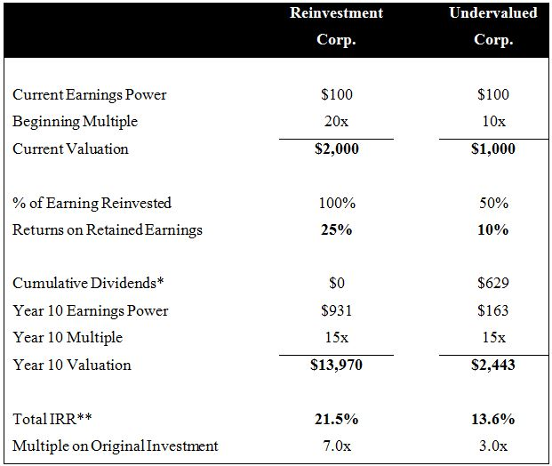
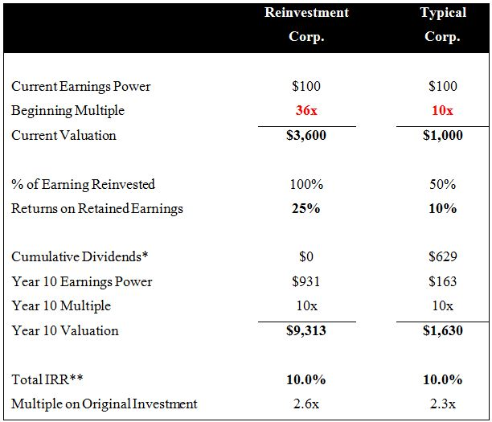

原文信息：

- 标题：Importance of ROIC: "Reinvestment" vs "Legacy" Moats
- 作者：John Huber, Connor Leonard
- 发表时间：2016-05-23
- 链接：[Saber Capital](https://sabercapitalmgt.com/importance-of-roic-reinvestment-vs-legacy-moats/)

翻译信息：

- 参考翻译：[旭犇投资](https://mp.weixin.qq.com/s/qTTcNU5WUD5qwYOldT9hOw)
- 校译：Ponge

---
I’ve talked a lot about the importance of the concept of return on invested capital (ROIC), and how it is a key driver of value in a business. Feel free to go back and [read some of those posts here](https://sabercapitalmgt.com/tag/roic/). In this particular post, the discussion is continued. This post is something new for BHI: it’s a guest post written by my good friend Connor Leonard _(see his brief bio at the end of the post)_.

关于投入资本回报率（ROIC）这一概念的重要性，以及为何称之为企业价值的关键驱动因素之一，我在之前已经谈过不少。想要回顾之前的内容，可以看[这里](https://sabercapitalmgt.com/tag/roic/)。在这篇特别的稿件中，我们将继续讨论这一话题。这篇文章对于 BHI[^BHI] 的读者来说有些与众不同：这是一篇客座文章，作者是我的好朋友 Connor Leonard（文章末尾有他的简要介绍）。

[^BHI]: 译者注：John Huber 曾经建立了一个名为 Base Hit Investing 的博客，讨论价值投资的理念和思想，但现在已经打不开了。

Connor and I live in the same area (Raleigh, North Carolina), and we get together on a regular basis to discuss businesses we follow as well as investment strategy. He and I think very similarly when it comes to investing in high quality businesses that can create significant value over the long-run. Connor is a smart investor, and I appreciate his willingness to be a sounding board for me at times.

我和 Connor 都住在同一个地区（北卡罗来纳州的罗利市）。我们会定期聚在一起，讨论我们所关注的企业，也会讨论投资策略。他和我的投资思路非常相似，都是投资于能够长期创造巨大价值的高质量企业。Connor 是一个聪明的投资者，我很感谢他时不时愿意倾听我的新点子并给予反馈。

This post contains his own thoughts (unedited by me) regarding the importance of a company being able to retain and reinvest its cash flow at high rates of return. I think he articulates the concept very well.

这篇文章是他自己关于「**一个公司能够留存其现金流，并以高投资回报率进行再投资的重要性**」这个话题的一些思考（未经我编辑）。我认为他很好地阐述了这个概念。

Here is Connor’s post:

以下是 Connor 的文章：**《再投资护城河》**。

---

Outstanding companies are often described as having a “moat”, a term popularized by Warren Buffett where a durable competitive advantage enables a business to earn high returns on capital for many years[^1]. These businesses are rare and form a small group, however I bifurcate the group further into what I classify as “Legacy Moats” and “Reinvestment Moats”. I find that most businesses with a durable competitive advantage belong in the Legacy Moat bucket, meaning the companies **_earn strong returns on capital but do not have compelling opportunities to deploy incremental capital at similar rates_**.

杰出的公司通常被描述为拥有「护城河」。「护城河」一词的普及要归功于沃伦·巴菲特[^1]，说的是持久的竞争优势使企业能够多年获得高额的资本回报。拥有「护城河」的企业很少见，在这些被认为是拥有「护城河」的企业中，我又将其进一步划分为两类：拥有「传统护城河（Legacy Moats）」的企业，以及拥有「再投资护城河（Reinvestment Moats）」的企业。我发现，大多数具有持久竞争优势的企业都属于拥有传统护城河那一类，这意味着这些企业**能够获得丰厚的资本回报，但却没有足够的机会以类似的回报率配置增量资本**。

[^1]: If you are new to the concept of “moats”, this video of Buffett speaking to MBA students at the University of Florida does as far better job of describing the concept than I can: [https://youtu.be/r7m7ifUz7r0?t=108](https://youtu.be/r7m7ifUz7r0?t=108) 如果你对「护城河」的概念感到陌生，可以看一下这段巴菲特在佛罗里达大学对 MBA 学生演讲的视频：[https://youtu.be/r7m7ifUz7r0](https://youtu.be/r7m7ifUz7r0)。巴菲特对这个概念的描述远比我好。

There is an even more elite category of quality businesses that I classify as having a Reinvestment Moat. These businesses have all of the advantages of a Legacy Moat, but also have **_opportunities to deploy incremental capital at high rates_**. Businesses with long runways of high-return investment opportunities can compound capital for long stretches, and a portfolio of these exceptional businesses is likely to produce years of strong returns. It will take some work and a lot of discipline to filter down to the true compounding machines, however I will outline what factors to look for and how many of the “bargains” hide in plain sight.

和拥有「传统护城河」的企业相比，还有一类更加出类拔萃的高质量企业，我将其归类为拥有「再投资护城河」的企业。这些企业不仅拥有前者所有的优势，还有**充足的机会以高回报率配置增量资本**。拥有长期高回报投资机会的企业可以使资本实现长期复利增长，同时拥有这类杰出企业的投资组合很可能创造年复一年的丰厚回报。要想筛选出真正的「复利机器」还需要花一些时间，并做大量的训练，不过，我会简要说明我们需要关注哪些因素，并看看在一目了然的市场中隐藏了多少「特价商品」。

# The “Legacy Moat” 传统护城河

Businesses with a Legacy Moat possess a solid competitive position that results in healthy profits and strong returns on invested capital. In exceptional cases, a company with a Legacy Moat employs no tangible capital and can modestly grow without requiring additional capital. However because there are **_no reinvestment opportunities offering those same high returns, whatever cash the business generates needs to be deployed elsewhere or shipped back to the owners._**

拥有传统护城河的企业拥有稳固的竞争地位，从而获得健康的利润和强劲的投资资本回报。对于其中的佼佼者，企业可以不进行有形资产的再投入，甚至可以在不需要额外资本的情况下适度增长。然而，由于**缺乏同样高回报的再投资机会，企业产生的任何现金都需要部署到其他地方或返还给股东。**

Think of a self-storage facility in a rural town with a high occupancy rate and little competition. This location may be generating $200,000 of annual free cash flow, a solid yield on the $1,000,000 of capital used to build the facility. As long as they run a tight operation, and a competing storage facility doesn’t open across the street, the owner can be reasonably assured that the earnings power will persist or modestly grow over time.

想象一下，在一个农村小镇上，有一个租用率很高、没有什么竞争的自助式仓储中心。这个地方每年可能产生 20 万美元的自由现金流，相比于 100 万美元的建造成本来说，收益很可观。只要他们经营得好，而且街对面没有开设新的仓储中心来竞争，这个仓储中心的所有者就可以合理地认为，该业务的盈利能力将持续存在，甚至随着时间的推移而适度增长。

But what does the owner do with the $200,000 that the operation generates each year? The town can’t really support another location, and nearby towns are already serving the storage demand adequately. So maybe the owner invests it in another private business, or puts it towards savings, or maybe buys a lake house. But wherever that capital goes, **_it likely won’t be at the same 20% return earned on the initial facility_**.

但是，所有者如何处理每年经营产生的 20 万美元呢？这个小镇的需求无法支撑一个新的仓储中心，附近小镇的仓储需求也已经充分满足了。因此，所有者可能将其投资于其他私人公司，或将其用于储蓄，或购买一栋湖畔别墅。但无论这些资金流向何处，**它很可能无法像这个仓储中心一样实现 20% 的回报率。**

This same dilemma applies to many larger businesses such as Hershey’s, Coca-Cola, McDonald’s or Proctor & Gamble. These four companies on average distributed 82.4% of their 2015 net income out to shareholders as dividends. For these companies that decision makes sense, they do not have enough attractive reinvestment opportunities to justify retaining the capital.

这种困境同样适用于许多大型企业，比如好时（巧克力）、可口可乐、麦当劳或宝洁公司。这四家公司将它们 2015 年净利润的 82.4%（平均值）作为股息发放给股东。对于这些公司来说，这个决定是说得通的，因为它们缺乏足够有吸引力的再投资机会，没办法合理地留存收益。

Even though these Legacy Moat businesses demonstrate high returns on invested capital (ROIC), if you purchase their stock today and own it for ten years it is unlikely you as an investor will achieve exceptional returns. **_This is because their high ROIC reflects returns on prior invested capital rather than incremental invested capital. In other words, a 20% reported ROIC today is not worth as much to an investor if there are no more 20% ROIC opportunities available to direct the profits._**

尽管这些拥有传统护城河的企业展现出较高的投入资本回报率（ROIC），但如果你今天购买了它们的股票并持有 10 年，作为投资者，你不太可能获得杰出的回报。**这是因为它们的高 ROIC 反映的是先前投入资本的回报，而不是增量投入资本。换句话说，如果没有更多回报率达 20% 的投资机会来产生利润，那么今天表观 20% 的 ROIC 对投资者来说就不那么有价值了。**

Equity ownership in these businesses ends up resembling a high-yield bond with a coupon that should increase over time. There is absolutely nothing wrong with this, businesses like Proctor & Gamble and Hershey’s provide a steady yield and are excellent at **_preserving capital but not necessarily for creating wealth_**. If you are looking to compound your capital at unusually high rates, the focus needs to shift to identifying businesses that also possess a “Reinvestment Moat”.

这些企业的股权最终类似于高收益债券（译者注：股票市值的缓慢增长），并附带一个随时间推移而增加的息票（译者注：每年股息）。这也没什么不好的，像宝洁公司和好时公司这样的企业能够提供稳定的收益，**非常保值，但不一定能创造财富**。如果你想让你的资本实现非常高的年化复合收益率，那么你应该转移关注点，放在识别那些同时拥有「再投资护城河」的企业上。

# The “Reinvestment Moat” 再投资护城河

There is a second group of companies that have all the benefits of a Legacy Moat, but also have **_opportunities to deploy incremental capital at high rates_** because they have a Reinvestment Moat. These companies have their current profits protected by a Legacy Moat, so the core earnings power should be maintained. But instead of shipping the earnings back to the owner at the end of each year, the vast majority of the capital will be retained and deployed into opportunities that stand a high likelihood of producing high returns.

拥有「再投资护城河」的企业是这样的一类公司：它们和拥有「传统护城河」的企业一样拥有稳固的竞争地位、良好的投入资产回报率，但除此之外，由于「再投资护城河」的存在，它们还能够拥有**以高预期收益率配置增量资本的机会**。这些公司的当前利润受到「传统护城河」的保护，核心盈利能力能够维持。但这类公司并不会在年末将收益返还给股东，相反，它们会将绝大部分的盈利留存下来，并配置到极有可能产生高回报的投资机会中去。

Think of Wal-Mart in 1972. There were 51 locations open at the time and the overall business generated a 52% pre-tax return on net tangible assets. Clearly their early stores were working, they dominated small towns with a differentiated format and a fanatical devotion to low prices. Within the 51 towns, I would bet that each store had a moat and Sam Walton could be reasonably assured the earnings power would hold steady or grow over time. Mr. Walton also had a pretty simple job when it came to deploying the cash those stores generated each year. The clear path was to reinvest the earnings right back into opening more Wal-Marts for as long as possible. Today there are over 11,000 Wal-Mart locations throughout the world and both sales and net income are **_up over 5,000x_** from 1972 levels.

想想 1972 年的沃尔玛。当时，该公司在 51 个城镇开设了门店，整个公司的净有形资产回报率达到了 52%（税前）。很明显，之前开设的门店是成功的，他们以差异化的购物形式和对低价的狂热痴迷在小城镇中获得了绝对领先的市占率。在这 51 个城镇中，我敢打赌，每家商店都有护城河，山姆·沃尔顿可以合理地认为公司的盈利能力将持续稳健地增长。在如何配置这些门店每年产生的现金这一问题上，沃尔顿先生也不用费什么心思。路径很明确：在尽可能长的时间里，把盈利进行再投资，继续开更多的沃尔玛超市。到目前为止，沃尔玛在全球有 11,000 多家门店，和 1972 年相比，销售额和净利润的增长都**超过了 5,000 倍**。

# How To Identify a Reinvestment Moat 如何识别「再投资护城河」

When searching for a Reinvestment Moat, I’m essentially looking for a business that defies capitalism. Isolated profits in a small market is one thing, but continuing to achieve high returns on incremental dollars for years should in theory not be attainable. As a business gets bigger, and the profits become more meaningful, it will attract more and more competition and returns should eventually compress. Instead I’m looking for a business that **_actually becomes stronger as it gets bigger_**. In my opinion there are two models that lend itself to this kind of positive reinforcement cycle over time: companies with **_low cost production or scale advantages_** and companies with a **_two-sided network effect_**.

说起寻找再投资护城河，本质上我是在寻找一类挑战资本主义基本规律的企业。在一个小市场中，获得一段时期的利润是一回事，但想持续多年取得增量资本的高回报，理论上应该是无法实现的。随着企业规模越来越大，利润体量也会越来越大，它将吸引越来越多的竞争，投入回报最终会被压缩。我在寻找的是与此相悖的企业：这些企业**随着公司规模的扩大而变得更加强大**。在我看来，有两种商业模式能够让企业实现这种随时间推移的正强化循环：具有**低成本生产或规模优势**[^规模]的公司，以及具有**双边网络效应**[^网络效应]的公司。

[^规模]: 译者注：有两篇文章可供参考： 《[什么是“规模效应”？（上）](https://mp.weixin.qq.com/s/5PKLdDxgR3IkC1wdJRfReQ)》、《[什么是“规模效应”？（下）](https://mp.weixin.qq.com/s/cz8Z5Bh-zTpSqXi6TxrrLw)》
[^网络效应]: 译者注：关于双边网络效应，还可以参考 《[网络效应手册笔记](https://mp.weixin.qq.com/s/Pw5OKV_l9a04fqIgU3Tb4w)》

## Low Cost / Scale: 低成本/规模效应

Going back to the early Wal-Mart example, the stores were so big compared to traditional five and dimes that Mr. Walton could sell each item at a lower margin than competitors and still operate profitably due to the large volume of shoppers. The more people that shopped at a given Wal-Mart, or the more Wal-Marts that were built, only furthered this cost advantage and widened the moat. The lower prices enticed more shoppers, and the cycle continues to reinforce itself. So by the time there were 1,000 Wal-Marts in existence, the moat was significantly wider than when there were 51. Other businesses such as Costco, GEICO, and Amazon have followed a similar playbook, creating a “flywheel” that accelerates as the business grows[^2].

让我们回到早期沃尔玛的例子，与传统的一元店相比，沃尔玛的门店规模非常大。由于顾客人数众多，沃尔顿可以以低于竞争对手的利润率销售每一件商品，仍然能够实现经营性盈利。在任一家沃尔玛购物的人越多，或者沃尔玛的门店越多，沃尔玛的成本优势只会更强，护城河只会更深。较低的价格又进一步吸引了更多的购物者，这个循环不断自我强化。所以当沃尔玛有 1000 家门店时，护城河明显比有 51 家的时候要宽得多。好市多（Costco）、盖可保险（GEICO）和亚马逊（Amazon）等其他企业也遵循了类似的思路：创造了一个「飞轮」，随着业务不断发展，「飞轮」会不断加速。[^2]

*Example: Sketch of the Amazon Flywheel*

*示例：亚马逊的成长飞轮草图*

[^2]: The concept of a flywheel is popularized by Jim Collins, you can read more about it here: [http://www.inc.com/jeff-haden/the-best-from-the-brightest-jim-collins-flywheel.html](http://www.inc.com/jeff-haden/the-best-from-the-brightest-jim-collins-flywheel.html) 飞轮的概念是由 Jim Collins 推广的，更多详见：[http://www.inc.com/jeff-haden/the-best-from-the-brightest-jim-collins-flywheel.html](http://www.inc.com/jeff-haden/the-best-from-the-brightest-jim-collins-flywheel.html)

## Two-Sided Network: 双边网络效应

Creating a two-sided network such as an auction or marketplace business requires both buyers and sellers, and each group is only going to show up if they believe the other side will also be present. Once the network is established however, it actually becomes stronger as more participants from either side engage. This is because the network is stronger for the “n + 1,000th” participant compared to the “n” participant directly as a function of adding 1,000 participants to the market[^3].  Another way of describing this: as more buyers show up it will attract more sellers, and that in turn will attract more buyers. Once this positive cycle is in place, it becomes nearly impossible to convince either buyer or seller to leave and join a new platform. Businesses such as Copart, eBay, and Airbnb have built up strong two-sided networks over time.

创造一个双边网络（像拍卖或者交易平台）需要同时存在买家和卖家，而且只有当一方相信对方也会来到这里时，他们才会参与其中。然而，一旦这个网络建立起来，它就会随着双方参与者数量的不断增加而加强。对第「n+1,000」个参与者来说，该网络的网络效应比网络中有「n」个参与者的时候更强，因为网络中多了 1,000 名参与者[^3]。另外一种理解方式：当更多的买家出现时，更多的卖家会被吸引过来，而更多的卖家反过来又会吸引更多的买家。一点出现了这样的正向循环，要让买家或者卖家离开这里并加入一个新的平台几乎是不可能的。像 Copart、eBay 和 Airbnb 这样的企业，随着时间的推移，已经建立了强大的双边网络[^护城河]。

[^3]: This description of the strength of a network business is taken from venture capitalist Bill Gurley. 这段关于网络强度的描述来自于风险投资家 Bill Gurley。
[^护城河]: 也有其他研究表示，网络效应本身并不是护城河的来源，重要的是转换成本和多宿主成本，详见 [网络效应并不是护城河](https://mp.weixin.qq.com/s/-RXpOW7dSGFTqL5fNXcNVQ)。

*Andreesen Horowitz’s example of Airbnb’s two-sided network:*

*Andreesen Horowitz 关于 Airbnb 双边网络的例子*

# Judging the “Runway” to Reinvest 判断可进行再投资的「跑道长度」

Many investors focus purely on growth rates, driving up the valuation of a company growing at high rates even if the growth does not carry positive economics. The key to Reinvestment Moats is not the specific growth rate forecasted for next year, but instead having **_conviction that there is a very long runway and the competitive advantages that produce those high returns will remain or strengthen over time_**. Instead of focusing on next quarter or next year, the key is to step back and envision if this company can be 5x or 10x today’s size in a decade or two? My guess is for 99% of businesses you will find that it is almost impossible to have that kind of conviction. That’s fine, be patient and focus your energy on identifying the 1%.

很多投资者只关注业绩增速，这导致一家高速增长的公司估值会被推高，哪怕这种增长并不带来正向的经济效益。再投资护城河的关键不在于预测下一年的业绩增长的具体数字是多少，而在于**相信公司处在一条很长的「跑道」上，公司在当下能够产生高投资回报的竞争优势将随着时间的推移继续存在或加强**。问题的关键不是在下个季度或下一年，而是退一步，设想一下，这家公司在 10 年或 20 年后的规模能否达到现在的 5 倍或 10 倍？我估计，对于 99% 的企业来说，你很难具备这样的信念。这没有任何问题，耐心一些，把你的精力放在识别那 1% 的公司上。

Admittedly this is the most difficult step of the process, with many variables and uncertainties. Each situation will be different, but below are items I look for as positive indicators of a long runway and also red flags that the runway is concluding:

诚然，识别那 1% 的公司是整个过程中最困难的一步，有许多变数和不确定因素。每种情况都会有所不同，但我在下面列出了一些可能的情况，一些是积极信号，暗示这可能就是我寻找的长跑道；还有一些是警示信号，暗示跑道将到尽头。

## Positive Indicators: 积极信号

If a two-sided network is consistently increasing key metrics like users or gross transactions but is still a small percentage of the overall market:

**如果一个双边网络在用户量或交易总额等关键指标上持续增长，但在整个市场中仍只占很小的百分比**：

-   Focus on companies with a high “flow through” margin on an incremental user or transaction, which will help the company expand margins as the network grows.

* 关注那些增量用户或增量交易中边际盈利率（"flow through" margin）[^边际盈利率]较高的公司，因为这类公司的利润会随着网络扩张而增加；

If a company has a structural advantage that leads to a lower cost model than competitors:

**如果一家公司具有结构性优势，导致其成本模型低于竞争对手**：

-   This could be a differentiated business model such as selling direct rather than through agents. Or it could be an advantage developed over time such as technology that results in greater automation. The structural advantage has to be difficult for larger incumbents to duplicate.

* 往往来源于差异化的商业模式，比如采用直接销售模式而不是通过经销商。也可能是随着时间的推移而发展起来的一种竞争优势，比如技术领先（意味着自动化程度更高）。这种结构性优势必须使得大型企业难以复制，才能存在；

If a multi-unit retailer currently has less than 100 locations but foresees an end market of over 1,000:

**如果一家多元产品零售商目前门店只有不到 100 家，但预计未来市场成熟时会超过 1000 家**：

-   Focus on companies with a consistent, profitable, and replicable model. The company should primarily be “stamping out” the same prototype over and over while producing consistent unit economics.

* 关注这里面具有一致性、可盈利、模式可复制的公司。这类公司会产生相似的单店盈利过程，同时不断「干掉」同类型的公司。

[^边际盈利率]: 译者注：边际盈利率=利润的变化值/收入的变化值，衡量每一元额外收入中有多少变成了利润。

## Red Flags: 警示信号

If a company that claims to have a long runway begins shifting into new or different markets:

**如果一家公司声称自己处在一个很长的赛道之中，业务却开始转向新的或不同的市场**：

-   If the future is so bright, then why deviate from the plan? The management may already know the runway is limited and is making a pivot.

* 如果未来如此光明，为什么要偏离计划呢？管理层可能已经看到了跑道的尽头，并在调转方向；

If management’s definition of the total ad[dress](https://www.formalgownaustralia.com/)able market (TAM) is suspect:

**如果管理层对于可获取市场规模（Total Addressable Market，TAM）的定义难以让人信服**：

-   Some management teams like to throw out a massive TAM number in a slide deck for investors to focus on. Check the underlying source of that number, if their definition is overly broad they may be trying to mislead investors.

* 有些管理层喜欢在幻灯片里放一个巨大的市场规模预测数字，以此来吸引投资者的注意力。投资者应该核对数字的原始出处，如果管理层给出的定义过于宽泛，他们可能是在试图误导投资者；

If the recent vintages of growth investments are producing lower returns:

**如果近几年增长性投资的投资收益较低**：

-   If the most recent stores opened are producing lower sales and margins, but cost just as much, the runway is showing some cracks. Many multi-unit businesses begin to show lower unit returns once outside of core markets.

* 如果最近新开的几家店的销售额和利润率都下降了，但成本却一样高，那么这条跑道就出现了一些问题。很多多元化发展的企业一旦离开核心市场，其单位收益就开始降低。

# Why Value Investors Often “Miss” the Reinvestment Moats 为什么价值投资者经常「错失」再投资护城河

I believe identifying these businesses with Reinvestment Moats is possible with some work, but many value investors struggle with identifying a “reasonable” price. My theory is that these Reinvestment Moats tend to “hide in plain sight” because most investors underappreciate the impact of compounding.

我相信，识别这些具有再投资护城河的企业并不难，花点功夫是可以做到的，但对于很多价值投资者来说，难点在于判断一个「合理的」价格。我的观点是，这些再投资护城河的价值往往「大隐隐于市」，因为大多数投资者低估了复利效应的影响。

When assessing a quality business, value investors will often point to a P/E ratio over 20x or the EV/EBITDA multiple of 10x+ to show that Ben Graham would surely shake his head in disgust over such a purchase[^4]. However let’s consider two investments and determine which will yield better results over a ten year horizon. The first business, Reinvestment Corp., has the ability to deploy _all retained earnings at a high rate_ because of the strong Reinvestment Moat it possesses. Of course investors acknowledge this likelihood, meaning the entry price is fairly high at 20x earnings, leading most bargain hunters to pass. On the other hand, Undervalued Corp. has all of Graham and Doddsville in a buzz because it’s a steady business with a nice dividend selling for a bargain of only 10x earnings! Assume that over time both companies will be valued in-line with the market at 15x:

在评估一家优质企业时，价值投资者经常会指着 P/E 超过 20 倍，或 EV/EBITDA 超过 10 倍的公司说，本·格雷厄姆肯定会对买入这样的公司摇头叹息[^4]。然而，让我们看看以下两个投资项目中，哪个可以在**未来十年**带来更好的收益。

[^4]: According to the postscript to the revised edition of the Intelligent Investor, Ben Graham made more money off his stake in GEICO (a true Reinvestment Moat with lost-cost advantages) than he did from every other investment in his partnership over twenty years combined. At the time of the GEICO purchase, Graham allocated about 25% of the partnership’s funds towards the investment. 根据《聪明的投资者》修订版后记，本·格雷厄姆从他在 GEICO（一个真正具有低成本再投资护城河的公司）的股份中赚到的钱，比他在 20 年里从他的合伙公司的其他投资中赚到的钱加起来还要多。在购买 GEICO 的时候，格雷厄姆该公司的仓位占了合伙基金的 25%。

第一家公司，我们叫它「再投资股份有限公司」。由于拥有强大的再投资护城河，这家公司有能力**以高投资回报率配置所有留存收益**。很明显投资者也了解这种可能性，导致其市场价格相当高，估值有 20 倍 P/E，这足以使大多数追求安全边际的投资者敬而远之。

第二家公司，我们叫它「低估股份有限公司」。这家公司让「格雷厄姆和多德都市」里的投资者们兴奋不已，因为它业务稳定，股息丰厚，并且估值只有 10 倍 P/E，有很好的价格折扣。

假设随着时间的推移，这两家公司的估值都恢复到市场平均水平，也即 15 倍 P/E：

|            | 再投资股份有限公司   | 低估股份有限公司   |
| ---------- | ----------- | ---------- |
| 当前盈利能力     | $100        | $100       |
| 期初 P/E     | 20x         | 10x        |
| 当前估值       | **$2,000**  | **$1,000** |
|            |             |            |
| 盈利留存百分比    | 100%        | 50%        |
| 留存收益投资回报率  | **25%**     | **10%**    |
|            |             |            |
| 累计分红总额*    | $0          | $629       |
| 第 10 年盈利能力 | $931        | $163       |
| 第 10 年 P/E | 15x         | 15x        |
| 第 10 年估值   | **$13,970** | **$2,443** |
|            |             |            |
| 复合收益率**    | **21.5%**   | **13.6%**  |
| 初始投资回报倍数   | 7.0x        | 3.0x       |

说明：

\* Assumes all earnings not reinvested are distributed as dividends

\*：假设所有未被用于再投资的收益都当做股息发放；

\** Pre-tax IRR, factoring in tax rates will only further the advantage of Reinvestment Corp.

\*\*：这里指税前内部收益率（Pre-tax IRR）。如果考虑税收因素，只会让再投资股份有限公司的优势更为明显。

This example illustrates a concept Charlie Munger outlined in “The Art of Stockpicking”:

这个例子阐释了查理·芒格在《选股的艺术》[^芒格]中提出的一个说法：

[^芒格]: 译者注：这段文字见于芒格的《论基本的、普世的智慧，及其与投资管理和商业的关系》，被收录在彼得·考夫曼的《穷查理宝典》中。关于这个观点的一些补充意见，我也写了相关文章，详见 《[股票持有收益率等于净资产收益率吗？](https://mp.weixin.qq.com/s/HzMNnONO1yTi0ExCmo1Ttg)》

> “If the business earns 6% on capital over 40 years and you hold it for that 40 years, you’re not going to make much different than a 6% return—even if you originally buy it at a huge discount. Conversely, if a business earns 18% on capital over 20 or 30 years, even if you pay an expensive looking price, you’ll end up with a fine result.”

> 「如果某家企业 40 年来的资本回报率是 6%，你在这 40 年间持有它的股票，那么你得到的回报率不会跟 6% 有太大的差别——即使你最早购买时该股票的价格比其账面价值低很多。相反地，如果一家企业在过去二三十年间的资本回报率率是 18%，那么即使你当时花了很大的价钱去买它的股票，你最终得到的回报也将会非常可观。」

To create an even more extreme example, if you find a business that you believe is capable of earning strong returns over a decade, look at how much you can “overpay” and still earn a return equal to a typical business:

再举一个更极端的例子，如果你找到一家你认为能够在十年内获得丰厚回报的企业，我们看看你能「多付」多少钱，保证收益与持有低估股份有限公司相当（这里假设十年后，两家公司的估值都为 10x P/E）：

|            | 再投资股份有限公司  | 低估股份有限公司   |
| ---------- | ---------- | ---------- |
| 当前盈利能力     | $100       | $100       |
| 期初 P/E     | **36x**    | **10x**    |
| 当前估值       | **$3,600** | **$1,000** |
|            |            |            |
| 盈利留存百分比    | 100%       | 50%        |
| 留存收益投资回报率  | **25%**    | **10%**    |
|            |            |            |
| 累计分红总额*    | $0         | $629       |
| 第 10 年盈利能力 | $931       | $163       |
| 第 10 年 P/E | 10x        | 10x        |
| 第 10 年估值   | **$9,313** | **$1,630** |
|            |            |            |
| 复合收益率**    | **10.0%**  | **10.0%**  |
| 初始投资回报倍数   | 2.6x       | 2.3x       |

说明：

\* Assumes all earnings not reinvested are distributed as dividends

\*：假设所有未被用于再投资的收益都当做股息发放；

\** Pre-tax IRR

\*\*：这里指税前内部收益率（Pre-tax IRR）。

Time is certainly the friend of a great business. But does this mean that only businesses with a Reinvestment Moat should be considered for a long-term investment?

时间当然是伟大公司的朋友。但这是否意味着只有拥有再投资护城河的企业才值得长期投资呢？

# Earning High Returns Investing in Legacy Moats 投资传统护城河公司也能获得高回报

A solid Legacy Moat paired with the right management team and strategy can be a wealth creator for shareholders over many years. In order to accomplish this, the playbook has to change into one more focused on capital allocation, specifically a systematic focus on acquisitions and managing the capital structure. In a sense the **_management team’s capital allocation prowess must become the Reinvestment Moat_**.

稳固的传统护城河，再加上正确的管理团队和发展战略，这种公司也可以为股东连续多年创造财富。为了实现这一点，我们的重心要转移到资本配置上来，具体来说就是要系统性地关注公司的并购活动和资本结构管理。从某种意义上说，**管理团队的资本配置造诣就是公司的再投资护城河。**

While the research on the negative consequences of M&A for corporations is extensive, I think there are a select group of management teams that can actually reinvest the company’s capital better than individual shareholders could do on their own. They tend to operate solely within their circle of competence, which is typically the sector where the underlying business resides. With deep industry knowledge, access to deal flow, and the ability to achieve operational synergies, **_these companies can operate like a private equity fund with permanent capital (and without the fee structure)._** Notable examples include TransDigm Group, Danaher Corporation, and Constellation Software.

虽然关于并购对企业负面影响的研究非常广泛，但我认为，相比个人股东自己进行收益再投资，由精挑细选的管理团队来进行公司资本再投资会更好。管理团队往往只在自己的能力圈内进行再投资，而这往往也是公司主业所在的领域。凭借自身深厚的行业知识和对标的交易情况的掌握，并有能力实现运营协同，**这些公司可以像私募股权基金一样运营，同时资本是永续的（且没有管理费和业绩提成费用）**。这方面做得非常杰出的公司包括 TransDigm 集团、丹纳赫集团（Danaher Corporation）、星座软件公司（Constellation Software）。

Typically the management team consists of at least one “Operator” and a sole “Allocator”. The Operator is tightly managing the existing businesses to maintain their competitive positions. The Allocator functions more as an investor than a CEO, seeking out opportunities to deploy capital at high rates while also optimizing the capital structure. **_For the Allocator the capital structure is another means of creating shareholder value, and it is common to see special dividends, strategic use of leverage, and lumpy share buybacks that only occur when the stock is undervalued_**. William Thorndike’s book “The Outsiders” does a fantastic job of detailing these unique management teams with a talent for capital allocation.

一般来说，公司管理团队由至少一个「经营者」和一个唯一的「配置者」组成。经营者时刻管理着现有业务，维持公司的竞争优势。配置者更像一个投资者而不是 CEO，寻找高回报率的投资机会以配置资本，同时优化资本结构。**对于配置者来说，资本结构是创造股东价值的另一种手段，常见的手段包括特别股息、战略性地使用杠杆以及只有在股票被低估时才会出现的不定期股票回购**。威廉·桑代克的《商界局外人》一书详细介绍了这些具有资本配置天赋的独特管理团队，而且写得很好[^商界局外人]。

[^商界局外人]: 译者注：这本书我做过读书笔记，详见 [《商界局外人》读书笔记](https://mp.weixin.qq.com/s/IyLCe7GJTOuAbzxntrOYrQ)。

I’ve found that the best way to find these companies is by reading annual shareholder letters and picking up on certain qualitative patterns.  First, a thoughtful and informative annual letter is key because it shows **_the managers view the shareholders more as business partners and co-owners rather than a pesky group they have to deal with each quarter_**. While I prefer to do further research, typically the letter is so insightful to a potential owner that they could make an informed investment decision simply by reading it each year. The letters typically contain terms like “intrinsic value”, “return on capital employed”, and “free cash flow per share” rather than simply discussing sales growth. These businesses tend to view frugality as a source of pride, with the home office setting the tone that each dollar is valuable because it ultimately belongs to the shareholder. If you happen to come across one of these companies, and you think the management team has a number of years remaining with plenty of attractive M&A targets, my advice is to buy the shares and let them take care of the compounding for you.

我发现，找到这些公司的最佳方式是阅读年度股东信，并从中找到某些定性特征。首先，一封深思熟虑、内容翔实的年度股东信很关键，因为它表明**管理层更倾向将股东视为商业伙伴和合伙人，而不是每个季度都必须与之打交道的一群烦人精**。虽然对我来说，找到这类公司还需要做进一步的研究，但通常来说，这封信对潜在股东还是很有价值的，他们只需每年读一读就能做出明智的投资决定。这类公司的股东信中通常会包含「内在价值」、「占用资本回报率」、「每股自由现金流」等词语，而不是简单地讨论销售增长。这类企业往往认为节俭是值得自豪的事情，从总部自上而下的基调就是，珍惜每一块钱，因为那是股东的钱。如果你碰巧遇到了这样的企业，而且你觉得管理层的任期会持续多年，同时他们手头还有很多有吸引力的待并购标的，那么我的建议是买他们的股票，让他们替你实现复利增长。

# Summary 总结

Most of the companies that are identified as having a “moat” tend to be Legacy Moats that produce consistent, protected earnings and **_strong returns on prior invested capital_**. These are perfectly good businesses and can produce nice returns for investors in a comfortable fashion.

大多数被认为有「护城河」的公司拥有的都是传统护城河，他们能够产生持续的、不受竞争影响的利润，并且**前期投入资本回报率非常高**。这些公司都是非常好的企业，能够以一种温和的方式为投资者产生不错的回报。

However if you aiming to compound capital at high rates, I believe you should spend time focusing on businesses possessing a Reinvestment Moat with a very long runway. These businesses exhibit strong economics today, but more importantly **_possess a long runway of opportunities to deploy capital at high incremental rates_**. If these are hard to come by, the next best alternative is a business with the combination of a Legacy Moat and an exceptionally strong capital allocator. It will take some work and a lot of discipline to filter down to the true compounding machines, however a portfolio of these exceptional businesses acquired sensibly is likely to produce years of strong returns.

但如果你想要实现高复合收益率的资本增值，我认为你应该花时间关注那些拥有再投资护城河且拥有非常长的跑道的公司。这些企业现阶段表现出强大的经济效益，但更重要的是，**拥有很长的跑道，能够有高回报率的再投资机会**。如果这类企业很难遇到，那么次优的选择就是寻找一个既有传统护城河，又有特别强大的资本配置者的企业。想要筛选出真正的复利机器，还需要花一些时间，并做大量的训练，但最终，一个将这些杰出企业收入囊中的投资组合很可能会产生多年的强劲回报。

# John’s Comment John Huber 的评论

Thanks again to Connor for putting this guest post together. I think it is a good extension of some of the investment concepts we’ve talked about here before. For related posts on this topic, [please review the ROIC label](https://sabercapitalmgt.com/tag/roic/) as well as a recent post I did summarizing the talk that Connor referenced where [Buffett does a particularly great job summarizing some of his investment tenets](https://sabercapitalmgt.com/warren-buffett-1998-talk-at-university-of-florida/), including the concepts discussed in this post.

再次感谢 Connor 将这篇客座文章发在这里。我认为这篇文章是对我们以前谈到的一些投资概念很好的延伸。关于 ROIC 这个话题的其他文章，可以查看网站上的 [ROIC 标签](https://sabercapitalmgt.com/tag/roic/)，以及我最近写的关于 Connor 提到的谈话文章，其中[巴菲特对他的一些投资信条做了特别好的总结](https://sabercapitalmgt.com/warren-buffett-1998-talk-at-university-of-florida/)，这里面也包括了本文探讨的一些概念。

---

_Connor Leonard is the Public Securities Manager at Investors Management Corporation (IMC) where he runs a concentrated portfolio utilizing a value investing philosophy. IMC is a privately-held holding company based in Raleigh, NC and modeled after Berkshire Hathaway. IMC looks to partner with exceptional management teams and is focused on being a long-term owner of a family of companies._

Connor Leonard 是投资者管理公司（IMC）的公共证券经理，他利用价值投资理念管理着一个集中的投资组合。IMC 是一家以伯克希尔·哈撒韦公司为蓝本，总部设在北卡罗来纳州罗利市的私人控股公司。IMC希望与优秀的管理团队合作，并专注于成为一组公司的长期所有者。