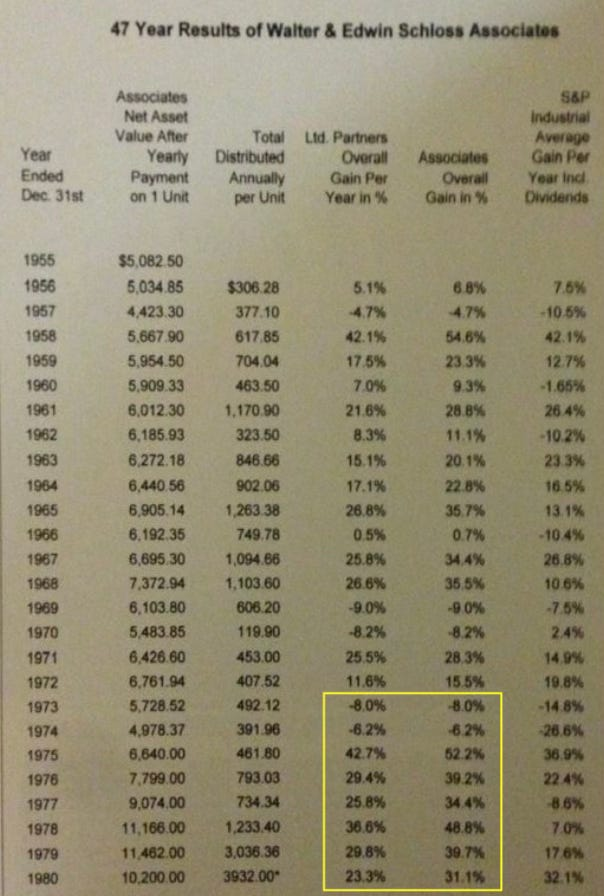

原文信息：

- 标题：Walter Schloss, Nifty Fifty, Current Market Valuations and Opportunities
- 作者：John Huber
- 发表时间：2024-07-12
- 链接：[Base Hit Investing](https://basehitinvesting.substack.com/p/walter-schloss-nifty-fifty-current)
- 翻译：Terrellchen

---

# “漂亮50”时期的沃尔特·施洛斯，兼谈当前市场的估值与机遇

I was going to say there is good news and bad news, but like the wise turtle from Kung Fu Panda says, “there is just news, there is no good or bad”. This post has my thoughts on how I see current market conditions and the opportunities it’s creating (which is the good news part).

我本想说有好消息也有坏消息，但就像《功夫熊猫》里那只聪明的乌龟说的，“只有消息，没有好坏”。这篇文章包含了我对当前市场状况及其带来的机遇的看法（这是好消息的一部分）。

With the S&P 500 trading north of 25 P/E and many of the world’s great companies trading at 40 P/E or higher (Costco is now at 55 P/E!), I think we could be at valuation levels that might lead to disappointing results for these stocks over the next 5-10 years, even if the businesses continue to do well (which I expect many of them to do).

标准普尔 500 指数的市盈率在 25 以上，而世界上许多大公司的市盈率都在 40 或更高（好市多现在的市盈率是 55！），我认为我们所处的估值水平可能会导致这些股票在未来 5-10 年内的表现令人失望，即使这些公司的业务继续保持良好（我预计其中许多公司都会如此）。

A cut from 40 P/E to a more normal 20 P/E is difficult to overcome over even a long period — a stock that grows earnings at 12% annually for a decade would lead to just a 4% annualized return in the stock if the multiple fell by half over that time. Most of the world’s best businesses today will not grow at 12% annually over the next decade (though a very select few might). It’s far more rare than people realize, especially for companies that grew this fast or faster over the previous decade.

将市盈率从 40 降到更正常的 20，即使在很长一段时间内也是很难实现的--如果一只股票的盈利在十年内每年增长 12%，那么在此期间，如果市盈率下降一半，该股票的年回报率也只有 4%。当今世界上大多数最优秀的企业在未来十年都不太可能以每年 12% 的速度增长（尽管极少数企业可能会这样）。这比人们意识到的要罕见得多，尤其是那些在过去十年中增长如此之快或更快的公司。

[I wrote a post recently about how the largest tech companies are looking very different than they were just five years ago.](https://basehitinvesting.substack.com/p/big-tech-capex-and-earnings-quality) If the AI spending boom slows down or if demand for AI proves to be somewhat less than expected (or takes longer to materialize, which is what happened in the late 90’s telecom/internet boom), then some of these companies will have excess capacity and lower returns on capital. They became great stocks in large part because their ROIC’s were sky high coupled with a starting valuation of 10-15 P/E in many cases (AAPL, META, MSFT and GOOG all traded around this level or cheaper at times last decade). Now we’re faced with the opposite: much more capital intensive businesses with much higher starting valuations closer to 30-40 P/E.

我最近写过一篇文章，谈到最大的科技公司与五年前相比有何不同。如果人工智能消费热潮放缓，或者人工智能的需求低于预期（或需要更长时间才能实现，90 年代末电信/互联网热潮就是如此），那么其中一些公司就会产能过剩，资本回报率降低。这些公司之所以能成为优秀的股票，很大程度上是因为它们的投资回报率非常高，而且在很多情况下起始估值都在 10-15 P/E 左右（AAPL、META、MSFT 和 GOOG 在过去十年的交易价格都在这一水平或更低的水平）。现在我们面临的情况恰恰相反：资本密集型企业的起始估值要高得多，接近 30-40 P/E。

These are truly great companies and many of them will have continued strong fundamentals. I’ve owned stock in a few of these over the years and I’ve never been opposed to mega-caps, but as a group, I think these stocks have become much riskier. Durability in an investment comes from paying a price that is far less than the stock is worth (a margin of safety). Fragility comes from doing the opposite. Stocks of the world’s best companies can fall into either of those two groups depending on price.

这些都是真正伟大的公司，其中许多都将拥有持续强劲的基本面。多年来，我一直持有其中几家公司的股票，我从不反对超级大盘股，但作为一个群体，我认为这些股票的风险变得更大了。投资的持久性来自于支付远远低于股票价值的价格（安全边际）。而脆弱性则恰恰相反。世界上最优秀公司的股票可能属于这两类中的任何一类，这取决于价格。

So what’s an investor to do?

那么，投资者该怎么办呢？

**The good news is there are lots of opportunities to find great value outside** of the mega-caps currently (see a [few examples in my recent archives](https://basehitinvesting.substack.com/archive)). I think there is an interesting valuation gap emerging between the largest 25-50 stocks and everything else. This has happened numerous times in the past where the large high-quality stocks became expensive while bargains existed elsewhere, most famously in the early 1970’s and the late 1990’s. Both of these periods were followed by a multi-year correction where the expensive stocks fell and the cheapest stocks soared.

**好消息是，目前有很多机会可以在**大盘股之外发现巨大价值（参见[我最近档案中的几个例子](https://basehitinvesting.substack.com/archive)）。我认为，在最大的 25-50 只股票与其他所有股票之间出现了有趣的估值差距。过去曾多次出现过这种情况，即大型优质股票变得昂贵，而其他地方却有便宜货，最著名的是 20 世纪 70 年代初和 20 世纪 90 年代末。这两个时期之后都出现了多年的调整，昂贵的股票下跌，最便宜的股票飙升。

In 90’s internet boom, money was flowing into the largest high fliers and out of the “old economy” boring stocks like Berkshire Hathaway, M&T Bank, Fastenal, NVR and Autozone. These stocks and many others lagged during the boom but all soared during the bust and were big winners in the early 2000’s even as the market declined. **AZO actually tripled between 2000-2002 as the S&P plummeted 50%. NVR soared 6x during this same stretch**, during a recession and a stock market crash.

在 90 年代的互联网热潮中，资金纷纷涌入那些最大的热门股，流出伯克希尔-哈撒韦、M&T Bank、Fastenal、NVR 和 Autozone 等 “旧经济 ”中的乏味股票。这些股票在经济繁荣时期表现落后，但在经济萧条时期都一路飙升，即使在市场下跌的 2000 年代初也是大赢家。在 2000-2002 年期间，当标准普尔指数暴跌 50%时，**AZO 实际上上涨了三倍。NVR 也在这一时期飙升了 6 倍**，当时正值经济衰退和股市暴跌。

Stocks like AZO and NVR are household names today, but they weren’t viewed this way in 2000. They were viewed as cyclical, old economy companies with inefficient or outdated business models and their valuations reflected this sentiment. But they were durable (even if not fast growing) companies that produced cash flow and had rational management teams, and eventually, their cheap valuations became a catalyst for future returns for their shareholders.

像 AZO 和 NVR 这样的股票如今已家喻户晓，但在 2000 年，人们对它们的看法并非如此。它们被视为周期性的旧经济公司，业务模式低效或过时，其估值也反映了这种看法。但它们都是经久不衰（即使增长不快）的公司，能够产生现金流，拥有合理的管理团队，最终，它们低廉的估值成为股东未来回报的催化剂。

There are many differences, but I’m noticing some rhymes with the late 90’s and early 2000’s (which corresponds with the time I began investing). I was not investing (or doing anything else) during the late 60’s and early 70’s, but if you study that time you’ll notice some common themes. Two great books on those two boom decades are _Bull_ (the 1990’s) and _The Go-Go Years_ (1960’s).

虽然有许多不同之处，但我注意到 90 年代末和 2000 年代初（与我开始投资的时间一致）的一些韵律。在 60 年代末和 70 年代初，我并没有投资（或做其他事情），但如果你研究一下那个时期，你会发现一些共同的主题。关于这两个繁荣年代的两本好书是 _Bull_（20 世纪 90 年代）和 _The Go-Go Years_（20 世纪 60 年代）。

Walter Schloss is one investor who capitalized on the values that arose after the bust that followed the boom of that latter period.

沃尔特-施洛斯（Walter Schloss）就是这样一位投资者，他从后一时期繁荣之后的萧条所产生的价值中获益。

Take a look at the results he earned in the years after the 1972 Nifty Fifty period:

看看他在 1972 年 “漂亮50 ”之后的几年里所取得的业绩吧：

*Source: www.walterschloss.com*

In the 10 years following 1972, Schloss’s fund returned 22% annually vs. around 7% for the S&P. After the market downturn of 1973-1974, he had a five year stretch where his fund returned over 30% annually.

在 1972 年之后的 10 年中，施洛斯的基金年回报率为 22%，而标准普尔指数约为 7%。1973-1974 年市场低迷之后，他的基金有五年的年回报率超过 30%。

I recently went back and reread some of the articles about his approach just out of curiosity to see what types of stocks he was looking at (see full list of his stocks [here](https://static1.squarespace.com/static/52314aabe4b07589293175dd/t/526487eee4b02130645005b1/1382320110925/schloss+-+list+of+stocks+-+january+2007.pdf) — my friend Dirt Cheap Stocks did a [case study on one of them](https://dirtcheapstocks.substack.com/p/warren-buffett-case-study-greif-bros?utm_source=publication-search) which compounded at 15% per year for decades and is still around today).

出于好奇，我最近回去重读了一些关于他的投资方法的文章，看看他看中了哪些类型的股票（请参阅他的完整股票清单[这里](https://static1.squarespace.com/static/52314aabe4b07589293175dd/t/526487eee4b02130645005b1/1382320110925/schloss+-+list+of+stocks+-+january+2007.pdf) - 我的朋友 Dirt Cheap Stocks 做了一个[关于其中一只股票的案例研究]，这只股票几十年来的年复利达到 15%，至今仍然持续）。

Schloss had a different investment style than my own approach, but he is one of my favorite investors to read about, mostly because of his personality and attitude. His simplicity, common sense, humility and his gracious attitude toward his clients and colleagues are all traits worth emulating.

施洛斯的投资风格与我自己的方法不同，但他是我最喜欢阅读的投资者之一，主要是因为他的个性和态度。他的简单、常识、谦逊以及对客户和同事的亲切态度都值得我们效仿。

He compounded his capital at 21% for 50 years, resulting in mid-teen returns net to clients after his share of the profits (he charged no management fee). There are investors who have compounded at higher rates, but I don’t know of anyone who picked stocks for as long as he did that surpassed these results.

他连续 50年 实现了 21% 的资本年复合增长率，扣除他的利润分成后，客户的净收益率达到了约15%（他不收取任何管理费）。尽管有些投资者的复合增长率更高，但我所知道的长期选股的投资者中，没有人能够超越他所取得的这些成果。

## Schloss Guest Lecture 施洛斯客座演讲

I recently re-listened to [this guest lecture he gave in 2008](https://www.youtube.com/watch?v=_FcVS3nf3Qs). Sometimes it's helpful to go back to basics. Schloss was focused on downside protection, which he prioritized through investing in stocks that traded below an easily identifiable net asset value (he often used tangible book value) and that also had great balance sheets. He used the numbers and ran an insurance type approach that utilized the law of large numbers approach where any one stock might not work out, but “if you have **15 to 20 of them”…**

我最近重听了他在 2008 年发表的客座演讲。有时回顾基本理念是非常有益的。施洛斯强调了下跌风险的保护，他优先投资于交易价格低于易识别净资产价值（他经常使用有形账面价值）且资产负债表良好的股票。他利用数字和采用类似保险的方法，利用大数法则，虽然单一股票可能表现不好，但 “如果你有 **15 到 20 只这样的股票”......**。

It's amazing how simple Schloss's strategy was and how well it worked. He must have mentioned 10 times "**I don't like to lose money**" and probably another 10 times warning about debt.

施洛斯的策略如此简单，效果却如此之好，令人惊叹。他一定提到过 10 次 “**我不喜欢赔钱**”，可能还提到过 10 次关于债务的警告。

In a nutshell, he was a classic Ben Graham style investor that looked for stocks trading below net asset value. He wanted good companies, but was willing to own average ones if he felt the asset value was there. He didn't talk to management. Wasn't concerned too much with thinking about the company's long term prospects or competitive position, didn't think about the economy or stock market. He just bought value, sold it when the value gap closed, and repeated the process over and over again.

简而言之，施洛斯是一位典型的本杰明·格雷厄姆风格的投资者，他寻找那些股价低于净资产价值的股票。他希望投资于优秀的公司，但如果他认为资产价值存在，他也愿意持有一般公司的股票。他不与管理层交流，不太关心公司的长期前景或竞争地位，也不考虑经济或股市的情况。他只是买入价值股，当价值差距缩小时卖出，并一次又一次地重复这个过程。

One of the things I like about him was his detached view of the stock market and even his own portfolio companies. He came in at 9am, left by 4:30, and didn't seem to be bothered by bad events (that were inevitable, especially with so many stocks). He once said "Let the Tisch's worry about that" when his son was asking him about his view on some problems going on at Loews, one of his investments.

我喜欢他的一点是，他对股市，甚至是他自己的投资组合公司都持超然的态度。他早上 9 点上班，下午4:30 下班，似乎并不为糟糕的事件所困扰（这是不可避免的，尤其是有这么多股票）。有一次，他的儿子问他对自己投资的 Loews 公司出现的一些问题的看法，他说：“让 Tisch 的人来操心吧”。

## Schloss’s Longevity - Stay in the Game 施洛斯的长赢之道--持续投资

One under appreciated aspect of Schloss's approach: it was simple enough for him to manage virtually by himself (with his son) for 5 decades. Compounding works best when you have a long runway. Some track records are incredible but only last a relatively short period of time because it's hard to keep up the required pace and effort needed for peak performance. Schloss found a way to achieve peak performance that also allowed for longevity, and that is absolutely critical to compounding capital.

施洛斯的方法有一个不为人知的方面：他的方法非常简单，几乎独自（和他的儿子）管理长达 50 年。复利的最佳效果是在你有足够长的时间才能显现。有些业绩记录非常惊人，但只能维持相对较短的时间，因为很难保持巅峰业绩所需的速度和努力。施洛斯找到了一种既能实现巅峰业绩，又能保持长盛不衰的方法，而这对于资本的复利增长来说绝对是至关重要的。

Other than Buffett, most other managers tend to burn out after a period of time that often isn't much more than a decade: Peter Lynch had perhaps the best mutual fund record of anyone over the period of time he ran Magellan, but he had to retire because "he kept calling his kids Fannie and Freddie" (one of his big positions at the time).

除了巴菲特之外，大多数其他基金经理在一段时间后往往会耗尽精力，这段时间通常不超过十年：彼得·林奇在管理麦哲伦基金期间的共同基金业绩可能是所有人中最好的，但他不得不退休，因为他“总是把他的孩子叫做范妮和弗雷迪”（指的是房利美和房地美，当时他的重要持仓之一）。

This business can be all consuming. Joel Greenblatt earned 50% annually for a decade before returning outside capital; saying that it was hard to see your net worth drop by such a large amount in one day due to the extreme concentration levels he had. Even Charlie Munger and Warren Buffett ran partnerships that both closed down, coincidentally, after 13 years of operations (of course they found a different path through longevity by owning a controlling stake in an operating business that better suited their personality and goals).

这一行可以让人精疲力尽。乔尔-格林布拉特（Joel Greenblatt）在返还外部资本之前的十年里，每年赚取 50%的利润；他说，由于他所持有的投资集中度极高，看到自己的净资产在一天之内大幅缩水是很难接受的。即使是查理-芒格和沃伦-巴菲特经营的合伙企业，也都在运营 13 年后相继关闭了（当然，他们通过持有一个运营公司的控股权，找到了一条更符合他们个性和目标的长期发展道路。）

Schloss is one of the rare investors who lasted more than 20 years, and he lasted nearly 50. John Neff is another one who ran money effectively for 30 years, and also coincidentally ran a value strategy that was largely numbers based.

施洛斯是少数几位投资生涯超过20年的投资者之一，他的投资生涯几乎持续了50年。约翰·内夫是另一位有效管理资金长达 30 年的投资者，同样巧合的是，他也采用了一种主要基于数字的估值策略。

Schloss reminds me somewhat of the tortoise and the hare, although that metaphor doesn't really work because his rate of compounding (21% over 50 years) was anything but tortoise-like. But the fact that he just kept at it, day after day, week after week, year after year is something I really admire and strive to achieve for my own business.

施洛斯让我想起了龟兔赛跑，虽然这个比喻不太恰当，因为他的复利率（50 年 21%）并不像乌龟。但是，他日复一日、周复一周、年复一年地坚持不懈，这一点让我非常钦佩，也是我努力实现的目标。

I have another post with a few more thoughts on Schloss along with a recap of some current investment ideas that might resemble some of the valuations that he might have liked back in his day.

我将在另一篇文章中再谈谈对施洛斯的一些看法，以及对当前一些投资理念的回顾，这些想法在估值方面可能与他当年所喜欢的有些相似。

Some will think his ideas are outdated, and it’s true that certain aspects of his approach would require new tactics, but I think it’s worth studying successful investors who achieved their success in a manner that’s different from the current conventional wisdom (buy and hold great compounders forever). It’s not that this conventional wisdom is wrong, but when it’s practiced at the extreme, it could lead to results that disappoint the practitioner. Many of Schloss’s ideas are no longer en vogue or perhaps viewed as outdated. Markets go through long cycles and opportunity sets vary within those cycles. I have no idea when or even if we’ll see a market correction, but my hunch is that the opportunities of the next decade might look different from those of the last one. I’m excited about these opportunities and to watch it all unfold.

有些人会认为他的观点已经过时，确实他的方法的某些方面可能需要采取新的策略，但我认为值得研究那些成功的投资者，他们取得成功的方式不同于当前的传统智慧（永远买入并持有伟大的复利增长者）。并不是说这种传统智慧是错误的，而是当它被过度执行时，可能会带来令人失望的结果。施洛斯的许多观点已不再流行，或许已被视为过时。市场会经历漫长的周期，而在这些周期中，机会也各不相同。我不知道何时甚至是否会出现市场调整，但我的直觉是，下一个十年的机会可能与上一个十年不同。我对这些机会感到兴奋，并期待着这一切的发生。