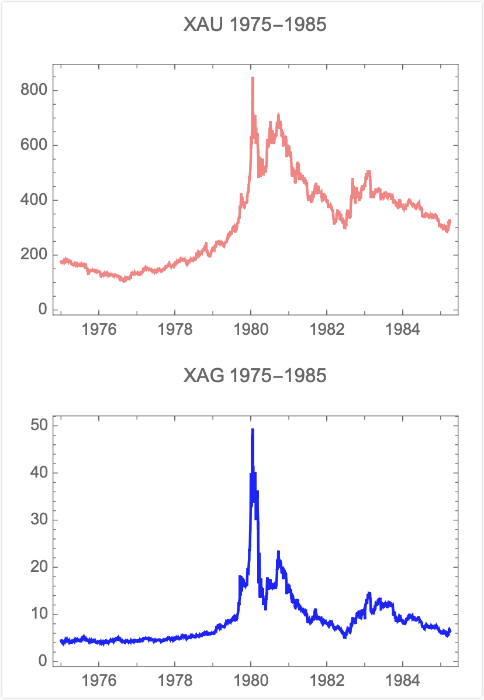

原文信息：

- 原标题：Bitcoin, Currencies, and Fragility
- 原文链接：[PDF](https://www.fooledbyrandomness.com/BTC-QF.pdf)
- 发表时间：2021-06-30
- 中文翻译：Ponge（参考机器翻译、[许哲译本](https://zhuanlan.zhihu.com/p/543127242)）

---

# Bitcoin, Currencies, and Fragility  比特币、货币和脆弱性

Nassim Nicholas Taleb 纳西姆·尼古拉斯·塔勒布[^A][^B]

Universa Investments 寰宇投资公司

Tandon School of Engineering, New York University 纽约大学坦登工学院

Forthcoming, *Quantitative Finance* 即将发表在《计量金融》

[^A]: NNT1@nyu.edu

[^B]: The author thanks Gur Huberman, Mark Spitznagel, Brandon Yarkin, Arthur Breitman, Trishank Karthik Kuppusamy, Jim Gatheral, Joe Norman, Zhuo Xi, David Boxenhorn, Antonis Polemitis, Joe Shipman, and others for useful discussions.  作者感谢 Gur Huberman、Mark Spitznagel、Brandon Yarkin、Arthur Breitman、Trishank Karthik Kuppusamy、Jim Gatheral、Joe Norman、Zhuo Xi、David Boxenhorn、Antonis Polemitis、Joe Shipman 等人的有益讨论。

## Introduction/Abstract  引言/摘要

This discussion applies quantitative finance methods and economic arguments to cryptocurrencies in general and bitcoin in particular — as there are about 10,000 cryptocurrencies, we focus (unless otherwise specified) on the most discussed crypto of those that claim to hew to the original protocol[^r1] and the one with, by far, the largest market capitalization.

本文将量化金融方法和经济学论证应用于加密货币行业，尤其是比特币。目前存在约 10,000 种加密货币，我们将主要关注（除非另有说明）比特币。因为比特币在那些声称遵循原始协议[^r1]的加密货币中被讨论的最多，同时也是迄今为止市值最大的加密货币。

In its current version, in spite of the hype, bitcoin failed to satisfy the notion of "currency without government" (it proved to not even be a currency at all), can be neither a short nor long term store of value (its expected value is no higher than 0), cannot operate as a reliable inflation hedge, and, worst of all, does not constitute, not even remotely, a safe haven for one's investments, a shield against government tyranny, or a tail protection vehicle for catastrophic episodes.

就当下而言，尽管不断有人大肆鼓吹，但比特币并没能实现「无需政府的货币」的构想（事实证明，比特币甚至算不上是一种货币）。它既不能作为短期或长期的价值储存手段（其预期价值不会高于 0），也不能作为可靠的通胀对冲工具。最糟糕的是，它无法成为投资的避风港（完全没办法），也无法充当抵御政府暴政的盾牌，更不能为灾难性的尾部事件[^x1]充当对冲保护的工具。

[^x1]: 许哲注：尾部事件是指发生概率很小的，在分布函数尾部的事件，可粗略理解成小概率事件。

Furthermore, bitcoin promoters appear to conflate the success of a payment mechanism (as a decentralized mode of exchange), which so far has failed, with the speculative variations in the price of a zero-sum maximally fragile asset with massive negative externalities.

此外，比特币的鼓吹者似乎想要把比特币「作为一种（去中心化交易）支付方案的成功与否」与「作为一个投机品的价格上涨与否」混为一谈。就前者来说，到目前为止已经宣告失败了；就后者来说，比特币作为用于零和投机游戏的脆弱资产，具有巨大的负外部性[^x2]。

[^x2]: 许哲注：负外部性是经济学术语，可以粗略的理解为对社会有害。

Going through monetary history, we show how a true numeraire must be one of minimum variance with respect to an arbitrary basket of goods and services, how gold and silver lost their inflation hedge status during the Hunt brothers squeeze in the late 1970s and what would be required from a true inflation hedged store of value.

通过回顾货币历史，我们展示了：1）为什么说一个真正的计价单位（numeraire）必须是相对于任意一篮子商品和服务而言差异最小的货币；2）黄金和白银如何在 1970 年代后期亨特兄弟挤兑事件后失去了其通胀对冲地位；以及 3）一个真正的通胀对冲、价值储存工具需要具备哪些条件。

*Fig. 1. BTC return, 3 months annualized volatility. It does not seem to decrease over time. 图 1：比特币回报的 3 个月年化波动率。它似乎没有随着时间的推移而下降。*

*Fig. 2. Too volatile to fail? We show the volatility of the capitalization of BTC. At higher levels of capitalization, return volatility compounds. In 2021 a swing of half a trillion dollars in the capitalization of bitcoin took place.  图 2：太过波动而不能倒？我们展示了比特币市值的波动性。在较高水平的市值下，回报的波动性会指数级增加。2021 年，比特币市值发生了 5000 亿美元的大幅波动。[^x3]*

[^x3]: 许哲注：该图是比特币价格波动率的一个统计，波动率通常是描述资产价格不稳定性的指标，用价格变化的方差来刻画。波动率大意味着作为支付工具是不可用的。

## The Blockchain  区块链

First, let us consider what cryptocurrencies do by examining the notion of blockchain and its intellectual and mathematical appeal.

首先，让我们通过探讨区块链的概念及其在智力和数学方面的魅力特质，来了解加密货币所做的事情[^x4]。

[^x4]: 许哲注：关于比特币原理的简介，网上有很多，这里说的实在是不够清晰，**强烈推荐** [3blue1brown 比特币原理简介](https://www.bilibili.com/video/BV11x411i72w/)；了解了比特币的原理后关于原理部分的描述可以扫一眼跳着看

The concept behind such a chain is quite intuitive to early practitioners of quantitative finance. Consider that before efficient software for Monte Carlo simulations became widely available, some of us were using methods to generate pseudorandom variables via some forms of chained nonlinear transformations, in the spirit of Von Neumann's original idea[^r2]. Indexing sequences by $t= 1, 2,... n$, with a seed at $t$, a variable $x_t$ on the real line generates via nonlinear transformations $r: \mathbb{R} \to \mathbb{R}$, an output variable $r(x_t)$. This output variable can serve as a pseudorandom seed to generate another pseudorandom variable, $r(x_{t+1})$. For all $t$, knowledge of $r(X_t)$ allows knowledge of all subsequent variables $r(x_\tau)_{\tau>t}$ and replication of the entire sequence, thus probabilistically mimicking the arrow of time. It is also crucial that the same seed produces exactly the same pseudorandom variable, allowing verification of sequence, but disallowing easy reverse engineering.

区块链背后的概念，对于早期的量化金融从业者来说是非常简单易懂的。想想看，在蒙特卡罗模拟的高效软件广泛普及之前，我们中的一些人就已经在通过某种形式的链式非线性变换来生成伪随机变量了，这与冯·诺依曼最初的想法如出一辙[^r2]。将序列用 $t= 1, 2,... n$ 进行编号，以 $t$ 处的值为初值，实数轴上的变量 $x_t$ 通过非线性变换 $r: \mathbb{R} \to \mathbb{R}$ 生成输出变量 $r(x_t)$。这个输出变量可以作为伪随机初值，去生成另一个伪随机变量 $r(x_{t+1})$。对于所有 $t$，只要知道 $r(X_t)$，就可以知道所有后续变量 $r(x_\tau)_{\tau>t}$，并复制整个序列，从而从概率上模拟时间流逝。同样重要的是，相同的初值会产生完全相同的伪随机变量，使得可以很容易地验证序列，但很难逆向工程（从结果倒推初始的序列数值）。

What the blockchain added, thanks to the hash function, is the condition that $r(.)$ must be functionally and probabilistically bijective: no two seeds should produce the same output (or should produce a vanishingly low probability of that happening), what, in computer science terminology, is called *collision*.

由于哈希函数的存在，区块链增加了一个条件，即 $r(.)$ 必须在函数和概率上是双射（bijective）的：任意两个不同的初值产生的输出皆不相同（或者产生相同输出的概率应该低得可以忽略不计）。这在计算机科学术语中被称为**碰撞（collision）**[^x5]。

[^x5]: 许哲注：如果你看着头晕，确保你知道哈希函数是什么的情况下可以跳过，如果还不知道，但能看点简单的代码，推荐参考 [关于哈希算法](https://zhuanlan.zhihu.com/p/28818841)

This hard-wired attribute and absence of supervision of the blockchain allow the storage of activities on a public ledger to facilitate peer-to-peer commerce, transactions, and settlements. The blockchain concept also allows for serial record keeping. This is supposed to help create what the original white paper[^r1] described as:

这种一旦产生就无法更改（hard-wired），且区块链本身无需许可的特点，使得人们可以将活动存储在公共账本（public ledger）上，从而促进点对点（peer-to-peer）商业活动、交易和结算的发展。此外，区块链的机制还能够保存过往历史记录。这被认为有助于创建原始白皮书[^r1]中所描述的：

> A purely peer-to-peer version of electronic cash would allow online payments to be sent directly from one party to another without going through a financial institution.  一种完全的点对点电子货币应当允许在线支付从一方直接发送到另一方，而不需要通过一个金融机构。（来源：[比特币白皮书中文版](https://bitcoin.org/files/bitcoin-paper/bitcoin_zh_cn.pdf)）

From that paper, bitcoin makes use of three existing technologies: 1) the hash function, 2) the Merkle tree (to chain blocks of transactions tagged by the hash function), and 3) the concept of proof of work (used to deter spam by forcing agents to use computer time in order to qualify for a transaction) — technologies that, ironically, all came out of the academic literature[^r3] *\[note 1\]*. The idea provides a game theoretic approach to mitigate the effects of the absence of custodian and lack of trust between participants in the maintenance of a permanent shared public ledger — attenuating or circumventing the coordination quandary known as the "Byzantine general problem". 

根据白皮书的说法，比特币使用了三项已经存在的技术[^x6]：

1) 哈希函数（the hash function）；
2) 默克尔树（the Merkle tree）（把一个个由哈希函数标记的交易区块链接起来）；
3) 工作量证明（proof of work）的概念（强制让记账者使用时间戳来获得记录交易的资格，以避免双重支付）。

具有讽刺意味的是，所有这些技术都出自学术文献[^r3]【注释 1】。区块链的机制提供了一种博弈论层面上的方法，使得公众在维护永久共享的公共账本过程中，能够缓解缺乏托管人、参与者之间缺乏信任带来的影响，同时能够减轻或规避被称为「拜占庭将军问题」的协调困境。

[^x6]: 许哲注：使用已经成熟很久的技术拼凑出一个新技术并不丢人和讽刺，利用久经考验的技术会让技术更可靠，这并没问题。显得略有讽刺是区块链技术的鼓吹者把这项技术吹得过于跨时代，好似再造天地一般。这个锅是区块链的过度鼓吹者的，笔者并不认为这是区块链应该被诟病的点。

*\[note 1\]*: As this discussion is focused on proof of work, we exclude from it Ethereum and other cryptocurrencies.

【注释 1】由于本文讨论的重点是工作量证明，因此将以太坊和其他加密货币排除在外。[^x7]

[^x7]: 许哲注：以太坊要转用 POS 等完全原理上不同于 POW 的技术，之后关于 POW 的论述均不适用

The bitcoin transactional currency (BTC) system establishes an adversarial collaboration between the so-called "miners" who validate transactions by getting them on a public ledger; as a reward they get coins plus a fee from the underlying transactions, transfers of coins between parties. The proof of work method has an adjustable degree of difficulty based on the speed of blocks, which aims, in theory, to keep the incentive sufficiently high for miners to keep operating the system. Such adjustments lead to an exponential increase in computer power requirements, making at the time of writing onerous energy demands on the system — energy that could find alternatives in other computational and scientific uses.

比特币的交易货币系统在所谓的「矿工（miners）」之间建立了一种对抗性合作关系。矿工指的是那些将交易记入公共账本中，以此来确认交易成立的参与者。作为回报，矿工会获得系统增发的比特币，并从基础交易（即各方之间的比特币转账）中赚取手续费。工作量证明（PoW）的算法会根据出块的速度来调整挖矿难度，这种设计初衷在于为矿工创造足够的激励，以保证公共账本系统的运营。这种调整机制会导致计算机算力需求指数性的增长，整个系统能源需求巨大（截至本文撰稿时）——这些算力和能源本可以用来做其他计算和科研用途。

Miners derive their compensation from both seignorage (the market value of a bitcoin minus its mining costs) and transaction fees upon validation — with the plan to switch to transaction fees as the sole revenues upon the eventual depletion of the coins, which are limited to a fixed number.

矿工们的报酬来自两部分：铸币税（比特币的市场价值减去其挖矿成本）和验证交易收取的手续费。按照计划，比特币最终会停止增发（比特币的总发行量是固定的），矿工的收入将只依赖于交易费用。[^x8]

[^x8]: 许哲注：这里是比特币区块奖励的机制，每过一段时间区块奖励减半，最后直到没有，从而保证比特币的总量上限存在一个固定数字。当比特币达到最大值时，矿工的所有收益均来自于手续费。

A central attribute is that bitcoin depends on the existence of such miners for perpetuity.

比特币的一个核心特性是，只有这种矿工一直存在，比特币才会永存。[^x9]

[^x9]: 许哲注：意思是当区块奖励消失后，矿工们能否继续参与挖矿有问题，但比特币唯一的物理存在就是矿工，矿工要是不干了就彻底废了。这个担忧是确实存在的，矿工圈内亦有激烈讨论，不是空穴来风。

Note that the entire ideological basis behind bitcoin is complete distrust of other operators — there are no partial custodians; the system is fully distributed, though prone to concentration *\[note 2\]*. Furthermore, by the very nature of the blockchain, transactions are irreversible, no matter the reason.

请注意，比特币的整个理念基础是矿工之间彼此完全不信任（即系统内不存在托管商）。尽管容易出现集中化现象【注释 2】，整个系统是完全分布式的。此外，由于区块链的本质，无论出于何种原因，交易都是不可撤销的。

*\[note 2\]*: From public data, we were able to verify that the distribution of holdings of bitcoin follows a powerlaw with tail index $\approx \dfrac{5}{4}$ , no different from the distribution of wealth in the U.S.

【注释 2】根据公开数据，我们可以证实比特币的持有量遵循幂律分布，且具有肥尾特征，其尾指数（Tail Index）大约是 1.25 左右，这种分布特征与美国的财富分布并无不同[^x10][^p1]。

[^x10]: 许哲注：意思是比特币是集中在少数人手上的，所以理念上的去中心化并没什么卵用，还是掌握在几个中心手上

[^p1]: 译者注：所谓尾指数，是一个用来衡量分布尾部厚度的参数，用于描述分布的尾部衰减速度，即极端事件发生的频率。正态分布的尾指数为0，表示其尾部衰减得最快；尾指数大于0时，表示分布具有肥尾特性，极端事件发生的频率较高。

Finally, note that bitcoins are zero-sum by virtue of the *numerus clausus*.

最后，请注意，由于「**总量恒定（numerus clausus）**」[^x11]，比特币是一个零和游戏。

[^x11]: 许哲注：这里的 *numerus clausus* 是拉丁语，意思是「closed number」，意思是比特币就在一个封闭的小圈子里互相搞一个零和的游戏而已。四个人打麻将永远创造不出价值的。

As we will see, mathematical and combinatorial qualities do not necessarily translate into financial benefits at either individual or systemic levels.

正如我们将看到的，比特币在数学和合作方面的精巧设计并不一定会转化为个人或系统层面的经济利益。

> **Comment 1: Why BTC is worth exactly 0**
> 
> **评论 1：为什么比特币一文不值？**
>
> Gold and other precious metals are largely maintenance free, do not degrade over an historical horizon, and do not require maintenance to refresh their physical properties over time.
>
> 黄金和其他贵金属几乎不需要人为关照，在漫长历史中不会衰败，也无需花钱来保持其物理特性。
>
> Cryptocurrencies require a sustained amount of interest in them.
>
> 相比之下，加密货币需要人们持续的关注和投入。

## Vulnerability Of Revenue-Free Bubbles  非生息资产泡沫的脆弱性

A central result (even principle) in the rational expectations and securities pricing literature is that, thanks to the law of iterated expectations, if we expect now *that we will expect* the price to vary at some point in the future, then by backward induction such a variation must be incorporated in the price *now*. When there are no dividends, as with growth companies, there is still an expectation of future earnings, and a future expected reward to stockholders — directly via dividends, or indirectly via reverse dilutions and buybacks. It remains that a stock is a claim on accumulated assets and their residual value.

在理性预期和证券定价文献中，一个核心结论（甚至可以说是核心原则）是：根据迭代期望定律（law of iterated expectations），如果我们现在预期「**站在未来某个时刻，那时候我们预期**价格将会在更远的未来发生变化」，那么通过反向推理，这种变化一定包含在**当下**的价格之中。与成长型公司一样，在不分红的情况下，股东仍然可以预期未来的公司利润，以及预期未来的股东回报——可能是通过股息直接实现，也可能是通过反向稀释和股票回购间接实现。无论如何，股票仍然是对累积资产及其剩余价值的索取权。[^x12]

[^x12]: 许哲注：
	
	这里讲的未来贴现的股票定价模型，可以参考：[如何简单明了地解释自由现金流折现？](https://www.zhihu.com/question/23005134/answer/2306281723)
	
	这里的范围要略广一些，不仅仅是股息回报，所有的回购增加股东权益的行为都囊括进去了，意思是说明一个资产必然是因为未来有回报的（无论是不是以现金分红的形式）才造就了它当下的「贴现价值」。
	
	并且未来在某个条件下产生的某种期望的综合效果，和当下无视未来事件对期望的影响也一定是相同的，双重期望值定律给我们估值带来的巨大方便。
	
	双重期望值定律： E(X)=E(E(X|Y))
	
	当Y条件下X的期望值，也就是未来股票或者资产产生某些事件对我们估值的影响（利好或者利空的事件），长期综合考虑它们影响的总和，也就是对所有条件期望再求期望，和无条件期望（完全不考虑未来可能产生的利多利空，也就是无视条件概率事件）最后必然也是一致的。
	
	我再换人话一下：风风雨雨最后长期还是看内在，当下只要观察长期价值，当下也必然反应长期。因为有双重期望值定律，我们不需要考虑太多可能产生条件下期望的事情对当下估值的影响，使得资产估值变为可能。
	
	再透一点，价值投资可以彻底无视未来可能对价值预估产生变动的扰动，因为这些未来潜在的扰动其实也已经含在现在都价格里。因为未来是不可知的，所以有了双重期望值定律，我们才有可能定价，无惧未知。
	
	这些都是为了说明价值投资理论的内涵用于后续的论述。

Earnings-free assets with no residual value are problematic.

没有剩余价值的非生息资产是有问题的。

The implication is that, owing to the absence of any explicit yield benefitting the holder of bitcoin, *if* we expect that at any point in the future the value will be zero when miners are extinct, the technology becomes obsolete, or future generations get into other such "assets" and bitcoin loses its appeal for them, *then* the value must be zero *now* *\[note 3\]*.

这意味着，由于比特币持有者没有任何明确的收益，**如果**我们预期在未来某个时刻比特币的价值将为零，比如矿工最后因为激励不足停止运营了、现有技术过时了，或者未来几代人转向其他类似「资产」，不再看好比特币了，**那么**比特币**现在的**价值就应该是零【注释 3】[^x13]。

[^x13]: 许哲注：在价值投资里，一个东西未来的价格如果是 0 的话，那么它的「现值」必然是 0。这段话的意思是比特币作为一个必须要有「后来人」接盘的东西，本身是无收益资产的话，那么几个可能让比特币归零的可能性存在，比特币的现值就应该是 0。肯定有人会说黄金白银也是无收益资产，不照样不归零还新高嘛，这个在后文里有讲到。我们先来看【注释 3】的内容

*\[note 3\]*: Using a traditional rational bubble model (see this[^r4] and the review by this[^r5]), we get the following conditions. Let $r_d$ be a discount rate and $\pi$ be a probability of absorption over a period. To escape the barrier, bitcoin must grow at $e^{r+\pi}$ forever, but no more, without remission, and with total certainty. Should it grow then stabilize, it still would be prone to extinction. We note that traditionally, models rule out any continuous growth at an exponential rate faster than $r+\pi$ because the security or asset would then represent the entire economy. Bitcoin distinguishes itself from other assets because of its fragility as a mere book entry on a virtual ledger that requires constant refreshing *ad infinitum*.

【注释 3】使用传统的理性泡沫模型（参考这篇[^r4]，以及这篇[^r5]的文献综述部分），我们可以推导出泡沫不破裂需要满足下列的条件：令 $r_d$ 为贴现率（discount rate）， $\pi$ 为一段时间内的吸收概率（probability of absorption）。为了逃离吸收壁（absorbing barrier），比特币必须永远以 $e^{r+\pi}$ 的速度增长，但不能超过这个速度。而且，这个过程必须毫无间断，并且有十足的确定性。如果它增长后趋于稳定，它仍然容易消亡。我们注意到，传统模型排除了任何快于 $r+\pi$ 的指数增长，因为那样的话，证券或资产将代表整个经济。比特币与其他资产的区别在于其脆弱性，因为它仅仅是一个需要**永无止尽**（ad infinitum）持续更新的虚拟账本上的账目记录。[^x14]

[^x14]: 许哲注：这两篇关于泡沫模型的论文我没读过，不过看着似乎挺有意思的。塔勒布的意思是根据这个泡沫模型，一个靠后来者接盘的东西本质上是一个旁氏模型，然后必须维持一定的增速，否则旁氏骗局就崩盘了。具体的推导过程大家可以去看引述的原论文。所有引述的论文最后会罗列。一个旁氏盘子必须药不能停，这个是肯定没问题的。如果比特币是完全依赖后来者以更高价格买走的旁氏的话，那么它维系存在的增长需求也是不断增长直到不可能的。塔勒布大致的意思是比特币那是比一般泡沫要虚得多的泡沫里的战斗机。

The typical comparison of bitcoin to gold is lacking in elementary financial rigor *\[note 4\]*. We will see below how precious metals lost their quality as a medium of exchange; gold and other dividend-free precious items (such as other metals or stones) have held some financial status for more than 6,000 years, and their physical status for several orders of magnitude longer (i.e., they did not degrade or mutate into some other alloy or mineral). So one can expect one's gold or silver possessions to be around physically for at least the next millennium, as well as having some residual economic value by iteration, for the same reason. Metals have ample industrial uses with demand elasticity (and substitution for other raw materials). Currently, about half of gold production goes to jewelry (for which there are often no storage costs), one tenth to industry, and a quarter to central bank reserves.

通常，人们将比特币比作黄金，但这种比较缺乏最基本的金融严谨性【注释 4】。我们将在下文中看到贵金属是如何失去其作为交换媒介的地位的；黄金和其他非生息稀缺品（比如其他金属或宝石）在 6,000 多年来一直具有着某种价值贮藏的功能，不过它们的物理状态可保持的时间则要比这长上好几个数量级（即，它们没有降解或变异成其他合金或矿物）。因此，可以预计自己的黄金或白银资产在物理上至少到公元三千年还会存在，并且由于相同的原因，在一代代相传之下仍会有一些残余的经济价值。金属在工业上有广泛的用途，具有需求弹性（黄金可以替代其他原材料）。目前，黄金产量的一半用于珠宝首饰（通常不需要储存成本），十分之一用于工业，四分之一用于中央银行储备。[^x15]

[^x15]: 许哲注：意思是说贵金属宝石啥的并不是啥天然的货币，6000多年的金融属性历史远比不上它们更久远的历史，贵金属宝石等作为货币只占它们历史的很小一段，而且现在贵金属也失去了货币属性了。所以不存在什么金属天然是货币。且金属这类非生息资产因为有工业属性和其他用途，比如就是人们纯粹喜欢黄金而有价值。为什么把比特币称为电子黄金是不对的，是【注释 4】的内容。

*\[note 4\]*: It is also a reasoning error to claim that an innovation, bitcoin, can become the "new gold" *ab ovo*, when gold wasn't decided to be so by fiat thanks to a white paper; it organically became a reserve asset ex post, through centuries of competitive selection against other modes of storage, payment, and collectibles. Gold elicited an aesthetic fascination and had been used as jewelry and store of value for more than two millennia before it became, literally, a currency or before there was such a thing as a currency. The Phoenicians used it as store of value because there was demand for it, and it was not until the 6th C. BCE that coins from Sardis became a widespread means of exchange[^r6].

【注释 4】人们宣称一种创新产品（比特币）**一出现**就可以成为「新型黄金」，这是一种推理错误。当时黄金并不是通过一份白皮书被决定为如此的；站在今天回溯整段历史，黄金经历了好几个世纪的竞争性选择，在各种形式的存储、支付和收藏方式中脱颖而出，最终成为了储备资产。在黄金真正成为货币或出现货币这一概念之前的两千多年里，黄金本身就会引发人们的迷恋，人们认为黄金是美的，把黄金当作珠宝和价值储藏的工具。腓尼基人使用黄金作为储藏价值的工具，因为当时市场对其有需求。直到公元前 6 世纪，来自萨迪斯（Sardis）的硬币才成为一种广泛的交换手段。[^r6][^x16]

[^x16]: 许哲注：
	
	这段注释的意思是不能倒果为因，黄金在成为货币前因为大家都很想要了，所以才脱颖而出变成一种储备资产，然后才有把黄金当做货币的事情发生。是先有大家想要黄金为因，才有黄金被当做货币为果。先宣传一个东西是货币，然后说它是新黄金是不对的。
	
	一个东西能成为货币储备是因为大家想要它，而不是它像黄金。黄金也是因为大家要它，它才成为货币储备资产的，而非反过来。
	
	到这里大致的意思是要么一个资产是生息资产，我们能通过贴现模型的方式估值资产。而一个纯粹靠后来者接盘维系价格的旁氏结构未来对增长的需求会达到不可能实现而必然走向崩盘。比特币是非生息资产。
	
	例如黄金这样的也是非生息资产的东西，它能保持自己的价值是因为有需求，或者珠宝业人家喜欢黄金，或者是工业属性。且黄金存在的时间远远长于其作为货币属性的时间。是因为黄金被广泛的有需求了，才会让黄金脱颖而出成为货币的一种候选，并且黄金现在也失去了货币属性。
	
	所以因为比特币和黄金一样是稀缺不可再生的，就论证比特币一定会像黄金一样具备货币属性（黄金自己都没有了），这个逻辑推断是不成立的。是先有需求才有储备价值，才发展成货币。而非单纯因为稀有。如果比特币不能让人产生需求，仅就不可再生和稀缺的话，是站不住脚的论断。
	
	要么你拿贴现模型来，要么有人消费的供需模型来，否则就得用泡沫模型了，是个泡沫迟早要灭。如果迟早要灭，那么贴现价值也就是0了。

Path dependence is a problem. We cannot expect a book entry on a ledger that requires active maintenance by interested and incentivized people to keep its *physical presence*, a condition for monetary value, for any period of time — and of course we are not sure of the interests, mindsets, and preferences of future generations. Once bitcoin drops below a certain threshold, it may hit an absorbing barrier and stays at 0 — gold on the other hand is *not* path dependent in its physical properties *\[note 5\]*. As discussed in this paper[^r7], technologies tend to be supplanted by other technologies (>99% of the new is replaced by something newer), whereas items such as gold and silver have proved resistant to extinction. Furthermore bitcoin is supposed to be hacker-proof and is based on total infallibility in the future, not just at present. It is crucial that bitcoin is based on perfect immortality; unlike conventional assets, the slightest mortality rate puts its value at 0 *\[note 6\]*.

路径依赖是一个问题。这种账本上的任何记录，都需要人主动维护（出于兴趣和物质激励），才能保持其**物理状态**。而物理状态稳定是其资产价值的必要条件，在任何时期都是如此。我们不能指望这种账本永远有价值，尤其是我们尚不能确定未来几代人的兴趣、思维方式和偏好。一旦比特币跌破某个阈值，它可能会「撞上」吸收壁（absorbing barrier），然后永远归零。然而，黄金在其物理状态上**不存在**路径依赖的问题【注释 5】。正如这篇文章[^r7]讨论的那样，技术往往会被其他技术取代（新技术中超过 99% 会被更新的东西替代），而像黄金和白银这样的东西则被证明不会消亡[^x17]。此外，比特币存在的前提是，这种技术应该是无法被黑客攻击的。这种坚不可摧并不仅仅适用于现在，而要适用于从现在往后的所有时刻。至关重要的是，比特币是建立在完美不朽的基础上的；于传统资产不同，一丝丝瑕疵都会让其价值永远归零【注释 6】。[^x18]

[^x17]: 许哲注：
	
	意思是比特币和黄金白银不一样，它要维持自己在物理世界的存在，需要矿工们持续支付代价来维持存在。而未来的人是不是会继续对比特币网络有那么高的兴趣来维护昂贵的区块链的运行成本，我们没办法知道。如果有更好的记账技术了，比特币主链会被放弃，那就会归零，而未来会归零的东西的贴现值就是零。也就是说除非币圈信仰充值药不能停能维持到天荒地老，并且当中不能有任何断档，不然迟早有一天要归零。中间任何一个 10 分钟都不能断是颇为脆弱的。
	
	长期来看，很难想象比特币的区块链技术就是最优版本，这也不符合计算机软件发展的规律。目前比特币的主链是否会是未来的最大市值链，甚至是否有挖矿的经济效益，确实是不确定的。并且未来如果有比区块链更好的作为记账的手段，抛弃区块链也不是不可能的事情。但这个未来可能会有更好方案的推论其实可以普适于一切对技术的评论。笔者认为这种诘难过于宽泛。
	
	但区块链需要一刻不停的以高成本维护确实是一个脆弱点，触及「吸收壁」效应的话，可能就会发生比较大的问题。相比于贵金属等而言需要高维护成本是一个实打实的弱点和劣势，这是不可否认的。下面的【注释 5】会进一步解释「吸收壁」效应。
	
	硬分叉或许是一个保持动态升级的办法，虽然其有负面效应，一刻不能停确实是一个很严苛的要求，很难想象长期到千年的级别，区块链能保持 always online。笔者更加相信在链在技术上撞到脆弱性的时间要晚于有比目前区块链技术更好的新技术的出现的时间。比区块链更优的新技术让挖矿成为不经济行为的可能性更大。

[^x18]: 许哲注：从信息安全的角度上来说，没有绝对安全的系统，比特币亦然。比特币的区块链技术在历史上也有几次安全漏洞和更新，但并不是所有的安全漏洞都触发了吸收壁。但这确实是一个很大的风险隐患，我们确实没法确定比特币是否目前还藏着致命的安全性缺陷，没人知道。相比于黄金这类靠物理定律保持稳定的，确实是个劣势。而一旦有概率不小于 0 的比特币漏洞能导致比特币网络出致命问题，那么它的贴现值就是 0 这个推论是正确的。由此可以构造同义的句子：在未来无穷长的时间内，比特币技术存在任意致命漏洞的概率大于 0 的情况下，比特币当下的贴现价值为 0。比特币：我太难了……

*\[note 5\]*: The absorbing barrier does not have to be 0 for the price to spiral to 0 upon hitting the barrier. This is similar to saying "if the heart rate drops below ten beats per minutes, it will be 0 (death)" — nor does it necessarily have to be caused by a drop in price. Nor does it have to be endogenous.

【注释 5】吸收壁（absorbing barrier）并不意味着价格跌到 0，而是说，当触及吸收壁的时候，价格可能会螺旋式下降到 0。这个有点类似说「如果心率降到每分钟不到十次，那么它就会归零（死亡）」。这种撞上吸收壁后归零的情况，并不一定是由于价格下跌造成的，也不一定是内生的。[^x19]

[^x19]: 许哲注：吸收壁效应的意思就是临界触发死亡螺旋的这么一个比喻，一旦触及到了，就不可逆的走向灭亡。

*\[note 6\]*: To counter the effect of the absorbing barrier, the asset must grow at an exponential rate *forever*, without remission, and with total certainty. Belief in such an immortality for BTC — and its total infallibility — is in line with the common observation that its enthusiastic investors have the attributes of a religious cult.

【注释 6】为了对抗吸收壁效应的影响，资产价格必须**永远**以指数速度增长，速度不能变慢，而且要具有完全的确定性。相信比特币是不朽的，认为它是无懈可击的，符合一个普遍观察到的事实：比特币投资者是狂热的，而且具有宗教异端的特征。[^x20]

[^x20]: 许哲注：意思是比特币泡沫不触及到吸收壁除非有宗教信仰般的热情，否则不可能。而现在比特币还杵在那里是因为我们确实看到币圈搞的跟邪教一样。

>**Principle 1: Cumulative ruin**
>
>**定律 1：千里之堤毁于蚁穴**
>
>If any non-dividend yielding asset has the tiniest constant probability of hitting an absorbing barrier (causing its value to become 0), then its present value must be 0. 
>
>如果任何非生息资产有一定概率（哪怕极小）「撞上」吸收壁（导致价值归零），那么其现值就应该是 0。[^x21]

[^x21]: 许哲注：上一篇的贴限值理论和链接可以参考阅读，反复在用这个推论。

We exclude collectibles from that category, as they have an aesthetic utility as if one were, in a way, renting them for an expense that maps to a dividend — and thus are no different from perishable consumer goods. The same applies to the jewelry side of gold and its convenience yield: my gold necklace may be worth 0 in thirty years, but then I would have been wearing it for six decades.

在这里我们将收藏品排除在这一类别之外，因为它们具有美学价值。在某种程度上，这相当于人们愿意持续花钱租赁这种收藏品来获得美的体验，而租赁的价格，就相当于股息。（收藏品的价格就应该等于这种「股息」的贴现。）这与消费者买非耐用消费品没什么不同。同样的道理也适用于黄金首饰，佩戴它具有一定的便利收益（Convenience Yield）[^p2]：虽然我的黄金项链在三十年后可能一文不值，但那时我已经戴了六十年了。[^x22]

[^p2]: 译者注：期货的专业名词，指持有现货带来的无法用钱来衡量的便利。尤其是对生产商，如果持有原材料的远期合约，要到到期才能执行购买，如果持有现货，就可以轻松应对临时急缺原材料的尴尬场景，这当中的无法用钱来衡量的便利称为 convenience yield。[来源](https://www.fxtjz.com/pricing-valuation-of-forwards/)

[^x22]: 许哲注：
	
	意思是收藏品这类的持续在给人产生消费价值，这个持续产生的消费价值和股息分红是一个意思。是分批「划拨」给持有者的。大金链子戴六十年给塔勒布带来的效用已经「回本」了。
	
	这里得理解经济学上关于「效用」的意思，未必是金钱上的，满足你需求的都能改变人的经济行为。假如你买了一幅画，你越看越舒坦，其美学价值让你吃饭后看个十分钟就能觉得妙不可言，然后你持续看了三十年到你撒手人寰被你儿子贱卖掉。那么这三十年来给的这个舒适感也可以算作是「效用分红」，算变相的派息。
	
	按照这个收藏品效用的算法，NFT比BTC靠谱，我一时略有凌乱。抬个杠，我钱包里有比特币特看着就特满足算不算呢？

The difference between the current bitcoin bubble and past recent ones, such as the dot-com episode spanning the period over 1995-2000, is that shell companies were at least promising some type of future revenue stream. Bitcoin would be allowed to escape a valuation methodology had it proven to be a medium of exchange or satisfied the condition for a numeraire from which other goods could be priced. But currently it is not, as we will see next.

当前比特币泡沫与过去泡沫（如 1995 年至 2000 年的科网泡沫）的不同之处在于，就算那时候的空壳公司，也至少承诺了一些未来的收入来源。如果比特币想摆脱以这种估值方式定价的话，那么它必须证明自己能够作为一种交换媒介，或能够成为其他商品定价的计量单位。但它目前并没有做到这一点，正如我们在下文论述的。[^x23]

[^x23]: 许哲注：意思是纯交易媒介，也就是现金货币是不能用上面说的那些估值模式来定价的，或者世界上还有一些特殊的资产定价的模式，如果比特币是货币属性的话，就可以超然。塔勒布认为并没有。

## Success In Wrong Places  在错误的领域里成功

More generally, the fundamental flaw and contradiction at the base of most cryptocurrencies is, as we saw, that the originators, miners, and maintainers of the system currently make their money from the inflation of their currencies rather than *just* from the volume of underlying transactions in them. Hence the total failure of bitcoin to become a currency has been masked by the inflation of the currency value, generating (paper) profits for a large enough number of people to enter the discourse well ahead of its utility.

更一般地说，正如我们所看到的，大多数加密货币的根本缺陷和矛盾在于，该体系的创始人、矿工和维护者目前都在通过发行代币来赚钱，而不是**仅仅**通过其中的基础交易量赚手续费。因此，比特币想要成为一种货币的梦想虽然彻底破灭了，但价格暴涨后，这种梦想似乎也没那么重要了。对很多人来说，比特币创造了足够多的（账面）利润，这使得他们不需要看到比特币真正落地就能坦然接受这种叙事逻辑。[^x24]

[^x24]: 许哲注：
	
	这里说的是比特币作为货币属性的失败，如果是一个货币那么应该根据利用该货币清算的交易来得出它的媒介价值，也就是 MV=PQ ，当使用一个货币清算的商品数量和价格足够多的时候，货币是有价值的。但比特币并没用来清算什么贸易，而是一个通胀里的纸面富贵的游戏而已。
	
	人们沉迷于这个账面盈利的游戏，以至于不关心它有没有真的当货币用，这个是币圈里的现实。之前有尝试过比特币作为支付工具的创业公司，无一例外的都没成功，比特币在交易媒介领域并不成功。最初用比特币买披萨的反而是一个正途，而后期比特币虽然市值很高，但作为货币的尝试是失败的。但是 Who cares，币圈的人都盯着某某某发财了我也想要，比特币是不是货币确实没人关心。

>**Comment 2: Success for a digital currency**
>
>**评论 2：数字货币的成功标准**
>
>There is a mistaken conflation between success for a "digital currency", which requires some stability and usability, and speculative price appreciation.
>
>「数字货币」的成功，需要的是一定程度上的稳定性和可用性，并不是投机性的「汇率升值」，有人将这两者错误混淆了。

Transactions in bitcoin are considerably more expensive than wire services or other modes of transfers, or ones in other cryptocurrencies *\[note 7\]*. They are order of magnitudes slower than standard commercial systems used by credit card companies — anecdotally, while you can instantly buy a cup of coffee with your cell phone, you would need to wait ten minutes if you used bitcoin *\[note 8\]*. They cannot compete with African mobile money *\[note 9\]*. Nor can the system outlined above — as per its very structure — accommodate a large volume of transactions — which is something central for such an ambitious payment system.

比特币的交易费用比银行电汇或其他转账方式高得多，甚至相较于其他加密货币的交易费用也偏昂贵【注释 7】。此外，比特币的支付确认时间比信用卡公司使用的支付系统慢了一个数量级——你用手机买一杯咖啡，可以立即支付，但据说你要是用比特币的话，需要等上 10 分钟，对方才能够确认你是否付款成功【注释 8】。这种速度甚至无法与非洲的移动支付相竞争【注释 9】。更要命的是，比特币系统由于其特殊的机制，本身也无法容纳大量的交易量，而这对于如此雄心勃勃的支付系统来说是很重要的。[^x25]

[^x25]: 许哲注：批评比特币支付手段又慢又贵，比特币每秒 7 笔的处理速度从开始就被人诟病，大区块路线和闪电网络等方案也都是针对这个问题的。客观的说，原版的比特币作为一个通用支付系统，肯定是不够看的。

*\[note 7\]*: Transactions in bitcoin are orders of magnitude more expensive than those done using African mobile phones.

【注释 7】比特币的交易费用比非洲的移动支付都要贵得多。

*\[note 8\]*: "As it grew in popularity, Bitcoin became cumbersome, slow, and expensive to use. It takes about 10 minutes to validate most transactions using the cryptocurrency and the transaction fee has been at a median of about \$20 this year." By Eswar Prasad, *New York Times*, Jun 15, 2021.

【注释 8】「随着比特币的普及，比特币支付变得笨重、缓慢、使用成本高昂。使用这种加密货币确认大多数交易成功需要大约 10 分钟之久，而且每笔交易的费用中位数均值约为 20 美元（截至今年）。」——埃斯瓦尔·普拉萨德（Eswar Prasad），2021 年 6 月 15 日《纽约时报》

*\[note 9\]*: There appear to be other protocols issued from the original white paper that claim to be more transaction focused; as with Ethereum, we exclude them from this analysis.

【注释 9】除了比特币外，市面上似乎有其他也是源自原始白皮书的协议，这些协议声称更专注于交易场景。和以太坊一样，在我们的分析中先不讨论这些情况。

To date, twelve years into its life, in spite of all the fanfare, but with the possible exception of the price tag of Salvadoran permanent residence (3 bitcoins), there are currently no prices fixed in bitcoin floating in fiat currencies in the economy.

迄今为止，比特币已经诞生 12 年了。尽管宣传得沸沸扬扬，但除了萨尔瓦多永久居留权（标价 3 个比特币）之外，没有任何一个商品是根据比特币来标价的（从而相对于法币是浮动的）。[^x26]

[^x26]: 许哲注：这个是充分说明比特币目前并没有被当做货币用的一个例证，确实如此。

## Principles For A Currency  货币的原理

First, let's discuss the demonetization of gold. In 1971, the U.S. government terminated the Bretton Woods Agreement, ending the convertibility of the U.S. dollar into gold. Gold stocks were growing too slowly, and, as mentioned earlier, much of it went to jewelry and industry — the most robust theory is that there was not enough gold to keep up with economic growth *\[note 10\]*. Furthermore, there had been long debates over the hampering of monetary policy by sticking to metals, as witnessed by the bullionist controversy *\[note 11\]*. It appears that developed economies have trouble hooking their currencies to a commodity.

首先，让我们讨论一下黄金非货币化的问题。1971 年，美国政府终止了《布雷顿森林协定》，结束了美元与黄金之间的挂钩。黄金的总量增长太慢，而且正如前面提到的，其中大部分还流向了珠宝业和工业。（关于布林顿森林体系的崩溃，）目前最完备的解释是，黄金的增长速度是没办法满足经济增长需要的【注释 10】。此外，正如重金主义者（bullionist）的争论所证明的那样，坚持使用金银本位会对各国货币政策的实施产生阻碍，这种争论也是由来已久【注释 11】。看起来，发达经济体似乎很难将其货币与某种大宗商品挂钩。[^x27]

[^x27]: 许哲注：传统的经济学理论认为货币的增长应该要和经济总量的增长保持一个平衡，这样这种货币才有利于经济的发展。黄金本来开采的量就不多，且没法预测，还流向珠宝业和工业（导电性等特质）的话，就会造成通缩。这样用黄金挂钩做货币就显得很糟糕了。但这个在经济学是有争议的，不是金科玉律。

*\[note 10\]*: Ironically the U.S. deficit caused the dollar to be more widely available and used, in stable supply, by what is called the Triffin paradox.

【注释 10】具有讽刺意味的是，美国的赤字导致了美元的更广泛使用和稳定供应，这就是所谓的特里芬悖论。[^x28]

[^x28]: 许哲注：特里芬悖论的意思是如果美元和黄金挂钩，而其他货币和美元挂钩（也就是布雷顿森林体系），那么美元取得了核心的地位，别国为了发展国际贸易就必须储备美元，这样美元对于美国而言就是净流出的，美元在海外不断沉淀，则美国必然是逆差国。而美国作为维持美元稳定的主体，又必须是长期顺差国才能保持美元的稳定。这两者都要同时满足是矛盾的。由著名的经济学家罗伯特特里芬提出，所以叫特里芬悖论。

*\[note 11\]*: Even Ricardo got drawn in, see Ricardo’s 1811-1816 arguments[^r8][^r9], and commentary by Jevons[^r10].

【注释 11】关于金银本位制的争论，连李嘉图也下场争论过，详见李嘉图 1811-1816 年的讨论[^r8][^r9]，以及杰文斯[^r10]的评论。[^x29]

[^x29]: 许哲注：伯南克也是这个论题里比较出名的经济学家，相关的论文也被引用不少，但塔勒布特看不起伯南克来着，哈哈哈。

In the early 1970s, the Hunt brothers started to hoard silver (when they started, U.S. citizens were banned from directly owning gold), and accelerated their hoarding in the late 1970s, turning it into a squeeze. It lead to a speculative explosion in the price of silver, as shown in Fig 3, leading by contagion to between a fivefold and tenfold increase in the price of precious metals. Then, upon the deflation of the bubble, metals gave back more than half of their gains and languished for more than two decades. At the time of writing, 41 years later, neither gold nor silver have, inflation adjusted, reached their previous peak. The same effect took place in 2008-2009 in the wake of the banking crisis: gold and silver jumped upwards between 80 and 120 % then subsequently lost most of their gains.

20 世纪 70 年代初，亨特兄弟开始囤积白银（当时美国公民不允许直接拥有黄金），并在 20 世纪 70 年代末加速囤积，导致了市场的紧缩。如图 3 所示，这导致白银价格出现投机性的暴涨，进而引发了其他贵金属价格涨了 5~10 倍。随后，在泡沫破裂后，这些贵金属价格腰斩，并在接下来的二十多年里萎靡不振。截至本文撰写之时，41 年过去了，经通胀调整后的黄金和白银价格依然没有回到之前的峰值。2008-2009 年银行业危机爆发后也出现了同样的情况：黄金和白银飙升了 80% 至 120%，随后又跌回去了。

*Fig. 3. The rise and fall of metals during the Hunt squeeze of silver and, indirectly, gold.  图 3：贵金属价格在亨特操纵白银（间接操纵黄金）期间的涨跌*

Gold and silver proved then that they could neither be a reliable numeraire, nor an inflation hedge. The world had become too sophisticated for precious metals. If we consider the most effective numeraire, it must be the one in which the bulk of salaries are paid, as we will show next.

当时的事实证明，黄金和白银既不能成为可靠的计量单位，也不能作为通货膨胀的对冲工具。贵金属无法应对这个纷繁复杂的世界。说起最有效的计量单位，那一定用来付大部分工资的币种，这一点我们将在下文中说明。

>**Comment 3: Payment system**
>
> **评论 3：支付系统**
> 
>There is a conflation between "accepting bitcoin for payments" and pricing goods in bitcoin. To "price" in bitcoin, bitcoin the price must be fixed, with a conversion into fiat floating, rather than the reverse.
>
> 有人将「接受比特币支付」和「商品以比特币计价」这两件事搞混了。商品想要以比特币「计价」，那么该商品的比特币价格应该是固定的，浮动的应该是比特币兑法币的「汇率」，而不是反过来。[^p3][^x30]

[^p3]: 译者注：很多所谓接受比特币支付的商品（比如特斯拉），还是以美元计价的，只不过在支付的时候可以选择比特币支付。如果比特币涨了，那你就可以用更少的比特币支付。塔勒布说没有这样的。比特币想成为计量单位，商品应该直接标价为「X BTC/个」。

[^x30]: 许哲注：意思和上面那个萨尔瓦多的公民身份开价 3 比特币是一个意思。比特币从 7 万刀左右跌到 2 万刀，那个公民资格还是卖 3 BTC，没有变成 10.5 BTC 保持 21 万美元的价格才叫以比特币定价，区别于「接受比特币支付」。

Let us go deeper into how a currency can come about. No transaction between two persons is analytically pairwise in an open economy. The root of the confusion lies in the prevalent naïve-libertarian illusion that a transaction between two consenting adults, when devoid of coercion, is effectively just a transaction between two consenting adults and can be isolated and discussed as such *\[note 12\]*. But one must consider the ensemble of transactions and the interactions between agents: people happen to engage in contractual agreements with others; for them a specific transaction is just one piece. To be able to regularly buy goods denominated in bitcoin (whose prices fixed in bitcoin but floating in U.S.\$ or some other fiat currency), one must have an income that is fixed in bitcoin. Such an income must come from somewhere, say, an employer. For an employer to pay a salary fixed in bitcoin, she or he must be getting revenues fixed in bitcoin. Furthermore, for the vendor to offer a can of beer in fixed bitcoins, she or he must be paying for the raw material, and have the overhead fixed in bitcoin. The same applies to the mismatch of assets and obligations on a balance sheet. All this requires a parity in bitcoin-USD of low enough volatility to be tolerable and for variations to remain inconsequential.

让我们深入探讨一下货币是如何产生的。在一个开放的经济体中，买卖双方的交易并不能像理论上一样被孤立地拆分为一对一对的。这种错误理解的根源在于普遍存在的天真自由主义幻想（naïve-libertarian illusion）：在没有强迫的情况下，两个有交易意向的成年人之间发生的交易仅仅就是交易本身，而且可以被孤立地拆分出来并讨论【注释 12】。但现实情况是，必须要考虑许许多多交易的整体作用以及交易主体之间的互动关系：买卖双方签订合同协议是随机的，对于任何一个交易主体来说，任意一笔交易只是诸多交易行为的一部分。因此，如果一个人想要定期购买以比特币计价的商品（这个意思是说，该商品相对于比特币的兑价是固定的，相对于美元或其他法币的兑价是浮动的），那么，这个人必须有以比特币计价的收入。这种收入必须来自于其他地方，比如说，雇主。而对于一个雇主来说，想要支付以比特币计价的薪水，她或他必须赚取以比特币计价的营业收入。而且，如果商贩想要售卖以比特币计价的罐装啤酒，那么他或她在支付各类原材料成本和其他开销时都要以比特币来计价。同样，在资产负债表上也有类似的问题，如果你的资产是以比特币计价的，那么你的负债也要以比特币计价才可以，否则就会错配。而所有这一切都需要比特币兑美元的汇率保持足够低的波动，且波动是随机性的（而非趋势性的）。[^x31]

[^x31]: 许哲注：

	这里涉及到的一个概念是「交易成本」。真实世界里的交易不是没成本的，在一个异常孤立的经济学设想里，交易用什么货币清算是无关紧要的，因为可以把所有的交易都附加上一个外汇掉期互换。但真实的世界里，不可能所有涉及到的交易都频繁的做这种附加合同，必须考虑真实世界的日常清算的交易成本。一次涉及到汇率掉期的交易只能是偶尔出现的，不可能日常买菜等琐事里高频出现。
	
	纯粹的用一个个合同来解释自由人的经济活动是一个过度理想化的学术设想而已，是一个真空球形鸡式的构想，真实的世界不是这样的。人们在一个个合同下和人进行理性人博弈互动是偶尔的。大量的日常交易如果有一方要用比特币来进行计价的话，那意味着牵一发而动全身，所有的必须都用比特币来定价。除非比特币和现在最主流的清算方式，也就是美元，其之间的波动率小到可以不产生非常严重的影响。
	
	笔者的生活经验里有接触到一些跨国的不方便用正常银行渠道的清算案例，用USDT的交易远多于BTC。
	
	大体的意思是说比特币倘若真要走货币属性路线，那除非所有人突然都用比特币计价，否则它必须与当下世界的主流清算方式保持一个很小的波动率才有可能。

*\[note 12\]*: [https://www.libertarianism.org/](https://www.libertarianism.org/)

【注释 12】[https://www.libertarianism.org/](https://www.libertarianism.org/)

There are also arbitrage bounds present in any sufficiently efficient economy with relatively free markets.

Furthermore, to use a quantitative finance analogy: the seller of an item priced in fixed bitcoin, yet available elsewhere in fiat currency, would be short a currency option struck at the initial exchange rate. If a vendor prices goods in bitcoin, and the value fluctuates from the initial fixing, the price will be directly or indirectly arbitraged: when the conversion rate to fiat is favorable, customers will buy from the bitcoiner: when it is unfavorable they will either buy elsewhere (indirect arbitrage), or if possible, return previously purchased goods (direct arbitrage). For the price to not be arbitrageable requires the good to be unique and unavailable elsewhere at a price fixed in another currency -in this case it becomes, simply, a proxy for bitcoin. The only items that currently appear to be somewhat priced in bitcoin are other cryptocurrencies, even then not always.

Bimetalism did not last long[^r11]， nor could commodities last as currencies in developed economies[^r12].

More generally, the reasons multiple currencies exist (in the absence of pegs) is because there is not enough globalization and markets are not entirely free between currency zones. And some goods and services, "such as haircuts and auto repair cannot be traded internationally"[^r13] they are not, to use the language of quantitative finance, arbitrageable.

In 2021, the governments (central and local) share of GDP in Western economies is around 30-60%， one order of magnitude higher than it was in the 1900s. Government employees and contractors get paid in fiat currency; taxes are collected similarly *\[note 13\]*.

*\[note 13\]*: The designation "fiat" is a misleading stretch of language: money is not created by edict but largely via credit, by governments or the private sectors, particularly the banking system — and both lenders and borrowers need the least volatile currency[^r14].

Finally, while within a modern currency zone a bimetallic style dual currency cannot easily exist, the same limitations exist between currency zones; parity between currencies tend to be subjected to volatility bounds. An observation we currency option traders made while doing cross-currency volatility arbitrages is that the volatility of a currency pair is inversely proportional to the trade between the two currency zones — countries heavy into trade such as Hong Kong, Saudi Arabia, the UAE, and Singapore (at some point) have maintained explicit pegs to the U.S. dollar or some basket. There could be an interactive relationship between trade and volatility: one can argue that the stability of a currency-pair (adjusted for the yield curve)encourages trade and trade in turn brings stability to the pair *\[note 14\]* *\[note 15\]*.

*\[note 14\]*: Currency pairs often show fake volatility as the spot price can be fluctuating, but forward contracts do less so, owing to interest rate adjustments in the weak currency: interest rates rise to compensate holders for the devaluation.

*\[note 15\]*: We note here that quantitative finance operates along the lines of neoclassical economic theory in that both share a central principle: absence of arbitrage, which maps to the law of one price — the former, a concept initially aimed at goods and services, may be broadened to include asset valuation[^r15]. When we apply the law of one price to currencies, we realize using basic arbitrage arguments that the recent globalization does not allow for different currencies to coexist in the same marke: one must win.

Now bitcoin, as seen in Fig.1 has maintained extremely high volatility throughout its life (between 60% and 100% annualized) and, what is worse, at higher prices, which makes it's capitalization considerably more volatile, rising in price as shown in Fig. 2 — is it too volatile to fail?

## The Difficulty With Inflation Hedges

This does not mean that a cryptocurrency cannot displace fiat — it is indeed desirable to have at least one *real* currency without a government. But the new currency just needs to be more appealing as a store of value by tracking a weighted basket of goods and services with minimum error.

Displacing fiat is not easy, and has been done locally — though no single item has proved to be permanent and the difficulty is best represented in the following example. During the 1970s, the Italian national telephone tokens, the *gettoni*, were considered acceptable tender, almost always accepted as payment. The price of the espresso when expressed in lira varied over time, but it remained sticky to the *gettone*. For a while the *gettone* proved the closest money to track the Fisher Index across 12 communes[^r16] *\[note 16\]*. And while the gettoni worked for daily purchases such as espresso, it is doubtful that they could have been used as payment for an Alfa Romeo[^r18].

*\[note 16\]*: Likewise, the M-Pesa mobile currency used as tender in Africa is associated with transferable airtime minutes[^r17]. People can do microfinance via cell phones.

Considering that communications get cheaper over time, the notion of a telephone call is today, in the Zoom days, obsolete. So the *gettone* story illustrates the fact that, owing to technological changes, in the long term, no single item, such a telephone call, will permanently track inflation indices and act as a store of value. Even categories have their weights naturally revised over time: the share of food and clothing declined by almost threefold as a proportion of Western consumers expenditure since the great recession.

Thus we can look at an inflation hedge as the analog of a minimum variance numeraire.

>Let us assume that there exists an efficient inflation hedge for period $[to, T]$ for an index methodology, the one in which the index, constantly revised, is the most stable when it is as a numeraire (adjusting for interest and dividend payments).

Can one find her or his own hedge?

In the parable of the Christ in the temple, Jesus kicked the money changers out of the temple of Jerusalem... Now one wonders why were there were money changers in a place of worship? The answer is that the temple took for currency only the shekel of Tyre, known for its 90% silver content and its ancestral quality control[^r19] *\[note 17\]*.

*\[note 17\]*: This appears to be a Judean custom; in the Mishnah (Bekhorot 8): "The five sela coins of the redemption of the firstborn son, with regard to which it is written: "Five shekels of silver, after the shekel of the Sanctuary" (Numbers 18:16), are calculated using a Tyrian maneh. The silver content of the Tyrian coinage is significantly higher than that of provincial coinage, which is worth one-eighth its value."

Simply, there is a free market for fiat currencies, with the most reliable *at the time* used by third parties. Before the Euro, there were plenty of currencies in Europe. But long term contracts, investments, and commitments were evaluated in deutschmarks or Swiss francs, sometimes the U.S. dollar; drachmas, liras, and pesetas were there mostly for petty expenditures. So what we had was competition between fiat currencies just as with the shekel-of-Tyre!

This competition provides for a vastly more convenient monetary store of value. For practitioners of quant finance, the most effective inflation hedge can be a combination of bets which includes short positions in government bonds.

## Some Additional Fallacies

*1\) Fallacy of libertarianism*: The belief that bitcoin is an offshoot of libertarian and Austrian economics has no solid backing — it has the same lack of rigor as the one behind the belief that cryptos represent a "hedge for inflation". Spitznagel[^r20] had already, in 2017， debunked the notion that bitcoin can be a safe haven (as discussed next) or that the principles of Austrian economics can be invoked in support of cryptocurrencies.

>**Comment 4: Law vs. Regulations vs. Rules**
>
>Libertarianism is about the rule of law in place of the rule of regulation. It is not about the rule of rules.

Libertarianism is fundamentally about the rule of law in place of the rule of regulation. It is not about the rule of rules — mechanistic, automated rules with irreversible outcomes. The real world is fraught with ambiguities and even Napoleonic law (far less mechanistic than crypto rules) cannot keep up — to wit, as a risk management directive, most commercial contracts traditionally prefer forums of dispute resolution to be under the more flexible Anglo Saxon common law (London, NY, Hong Kong) that rules on balance, intent, and symmetry in contracts. This applies of course to quantitative finance products such as complex derivatives contracts for which one needs to minimize the legal risk.

Nor is libertarianism about total distrust.

*2\) Fallacy of safe haven, I (protection for financial tail risk)*: The experience of March 2020, during the market panic upon the onset of the pandemic, when bitcoin dropped farther than the stock market — and subsequently recovered with it upon the massive injection of liquidity is sufficient evidence that it cannot remotely be used as a tail hedge against systemic risk. Furthermore, bitcoin appears to respond to liquidity, exactly like other bubble items.

It is also uncertain what could happen should the internet experience a general, or an even a regional, outage — particularly if it takes place during a financial collapse.

*3\) Fallacy of safe haven, II (protection from tyrannical regimes)*: To many paranoid antigovernment individuals and of others distrustful of institutions, bitcoin has been marketed as a safe haven — also with an open invitation to fall for the fallacy that a volatile electronic token in a public setting is a place for your hidden treasure.

By its very nature, bitcoin is open for all to see. The belief in one's ability to hide one's assets from the government with a public blockchain easily triangularizable at endpoints, and not just read by the FBI but also by people in their living rooms, requires a certain lack of financial seasoning and statistical understanding — perhaps even a lack of minimal common sense. For instance a Wolfram Research specialist was able to statistically detect and triangularize "anonymous" ransom payments made by Colonial Pipeline on May 8 in 2021[^r21] — and it did not take long for the FBI to restore the funds.

We can safely assume that government structures and computational power will remain stronger than those of distributed operators who, while distrusting one another, can fall prey to simple hoaxes.

In the cyber world, connections are with people one has never met in real life; infiltration by government agents has proven to be extremely easy *\[note 18\]*. By comparison, the mafia required a Sicilian lineage for "friends of ours" for security clearance. One never knows the degree of governmental surveillance and its real capabilities.

*\[note 18\]*: This is one of the weaknesses of total decentralization.

The slogan "Escape government tyranny *hence* bitcoin" is similar to advertisements in the 1960s extolling the health benefits of cigarettes.

*4\) Fallacy of the Agency problem*: One might have the impression that, by being distributed, Bitcoin would be democratic and reduce the agency problem perceived to be present among civil servants and bankers. Unfortunately, there appears to be a worse agency problem: a concentration of insiders hoarding what they think will be the world currency, so others would have to go to them later on for supply. They would be cumulatively earning trillions, with many billionaire "Hodlers" — in comparison the "evil civil servants" behind fiat money make, at best, lower middle class wages. This situation represents a wealth transfer to the cartel of early bitcoin accumulators *\[note 19\]*.

*\[note 19\]*: The "distributed" attribute of cryptocurrencies appears to lead to both concentration and manipulation, precisely what they were supposedly designed to avoid. Griffin and Shams[^r22] show strong evidence of price manipulation, directly or via other cryptocurrencies such a tether, effectively printed by operators in order to prop up the price of bitcoin.

## Conclusion

We have presented the attributes of the blockchain in general and bitcoin in particular. Few assets in financial history have been more fragile than bitcoin.

The customary standard argument is that "bitcoin has its flaws but we are getting a great technology; we will do wonders with the blockchain". No, there is no evidence that we are getting a great technology — unless "great technology" doesn't mean "useful". And at the time of writing — in spite of all the fanfare — we have done still close to nothing with the blockchain.

So we close with a Damascus joke. One vendor was selling the exact same variety of cucumbers at two different prices. "Why is this one twice the price?", the merchant was asked. "They came on higher quality mules" was the answer.

We only judge a technology by how it solves problems, not by what technological attributes it has.

[^r1]: S. Nakamoto, "Bitcoin: A peer-to-peer electronic cash system,"Tech. Rep.,2008.

[^r2]: J. Von Neumann, "Various techniques used in connection with random digits," *Appl. Math Ser*, vol. 12, no. 36-38, p. 3, 1951.

[^r3]: A. Narayanan and J. Clark, "Bitcoin's academic pedigree," *Communications of the ACM*, vol. 60, no. 12, pp. 36-45, 2017.

[^r4]: O. J. Blanchard and M. W. Watson, "Bubbles, rational expectations and financial markets," *NBER working paper*, no. w0945, 1982.

[^r5]: M. K. Brunnermeier, "Bubbles," in *Banking Crises*. Springer, 2016, pp.28-36.

[^r6]: D. Graeber, *Debt: The first 5000 years*. Penguin UK, 2012.

[^r7]: N. N. Taleb, *Antifragile: things that gain from disorder*. Random House and Penguin, 2012.

[^r8]: D. Ricardo, *Reply to Mr. Bosanquet's practical observations on the report of the Bullion Committee*. J. Murray, 1811, vol. 10.

[^r9]: ——, *Proposals for an economical and secure currency*, 1816.

[^r10]: W. S. Jevons, *A Serious Fall in the Value of Gold Ascertained: And Its Social Effects Set Forth*. E. Stanford, 1863.

[^r11]: F. R. Velde and W. E. Weber, "A model of bimetallism," *Journal of Political Economy*, vol. 108, no. 6, pp. 1210-1234, 2000.

[^r12]: T. J. Sargent and M. Wallace, "A model of commodity money," *Journal of Monetary Economics*, vol. 12, no. 1, pp. 163-187, 1983.

[^r13]: P. Krugman, M. Obstfeld, and M. Melitz, " International economics: Theory and policy,"2017.

[^r14]: M. McLeay, A. Radia, and R. Thomas, "Money creation in the modern economy," *Bank of England Quarterly Bulletin*, p. Q1, 2014.

[^r15]: S. A. Ross, *Neoclassical finance*. Princeton University Press, 2009, vol.4.

[^r16]: L. Campiglio, "Un'analisi comparata del sistema dei prezzi nei venti comuni capoluogo di regione," *Rivista Internazionale di Scienze Sociali*, vol. 94, no. 3, pp. 329-377, 1986.

[^r17]: M. Nair and R. Emozozo, "Electronic currency in africa: M-pesa as private inside money," *Economic Affairs*, vol. 38, no. 2, pp. 197-206, 2018.

[^r18]: K. Colucci and C. Moiso, "Il fenomeno delle monete virtuali: opportunità per telecom italia," *Notiziaro Tecnico /Telecom Italia*, vol. 1, pp. 76-89,2014.

[^r19]: J. Murphy-O'Connor, "Jesus and the money changers (mark 11: 15-17; john 2： 13-17)," *Revue Biblique (1946-)*, pp. 42-55, 2000.

[^r20]: M. W. Spitznagel, "Why cryptocurrencies will never be safe havens," *Von Mises Institute*, 2017.

[^r21]: D. Porechna, "Darkside update: The fbi hacks the hackers?" *Wolfram Research*, June 2021.

[^r22]: J. M. Griffin and A. Shams, "Is bitcoin really untethered?" *The Journal of Finance*, vol. 75, no. 4, pp. 1913-1964, 2020.

