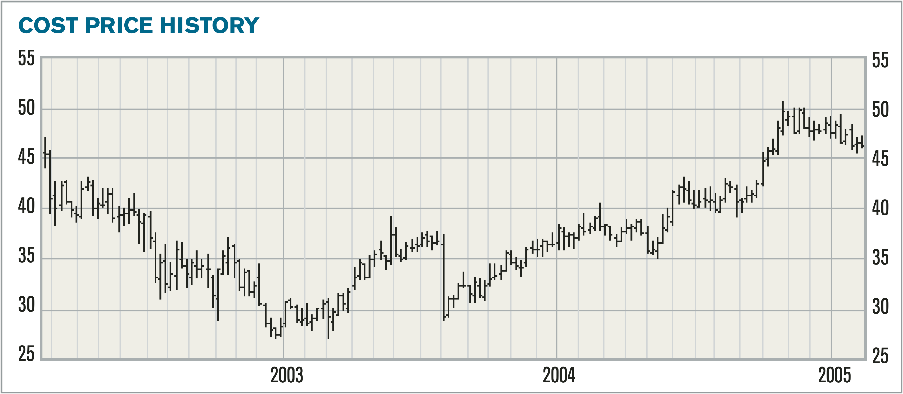
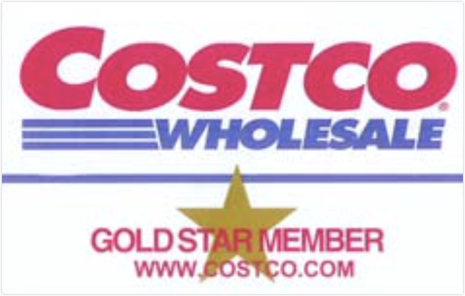

原文信息：

- 标题：Nomad Investment Partnership Annual Letter For the period ended December 31st, 2004
- 链接：[PDF](https://igyfoundation.org.uk/wp-content/uploads/2021/03/Full_Collection_Nomad_Letters_.pdf)
- 翻译：Terrellchen、[Toby的研究笔记](https://xueqiu.com/u/1005026863)（基于他的译本进行了修订）
- 整合：Terrellchen、Ponge

---

To December 31st, 2004:  至2004年12月31日|Nomad Investment Partnership 游牧人投资合伙| MSCI World Index (net) US$ 摩根士丹利资本国际世界指数美元
:---|---:|---:
6 months|+23.2%|+11.5%
One year|+22.0%|+15.2%
Two years|+119.2%|+54.4%
Three years|+122.1%|+22.6%
Since inception(10/09/01)|+144.6%|+29.4%
Annualised since inception|
&emsp;Before performance fees|+30.8%|+8.0%
&emsp;After performance fees|+25.7%|+8.0%

The figures above are presented on a cumulative basis (for the “A” shares, after management fees and before performance fees). Below the same results are presented in discrete annual increments. It is the upper table that is most useful in assessing long-term investment performance (see appendix):

上述数字以累计方式列示（"A"股，扣除管理费后，未扣除绩效费）。下表按年度分段列出了同样的结果。上表对评估长期投资业绩最为有用（见附录）：

To December 31, 2004:  至2004年12月31日|Nomad Investment Partnership 游牧人投资合伙| MSCI World Index (net) US$ 摩根士丹利资本国际世界指数美元
:---|---:|---:
2004|+22.0%|+15.2%
2003|+79.6%|+34.0%
2002|+1.30%|-19.3%
2001(inception 10/09/01)|+10.1%|+3.9%

2005 is the fifth calendar year of the Partnership. This is important only in as much as we asked you to measure our performance over rolling five-year periods and we are now in the final stretch to our first five-year anniversary. Since inception we have turned a dollar into two dollars and forty-four cents before performance fees, and two dollars and fourteen cents after fees, compared to an index that would have added around twenty-nine cents to the original dollar. But there is some way to go yet, and as always, please, no mental extrapolation of historic performance, that is simply a recipe for everyone to get upset.

2005 年是合伙企业成立的第五个自然年。这一点很重要，因为我们要求大家衡量我们在五年滚动期内的业绩，而我们现在正处于第一个五年期的最后冲刺阶段。自成立以来，我们已将 1 美元变成了 2.44 美元（未计入业绩费用）和 2.14 美元（计入费用后），相比之下，指数只在原来 1 美元的基础上增加约 29 美分。但还有很长的路要走，而且像往常一样，请不要经由我们的历史业绩进行线性外推，那只会让每个人都不高兴。

There has been much comment in the press of the recent success of so called “value investors”. In general, the commentary has described the last few years as suiting “value investors”, just as the last few years of the previous decade are described as suiting “growth investors”. We will discuss growth and value some more in this letter. Certainly, it is fair to say that our results indicate they have been fruitful for contrarian investors. But now with prices higher it is a little harder. A word of warning: the current market is not like the end of the 1990s when a bubble in high priced mainly technology stocks was balanced with Zen like symmetry by an anti-bubble of cheap, slower growth business. Today, prices are evenly high across the various opportunity sets, and there are few readily apparent pockets of under-valuation of size. We particularly enjoyed an editorial in the Investor’s Business Daily carried in December, which captures the mood of the markets quite well,

新闻界对所谓 "价值投资者 "最近的成功有很多评论。总的来说，这些评论把过去几年\[的市场风格\]描述为适合 "价值投资者"，就像把前十年的最后几年描述为适合 "成长投资者 "一样。我们将在这封信中进一步讨论成长投资和价值投资。当然，可以公平地说，我们的研究结果表明，对于逆向投资者来说，这两种投资方式都是卓有成效的。但现在随着价格走高，这就有点难了。需要提醒的是：当前的市场与 20 世纪 90 年代末不同，当时以高价科技股为主的泡沫与廉价、增长较慢的反泡沫形成了禅宗式的对称平衡。如今，各种可供选择资产的价格平均偏高，几乎没有明显的成规模低估现象。我们特别喜欢《投资者商业日报（Investor’s Business Daily）》在 12 月份发表的一篇社论，它很好地捕捉到了市场的情绪：

> *“The Fed tightens, stocks go up."*
> 
> *美联储紧缩，股市上涨；*
> 
> *The dollar falls, stocks go up.*
> 
> *美元下跌，股市上涨；*
>
> *Oil soars, stocks go up.*
> 
> *石油飙升，股市上涨；*
>
> *Retail sales wobble, stocks go up.*
> 
> *零售增速下滑，股票上涨。*
>
> *Is this a great country or what?”*
> 
> *这是一个伟大的国家吗？”*

It is probably fair to say that reinvestment risk (the risk from investing the incremental dollar poorly) is probably higher today than normal. But then, with the Partnership closed, we do not have many incremental dollars to reinvest.

或许可以说，今天的再投资风险（即增量资金投资不善所带来的风险）可能高于往常。但\[值得庆幸的是\]，由于合伙企业已经关闭募资，我们没有多少增量资金可用于再投资。

# Growth and Value 成长与价值

The debate over growth and value is perennial, and quite unnecessary. Warren Buffett got it right years ago:

关于成长与价值的争论经久不衰，而且毫无必要。巴菲特多年前就说得很对：

> *“Whether appropriate or not, the term “value investing” is widely used. Typically, it connotes the purchase of stocks having attributes such as a low ratio of price to book value, a low price-earnings ratio, or a high dividend yield. Unfortunately, such characteristics, even if they appear in combination, are far from determinative as to whether an investor is indeed buying something for what it is worth and is therefore truly operating on the principle of  obtaining value in his investments. Correspondingly, opposite characteristics –a high ratio of price to book value, a high price-earnings ratio, a low dividend yield – are in no way inconsistent with a “value” purchase.”*
> 
> *“但無論適當與否，人們仍普遍使用「價值投資法」一詞。通常它是指購入具特定條件的股票，例如低股價淨值比、低本益比，或是高股息殖利率。遺憾的是，即使一檔股票完全符合這些條件，投資人仍無法確定該股一定物有所值。相對的，條件相反（高股價淨值比、高本益比，以及低股息殖利率）的股票也可能極具投資價值。”*

Source: Berkshire Hathaway 1992 Annual Report

资料来源：伯克希尔-哈撒韦 1992 年年报

We won’t end the debate here but, so that we all understand, our definition is that a business is worth the free cash flow that it can be expected to generate between now and judgment day, discounted back at a reasonable rate. Period. Growth is therefore  inherently part of the value judgment, not a separate discipline. If it is that simple, and it is, (at least, the definition is simple) then how has the industry got in such a muddle, and why do commentators continue to use price to book ratios, price to earnings ratios or their modern equivalents such as EV to Ebitda, as a proxy for value. We all know that it does not mean a thing. So why do we do it?

我们不会就此结束争论，但为了让大家都明白，我们的定义是，一家企业的价值是它从现在到停止经营之间可望产生的自由现金流，并以合理的比率折现。因此，成长本身就是判断价值的一部分，而不是一种独立的投资风格。如果事情（至少他们的定义）确实如此简单，那么这个行业怎么会陷入如此的泥潭？为什么评论家们还在继续使用市净率、市盈率或其现代等价物（如EV/EBITDA）来代表价值？我们都知道这并不意味着什么。那为什么还要这么做呢？

Psychologists refer to simple rules of thumb as heuristics. In normal life heuristics generally work. We do not consciously process all the possible combinations of clothes in our wardrobe when dressing in the morning, instead we subconsciously use heuristics to narrow the options. However, in the stock market, doing half the work (only observing a portion of the wardrobe) is of limited benefit if successful investment requires more work. Price to book, price to cash flow etc., cannot be an accurate substitute for the definition we provided above. The wide use of valuation heuristics in the industry is quite bizarre. Their informational value, leaving aside inaccuracy for a moment, can be limited if only because successful investing is a minority sport. Their survival can probably be attributed to intellectual laziness on the part of the investment  professional, and spin on the part of the industry’s marketing  departments. It certainly has little to do with investment excellence. So, when commentators suggest that “value” has beaten “growth”, or “growth” has beaten “value”, please note that little of real substance is being imparted. It certainly has little to do with our Partnership’s results.

心理学家将简单的经验法则称为启发法（heuristic）。在正常生活中，启发法一般都能发挥作用：早上穿衣服时，我们不会有意识地思考衣柜里所有可能的衣服组合，而是下意识地使用启发法来缩小选择范围。然而，在股票市场上，如果成功的投资需要更多的工作，那么只做一半的工作（就像只在一部分衣服中选择穿搭）的好处是有限的。价格/账面价值、价格/现金流等常用指标都不能准确替代我们上面所述的价值投资定义。业内广泛使用启发法进行估值的现象非常奇怪。撇开准确性不谈，它们的信息价值是有限的，这仅仅是因为成功的投资只属于少数人。用启发法估值之所以成为资管行业的惯例，可能要归咎于投资专业人士在知识上的懒惰，以及营销部门的自以为是。当然，这与投资的卓越性关系不大。因此，当评论家们认为 "价值"战胜了 "成长"，或“成长"战胜了 "价值"时，请注意，他们并没有传授什么真正的实质内容。当然，这与我们的业绩也没什么关系。

# Why we think what we think 我们为什么如此思考

It is only in such a topsy-turvy world that a common-sense Investment Partnership, such as Nomad, can be seen as lunatic fringe – trust me, we are. The industry has a dreadful time pigeon-holing our Partnership. Not that we mind one jot. Nomad is a value investor in the sense that we like to buy stocks at half price. But the largest holdings would be described by most of our peers as growth stocks. We have the ability to invest globally, but 40% of Partnership assets are in South East Asia. We are concentrated (the top ten holdings make up around 65% of Partnership assets), but we have investments as small as 0.5% of assets. This year we held company meetings in California, Johannesburg and Hong Kong, where we have investments, but also in Zimbabwe, where we have none, just because we were curious. We asked the London office of Rio Tinto plc., a large global mining business, if they could help arrange a meeting with their Zimbabwe subsidiary quoted on the Harare Stock Exchange, only for their investor relations officer to ask, “is it listed?”! We can own listed and unlisted equity and bonds, like a hedge fund, but we can’t go short. We have a performance fee that is equitable, not egregious, in an era when egregious is the norm. It is so equitable that a famed US investor told us “you won’t make money like that”, meaning the management fee is too low. But we have made money, we have earned it through performance, not asset gathering. But most important of all, we do not resort to “belief” statements to justify our actions (look out for the use of that particular word when discussing investments, particularly when “belief” is attached to a heuristic). Ayn Rand had it about right when she wrote John Galt’s famous speech in Atlas Shrugged that “no substitute can do your thinking”. Watch out, this industry is full of the non-thought of received ideas, starting with the value, growth debate and valuation heuristics. We think we try harder than most to be rational and creative. The combination of the two is important. It is nearly seventy years since John Maynard Keynes wrote his “General Theory”.  Surprisingly little has changed:

只有在这样一个颠三倒四的世界里，像游牧人基金这样具有常识性的合伙企业才会被视为极端主义者（lunatic fringe）——相信我，我们正是这样的人。业内人士试图把我们的投资风格归类时感到非常痛苦，但我们一点也不介意。我们是价值投资者，喜欢以内在价值的半价购买股票。但我们最大的持仓会被大多数同行称为“成长股”。我们有能力进行全球投资，但 40% 的仓位集中在东南亚。我们的投资集中（前十大持股约占总资产 65%），但我们也有小至0.5%仓位的投资。今年，我们在加州、约翰内斯堡和香港召开了公司会议，我们投资了这些地方的公司，但也在津巴布韦召开了会议，我们在那里没有投资，只是因为好奇。我们曾询问全球大型矿业公司力拓集团的伦敦办事处，能否帮助安排一次与他们在哈拉雷证券交易所上市的津巴布韦子公司的会面，结果他们的投资者关系员工问：“这家子公司上市了吗？”我们可以像对冲基金一样拥有上市和非上市的股票和债券，但我们不能做空。我们的业绩提成是公平的，而不是过分的。它是如此公平，以至于一位著名的美国投资者对我们说："你们这样是赚不到钱的"，意思是管理费太低了。但我们却成功赚到钱，我们是通过优秀的业绩而不是通过募集资金收管理费赚到钱的。但最重要的是，我们不会用 "信念（belief）"来为自己的行为辩护（在讨论投资时要注意这个词的使用，尤其是当 "信念 "与启发法相连时）。安·兰德（Ayn Rand）在《阿特拉斯耸耸肩》（Atlas Shrugged）一书中写下了约翰·高尔特（John Galt）的著名言论："没有任何替代品可以代替你思考"，她说得很对。要当心，这个行业充满了不被接受的想法，例如价值和成长的对立论，以及用启发法进行估值的惯例。我们认为，我们比大多数人更努力保持理性和创造性。两者的结合非常重要。凯恩斯撰写《通论》已近七十年，令人惊讶的是，他在书中所述的情况几乎没有什么变化：

> *“Finally, it is the lon g-term investor, he who most promotes the public interest, who will in practice come in for the most criticism, wherever investment funds are managed by committees or boards or banks. For it is in the essence of his behavior that he should be eccentric, unconventional and rash in the eyes of average opinion. If he is successful, that will only confirm the general belief in his rashness; and if in the short run he is unsuccessful, which is very likely, he will not receive much mercy. Worldly wisdom teaches that it is better for reputation to fail conventionally than to succeed unconventionally.”*
> 
> "最后，无论投资基金是由委员会、董事会还是银行管理，实际上受到最多批评的是长期投资者，即最能促进公众利益的人。因为在一般人看来，他的行为应该是古怪的、不按常理出牌的和轻率的。如果他成功了，那只会证实他是鲁莽的普遍观点；如果短期内他不成功（这是很有可能的），他也不会得到多少怜悯。世俗的智慧告诉我们：对于声誉而言，常规性的失败要好于非常规性的成功。”

Source: The General Theory of Employment, Interest and Money, John Maynard Keynes

资料来源：《就业、利息和货币通论》，凯恩斯著

# Why is no one doing a good job? 为什么没有人做得好？

Among the best performing stocks of the 1990s were EMC, Dell, PMC Sierra and Microsoft. These were the cheapest stocks a decade ago, but no value investor owned them. But then again, none of the large growth investors (excluding insiders) owned the shares all the way through the decade either. Why is this? Why weren’t value investors, those who claim to be good at pricing a business, invested in Dell in 1990? Why is no one doing a really good job?

20 世纪 90 年代表现最好的股票包括 EMC、戴尔、PMC Sierra 和微软。这些股票在90年代初是最便宜的股票，但没有价值投资者持有它们。但话又说回来，十年间也没有一个大型成长投资者（不包括内部人士）持有这些股票。这是为什么呢？为什么价值投资者（那些自称擅长给企业定价的投资者）在 1990 年没有投资戴尔？为什么没有人做得好？

No, we weren’t invested in Dell either. Worse still, we weren’t looking. Although Dell was not expensive at the time, I am sure we would have concluded that its probability of failure over the next decade would have been high, or at least high enough to stop us owning the shares. A study by Michael Goldstein at Empirical Research, a research boutique, claims that the probability of growth stock failure (company growth slowing) is as high as four in five over five years and nine out of ten over ten years. And in the case of Dell, we would have been wrong. We take no comfort from the fact that not seeing success is a perennial investment mistake: in the 1950s a large Baltimore based fund management company sold their clients’ shares in IBM only for the shares to appreciate to the point that the value of the shares sold would become bigger than the whole fund management company itself. What we are trying to do today is avoid the Baltimore company’s second mistake, which was to sell an equally big stake in Wal-Mart in the 1970s!

我们也没有投资戴尔。更糟糕的是，我们并没有关注这家公司。虽然戴尔当时的股价并不贵，但我相信我们会得出这样的结论：戴尔在未来十年内失败的概率会很高，或者至少高到足以阻止我们持有该公司的股票。经验研究公司（Empirical Research）的迈克尔-戈德斯坦（Michael Goldstein）的一项研究称，成长股失败（即公司增长放缓）的概率在五年内高达五分之四，十年内高达十分之九。就戴尔公司而言，我们错了。忽视企业未来的成功是一个长期存在的投资错误，这一事实并不能让我们感到安慰：20 世纪 50 年代，巴尔的摩的一家大型基金管理公司出售了客户持有的 IBM 股票，结果股价不断上涨，所出售股票的价值超过了整个基金管理公司本身的价值。我们今天要做的是避免这家巴尔的摩公司犯下的第二个错误，即在 20 世纪 70 年代出售同样多的沃尔玛股份！

When investors describe themselves as growth or value it might be helpful to have two questions in mind. To the value investor ask, “what is it about your approach that would have stopped you owning K-Mart for much of the last twenty years?” (K-Mart was a “cheap” stock, as measured by say price to book value – but a dreadful investment, recent performance  notwithstanding), and to the growth investor ask, “what is it about your approach that would have stopped you selling Wal-Mart?”. So how does one avoid these mistakes? The answer lies in analyzing not the effects and outputs of a business, but, digging down to the underlying reality of the company, the engine of its success. That is, one must see an investment not as a static balance sheet but as an evolving, compounding machine.

当投资者将自己描述为成长型或价值型投资者时，记住两个问题可能会有所帮助。价值投资者会问："在过去二十年的大部分时间里，是什么阻止了你拥有 K-Mart？(K-Mart以市净率来衡量是一只"廉价"股票——但最近的业绩表现不佳，是一项可怕的投资），而对于成长型投资者，则要问："你的投资方法中有哪些地方会阻止你出售沃尔玛？”那么，如何避免这些错误呢？答案不在于分析企业的效果和产出，而在于深入分析公司的本质（underlying reality），也就是公司成功的源动力。也就是说，我们不能把投资的公司看作一张静态的资产负债表，而应把它看作一台不断发展，能不断创造复利的机器。

# Deconstructing the Business case for Costco Wholesale 解析Costco的商业模式

We have written about Costco before (December 2002) but make no apologies for its inclusion again. The reason is that it is important to us that you understand not only what we do, but why we do what we do. This is not easily done, as I am sure I will now demonstrate. In our experience very few investors understand what their managers really do. We know this because fund managers are often sacked at the trough of their relative performance, and invariably just as performance is about to turn. Clients that sacked Marathon at the end of 1999 (you know who you are) have missed out on a 12% annual gain compared to the index since, a gain which far outstrips any deficit against the benchmark during previous years. So, education is important. It helps both parties make rational decisions. Costco is also an important investment for the Partnership at close to 10% of assets. I am also conscious that in the September issue of the Global Investment Review, your manager wrote an article explaining the risks of doing precisely what he is about to do. That is, by publicly committing to an investment it may become harder subsequently to change one’s mind. A copy of the essay is contained in the appendix. However, on the basis that fore-warned is fore-armed, I shall continue. You will understand if we don’t sell our shares just yet!

我们两年前写过关于Costco的分析，但再次描述这家公司，我们并无歉意。原因是，对我们来说，重要的是你们不仅要了解我们投资了什么公司，更要了解我们为什么如此投资。要做到这一点并不容易：根据我们的经验，很少有投资者了解他们的基金经理到底在做什么。我们之所以知道这一点，是因为基金经理往往在相对收益跑输大盘时被解雇，而且解雇的时间点往往在他们的业绩反转之前。1999 年底解雇马拉松基金经理的客户（你们知道自己是谁吧），错过了自此以后每年跑赢指数 12% 的收益，这一收益远远超过了前几年与基准相比的任何亏损。因此，投资者教育很重要，它有助于双方做出理性的决定。Costco也是合伙企业的一项重要投资，占资产的近 10%。我还注意到，在九月刊的《全球投资评论》上，你们的基金经理写了一篇文章，解释了他将要做的事情的风险。也就是说，如果公开承诺投资，以后可能就很难改变主意了。附录中载有这篇文章的副本。不过，基于有备无患的原则，我还是要继续说下去。如果我们暂时不出售股票，您会理解的！

Costco Wholesale is a member-only wholesaler of consumer goods. Membership is available to the public at a price of U$45 per annum. The act of purchasing membership has the effect of raising the company’s share of mind with the customer in the same way that consumer goods companies hope to achieve with conventional advertising. At Costco, the consumer has chosen to commit to the retailer. In other words, people shop at Costco because it is Costco, not because Costco stocks Coke. And the reason they shop is that goods are priced at a fixed maximum 14% mark up over cost. The fixed mark-up is referred to in the industry as “every-day-low-pricing” or EDLP, in order to differentiate it from normal industry practice of changing prices in an attempt to influence traffic, or so-called high-low pricing. At Costco the consumer pays no more than 14% over what the company paid, period. In the December 2002 letter to  shareholders, we wrote:

Costco是一家会员制消费品批发商。公众可以每年 45 美元的价格入会。购买会员资格的行为会让客户对该公司产生更多关注，就像传统广告希望在消费者心中树立品牌形象一样。在Costco，消费者选择了向零售商的承诺。换句话说，人们在Costco购物是因为它是Costco，而不是因为Costco售卖可乐。他们在Costco购物的原因是，Costco的所有商品均奉行在成本基础上最高加价14%的定价模式。这种固定加价模式在行业内被称为"每日低价 (Everyday low price, EDLP)，以区别于行业内试图通过改变价格来影响流量的常规做法，即所谓的“高低定价 (Hi-Lo)”。在 2002 年 12 月致股东的信中，我们写道：

> *“To understand how important EDLP is to Jim Sinegal, the firm’s founder, consider the following story which was recounted to us by a company director. Costco bought 2m designer jeans from an exporter and shipped them into international waters and re-imported the jeans for an all-in price of U$22 or so per pair. This was U$10 less than the firm had sold the jeans for in the past (offering the potential for a 50% mark-up) and half the cost of most other retailers. One buyer recommended taking a higher gross margin than was usual (i.e., more than the usual 14% mark-up) as no one would know. Apparently Sinegal insisted on the standard mark up, arguing that if ‘I let you do it this time, you will do it again’.”*
>
> *"要了解 EDLP模式对公司创始人 Jim Sinegal 有多重要，请看下面这个由公司董事向我们讲述的故事：Costco从一家出口商那里购买了 200 万条名牌牛仔裤，然后将它们运到国际水域，再以每条 22 美元左右的总价重新进口。这比该公司过去出售牛仔裤的价格低 10 美元（有可能加价 50%），是大多数其他零售商成本的一半。一位买主建议，毛利率应高于通常的水平（即高于通常 14% 的加价率），因为没有人会知道。显然，Sinegal 坚持按标准加价，认为如果'这次我允许你这样做，下次你还会这么做'。*

Most supermarkets mark-up goods in aggregate by twice as much (in margin terms) as Costco and even the mighty Wal-Mart marks up by half as much again as Costco. In order to make money at such low (gross) margins Costco must ensure that: (1) Operating costs are low, indeed very low. It is indicative of the paranoia with which the company is run that costs are measured in basis points (there are 100 basis points in one percentage point). This makes life difficult for Wal-Mart and the hypermarkets who cannot price at aggregate Costco levels and make money as their cost bases  (approximately 15% and 25% of revenues respectively) are too high. (2) That the wholesale price is as competitive as can be. The key to negotiating terms is that the number of items in a store (stock keeping units) are fixed at 4,000, and the right to fill one of these spaces is auctioned, with the supplier that provides the best value proposition to the consumer winning space on the shop floor! Contrast this to normal industry practice whereby the supermarket assumes the role of landlord, auctions space to the highest bidder and pockets the rents (“slotting fees” in industry parlance). Many supermarkets make their money from buying from the supplier. Costco makes money from selling to the consumer. The firm publishes the criteria required to become a Costco supplier on its UK web site. After setting out the definitions of quality, pricing, packaging and gratuities (“expressly prohibited” for reasons we can all understand) there is the following statement about purchasing quotes:

大多数超市商品的加价幅度是Costco的两倍（按毛利率计算），甚至强大的沃尔玛的加价幅度也是Costco的一倍。为了以如此低的毛利率赚钱，Costco必须确保三点：(1) 运营成本需要非常低。Costco成本是以基点（1 个百分点等于 100 个基点）来衡量的，这表明了公司经营的偏执。这使得沃尔玛和大型超市的日子不好过，它们无法按照 Costco 的总体水平定价，也无法赚钱，因为它们的成本基础（分别约占收入的 15%和 25%）太高了。(2) 供货价格要尽可能低廉。Costco和供货商谈判条件的关键在于，一家门店的商品数量（存货单位）固定为 4000 个，其中一个货位的供应权通过拍卖产生，为消费者提供最佳价值主张的供应商将赢得货位！这与通常的行业做法形成鲜明对比，即超市扮演房东的角色，将空间拍卖给出价最高者，并从中收取租金（行话称为"空档费"）。大多数超市从供应商处进货赚钱，而Costco则通过\[将不贵的优质商品尽可能多的\]卖给消费者赚钱。Costco在其英国网站上公布了成为供应商所需的标准。在列出质量、价格、包装和小费（最后一项被"明令禁止"，原因大家都明白）的要求后，还有以下关于采购报价的声明：

> *“We expect all vendors to consistently and voluntarily quote the lowest possible acquisition price available on all items. A vendor who does not consistently and voluntarily quote its lowest prices to our buyers will be permanently discontinued as a purchasing source for Costco.”*
>
> *"我们希望所有供应商对所有物品都能始终如一地自愿报出尽可能低的采购价格。如果供应商不能始终如一地主动向我们的买家报出最低价格，我们将永远停止其作为 Costco 采购来源的资格"。*

Source: Costco.co.uk

来源：Costco.co.uk

Grief. One strike and you’re out! 

太惨了，只要供应商胆敢违反一次禁令，他们就会被永远停止供货资格！

(3) Revenues need to be very high. This last factor is partly a self-fulfilling prophesy –revenues will be high if the other factors, (1) and (2), are favorable. The issue is what the company then does with this revenue advantage. In the case of Costco scale efficiency gains are passed back to the consumer in order to drive further revenue growth. That way customers at one of the first Costco stores (outside Seattle) benefit from the firm’s expansion (into say Ohio) as they also gain from the decline in supplier prices. This keeps the old stores growing too. The point is that having shared the cost savings, the customer reciprocates, with the result that revenues per foot of retailing space at Costco exceed that at the next highest rival (Wal-Mart’s Sam’s Club) by about fifty percent.

3）收入规模必须很大。最后一个因素某种程度上是个自我实现的预言——如果其他因素（1）和（2）有利，收入就会很高。问题在于公司如何利用这一收入优势。在 Costco 的案例中，公司将规模效益节省的成本回馈给消费者，以推动收入的进一步增长：例如，首批Costco门店（西雅图郊外）的顾客就能从公司的扩张（比如说进入俄亥俄州）中获益，因为他们也能从供货价格下降中获益。这样一来，老店的销量也能保持增长。这一模式的关键在于，顾客在分享成本节约的同时，也会给予回报，结果是Costco每英尺零售空间的收入比排名第二的竞争对手（沃尔玛的山姆会员店）高出约 50%。

The stores are mainly owned rather than leased. This makes sense in terms of controlling costs (no greedy landlords putting up rents) but also means that growth is measured and predictable, if slower than Wall Street might like. But this is fine with us if it means that the probability of continued success is higher than under a going- for-broke expansion plan.

Costco的商店大部分是自己持有，而不是租赁的，这和山姆会员店有所不同。这对于控制成本而言是合理的决策（没有贪婪的房东抬高租金），但也意味着公司门店的增长是可衡量和可预测的【租赁门店可以让公司的门店规模短期内高速扩张】，尽管比华尔街预期的要慢。不过，如果这意味着持续成功的可能性比一蹶不振的扩张计划要高，我们也没有反对意见。

In the office we have a white board on which we have listed the (very few) investment models that work and that we can understand. Costco is the best example we can find of one of them: scale efficiencies shared. Most companies pursue scale efficiencies, but few share them. It’s the sharing that makes the model so powerful. But in the center of the model is a paradox: the company grows through giving more back. We often ask companies what they would do with windfall profits, and most spend it on something or other, or return the cash to shareholders. Almost no one replies give it back to customers – how would that go down with Wall Street? That is why competing with Costco is so hard to do. The firm is not interested in today’s static assessment of  performance. It is managing the business as if to raise the probability of long-term success.

在办公室里，我们有一块白板，上面列出了我们能够理解的（极少数）有效投资模式。Costco是我们能找到的其中一个最好的例子：共享的规模效益（shared economics of scale）。大多数公司都在追求规模效益，但很少有人愿意将规模效益加以共享。正是因为共享，这种模式才如此强大。但该模式的核心是一个悖论：公司通过更多的回馈实现增长。我们经常问公司如何处理意外得来的利润，大多数公司会将其用于其他用途，或将现金返还给股东。几乎没有公司会把这部分利润返还给顾客——华尔街会怎么看？ 这就是为什么其他公司很难与Costco竞争：这家公司对当前的静态业绩评估不感兴趣，它经营生意目的是提高长期成功的可能性。

# Deconstructing the Investment Case for Costco Wholesale 解析Costco的投资案例

What is it about growth stocks that dooms them to failure? In other words, why is Michael Goldstein’s growth stock failure rate, and our shunning of Dell, normally right? The answer is that success encourages competition, and capital flows into an industry to compete away the excess returns. Like all heuristics, this works most of the time, and we can all think of businesses that were super profitable for a while before the competition caught on. But what of those that don’t fail? Michael Dell succeeded by keeping costs low and passing back his scale benefits to the buyer of his PCs. By the time the competition had matched him in pricing he had moved on. And on and on. (Perhaps someone could slip this letter into Carly Fiorina, Chairman and CEO of Hewlett Packard’s suggestion box). Amazon.com may be following this path as well. So, the first point is that whilst Costco continues to recycle cost savings to the consumer, it is lowering the probability of failure.

是什么导致成长股注定失败？换句话说，为什么迈克尔-戈德斯坦（Michael Goldstein）的成长股失败率以及我们对戴尔的回避通常都是正确的呢？答案是，成功鼓励竞争，高利润吸引资本流入一个行业，争夺超额收益。就像所有启发法理论一样，这种理论在大多数情况下都是有效的，我们都能想到一些企业，它们在行业竞争变得激烈之前，曾一度能攫取高额利润，\[而最后回归平庸\]。但那些没有失败的企业呢？迈克尔·戴尔（Michael Dell）通过压低成本并将规模优势回馈给个人电脑买家而取得了成功。当竞争对手努力把售价压到和戴尔不相上下时，他已经转行了，如此循环往复。(也许有人可以把这封信塞进惠普公司董事长兼首席执行官卡莉-菲奥莉娜的意见箱）。亚马逊可能也会走这条路。因此，当 Costco 继续把节省下来的成本回馈给消费者时，它正在降低失败的概率。

So, what heuristics do investors incorrectly apply to Costco (why might the shares be mis- priced?). Heuristic One: “the company has low margins” (net profit margin is 1.7%, compared to Wal Mart at 3.6% and Target at 4.2%). True, but that’s the point. The firm is deferring profits today in order to extend the life of the franchise. Of course, Wall Street would love profits today but that’s just Wall Street’s obsession with short term outcomes. Heuristic Two: “it’s expensive at 24x earnings”. Really? Net income is a small residual, as discussed above. The firm could earn Wal-Mart margins by taking pricing up a little, in which case the firm would be on 11x earnings, but would it be a better business as a result? We think not, if it allowed the competition to catch up. Heuristic Three: “Costco has a cost problem”. Costs have risen as a percentage of revenues in the last few years due to the expense of a warehouse and distribution system associated with the next phase of the firm’s growth and the cost of employee benefits and insurance, especially in California. This has people fooled who really should not be. At the annual general meeting for an investment company that we hugely admire, the investment firm’s founder (and industry hero) was asked by a client why their holding in Costco was just 1% of the fund, especially when they have a reputation for portfolio concentration. The answer given was that of the firm's three constituencies (labour, customers and shareholders) the first two had been ascendant. This sounds nice and neat, but the phenomenon is cyclical: labour are "happy" according to Sinegal, Costco’s founder and CEO, incremental stores will leverage fixed costs, and in the letter to shareholders Sinegal describes costs as "unacceptable". In short, they are on to it. Our investment hero was mistaken, by about U$20 per share so far, or a gain of 65%.

那么，投资者对 Costco 采用了哪些错误的启发法（为什么股价会被错误定价？）**启发法一**："Costco的利润率很低"。没错，Costco的净利润率只有1.7%，而沃尔玛为 3.6%，塔吉特为 4.2%。但这正是问题所在。该公司正在延迟当前的获利，以延长其特许经营权的寿命。当然，华尔街希望今天就获得利润，但这只是机构对短期结果的迷恋而已，对公司的长期价值丝毫没有影响。**启发法之二**："Costco 目前的市盈率为 24 倍，太贵了"。真的吗？如上文所述，净利润只占 Costco 营收很小一部分。 Costco 完全可以通过略微提高加价幅度，来赚取等同于沃尔玛水平的净利率，在这种情况下，Costco 的市盈率将只有 11 倍。但它会因此成为一家更好的企业吗？我们认为不会，提高加价幅度会让竞争对手迎头赶上。**启发法三**： "Costco 有成本问题”。在过去几年里，Costco 的成本占收入的比例有所上升，原因是与公司下一阶段发展相关的仓库和配送系统的费用，以及员工福利和保险费用提升幅度超过营收增速，尤其是在加利福尼亚州。这让一些人上当受骗，其实他们不应该如此。在我们非常欣赏的一家投资公司的年度股东大会上，该投资公司的创始人（也是一位知名的投资者）被一位客户问到，为什么他们以集中投资而闻名，但在 Costco 的持股只占基金的 1%？他们给出的答案是，在公司的三大利益相关者（劳工、顾客和股东）中，前两者的地位一直很高。这听起来有道理，但这种现象是周期性的：Costco 的创始人兼首席执行官 Sinegal 认为，公司的员工因为待遇提升而"很高兴"，而不断增加的门店数量将有效摊薄固定成本，而在致股东信中，Sinegal 将成本描述为 "不可接受的"。简而言之，他们已经开始\[为提升股东回报\]行动了。我们的投资英雄犯了错：到目前为止，每股收益约 20 美元，涨幅达65%。

# Is it perfect? Costco是一家完美的企业吗？

No. But that suggests an interesting question: What characteristics could one bestow on a company that would make it the most valuable in the world? What would it look like? Such a firm would have a huge marketplace (offering size), high barriers to entry (offering longevity) and very low levels of capital employed (offering free cash flow). Costco has some of these attributes. The range of products is as wide as any retailer, and by-passing savings back it is building a formidable moat. It is also more asset light than its peers, but it is not the lightest of them all. For that one must turn to the Internet. In our opinion a business such as eBay could be the most valuable in the world. It has a huge marketplace, the biggest, an auction marketplace naturally aggregates to one player, offering high market share and high barriers to entry to the winner. Product pricing may be supported by the incumbent local newspapers and publishing businesses which have expensive machinery to replace and usually unionised labour and may provide a price umbrella for eBay. Better still eBay makes the customer pay for a high proportion of the assets used in the transaction such as PCs, modems, phone lines and so forth. But best of all, the incremental assets required to grow are so small. At Costco the firm will spend around U$15m per incremental store which will serve a radius of perhaps thirty miles. U$15m is a lot of servers for eBay, and whilst we are not experts, that may be enough to serve some countries. So no, Costco is not perfect. Perhaps we should own eBay as well.

不，但这提出了一个有趣的问题： 赋予一家公司什么样的特征，才能使它成为世界上最有价值的公司？它会是什么样子？这样的公司将**拥有巨大的市场（提供规模）、高进入壁垒（提供长期性）和极低的资本占用水平（提供自由现金流）**。Costco就具备其中的一些特征。它的产品种类之多不亚于任何一家零售商，而且通过节省开支，它正在建立一条强大的护城河；它的资产也比同行更轻，但并不是最轻的。为此，我们必须求助于互联网。**我们认为，像 eBay 这样的互联网企业可能是世界上最有价值的企业。它拥有一个巨大的市场，拍卖市场自然会向一个参与者聚集，为获胜者提供高市场份额和高进入壁垒。**产品定价可能会得到当地现有报纸和出版企业的支持，这些企业拥有昂贵的机器设备和通常由工会组织的劳动力，可以为 eBay 提供价格保护伞。更妙的是，eBay 让客户支付交易中使用的大部分资产，如个人电脑、调制解调器、电话线等。**但最重要的是，扩张业务所需的增量资本开支非常少**。对于Costco而言，公司将为每家新开门店投入约 1,500 万美元，服务半径约为 30 英里。对于 eBay 来说，1,500 万美元是一笔不小的服务器费用，足以为几个国家提供服务。因此，Costco 并不完美。也许我们也应该买入 eBay。

# What are the economics of our purchase of shares in Costco? 我们购买Costco股票的经济效益如何？

Readers that don’t enjoy sweating the maths can resume at the next paragraph. Those that like a work-out, read on. Analysis of the annual report (disgraceful lack of colour pictures) reveals that revenues of U$47.2bn (year to August 2004) represented a 12% mark up on  "merchandising costs" and left enough to pay for operating costs (SG&A) of 9.8% of sales (one third of the hi-lo  supermarkets). Profits from retailing are therefore around U$456m per annum to which one should add the membership fees of U$961m = U$1.41bn, pre-taxes. Taxes approximate depreciation most years, so pre- tax income equates to gross cash flow before maintenance capex which at around U$250m per annum implies around U$1.17bn in free cash flow as a cash cow. This compares to a fixed asset base of company owned real estate of U$9.6bn (depreciated value U$7.3bn). Working capital is "supplier funded" and means that the U$1.17bn free cash flow represents a yield of around 12% on fixed assets. A bear argument is that if the real estate was leased, free cash flow would be nought: this looks right but may miss two things: (1) Rents provide a return to their owners, not just break even on the cost of capital and (2) The store base is under-earning, perhaps significantly. Evidence for this is as follows: revenue per store at the oldest stores is twice this year's new openings, revenues per store at the oldest stores are still rising at 3 to 4% per annum, costs per new store suffer from low capacity utilisation of warehouses, and penetration in California is six times US State average. Store growth will be around 5% per annum and management confess to "always under-estimating saturation": in LA post the merger with Price Club in 1993 they thought 31 stores were too many for the market, but today there are 36. Likewise, in Seattle and Alaska the penetration of cards (membership) is 65% of households (gosh) but in most markets it is below 10%. Note also that one third of the store base remains in California, and almost half on the West Coast. This is a very young franchise. Half of the store base is over ten years old and earns 65% of the revenues whilst using approximately 40% of the asset base. What this means is that the oldest stores earn around 16.5% on assets and the youngest earn 6%. In other words, there is an approximate 50% rise in aggregate profits to come as the store base matures (4% growth per annum), plus same store sales growth at the mature stores (approx. 4% per annum) implying 8% growth before new store openings, which will add 5% to the store base and can easily be funded through free cash flow. This suggests normalised growth of 13%, and I don't think it is a stretch.

不喜欢计算的读者可以跳过这一段；那些喜欢计算的读者请继续往下看。对年报的分析表明，Costco上一财年的销售收入为472 亿美元，商品相较成本的平均加价幅度为12%，足以覆盖占销售额 9.8% 的广告和行政开支（费用率大概是采用高低定价策略（Hi-lo）超市的1/3）。因此，零售利润每年约为 4.56 亿美元，再加上 9.61 亿美元的会员费，税前利润为 14.1 亿美元。大多数年份的税收与折旧相近，因此税前收入相当于扣除资本开支（每年约 2.5 亿美元）前的总现金流，这意味着作为现金奶牛的自由现金流约为 11.7 亿美元。而公司拥有的不动产价值为 96 亿美元（折旧后价值 73 亿美元）。运营资本由 "供应商提供资金"，这意味着 11.7 亿美元的自由现金流代表了约 12% 的固定资产收益率 \[11.7/96 = 12.2%\]。有一种观点认为，如果不动产是租赁的，\[扣除租金开支后\]，Costco的自由现金流将为零：这种观点看似正确，但可能忽略了两点：(1) 租金为其所有者提供了回报，而不仅仅是资本成本的收支平衡；(2) 单店收入仍旧大有提升空间，证据如下：老店的单店收入是今年新开店的两倍，且老店的单店收入仍在以每年 3% 至 4% 的速度增长，新店的单店成本因仓库产能利用率低而受到影响，加州的门店渗透率是美国各州平均水平的六倍。我们预计Costco平均门店销售额的年化增速约为 5%，而且管理层承认自己"总是低估了门店饱和度"：1993 年Costco与 Price Club 合并后，他们认为洛杉矶市场的门店数量过多（当时为31家），但现在已有 36 家。同样，在西雅图和阿拉斯加，会员渗透率为家庭的65%，相当惊人，但在大多数市场，这一比例低于 10%。还要注意的是，Costco 三分之一的门店开设于加州，近一半在西海岸。这是一个非常年轻的特许经营品牌。有一半门店的店龄超过十年，赚取 65% 的收入，却只使用了约 40% 的资产。这意味着，最老的门店的资产收益率约为 16.5%，而最年轻的门店的资产收益率仅为 6%。换句话说，随着新开门店逐渐成熟（每年销售额增长 4%），总利润将增长约 50%，加上成熟门店的同店销售增长（每年约 4%），这意味着刨除新店开业，每年利润将增长8%，与此同时，Costco 的门店规模每年增加 5%，并很容易通过自由现金流获得资金。这意味着 Costco 稳态情境下的年化利润增速为 13%，我认为这并不夸张。

How do we think about valuation? There is a range of possible outcomes for the business, some are more likely than others and, in our mind, they have various probabilities attached. What we present below is our assessment of central value for Costco, but you should bear in mind that it is not the only value for Costco. Our average purchase price of U$39 per share (a blend of U$30 per share when the Partnership was small, and U$40 per share following the draw-down of the Nomad subscription queue in the summer) discounts modest growth of 5 to 6% per annum and is too low for a business that will be pushed not to grow earnings 10% per annum. A price of U$43 per share discounts 7% growth and U$85 to U$90 per share 15% growth. There is a very real possibility that the business could be priced to discount growth of 10% which would imply a price of U$62 per share today (and that price should rise by our 10% discount rate per annum). If it takes five years for the shares to converge on a price which discounts 10% growth per annum, then the shares would need to rise by 20% per annum from our average purchase price of U$39 per share.

我们应当如何看待Costco的估值？这门生意有一系列可能的结果，有些结果比其他结果更有可能发生，在我们看来，这些结果都有不同的概率。以下是我们对 Costco 核心价值的评估，但请记住，这并不是 Costco 的唯一价值。我们的平均购买成本为每股 39 美元（在合伙企业规模较小时为每股 30 美元，在夏季游牧人基金扩大规模后为每股 40 美元），这个买入价格隐含了每年 5% 至 6% 的盈利增速，对于一个每年盈利增长 10% 都不费力的企业来说，这个价格太低了。根据我们的测算，每股 43 美元的价格隐含的年化利润增速低于 7%，每股 85 至 90 美元的价格隐含的年化利润增速则低于 15%。Costco的股价应当大概率反映 10% 的年化利润增速，这意味着目前的合理价位为每股 62 美元（而且应按每年 10% 的折现率持续上涨）。如果股价需要五年时间才能趋于每年增长 10% 的贴现率，那么股价就需要从我们的平均购买价每股 39 美元每年上涨 20%。

Such a gain would add around 2% per annum to Partnership assets. And it is this that makes me think the weighting in the portfolio is too small. If Dell is the appropriate model for Costco, then the probability of failure is lower than for most growth stocks. It is lower again when one considers self-funded, as opposed to, rented growth. And lower again when one considers the fixity of mark up. To a far greater extent than for many businesses the company controls its own destiny. So, what attracted us to Costco is the predictability of outcome: we don’t think it is going to fail for many years. But is a 2% gain per annum optimal? If one applies the Kelly criterion (discussed in the last letter) the weighting should be much higher. So already your manager may have made his first mistake investing in Costco. From not buying enough. Perhaps I will get my opportunity to make amends.

这样的收益将使合伙企业的资产每年增加约 2%。正是因为这一点，我们认为 Costco 在投资组合中的权重太小。如果 Costco 能按照戴尔的模式发展，那么其失败的概率就低于大多数成长股。如果考虑到 Costco 的增长来源于自筹资金，而不是外部融资，那么失败的概率会更低。如果再考虑 Costco 的固定加价策略，失败的概率还会再降低一些。在很大程度上，这家公司比许多企业更能掌控自己的命运。因此，**Costco吸引我们的是其结果的可预测性：我们认为它在很多年内都不会倒闭**。但是，每年 2% 的收益是最佳的吗？如果采用凯利公式（在上一封信中讨论过），我们在 Costco 的仓位应该更高。因此，您的基金经理在投资 Costco 时可能已经犯了第一个错误：买得不够多。也许我们未来会有机会加以弥补。

So, the consensus has it that Costco is a low margin, expensive retailer with a cost problem. That is certainly one description. In our judgement it is a cost disciplined, intellectually honest, high product integrity, perpetual motion machine trading at a discount to value. The weighting in the Partnership may be too small, but even so as the description of the business migrates in the minds of the average investor from the former to the latter, I think we will do quite well.

因此，市场一致认为 Costco 是一家利润低、成本高的零售商。这当然是一种看法。然而根据我们的判断，Costco 是一个严守成本纪律、理智诚实（intellectually honest）、产品诚信度高、并以低于内在价值折扣价在市场上交易的永动机。Costco 在合伙企业中的投资占比可能太小，但即便如此，随着大部分投资者对该企业的描述从前者转向后者，我认为我们的投资业绩会相当不错。

# A Short Word on thinking about Business Values as opposed to Stock Prices 关于企业价值而非股票价格的简短思考

We go through this analytical process with each investment and have expressed our thoughts on Costco here to help illustrate that transient stock price quotations mean little to us (except as an opportunity set for incremental capital). And they should mean little to you. Ignore Nomad’s performance so far. We own shares for multi-year periods and so our continued investment success has far more to do with the economics of the underlying businesses than it has to do with their last share price quote. In the last year or three, share price quotes happen to have been in our favour and they flatter your manager’s input. You should not always expect this to be the case. There is no reason why business values and share prices should move hand in glove. You should expect that there will be a time when prices, and Nomad’s performance, significantly lags the performance of our underlying businesses. It is then that we will ask you to be contrarian and invest more.

我们对每笔投资都会进行这样的分析。我们在此表达对 Costco 的看法，以帮助说明即时的股票报价对我们来说意义不大（除了作为增量资本的机会集）。对你来说也应该意义不大。忽略游牧人基金目前的表现。我们按照多年的投资期限持有股票，因此我们的持续投资成功与否与相关企业的经济效益关系很大，而非与投资期末的股价相关。在过去的一年或三年里，股价恰好对我们有利，这也为你们基金经理的投入增色不少。然而，你们不应总是期待这种情况。企业价值和股票价格没有理由同步变动。未来终究会有一段时间，股价和游牧人基金的业绩会明显落后于我们持有公司的业务表现。到那时，我们会要求您逆势而为，加大投资。

# How big is Nomad? 游牧人基金的规模有多大？

There is no getting around it, Nomad is stapled to a fund management organisation three hundred times its size. This was important for Nomad’s genesis, and I wonder if it would have survived this long if truly independent. But it is a problem also. Particularly when picking stocks. This is because your manager wears two hats, that of analyst to the main Marathon funds, and that of Portfolio Manager to Nomad. The problem comes when an order for Nomad is aggregated with those of the main funds. Then Nomad, whose own size is small, in effect behaves as if it was a U$30bn fund  (Marathon’s total assets under management). This is not ideal, but it is hard to devise a system which does not amount to a worse outcome for one party or the other. We struggle with a satisfactory system, but you should be under no illusion that Nomad’s returns, such as they are, are a product of its size alone. We look like a mouse but move like an elephant. It is not a good combination, but it is what it is.

这是无法回避的问题，游牧人基金与一家管理规模是其300倍的基金管理机构【马拉松资管】捆绑在一起。这对于游牧人基金的创立非常重要，我不知道如果它真正独立，是否还能存活这么久。但尤其是在挑选股票时，这种关联会产生问题。这是因为你的经理戴着两顶帽子，一顶是马拉松主基金的分析师，另一顶是游牧人基金的投资经理。当游牧人基金与主基金的交易指令汇总在一起时，本身规模较小的游牧人基金实际上就如同一家管理 300 亿美元的机构一样行动。这并不理想，但很难设计出不会对双方造成更坏结果的制度。我们一直在为建立一个令人满意的系统而努力，但您不应该抱有幻想，认为 Nomad 的收益（尽管如此）仅仅是其规模较小的产物。我们看起来如同老鼠般渺小，行动起来却像大象一样笨拙。这不是一个好的组合，但事实就是如此。

# Thank you 致谢

We don’t write to you that often, as measured by number of letters per annum. But the sum of the letters we write amounts to around ten per stock holding period (two annual letters times five years). On this measure we may be more communicative than many investors who write more often, but trade shares more frequently still. Even so, we like the balance as it is, and are hesitant to fall into “say-something” territory. We are very conscious that investors in the Partnership have reciprocated and allowed us to get on with our job of roaming the globe looking for value. Thank you.

按每年写信的数量计算，我们给你写信的次数并不多。但是，我们在每个股票持有期内所写的信件总和约为十封（每年两封乘以五年）。从这个角度看，我们可能比许多投资者更善于沟通，因为他们写信更频繁，但买卖股票的频率却更高。即便如此，我们还是喜欢现在的平衡状态，不愿陷入 "说点什么 "的境地。我们深知，合伙企业中的出资人给予了我们回报，让我们能够继续在全球范围内寻找价值。谢谢大家。

On the administration side, please do call Daiwa Securities Trust and Banking in Dublin with your enquiries (+353 1603 9921). I am aware that there have been issues with the timely receipt of statements and accounts. We are on to it. Please do press them if you are not fully satisfied. They are here to help you, and you have paid for their services. Don’t be shy, we aren’t. Likewise, Alexandra Aitken at this office (+44 207 497 2211) is employed to help with basic performance and statement enquiries.

在行政管理方面，请致电都柏林的大和证券信托银行（+353 1603 9921）进行咨询。我知道在及时收到报表和账目方面存在问题。我们正在处理。如果您不完全满意，请联系他们。他们是来帮助您的，您已经为他们的服务支付了费用。不要害羞，我们不会。同样，本办公室的亚历山德拉-艾特肯（Alexandra Aitken）（+44 207 497 2211）受雇帮助处理基本的业绩和报表查询。

As always it is an absolute pleasure running this Partnership. We value your confidence in us very highly and thank you for your patience.

一如既往，我们为管理合伙企业感到非常高兴。我们非常重视您对我们的信任，感谢您的耐心。

...back to the annual reports.

......回到年度报告。

Yours sincerely

您真挚的

Nicholas Sleep

尼克·斯利浦

# Appendix 附录

## Introduction to the Global Investment Review, September 2004. 马拉松资管《全球投资评论》导言，2004 年 9 月

> *“...this is a superpower in error - causing psychological tendency: bias from consistency and commitment tendency, including the tendency to avoid or promptly resolve cognitive dissonance. Includes the self-confirmatory tendency of all conclusions, particularly expressed conclusions, and with a special persistence for conclusions that are hard- won”.*
> 
> *"......这是一种导致错误的超级心理倾向:一致性偏见和承诺倾向，包括避免或及时解决认知失调的倾向。包括对所有结论，尤其是明示的结论的自我确认倾向，而且特别坚持来之不易的结论"。*

Charles T. Munger, speech at Harvard Law School, estimated date June 1995

查理·芒格，在哈佛大学法学院的演讲，1995 年 6 月

It is not uncommon for plan sponsors and other clients to ask their fund managers to discuss their latest stock purchases. Perhaps the supposition is that these are the investments on which the manager is most bullish. Perhaps it is a test of conviction. Perhaps the client is looking for a tip, who knows? No matter how good the relationship between fund manager and client there is inevitably a bias at least to defend and at worse promote the purchase decision. We have all done this to some extent. It’s only natural; the manager has made the decision to invest and is talking to the client, how can he not be upbeat? Promotion is one thing, and we can all adjust more or less for its effects, decades of company visits have honed that particular skill, but that is not the issue at hand. The issue is whether, in trying to convince the client of the merits of the case, the manager convinces himself. The danger is highlighted by Munger in the passage below:

客户经常要求基金经理讨论他们最近购买的股票。也许他们认为这些是基金经理最看好的投资；也许这是一种信念测试；也许客户是在寻求提示，谁知道呢？无论基金经理和客户之间的关系有多好，都不可避免地会有一种偏见，至少是为购买决策辩护，更有甚者是为购买决策造势。在某种程度上，我们都会这样做。这是很自然的；基金经理已经做出了投资决定，而且正在与客户交谈，他怎么能不乐观呢？获得晋升是一回事，我们都能或多或少地适应它的的影响，几十年的公司调研已经磨练出了这一特殊技能，但这并不是眼下的问题。问题在于，在试图说服客户相信投资案例时，基金经理是否说服了自己。芒格在下面这段话中强调了这种危险：

> *“And of course, if you make public disclosure of your conclusions, you’re pounding into your own head. Many of these students that are screaming a _t us, they aren’t convincing us, but they are forming mental chains for themselves, because what they are shouting out, they are pounding in. And I think that educational institutions that create a climate where too much of that goes on are...in a fundamental sense, they are irresponsible institutions”.*
>
> *"当然，如果你公开你的结论，你就是自己敲自己的脑袋。许多对我们大喊大叫的学生并没能说服我们，但他们正给自己绑上精神枷锁，因为他们叫喊的观点已经潜移默化灌输进了他们的脑海。我认为，教育机构如果营造出这样一种氛围，那么......从根本上说，它们就是不负责任的机构"。*

It is for this reason that in its purest form a fund management company’s sales function (whose basic technique is to “shout out and pound in”) can be counter- productive. And it is why the most successful salesmen (as measured by commissions earned over the short-term) are frequently void of rooted-in-reality objective thinking, such as is vital for good long-term investment performance. Either fund management companies are investment companies or marketing companies. Not both. At Marathon we think we understand this conflict but even we struggle, and we make no claim to maximise both functions. The fact is that sales and size are the two main detractors of long-term performance, after inability. To paraphrase Mr.Buffett, should you come across individuals suggesting otherwise our advice is watch their noses, for signs of abnormal growth.

正因为如此，基金管理公司最纯粹的销售职能（其基本技巧是 "大喊大叫，大肆宣传"）可能会产生反效果。这也是为什么最成功的销售人员（以短期赚取的佣金来衡量）往往缺乏扎根现实的客观思维，而这种思维对于良好的长期投资业绩至关重要。基金管理公司要么是投资机构，要么是营销公司。两者不可兼得。在马拉松资管，我们认为我们理解这种冲突，但即使是我们也很难做到，而且我们也没有声称要最大限度地发挥这两种功能。事实上，销售额和规模是影响长期业绩的两大因素，其次才是投资经理的能力。套用巴菲特先生的话说，如果你遇到有人提出相反的建议，我们的建议是观察他们的鼻子，寻找异常生长的迹象。

This is not to say that investors do not have the right to question their managers about stock picking – far from it. But both parties must be aware of what they are doing. Our thinking is that fund managers should have absolute conviction on the philosophy and methodology of their investment principles, providing of course that those principles reflect reality. But they should be circumspect about expressing these tenets as they relate to individual stocks. Evangelism is not healthy. The reason is that, whilst fund managers have it in their powers to control the way they think, they are unable to control how their companies behave. Businesses evolve, companies make mistakes, business managers change their minds, share prices depart from reality – the investment manager can control none of these factors but needs to assess objectively each one for the risk of misanalysis. The issue is: in publicly disclosing his stock picking commitments, does the investment manager subtly and no doubt subconsciously rob himself of his objectivity and the option to change his mind? To deny this takes place seems foolhardy. The question is, how many recognise the risk of dysfunctionality, and adjust their behaviour? Certainly, those consultants and plan sponsors that insist upon frequent, detailed, blow-by-blow reporting may be surprised to learn that their seemingly reasonable request risks being counterproductive. Consultant meetings, which aggressively bear down on the microeconomics of an individual business, seem designed to form mental chains that neither side needs to bear. But where does that leave monthly reporting, quarterly reporting, annual reporting, and even this publication?

这并不是说投资者无权就选股问题向基金提出质疑——远非如此。但双方都必须清楚自己在做什么。我们的想法是，基金经理应该对其投资原则的理念和方法有绝对的信心，当然前提是这些原则能够反映现实。但他们在表达与个股相关的这些信条时应谨慎。传教是不健康的。原因在于，虽然基金经理有能力控制自己的思维方式，但却无法控制公司的行为。企业在发展，企业在犯错，企业管理者会改变想法，股价会偏离现实——投资经理无法控制这些因素，但需要客观地评估每一个因素，以防分析错误的风险。问题是：在公开披露自己的选股承诺时，投资经理是否会巧妙地、无疑是潜意识地剥夺自己的客观性和改变主意的选择权？否认这一点似乎是愚蠢的。问题是，有多少人认识到了功能失调的风险，并调整了自己的行为？当然，那些坚持频繁、详细、逐一报告的顾问和计划发起人可能会惊讶地发现，他们看似合理的要求有可能适得其反。顾问会议对单个企业的微观经济学咄咄逼人，似乎旨在形成双方都不需要承担的精神枷锁。但是，月度报告、季度报告、年度报告，甚至是本刊物又该何去何从呢？

Fund management errors are not the only ones that result from over-promotion activity. Quarterly, or even monthly, client reporting routinely marks fund management performance to market and these result snapshots acquire an extra validity, simply by virtue of their being reported. At Marathon a full holding cycle can exceed 5 years, so any quarter individually considered could be poor without affecting long-term outcomes. For those keen on monthly results there will be 60 such data points in a full holding cycle. These data points, in the hands of an inexperienced investment committee, could be misconstrued or worse. After all, most of Marathon’s client termination events occurred after, rather than before, a period of underperformance. According to Munger, it is a common  psychological tendency that people overweigh the vivid evidence (or recent experiences). This is clearly what can happen via the mark-to-market effects of quarterly reporting. The “Pavlovian” association of poor short-term results with long-term incompetence and confusion between the two can lead to disastrous decisions. Today this risk is greater than ever because, relative to history, consistency of investment performance is an attribute prized almost above all others in some parts of our industry.

基金管理失误并不是过度宣传活动的唯一结果。每季度，甚至每月的客户报告都会定期向市场公布基金业绩，这些业绩说明仅仅因为被报告而获得了额外的有效性。在马拉松资管，一个完整的持股周期可能超过 5 年，因此任何一个季度的单独考量都可能是糟糕的，而不会影响长期结果。对于那些热衷于月度结果的人来说，在一个完整的持有周期中会有 60 个这样的数据点。这些数据点在缺乏经验的投资委员会手中可能会被误解，甚至更糟。毕竟，马拉松资管的大多数客户终止委托都发生在业绩不佳时期之后，而不是之前。芒格认为，人们普遍存在一种心理倾向，即过分看重生动的证据（或最近的经历）。季度报告的按市价计价效应显然就会造成这种情况。短期业绩不佳与长期无能的 "巴甫洛夫式 "联系，以及两者之间的混淆，会导致灾难性的决策。如今，这种风险比以往任何时候都要大，因为相对于历史而言，投资业绩的一致性在我们行业的某些领域几乎是最受推崇的特质。

At a New York cocktail party populated by investment professionals this author clumsily asked one fund manager what his largest holding was. My acquaintance’s response was to decline to answer for reasons that this essay makes plain. His response seemed rude in a social setting, at least to this author, but having thought about the issues for about a year, it was perhaps the highest quality answer he could have made. He certainly understood elementary psychology.

在纽约一次由投资专业人士参加的鸡尾酒会上，笔者笨拙地问一位基金经理他持有最多仓位的股票是什么。我的这位熟人拒绝回答，原因在这篇文章中已经说得很清楚了。至少在笔者看来，他的回答在社交场合显得很无礼，但在思考了大约一年之后，这也许是他能做出的最高质量的回答了。他当然懂得基本心理学。

## Perpetual Growth Machine 永动机

**BEHIND THE NUMBERS: Costco Wholesale Corp.**

**数字背后：好市多批发公司**

[Value Investor Insight](https://aksjefokus.no/wp-content/uploads/2020/08/Nick-Sleep-Costco.pdf)

February 22, 2005

*While Costco shares aren’t cheap, value investor Nicholas Sleep shares some fascinating insights about the company and makes an excellent case for its long-term prospect.*

*虽然好市多（Costco）的股价并不便宜，但价值投资者尼克-斯利普（Nicholas Sleep）分享了一些关于该公司的精彩见解，并对其长期前景进行了精彩论证。*

Value investors have long been intrigued by Costco Wholesale Corp. 。It has a fabulous long-term record of steady growth, it's old-school in its management and compensation practices, Berkshire Hathaway’s Charlie Munger is on the board - plus, any bargain hunter loves to shop there. Not so many value investors own the stock, however, in part because it has extremely low margins - less than 2% after tax - and the stock rarely looks cheap, trading today at 25x trailing earnings per share. 

长期以来，价值投资者一直对好市多批发公司（Costco Wholesale Corp. ）充满兴趣。该公司拥有令人难以置信的长期稳定增长记录，在管理和薪酬方面也是守旧的，伯克希尔-哈撒韦公司（Berkshire Hathaway）的查理-芒格（Charlie Munger）是董事会成员，此外，任何讨价还价的人都喜欢去那里购物。然而，拥有该股的价值投资者并不多，部分原因是它的利润率极低，税后利润率不到 2%，而且该股很少看起来便宜，目前的交易价格是每股跟踪收益的 25 倍。

So we didn’t expect anything particularly new when we sat down to read the discussion of Costco in the annual letter of Nicholas Sleep of London’s Marathon Asset Management But Sleeps fresh insights arguments and analysis - “Mungeresque“ in tone and content — Persuaded us that Costco’s intrinsic value is probably quite a bit higher than we’d thought. We followed up with him to learn more on why he believes even if it's not a 50-cent dollar, Costco is an outstanding long-term investment. 

因此，当我们坐下来阅读伦敦马拉松资产管理公司（Marathon Asset Management）的尼克-斯利普（Nicholas Sleep）在其年度信件中对 Costco 的讨论时，我们并没有期待什么特别新的东西，但斯利普新颖的见解、论据和分析--"芒格式 "的语气和内容--让我们相信，Costco 的内在价值可能比我们想象的要高得多。我们对他进行了跟踪采访，以进一步了解他为何认为即使 Costco 不是 50 美分，它也是一项出色的长期投资。

### Customer really is king 顾客至上

Retailers love to boast that the “customer is king,” but none live it like Costco. It starts with how the company negotiates with suppliers. As Sleep notes: 

零售商喜欢吹嘘 "顾客至上"，但没有一家像好市多这样践行 "顾客至上"。这要从公司如何与供应商谈判说起。正如 Sleep 所说：

“Costco’s key to negotiating terms is that the number of items in a store (SKUs) is fixed at around 4,000, with those suppliers that provide the best value proposition to the consumer winning space on the shop floor. Contrast this to normal industry practice, where the supermarket assumes the role of landlord, auctions space to the highest bidder and pockets the rents (“slotting fees” in industry parlance). Many supermarkets make their money from buying from the supplier. Costco makes money from selling to the consumer.” 

“好市多谈判条件的关键在于，店内商品（SKUs）的数量固定在 4000 个左右，那些能为消费者提供最佳价值主张的供应商就能赢得店面空间。与通常的行业做法不同，超市扮演着房东的角色，将空间拍卖给出价最高者，然后将租金（行业术语为 "货架费"）收入囊中。许多超市从供应商处进货赚钱。好市多则通过卖给消费者赚钱。”

Costco fixes its retail prices at a maximum of only 14% over the company’s cost - with no exceptions. This pricing discipline - even Wal-Mart’s mark-ups are around 20% - engenders outstanding customer loyalty, As the company has raised its annual membership fee over time, to 845, membership renewal rates have barely budged from an enviable 85%.

好市多的零售价最高只能超过公司成本的 14%，没有例外。这种定价纪律（即使沃尔玛的加价率也在 20% 左右）造就了出色的客户忠诚度。随着时间的推移，好市多的会员年费已提高到 845 美元，但会员续费率却从令人羡慕的 85% 几乎没有下降。

The real power of Costco’s strategy — and the source of its competitive advantage,  according to Sleep - is how the benefits of growth are reinvested in the relationship with the consumer As Costco opens new stores supplier and other scale cost savings are passed back to customers through even more competitive prices. Customers then respond to the better prices driving incremental revenue at both new and old stores. As Sleep writes: 

好市多战略的真正力量，也是其竞争优势的源泉，据斯利普称，是如何将增长的收益重新投入到与消费者的关系中去的。好市多开设新店时，供应商和其他规模成本的节省会通过更具竞争力的价格回馈给顾客。顾客会对更优惠的价格作出回应，从而推动新店和老店的收入增长。正如 Sleep 写道：

“In the office we have a white board on which we've listed the very few investment models that work and that we can understand. Costco is the best example we can find of one of them: scale efficiencies shared with customers. We often ask companies what they would do with windfall profits, and almost no one replies ‘give it back to customers’. How would that go down with Wall Street? That is why competing with Costco is so hard to do. The firm is not interested in today’s static assessment of performance. It is managing the business to raise the probability of longterm success.” 

"在办公室里，我们有一块白板，上面列出了极少数有效的、我们能够理解的投资模式。好市多就是其中一个最好的例子：与顾客共享规模效益。我们经常问公司如何处理意外利润，几乎没有人回答 "把它回馈给顾客"。华尔街会怎么看？这就是为什么很难与 Costco 竞争。该公司对今天的静态业绩评估不感兴趣。它管理业务的目的是提高长期成功的可能性。

By sharing the cost savings of growth, Costco earns revenues per square foot — around $830 - that are the envy of 山 e industry. Wal-Mart’s Samis Club checks in at around $500 per square foot, while BJ's Wholesale Club is about $400. Even more importantly, Sleep estimates that mature Costco stores - open at least five years - generate revenue of over $1,000 per square foot. 

通过分享增长带来的成本节约，好市多每平方英尺的收入（约 830 美元）令同行业羡慕不已。沃尔玛的 Samis Club 每平方英尺的收入约为 500 美元，而 BJ's Wholesale Club 约为 400 美元。更重要的是，据 Sleep 估算，成熟的 Costco 商店（至少开业五年）每平方英尺的收入超过 1000 美元。

### Margin trouble? 利润问题？

Costco’s pricing discipline, by definition, keeps margins low - at 1.9%, they are roughly half those of Wal-Mart (3.6%) and Target (4.1%). Sleep argues that Wall Street’s focus on margins is short sighted: “True, the company has low margins, but that’s the point. The firm is defer- ding profits today in order to extend the life of the franchise. Of course Wall Street would love profits today, but that’s just Wall Street’s obsession with short-term outcomes. The firm could earn Wal-Mart margins by taking pricing up a little and the stock would then trade at 11x earnings, but would it be a better business as a result? We think not, because it might allow the competition to catch up.” 

顾名思义，好市多的定价纪律使其利润率很低，仅为 1.9%，约为沃尔玛（3.6%）和 Target（4.1%）的一半。Sleep 认为，华尔街对利润率的关注是短视的： "公司的利润率的确很低，但这正是关键所在。公司今天延迟盈利，是为了延长特许经营权的寿命。华尔街当然希望今天就盈利，但这只是华尔街对短期结果的迷恋。该公司可以通过稍微提高定价来赚取沃尔玛的利润，然后股票以11倍的市盈率交易，但它会因此成为一家更好的企业吗？我们认为不会，因为这可能会让竞争对手迎头赶上。

Contributing to margin pressure in recent years has also been a rise in SG&A costs as a percentage of revenues, fueled in large part by spending on a new warehousing and distribution system and rising employee wages and benefits. A sign of trouble? No, explains Sleep: “We clearly differentiate between ‘good” and “bad SG&A spending,” he says. “In both of these cases, Costco is investing in areas critical to its growth.” With the new warehousing system in place, efficiency gains will start showing up in the financials this year And the slightly higher wage base helps Costco retain its employees twice as long as competitors do, which Sleep sees as positively impacting customer service and contributing to its very high customer retention. 

近年来，SG&A 成本在收入中所占比例的上升也是造成利润率压力的原因之一，这在很大程度上是由于在新仓储和配送系统上的支出以及员工工资和福利的上涨。这是麻烦的征兆吗？不，Sleep 解释说： "我们明确区分了'好的'和'坏的 SG&A 支出'。"在这两种情况下，好市多都在对其发展至关重要的领域进行投资。随着新仓储系统的投入使用，今年的财务数据中将开始显示效率的提高，而且略高的工资基数有助于好市多留住员工的时间是竞争对手的两倍，Sleep 认为这对客户服务产生了积极影响，并有助于提高客户留存率。

### Still an early life-cycle company 仍是一家处于生命周期早期的公司

Even with annual sales of nearly $50 billion, Sleep makes a compelling case for Costco as a growth company, through geographic expansion, increased market penetration, and the virtuous cycle of growth in maturing- store asset turns as scale efficiencies result in even lower prices. 

尽管好市多的年销售额接近 500 亿美元，但通过**地域扩张、提高市场渗透率，以及成熟店铺资产周转的良性循环，规模效益带来更低的价格，Sleep 认为好市多是一家令人信服的成长型公司**。

“One-third of the store base remains in California, and almost half on the West Coast. Management always con- fesses to underestimating saturation. In Los Angeles, for example, after merging with Price Club in 1993, Costco thought 31 stores were too many for the market, but today there are 36. Likewise, in Seattle and Alaska, the penetration of membership cards is an astonishing 65% of households, but in most markets it is below 10%.” 

"三分之一的门店仍在加利福尼亚，近一半在西海岸。管理层总是承认低估了饱和度。例如，在洛杉矶，1993 年与 Price Club 合并后，好市多认为 31 家门店对市场来说太多了，但如今已有 36 家。同样，在西雅图和阿拉斯加，会员卡在家庭中的普及率达到了惊人的 65%，但在大多数市场，这一比例还不到 10%。

All told, Sleep estimates that Costco can conservatively increase revenue and free cash flow by 13% per year into the foreseeable future - 4% from the increasing asset turns of newer stores as they mature, 4% from same-store growth at already-mature stores, and 5% from new stores. 

总之，Sleep 预计，在可预见的未来，好市多每年可以保守地增加 13% 的收入和自由现金流--4% 来自于新店成熟后资产周转率的提高，4% 来自于已成熟门店的同店增长，5% 来自于新店。

“This is an early life-cycle company whose competitive moat gets deeper as the company gets bigger and the consumer is consistently cut-in on the benefits of the company’s growth,” Sleep says, terming this cycle a “perpetual machine” of growth. 

"这是一家处于生命周期早期的公司，随着公司规模的扩大，竞争护城河会越来越深，消费者也会不断从公司的增长中获益，"Sleep 说，他把这种周期称为 "永动机 "式增长。

The market, which currently prices Costco shares at around $46, is not so generous in its growth expectation. Sleep calculates that if Costco shares were priced to reflect just 10% annual growth, the stock would trade at $62 today. Even at that price he wouldn’t sell, he says, given his expectation for even faster growth. 

目前，好市多股价约为 46 美元，市场对其增长预期并不乐观。根据 Sleep 的计算，如果好市多股票的定价仅反映 10% 的年增长率，那么现在的股价应为 62 美元。他说，考虑到他对更快增长的预期，即使是这个价格，他也不会卖出。

What could go wrong？ Wal-Mart, with Sam’s Club, could mount a sustained direct attack to undercut Costco’s prices. Sleep considers that unlikely, as Costco has shown itself more than capable of competing head-to-head with the discounting giant. The departure of CEO James Sinegal, 68, the architect of Costco’s unique and disciplined culture, could also be a blow. Sleep points out that Sinegal shows no sign of slowing down, and that Costco’s experienced board can be counted on to appoint a worthy successor. 

可能出现的问题？沃尔玛和山姆会员店（Sam's Club）可能会发动持续的直接攻击，压低好市多的价格。Sleep 认为这种可能性不大，因为 Costco 已经证明自己完全有能力与折扣巨头正面竞争。68 岁的首席执行官詹姆斯-西内格尔（James Sinegal）是好市多独特而严谨文化的缔造者，他的离职也可能是一个打击。Sleep 指出，Sinegal 没有放慢脚步的迹象，而且好市多经验丰富的董事会可以任命一位称职的继任者。

We'll leave to Marathons Nicholas Sleep the final word on Costco “The consensus has it that Costco is a low-margin retailer with an expensive stock and a cost Problem That is certainly one description. But in our judgment it is a cost-disciplined, intellectually honest, high-product-integrity, perpetual motion machine trading at a discount to value.”

关于好市多，马拉松的尼克-斯利普（Nicholas Sleep）最后说道："人们一致认为，好市多是一家低利润率的零售商，股价昂贵，存在成本问题。 这当然是一种说法。但根据我们的判断，好市多是一个成本严谨、诚实守信、产品完整度高、以价值折扣进行交易的永动机。"

### Investment Snapshot 投资标的掠影

**Costco Wholesale Corp. (Nasdaq: COST)**

**好市多批发公司（纳斯达克股票代码：COST）**

**Business:** Membership warehouse retailer offering members low prices on limited selection of branded and private-label products across multiple product categories. Primary operations in U.S. and Canada.

**业务**：会员制仓储零售商，以低价向会员提供有限的品牌和自有品牌产品，涵盖多个产品类别。主要业务在美国和加拿大。

Share Information 股票信息|(@2/18/05) 截至 2005 年 2 月 18 日
---|---:
Price 股价|45.80
52-Week Range 过去一年价格范围|35.05 - 50.46
Dividend Yield 股息率|0.9%
Market Cap 市值|$21.64 billion

Short Interest 卖空利率|(@1/10/05) 截至 2005 年 1 月 10 日
---|---:
Shares Short/Float 股票空头/浮动|2.47%

Financials 财务信息|(TTM)
---|---:
Revenue 营业收入|$49.16 billion
Operating Profit Margin 营业利润率|2.91%
Net Profit Margin 净利率|1.86%

Valuation Metrics (Current Price vs. TTM) 估值指标（基于当前价格和 TTM）|COST|S&P 500
---|:---:|:---:
P/E|23.9|23.1
P/CF|15.8|13.9

**Largest Institutional Owners**

**最大机构股东**

Company 公司名称|% Owned (@9/30/04) 持股占比（截至 2004 年 9 月 30 日）
---|---:
Davis Selected Advisers|7.9%
Barclays Bank Plc|3.6%
State Street Corp|2.7%
Capital Guardian Trust|2.3%
Vanguard Group|2.2%

**The Bottom Line**

**结论**

Costco’s “perpetual machine” of growth is capable of keeping company revenue and cash flow growing 13% annually, says Nicholas Sleep of London’s Marathon Asset Management. If the market price reflected even a 10% growth expectation, he says, COST would trade at $62, a 35% premium to the current market price.

伦敦马拉松资产管理公司（Marathon Asset Management）的尼古拉斯·斯利普（Nicholas Sleep）说，好市多的"永久增长机器 "能够使公司收入和现金流每年增长 13%。他说，如果市场价格能反映 10% 的增长预期，好市多的交易价格将达到 62 美元，比目前的市场价格高出 35%。

Sources: Company reports, other publicly available information

资料来源：公司报告、其他公开信息

### Privileges of Membership 好市多会员权益

Costco’s membership-only model helps foster a unique relationship with its customers. People shop there because it’s Costco, not because it stocks Pepsi or Pampers. As Costco has raised its basic annual membership fee over time, to $45 currently, membership renewal rates have barely budged from an enviable 86%.

好市多的会员制模式有助于与顾客建立一种独特的关系。人们在好市多购物是因为它是好市多，而不是因为它有百事可乐或帮宝适。随着时间的推移，好市多的基本会员年费不断提高，目前已达到 45 美元，但会员续费率却从令人羡慕的 86% 几乎没有下降。

