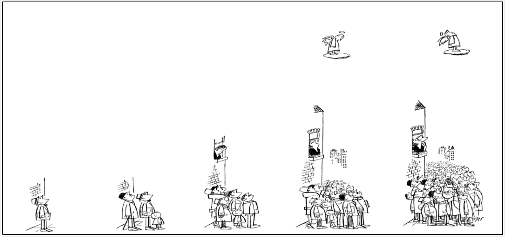
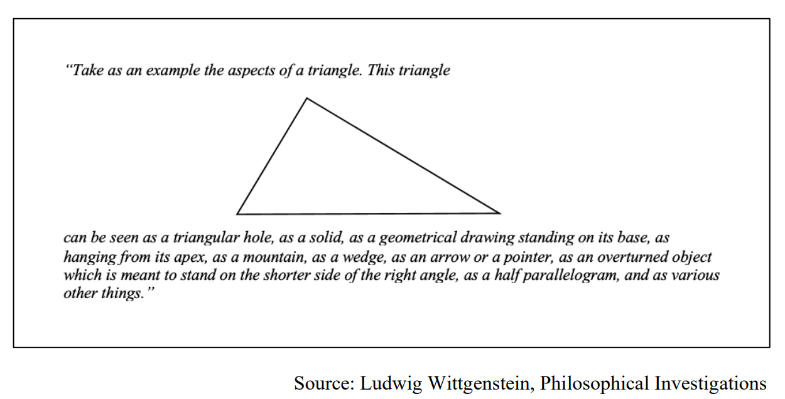
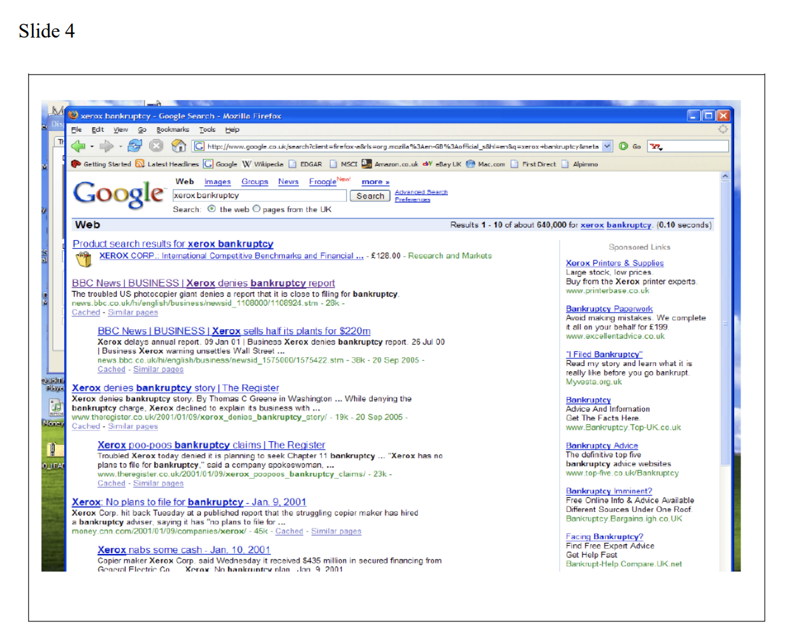
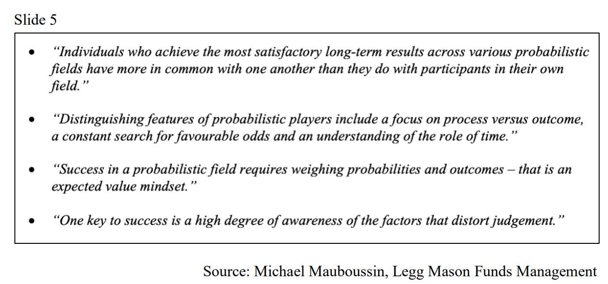

原文信息：

- 标题：Nomad Investment Partnership Annual Letter For the period ended December 31st, 2005
- 链接：[PDF](https://igyfoundation.org.uk/wp-content/uploads/2021/03/Full_Collection_Nomad_Letters_.pdf)
- 中文参考：[Toby的研究笔记](https://xueqiu.com/u/1005026863) ,AI等
- 整合校译：Terrellchen

---

To Dec. 31st, 2005:  至2005年12月31日|Nomad Investment Partnership 游牧人投资合伙| MSCI World Index (net) US$ 摩根士丹利资本国际世界指数美元
:---|---:|---:
One year|+9.2%|+9.5%
Two years|+33.3|+25.6
Three years|+139.5|+67.2
Four years|+142.6|+33.9
Since inception(Sept. 10 th  2001)|+167.2|+38.8
Annualised since inception||
&emsp;Before performance fees|+25.6%|+7.9%
&emsp;After performance fees|+21.4%|

The figures above are presented on a cumulative basis (for the “A” shares, after allowing for management fees and the cost of running the Partnership (auditors, administration, custody etc.) but before performance fees. We present results in this way as performance fees are earned once returns exceed 6% compound per annum from the time of subscription, and therefore net returns can vary from investor to investor). A large global index is also presented to place Partnership results in context, and inception refers to opening prices on the 10th.Overleaf the same results are presented in discrete annual increments. In our opinion, it is the table above that is most useful in assessing long-term investment performance (see appendix).

上述数据以累计为基础（就 "A "股而言，已计入管理费和合伙企业的运营成本（审计、行政、托管等），但未计入业绩费。我们以这种方式列报结果，因为从认购之时起，一旦年复合回报率超过 6%，就会获得业绩费用，因此不同投资者的净回报率可能会有所不同）。我们还列出了一个大型的全球指数，以便将合伙公司的结果与背景联系起来，开始时指的是 10 日的开盘价。我们认为，上表最有助于评估长期投资业绩（见附录）。

To Dec. 31st, 2005:  至2005年12月31日|Nomad Investment Partnership 游牧人投资合伙| MSCI World Index (net) US$ 摩根士丹利资本国际世界指数美元
:---|---:|---:
6 months|+6.8%|+10.3%
2005|+9.2|+9.5
2004|+22.1|+14.7
2003|+79.6|+33.1
2002|+1.30|-19.9
2001(inception Sept. 10th 2001)|+10.1|+3.6

---

2005 was the fifth calendar year of the Partnership’s operation and since inception we have turned U$1 into U$2.67 before performance fees and approximately U$2.30 after fees,compared to a gain of around U$0.39 for the average, one dollar stock over the same period. It is aesthetically annoying to under-perform a broad global stock market index by a piddly amount as we did last year (if you are going to under-perform, do it properly!) but given the concentration and eclectic composition of our Partnership (ten stocks account for around 70% of the Partnership, with operations from Seattle to Harare and Huddersfield to Manila) it is perhaps a little anomalous that we should be anywhere near the index at all, with its 1,801 large stocks. Indeed, according to a maths guru at a large investment bank the chance of Partnership results being as close to the index as they were last year, given the disparity of holdings, was once in a long lifetime (approximately one year in seventy). Make of that statistic what you will, but even so we are now within stabbing distance of tripling the original dollar in our first five years. Contrast this with poor Bill Ruane who launched his Sequoia Fund straight into the nifty-fifty, two tier market of the early 1970s, with the effect that at the end of his fifth-year cumulative returns were close to zero! Can you imagine such a fund surviving in today’s business-oriented investment world? So that there is no confusion: we are not more skilled than Bill Ruane.

2005 年是合伙企业运作的第五个自然年，自成立以来，我们已将 1 美元的初始投资变成了扣除费用前的2.67 美元，扣除费用后约为 2.30 美元，而同期平均 1 美元股票的收益约为 0.39 美元。去年我们与全球广义股票市场指数相比，表现稍逊，这在审美上令人不悦（如果你要跑输，那幅度就大一点！），但考虑到我们合伙公司的投资集中度和不拘一格的持仓组合（前十大重仓股占比 70% 左右，业务范围从西雅图到哈拉雷，从哈德斯菲尔德到马尼拉），我们的业绩与拥有 1801 只大型股票的指数相差无几，这也许有点反常。事实上，根据一家大型投行数学大师的说法，鉴于持股的差异，合伙公司的业绩与去年的指数如此接近的可能性是一生中仅有的一次（大约七十年一遇）。尽管如此，我们现在距离在头五年内将原始美元翻三倍的目标已经不远了。相比之下，可怜的比尔·鲁恩（Bill Ruane）在 20 世纪 70 年代初将他运营的红杉基金直接投向了 “漂亮50”，结果在他的五年期结束时，累计回报几乎为零！你能想象这样的基金能在当今以商业为导向的投资界生存吗？不要混淆：我们的投资技巧并不比比尔·鲁恩更强。

Our starting point has been more fortunate.

我们的起点更为幸运。

In our opinion, there have been two outstanding periods to make investments in the last ten years: Asia, in the aftermath of the Asian crisis, and during the US junk bond crisis which immediately followed the Partnership’s launch. We therefore walked straight into a super opportunity set and our results reflect that. However, there is not much distress around today (Zimbabwe excepted) and continuing to compound at 25% per annum, without the requisite amount of investor distress necessary to create good prices, is improbable. As we have said in previous letters “*no extrapolation of results, please: that is just a recipe for everyone to get upset*”.

我们认为，在过去十年中有两个黄金的投资时期： 一个是亚洲金融危机后的亚洲股市，另一个是合伙企业成立后立刻经历的美国垃圾债券危机期间。因此，我们成立后直接进入了一个超级投资机遇期，我们的业绩也反映了这一点。然而，如今的困境并不多（津巴布韦市场除外），在没有必要的投资者悲观来创造好价格的情况下，我们的净值继续保持25%的年化增速是不可能的。正如我们在以前的信中所说："请不要对我们已有的结果进行线性外推，那只会让所有人都感到不安"。

In May 2004, we drew down part of the queue that was waiting to invest in Nomad, and since then the Partnership has gained around 35%, compared to a gain of around 25% for most stocks. When we look back at the investments we made, there was, in practice, a very high limit to the amount of money we could have invested and still maintained performance. Several hundred million dollars could have been invested in each of Costco (US), New World Developments (Hong Kong), Amazon.com (US), Telewest (UK) and Liberty Media (Europe and Japan). But as each idea came one at a time, with a lag in between, we were reluctant to open the Partnership for the sake of one new idea. We erred on the side of investment performance rather than maximising fund size. I know this is not how the industry thinks and behaves, but at Nomad we see our job as running an investment partnership first and commercial enterprise second. Which raises an interesting wrinkle: if we had opened Nomad, drawn down the whole queue, and invested the capital well, then in five years-time Nomad would be billions of dollars in size. Say we then found that the opportunity set was small: could we give the money back?

2004 年 5 月，我们接纳了部分等待投资Nomad的资金，从那以后，Nomad的回报率达到了 35% 左右，而大多数股票的收益率约为 25%。回顾我们所做的投资，实际上，在保持业绩的前提下，我们所能投资的金额是非常有限的。我们本可以在 Costco（美国）、新世界发展（香港）、亚马逊（美国）、Telewest（英国）和Liberty Media（欧洲和日本）各投资数亿美元。但是，由于每个想法都是逐一产生的，中间会有一个滞后期，我们不愿意为了一个新的投资想法而开放基金认购。我们偏重投资业绩，而不是最大限度地扩大基金规模。我知道这不是这个行业的想法和行为方式，但在游牧人基金，我们认为我们的工作首先是经营一家投资合伙企业（investor partnership），其次才是一家商业企业（commercial enterprise）。这就引出了一个有趣的问题：如果我们完全放开游牧人基金的认购，提取了所有的资金，并对资金进行了良好的投资，那么五年后游牧公司的规模将达到数十亿美元。如果我们发现可投资的机会很小：我们能把钱还回去吗？

There is a difference between investment returns measured as a percentage gain, and results when measured in dollars. Doubling a hundred dollars through stock picking is not economically equivalent to a ten percent gain on a thousand dollars, although the dollar profits are the same. It is for this reason that investment results are rightly presented in percentage terms, however, in some respects this is only half the equation, as doubling a billion dollars is clearly a better outcome than doubling a hundred dollars. The key ingredient for evaluating the case for taking on more funds must be that the incremental, new dollars do not inhibit performance in percentage terms for the first dollars. That way the bus is always running at full speed with the number of passenger optimised to maintain maximum speed. The industry skirts around this point and talks about relative performance instead, as commercial pressures encourage lesser performance on vastly increased pools than better performance on smaller pools. It is as if the industry aspires to run the equivalent of the Calcutta commuter bus, so burdened with paying passengers piled on the roof that all it can manage is to trundle, unsafely, in the slow lane!

以百分比计算的投资收益与以美元计算的投资收益是不同的。通过选股使一百美元翻一番，在经济上并不等同于一千美元获得百分之十的收益，尽管美元利润是一样的。因此，投资结果以百分比表示是正确的，但在某些方面，这只是等式的一半，因为十亿美元翻一番的结果显然比一百美元翻一番的结果要好。评估是否需要投入更多资金的关键因素必须是，按百分比计算，新的增量资金不会影响第一笔资金的绩效。这样，公共汽车才能始终全速运行，乘客数量才能优化，以保持汽车能以最高速度行驶。然而资管行业却绕开这一点，转而谈论相对业绩，因为商业压力鼓励在大幅增加的资金池中降低投资业绩，而不是在较小的资金池中提高业绩。这就好比业界渴望运行的加尔各答通勤公共汽车：车顶上堆满了付费乘客，以至于只能在慢车道上不安全地行驶！

But let’s turn the proposition on its head: the intrinsically low-cost structure of the investment business, so often used to earn super normal profits for business owners, would instead allow a shrinking of the investment pool for the purpose of protecting investment returns. I don’t think many managers have thought about it this way, most in the industry have taken to heart Winston Churchill’s instruction to “*keep buggering on*”. They hope that declining returns go unnoticed, and besides, they argue, who knows how fast the bus would be going if they let some passengers off. But what we are asking is, in practice, how would you feel about us returning capital to you on investment grounds? At Nomad we hope that it would never come to that, but it may. And it is important that we all understand a road map that allows for a shrinkage before we first grow the Partnership. And to add another layer of complexity, how would you feel about us changing our mind some time thereafter if the opportunity set improved markedly and we could take more money? This raises the interesting notion that if we returned capital to you would Zak and I have some moral responsibility for the dividended funds? I think we might. In other words, as investment results are maximised by Nomad expanding and contracting with the opportunity set, how can we reflect this reality in the structure of our Partnership? It’s amazing to us that most investment companies are silent on such an obvious, common sense issue, but such is industry obfuscation of uncomfortable facts these issues go undiscussed. Even so, our ability to expand and shrink will be an important tool sometime in the next twenty years. I guarantee it. And it seems silly to set off without it. I would value your thoughts on this greatly.

但让我们反其道而行之：投资业务固有的低成本结构经常被用来为基金经理赚取超常规利润，但它同样具备为了保护投资收益，而缩小管理规模的能力。我想很多基金经理都没有这样想过。大多数从业者都把温斯顿·丘吉尔的名言"继续干下去" 铭记于心。他们希望收益率的下降不会被投资者察觉，而且他们争辩说，如果让一些乘客下车，谁知道公交车的车速能提升多少？但是我们要问的是，在实践中，你对我们以投资为由将资金返还给你有什么看法？在游牧人基金，我们希望永远不要走到这一步，但这是有可能发生的。重要的是，我们都要明白，在我们将合伙企业发展壮大之前，我们的详细计划是允许收缩管理规模的。如果再复杂一点，如果将来出现更多的投资机会，我们可以承载更多的资金，你会对我们（当时收缩规模的举动）作何感想？这就引出了一个有趣的问题：如果我们把资金返还给你们，扎克和我是否要对分红的资金承担一些道义上的责任？我们认为有可能。换句话说，由于游牧人基金随着投资机会的扩大和收缩而实现了投资收益的最大化，我们如何才能在合伙企业的结构中反映这一现实呢？让我们感到惊讶的是，大多数投资公司对这样一个显而易见的常识性问题保持沉默，但业界却对这些令人不安的事实混淆视听，且不加讨论。即便如此，在未来二十年的某个时候，我们的扩张和收缩能力仍将是一个重要的工具。我敢对此加以保证。如果不具备这种能力就开展投资，似乎有些愚蠢。我非常希望您能对此发表看法。

# More on the principal/agent conflict 关于委托-代理冲突的更多思考

What I am describing is one aspect of the principal agent conflict, that is, the interests of you, the principals, are different from ours, your manager, the agent. There are two ways to approach this situation: 1. maximise the conflict for the sake of maximising short-term agent revenues (standard industry practice), or 2. set about minimising the difference through behaving and thinking like principals. Zak and I have followed the second path. I know we are agents by virtue of the Nomad performance fee and perhaps that is the lot of young men with mortgages and families. But I do not think it is our natural disposition. There comes a point when turbo charging is counter- productive and there will come a day when we will be able to waive the performance fee. Before you start rubbing your hands, it’s not around the corner, no, really, it isn’t! But we mention this in writing now so that hopefully you will remind us of it in years to come and hold us to account! Our motivation is to do a good job. If we do that then the mortgages will take care of themselves.

我所描述的是委托人与代理人冲突的一个方面，即委托人——你们的利益与代理人——你们基金经理的利益有所不同。处理这种情况有两种方法： 1）为了最大限度地提高代理人的短期收入，将冲突最大化（这是标准的行业惯例）；或者 2）代理人通过像委托人一样的行为和思维，着手将冲突最小化。扎克和我走的是第二条路。我知道我们是靠收取基金业绩报酬为生的代理人，也许这就是有房贷和家庭的年轻人的命运。但我不认为这是我们的天性。总有一天，像涡轮增压一样收取业绩提成会适得其反，总有一天，我们可以免收业绩提成费。在你开始摩拳擦掌之前，这并不是指日可待（不，真的不是！）。但我们现在以书面形式提及此事，是希望您能在未来的日子里提醒我们，并对我们负责！我们的动力是把工作做好。如果我们做到了这一点，房贷的问题就会自行解决的。

Which brings me to the subject of the existing performance fee. Eagle-eyed investors will not have failed but notice the near 200 basis point difference between gross and net performance this year, reflecting the performance fee earned. We are in this position because performance for all investors is in excess of 6% per annum compounded. But given historic performance, that may be the case for a very long time. Indeed, we are so far ahead of the hurdle that if the Partnership now earned pass-book rates of return, say 5% per annum, we would continue to “earn” 20% performance fees (1% of assets) for thirty years, that is, until the hurdle caught up with actual results. During those thirty years, which would see me through to retirement, we would have added no value over the money market rates you can earn yourself, but we would still have been paid a “performance fee”. We are only in this position because we have done so well, and one could argue that contractually we have earned the right by dint of performance, but just look at the conflicts!

这让我想到了现有的绩效费问题。目光敏锐的投资者一定会注意到，今年的费前和费后收益率之间存在近 200 个基点的差异，这反映了我们所赚取的业绩提成。之所以处于这种状况，是因为所有投资者的年复利业绩都超过了 6%。但从历史业绩来看，这种情况可能会持续很长时间。事实上，我们已经远远超过了这一标准。如果合伙企业从现在起，每年仅获得及格的收益率（例如 5%），我们将在三十年内继续"赚取"20%的业绩提成（相当于资产的5%\*20%=1%），也就是说，直到这一标准赶上实际结果的三十年里，我们的收益率不会高于无风险利率，但我们仍然可以获得业绩提成。我们之所以处于这种地位，只是因为我们在前面几年中业绩很好。有人可能会说，这从合同上讲完全没问题，我们因优秀的业绩而赢得了这一权利，但看看其中的冲突就知道了！

Given the incentives, we should buy treasuries, and to keep us on our toes, you should rightly withdraw your investment and immediately reinvest to reset the base line. That’s not the relationship we want. Now, we are not going to buy treasuries (at least not for that reason), or equities that look like treasuries for that matter (check your other managers for those!) and to your great credit, no one has tried to game the system through withdrawing and reinvesting,and we would be mortified if you did. And given the way both investors and your manager appear to think and behave, I may be guilty of fixing a problem that does not exist. But even so, and at the risk of a belt and braces approach, I would like to propose that from this year the performance fee be amended so that the high-water mark also compounds at 6% per annum, and I will write to you shortly to ask approval for that amendment to the prospectus. That way each new year has a hurdle of 6%, and the hypothetical pass-book return goes unrewarded. No one has criticised the status quo. We are under no pressure to change anything. But I simply do not want to earn a “performance fee” if future returns are below 6% each year, that is not what we are about, and I want to be able to shave in peace in the morning!

在这种激励机制下，我们应该购买国债，而为了让我们保持警惕，你们理应撤回投资，并立即重新投资以重设基准线。这不是我们想要的关系。现在，我们不会购买国债（至少不会因此而购买国债），也不会购买看起来像国债的股票（请查看您的其他经理人的相关信息！），而且值得称赞的是，没有人试图通过撤资和再投资来玩弄这个系统。如果你们这样做了，我们会感到羞愧。鉴于游牧人基金投资者和你的基金经理的思维和行为方式，我可能犯了解决一个不存在的问题的错误。不过，即便如此，我还是冒着 "勒紧裤腰带 "的风险，建议从今年起修改业绩提成的收取标准，使高水位也按每年 6% 的比例复利计算，我很快就会致函各位，请求批准对募集说明书的这一修改。这样，新的一年都有一个 6% 的障碍，而假定的及格收益却得不到回报。没有人批评现状。我们没有压力去改变什么。但是，如果未来每年的回报率低于 6%，我根本不想赚取业绩提成，这不是我们的目的，我希望早上能够安安静静地刮胡子！

# Comparative Advantage Revisited 再论比较优势

It is an interesting psychological phenomenon to observe that if our annual results were reordered, we might feel differently about them. For example, place the results in descending order (+80%, +22%, +10%, +9%, +1%) and one is depressed by the decline; place them in ascending order (+1%...+80%), and we tend to think of them more favourably, even though the end result (the destination) is identical. Recent success feels better than distant success, as the brain perceives recent rewards more vividly. Psychologists call this the “availability heuristic” and it is this phenomenon that has sold a thousand mediocre mutual funds that appear, momentarily, to have a pulse! But that is not the way to invest. Annual results will bounce around all over the place, and for Nomad more so than more diversified funds. But does that matter if the destination is secure? Indeed, if we could turn U$1 into U$16, does it matter if it takes 18 years or 22 years? There is a difference in the annual compound rate of appreciation (over 3% per annum, and I do not wish to make light of that), but securing the destination is also important.

一个有趣的心理现象是，如果把我们的年度业绩重新排序，你们可能会有不同的感受。例如，将结果按降序排列（+80%、+22%、+10%、+9%、+1%），人们会对业绩的逐年下降感到沮丧；将结果按升序排列（+1%......+80%），即使最终结果（目标）相同，我们也倾向于对它们有更积极的看法。近期的成功比远期的成功感觉更好，因为大脑对近期奖励的感知更加生动。心理学家将此称为 "可得性启发法"，正是这种现象，卖出了一千只平庸的共同基金，它们似乎暂时有了活力！但这并不是投资之道。各基金的年度业绩都将出现波动，对游牧人基金而言，业绩的波动幅度会比投资多元化的基金更大。但如果目标是稳妥的，这又有什么关系呢？事实上，如果我们能把 1 美元变成 16 美元，那么需要 18 年还是 22 年又有什么关系呢？资产的年化增值率（每年超过 3%，我不想轻视这一点）固然有所区别，但确保目标也很重要。

And securing the destination is much harder to do if you are trying to beat the index in annual increments at the same time. Nassim Nicholas Taleb (author of “Fooled by Randomness”) published an interesting paper (free, on the internet) which also linked the sequence in which returns occurred to how they made investors feel. He argued that investors often accept the risk of an occasional large loss for a steady small profit as the recurrence of the gains made them feel better. This occurred even when an opposite strategy, of steady small losses followed by a large gain, generated superior end results. Travelling comfortably dominates people’s thinking when they should be thinking about destinations.

如果同时还想以每年递增的速度战胜指数，那么确保目标就难上加难了。纳西姆-尼古拉斯-塔勒布（《随机漫步的傻瓜》一书的作者）发表了一篇有趣的论文（你可以在互联网上免费下载到），该论文还将收益发生的顺序与投资者的感受联系起来。他认为，投资者通常会接受偶尔的巨额亏损风险，以换取稳定的微薄利润，因为收益的反复出现会让他们感觉更好。这种情况甚至发生在相反的策略，即稳定的小额亏损后再获得大额收益，也会产生更好的最终结果。当人们应该考虑目标好坏的时候，旅途的舒适与否却占据了他们的主要思维。

To our way of thinking the question is, what good habits and techniques ensure that the destination is secure (even if the ride is bumpy), and that U$16 will be realised? This comes down to the sustainability of an investor’s comparative advantage. In the last letter we discussed the comparative advantages an investor may have. To recall, “*there are three competitive advantages in investing: informational (I know a meaningful fact nobody else does); analytical (I have cut up the public information to arrive at a superior conclusion) and _psychological (that is to say, behavioural)*.” We concluded that the enduring advantages are mainly psychological. In this letter I thought I might describe some of the largest, common psychological causes of investor mis-judgement, and apply these to some of our investments.

在我们看来，问题是，什么样的好习惯和技巧才能确保目标稳妥（即使旅途颠簸），并实现 16 美元的收益？这就涉及到投资者比较优势的可持续性。在上一封信中，我们讨论了投资者可能拥有的比较优势。回顾一下，"投资有三种竞争优势：信息优势（我知道一个别人不知道的有意义的事实）；分析优势（我对公共信息进行了剖析，得出了一个卓越的结论）和心理优势（也就是行为优势）"。我们的结论是，这三者中最可能持久的主要是心理优势。在这封信中，我想我可以描述一些造成投资者错误判断的最大、最常见的心理原因，并将这些原因应用到我们的一些投资中。

# Social Proof/Group Psychology. 社会认同/群体心理学

We all know that social decisions can be suboptimal, but even so, that is how most decisions are made. In the last letter we reproduced one of our favourite Punch cartoons and make no apologies for doing so again here.

我们都知道，基于大多数人的决定所做的决策有时并不是最优解，但即便如此，大多数决策也是这样做出的。在上一封信中，我们转载了我们最喜欢的讽刺漫画之一，在此封信中我们将再次无悔转载。

*Reproduced under licence and with the kind permission of the Punch Cartoon Library.*

*根据授权转载，并已获得 Punch 漫画图书馆的许可。*

Look at the angel in the last frame: think of her as a metaphor for the investment management industry. We sit at the top of the capitalist pyramid, collecting our rent from the layers below, and we should be thinking differently from the crowd. We should behave with some integrity. But what is the angel doing? Stanley Milgram performed an experiment very similar to the Punch cartoon and found that as the size of the crowd increased, so the proportion of passers-by that stopped and looked up increased too. I have not seen the study, but I bet the relationship wasn’t linear, that instead it had these step functions to it. No one stops if there’s just one guy standing there, but perhaps a group of three would get some passers-by looking up, and by the time it’s a big group almost everyone is stopping: that’s the way it works in the  markets.Witness the waves of massive overinvestment such as occurred in the Thai cement industry in the mid 1990s, and the US telecom and technology companies in the late 1990s. It appears to us that once one company starts building, they all do through fear of missing out. Once Siam Cement had built all the capacity Thailand could need there was no need for Siam City Cement to join in. Let alone TPI Polene. But they all went mad. Combine social proof with envy and the financial incentives available in the stock market and that’s a recipe for a sizeable mistake.

请看最右边一格中的天使，并把她想象成资管行业的隐喻：我们\[作为基金经理\]，坐在资本主义金字塔的顶端，向下面各层收取租金。我们应该表现得正直一些。但天使在做什么呢？斯坦利·米尔格拉姆（Stanley Milgram）做了一个与漫画非常相似的实验，结果发现，随着人群规模的增加，停下来抬头看的路人比例也在增加。我没有看过这项研究，但我打赌这种关系不是线性的，而是一个阶跃函数。如果只有一个人站在那里，没有人会停下脚步，但也许三个人一组就会让一些路人抬起头来，到了一大群人抬起头的时候，几乎每个路人都会停下脚步：这就是市场的运作方式。20 世纪 90 年代中期，泰国水泥业出现了大规模过度投资的浪潮，20 世纪 90 年代末，美国电信和技术公司也出现了这种情况。在我们看来，一旦一家公司开始扩张产能，所有公司都会因为害怕错过而纷纷效仿。一旦暹罗水泥公司建成了泰国所需的所有产能，暹罗城市水泥公司就没有必要再加入进来。更不用说 TPI Polene 了。但他们都疯了。将社会认同、嫉妒和股票市场上的经济激励结合在一起，就会导致巨大的失误。

# Availability 易得性

A second source of mis-judgement is availability, or the tendency to over-weight the vivid evidence or the evidence easily obtained. We discussed this somewhat above in relation to annual performance. We all do this to some extent, as the tendency is to concentrate at the task in hand and miss the bigger picture. Looking around you is the most important skill, and is largely innate, although Professor John Stilgoe at Harvard is trying to teach it and wrote an interesting book recently entitled “Outside Lies Magic”. In the markets, investors tend to latch on to what can be measured, aided by the accountants and to some extent by their own laziness. But there is a wealth of information in items expensed by accountants, such as advertising, marketing and research and development, or in items auditors ignore entirely such as product integrity, product life cycles, market share and management character (this is not an exhaustive list!).

造成误判的第二个原因是易得性（availability），即倾向于过度重视生动的证据或容易获得的证据。我们在上文有关年度绩效的部分讨论过这个问题。我们在某种程度上都会这样做，因为我们往往会专注于手头的工作，而忽略了大局。尽管哈佛大学的约翰·斯蒂尔戈（John Stilgoe）教授正试图传授这种技能，并在最近写了一本有趣的书，书名就叫《魔法就在身边》（Outside Lies Magic），但环顾四周才是最重要的技能，而且这种技能在很大程度上是与生俱来的。在市场中，投资者倾向于抓住可以衡量的东西，这有会计师的帮助，在某种程度上也是他们自己的懒惰造成的。但是，在会计师列支的项目中，如广告、市场营销和研发，或者在审计师完全忽略的项目中，如产品完整性、产品生命周期、市场份额和管理层性格（这并不是一个详尽的清单！），都蕴含着丰富的信息。

# Probability based thinking 概率思维

Third is an inability to perform probability-based thinking. In one of Charlie Munger’s talks he makes the statement “*the right way to think is the way Zeckhauser plays bridge, it’s just that simple*”. Well, to a young man in London that is a very infuriating statement as it took me about a year to track down Richard Zeckhauser. He was world bridge champion in ’66 and, amongst other things, now runs a brilliant Behavioural Finance course at the Kennedy School of Government at Harvard. So, how does he play bridge? He thinks via decision trees and attaches probabilities to the various branches. And as the facts change, change the probabilities. And when you are comfortable dealing with probabilities, and the vast expanse of opportunities such as the global stock and bond markets, you don’t have to be too conservative with your bets.

第三，无法用概率思维思考问题。查理·芒格在一次演讲中说："正确的思维方式就是泽克豪瑟（Zackhauser）打桥牌的方式，就是这么简单"。对于一个在伦敦的年轻人来说，这句话非常令人苦恼，因为我花了大约一年的时间才找到理查德·泽克豪瑟。他是 1966 年的世界桥牌冠军，现在还在哈佛大学肯尼迪政府学院开设了一门出色的行为金融课程。那么，他是如何打桥牌的呢？他通过决策树来思考问题，并将概率赋予各个分支。随着事实的变化，概率也随之变化。当你能够自如地应对概率，以及全球股市和债券市场等广阔的机会时，你就不必在下注时过于保守。

But people don’t think clearly when faced with probability trees. Take the following example, one person in a thousand suffers from a particular disease. The test for that disease is 99% accurate. What is the chance that your friend, who has tested positive for the disease, actually has the disease? The answer is one in eleven. However, many people mistakenly think the answer is one in a hundred (hint for the confused: one in a hundred is the accuracy of the test). As the tests aren’t as accurate as they sound, and many doctors miscalculate the probabilities of disease, the General Medical Council (in the UK) requires that doctors test for dreadful diseases like HIV twice! Understanding the value of a company involves assessing the likely outcomes given management behaviour and competitive forces and weighing the probable outcomes in a valuation. So, an inability to arrange outcomes in probabilities is a considerable error causing bias in investors decision making processes and is behind many mis- valuations.

但面对概率树时，人们的思维并不清晰。举个例子：一千个人中有一个人患有某种疾病。该疾病的测试准确率为 99%。你的朋友对这种疾病的检测呈阳性，那么他患上这种疾病的概率是多少？答案是十一分之一。然而，很多人误以为答案是百分之一（提示：百分之一是检测的准确率）。由于检测结果并不像听起来那么准确，而且许多医生会误判患病概率，因此英国医学委员会（General Medical Council）才要求医生对艾滋病毒等可怕的疾病进行两次检测！要了解一家公司的价值，就必须评估管理层行为和竞争力可能带来的结果，并在估值中权衡可能出现的结果。因此，无法按概率排列结果是一个相当大的错误，这会造成投资者决策过程中的偏差，并导致许多错误估值。

# Patience 耐心

Finally, patience, or the lack thereof. At the beginning of the annual general meeting of the Berkshire Hathaway Company they show a video in which Buffett is asked what the main difference between and himself the average investor is, and he answers  “patience”. There is so little of it about these days: has anyone heard of getting rich slowly? Jack Bogle, founder of the Vanguard Group, claims that the holding period for stocks is down to 10 months and the average mutual fund is held for 2 years. What’s that all about? And this behaviour feeds back into how managers then report to their clients, to the extent that quarterly reporting borders on an obsessive-compulsive disorder. And how did we get to this state of affairs?

最后一点是耐心，或者说缺乏耐心。在伯克希尔-哈撒韦公司的年度大会开始时，他们播放了一段视频，视频中巴菲特被问及他与普通投资者的主要区别是什么，他的回答是 "耐心"。如今，耐心已经很少见了：有人听说过 "慢慢致富 "吗？先锋集团（Vanguard Group）创始人杰克·博格（Jack Bogle）声称，投资者持有股票的期限已缩短至 10 个月，共同基金的平均持有期为 2 年。这是怎么回事？这种行为反馈到基金经理们如何向客户汇报，以至于他们近乎强迫症的发布季度报告。我们是如何走到这一步的呢？

I think the problem is that two agents, the fund manager and his immediate client, try to eke out some value added in the mind of their clients, and it creates these counter-productive consequences. Few people honestly believe this is the right way to behave, but they think that is what is expected of them by others, and so a spiral of dysfunctional behaviour is established. You would never get this level of reporting nonsense if it was on a principal-to-principal basis! And who is to blame? I side against the investment institutions. These are largely rich organisations and should behave with integrity, not bow to dysfunctional requests. And it is so unnecessary: as investors we own the only permanent capital in a company’s capital structure,  everything else in the company: management, assets, board, employees, can change but, absent bankruptcy, our equity will still be there! Institutional investors have never really reconciled their ability to trade daily with the permanence of equity. Are they long-term or short-term?

我认为，问题在于基金经理和他的直接客户（immediate clients）这两个代理人试图在客户心目中获得一些附加值，结果造成了这些适得其反的后果。很少有人真诚地认为这是正确的行为方式，但他们认为这是别人对他们的期望，于是就形成了一种螺旋上升的不正常行为。如果是委托人向另一个委托人汇报，就不会有这种程度的胡乱报告！ 这该怪谁呢？我认为应该归咎于投资机构。这些机构拥有大量资产，应该诚信行事，而不是屈从于功能失调的要求。而且这样做也没有必要：作为投资者，我们拥有公司资本结构中唯一的永久资本，公司的其他一切：管理层、资产、董事会、以及员工，都可以改变，但只要公司不破产，我们的股权就仍然存在！机构投资者从未真正调和过他们的日常交易能力与股权的永久性。他们究竟是长期投资者还是短期投资者？

# A worked example of Current Institutional Dysfunctionality 当前机构功能失调的一个实例

Our returns over the next twenty years will, in part, be derived as a consequence of the failings of the institutions that dominate the markets. The good news is these companies are stuffed with internal rules and contradictions necessary for them to perform as businesses, but which foster the psychological mistakes mentioned above that compromise investment returns. Take an institutional favourite, liquidity (the number of shares of a company that trade on the stock market, crucially this is usually measured over a short time period). The institutional desire is to have high liquidity, it appears, so to lower the probability of being caught in a poorly performing share, and dare we say, having to explain that to clients and their agents (another strike for the principal agent conflict)! Being in the wrong stock strikes me as an analytical mistake, not a liquidity mistake (if there is such a thing) and hiding analytical mistakes through selling shares in my opinion borders on fraud. But even so, the point is that companies with poor liquidity can be sold by institutions because they have poor liquidity and regardless of price, and that creates opportunities for those less constrained. Take for example one of our holdings, Matichon Pcl, a Thai newspaper which we described in the first Nomad letter to Partners as follows:

未来二十年，我们的投资收益将部分来自大型投资机构决策失误造成的市场失灵。好消息是，这些机构内部充斥着各种规则和矛盾，而这些规则和矛盾是它们开展业务所必需的，但却助长了上文提到的影响投资回报的心理错误。就拿机构最喜欢的流动性（一家公司在股票市场上交易的股票数量，关键是这通常是在短时间内衡量的）来说吧。机构的愿望似乎是拥有较高的流动性，从而降低套牢在表现不佳的股票上的概率，而且我们敢说，他们还必须向客户及其代理人解释这一点（委托代理冲突的又一次打击）！在我看来，持有错误的股票是一种分析错误，而不是流动性错误（如果有这种错误的话）。但即便如此，问题的关键在于，流动性差的公司之所以会被机构卖出，是因为它们的流动性差，而不管价格如何，这就为那些限制较少的公司创造了机会。以我们持有的一家泰国报纸《民意报》（Matichon）为例，我们在第一封致合伙人信中对它做了如下描述：

> “We do not read Thai and take it on trust from Thai friends that the editorial content is pro-reform, and it is certainly tabloid in style which sets it aside from Thailand’s largest newspaper (Thai Rat) which is more “old Thailand”. Matichon is probably not the Washington Post, but it’s healthily questioning, nonetheless”.
> 
> "我们不懂泰语，但我们相信泰国朋友的描述：该报的社论内容支持改革，而且风格更加偏向民间，这使它与泰国最大的报纸《泰国日报》（Thai Rath）截然不同，后者更倾向于保守风格。《民意报》可能不是下一家《华盛顿邮报》，但它还是充满了健康的质疑"。

Perhaps a little too “healthily questioning” as, in September last year, the firm was subject to a takeover attempt backed by, it is reported, the Thai Prime Minister, who had been regularly criticised in Matichon’s pages! The offer was debt financed and orchestrated through another local media business which was making the bid. In the weeks before the attempted takeover we were approached by several other sizeable shareholders and asked if we wished to sell our shares in a block with theirs to the bidding party. We were a little surprised at the role reversal, as one might expect the bidding party to make the pitch, not one’s fellow shareholders, and besides the price seemed low!

也许"健康的质疑"有些过多了，因为去年 9 月，该公司受到了泰国总理支持的收购企图，而泰国总理经常在《民意报》的版面上批评该公司！该收购要约由债务融资，并由另一家参与竞标的本地媒体企业策划。在试图收购前的几周，其他几家大股东找到我们，询问我们是否愿意将我们的股份与他们的股份一起出售给竞购方。我们对这种角色转换感到有些惊讶，因为人们可能会认为是竞购方而非投资者来试图说服我们出售股份，况且，出售价格似乎太低了！

What could these other institutions be thinking? There had been no analytical mistake, we had all done quite well with our Matichon holdings, and yet as the stock had become increasingly illiquid (in part because we all owned so much of the company) one of our fellow shareholders confessed to us that there was a business pressure to sell, and it was for this reason they had called us. Just look at the psychological mistakes these institutions may be making, their thinking would appear to be as follows: the stock has risen in price so it is OK to sell (vivid evidence), our peers want to sell (social proof), therefore it must be OK for us to sell too (group psychology), there is a business reason to sell (principal agent conflict), the shares are illiquid (vivid evidence), we do not want to get stuck in an illiquid holding (impatience, more principal agent conflict and poor probability based thinking – highly priced shares are rarely illiquid!).

其他机构会怎么想呢？我们的投资分析没有错误，我们持有的《民意报》公司股票表现很好，但随着股票的流动性越来越差（部分原因是我们都持有公司这么多股份），我们的一位股东朋友向我们坦言，我们可能面临着出售股份的商业压力，正是出于这个原因，他们给我们打了电话。看看这些机构可能犯的心理错误，他们的想法似乎如下：股价涨了，所以可以卖了（生动的证据），我们的同伴想卖（社会认同），所以我们也一定可以卖（群体心理），有商业原因要卖（委托-代理冲突），股票流动性差（生动的证据），我们不想持有流动性差的股票（急躁、更多的委托-代理冲突和糟糕的概率思维——高价股很少是非流通股！）。

To our way of thinking in-market insiders buying on leverage are unlikely to provide the highest offer for our shares, and we declined on the grounds that the economics of buying looked good to us! But everyone else sold, except it seems Nomad, the company founder, allegedly the Thai Prime Minister and his associates, and other members of management. Following the institutional exit, the firm has begun a sizeable share repurchase program, not good for liquidity perhaps, but the repurchase program does imply a healthy compounding of value per share for the remaining owners. Time will tell whether these investment institutions were right to sell but, if they turn out to be, it will be for the wrong reason: they did not make an investment decision, they sold because it was commercially expedient, and that may be to our great advantage. 

按照我们的思维方式，利用杠杆购买股票的市场内部人士不太可能为我们的股票提供最高报价，我们拒绝了，理由是我们认为买入的经济效益不错！但除了公司创始人、游牧人基金、据称是泰国总理及其助手以及其他管理层成员之外，其他人都卖掉了股票。在机构退出后，该公司开始了规模可观的股票回购计划，这或许不利于流动性，但回购计划确实意味着剩余股东的每股价值将得到健康的复利增长。时间会证明这些投资机构的出售行为是否正确，但如果事实证明他们是正确的，那也将是错误的：他们没有做出投资决策，而是因为商业上的权宜之计而出售，而这可能对我们大有裨益。

# Our work for the next period 我们下一阶段的工作

We are very conscious of the destination (U$16 after twenty years) and raising the probability of reaching the destination involves understanding the psychological mistakes mentioned above and thinking in evolutionary terms to stay ahead of the crowd. If people learn and the economy is adaptive one would expect that over time price anomalies may diminish. You might have thought people would notice! But it is also true that some of the behavioural mistakes listed above are as old as the stars and were as valid when Graham wrote the first edition of Security Analysis in 1934 as they are today. Indeed, it is quite possible, in our opinion, that today’s business-oriented investment world is leading to a widening of the principal agent conflict and this may increase the psychological mistakes investors make. If so, the opportunity set should be increasing. This may be conjecture on our part, but that seems to be the way the industry is going. Know of any hedge funds that own stocks long-term? That want to own illiquid stock? That don’t price gouge? And we are told these guys are the future! At its heart we are trying to be people of good judgement and do intelligent things with money and this necessitates that our stock picks are contrarian. This approach has served us well in the first five years. But we regard it as only a start, and if we are to turn U$1 into U$16 over 20 years, which would be stunning, then sitting at just below U$3, as we do today, is not much to crow about. There is still much to do.

我们非常清楚我们的目标（让 1 美元的初始投资在二十年后达到 16 美元），而要提高达到目标的可能性，就必须了解上述心理误区，并从进化的角度思考问题，以保持领先地位。如果人们善于学习，经济具有适应性，那么随着时间的推移，价格异常现象就会逐渐减少。你可能会认为人们会注意到这一点！但是，上面列出的一些行为错误也确实像恒星一样古老，在格雷厄姆于 1934 年撰写《证券分析》第一版时也同样有效。事实上，在我们看来，当今以商业为导向的投资世界很有可能导致委托-代理冲突的扩大，这可能会增加投资者所犯的心理错误。如果是这样的话，机会应该会越来越多。这可能只是我们的猜测，但这似乎是行业发展的趋势。你知道有哪些对冲基金长期持有股票吗？想拥有非流通股的对冲基金？不抬高价格的？我们被告知这些人就是未来！从根本上说，我们要做一个有判断力的人，用钱做明智的事，这就要求我们的选股必须是逆向的。在最初的五年里，这种方法让我们受益匪浅。但我们认为这仅仅是一个开始，如果我们要在 20 年内将 1 美元变成 16 美元（这将是一个惊人的数字），那么像我们今天这样，仅仅停留在将 1 美元变成不到 3 美元的水平，并没有什么值得骄傲的。要做的事情还很多。

Matichon is one of six Nomad investments that have been bid for in the last eighteen months! By number that is one quarter of the portfolio. And whilst most of these have either failed (Brierley and Matichon), are pending (Telewest) or remain somewhat inconclusive (Thornton’s and Holcim Philippines which is in dispute in the high court) there is likely to be some recycling of investments in the coming period and we remain vigilant for stocks that others despise. It was put to us recently that we have a “*told you so*” portfolio (stocks which others will be dying to point out the idiocy thereof) and that pretty much sums it up. The task in hand is to find some more “*everybody knows that’s a bad idea*” stocks.

《民意报》是游牧人基金在过去 18 个月中竞标的六项投资之一！ 这相当于投资组合的四分之一。虽然其中大部分要么失败（Brierley和Matichon），要么悬而未决（Telewest），要么仍无定论（Thornton’s和Holcim Philippines在高等法院有争议），但在未来一段时间内，我们可能会对投资进行一些回笼，并对其他人鄙视的股票保持关注。最近有人对我们说，我们有一个 "早告诉过你 "的投资组合（别人会迫不及待地指出其愚蠢之处的股票），这几乎可以概括我们的投资组合。我们现在的任务就是找到更多 "大家都知道这是个坏主意 "的股票。

# Thank you 致谢

Attached to this letter is the transcript of a speech I gave recently which relates some of the psychological traps mentioned above to our experience of investing in Asia (more punishment for the curious). I have also attached a copy of the Nomad Letters to Partners since inception. That is an awful lot of reading. Don’t worry there will not be a test, but having everything in one place is usually helpful, especially as we often refer to previous letters.

本信的附件是我最近发表的一次演讲的记录，其中将上文提到的一些心理陷阱与我们在亚洲的投资经验联系起来（对好奇者的更多惩罚）。我还附上了自公司成立以来《游牧人基金致合伙人信》的副本。阅读量非常大。别担心，不会有考试，但把所有内容集中在一起通常会很有帮助，尤其是我们写信时经常会参考以前的信件。

Make no mistake of the role you play in any success the Partnership may have. We are simply delighted that you have let us get on with driving the bus (not always successfully) free of noisy passengers. We are pursuing the road less traveled in both stock picking and Partnership governance and conscious that that requires some effort on your part to stay the course with us. As such we are not an easy ride, but we are respectful of the effort you put in and I promise that we do not take your confidence in us lightly. Thank you. The destination will be worth it.

请不要忘记您在合伙企业的成功中所发挥的作用。我们很高兴你们让我们继续驾驶公共汽车（虽然并不总是成功），而没有喧闹的乘客。我们在选股和合伙企业治理方面都在走一条少有人走的路，并意识到这需要你们付出一些努力，与我们一起坚持走下去。因此，我们的工作并不轻松，但我们尊重您付出的努力，我保证我们不会轻视您对我们的信任。谢谢大家。目标将是值得的。

Zak and I love running the Partnership. Truth be told, perhaps a little too much! To our minds it is what investing should be.

扎克和我喜欢经营合伙企业。老实说，也许有点太喜欢了！在我们看来，这才是投资应有的样子。

The annual report pile now threatens the light levels in our office, and the annual general meeting season awaits...

现在，我们桌面上堆满了高高的年度报告，已经快要挡住办公室的灯光了。等待我们的将是年度股东大会季的到来...

Yours sincerely

您真诚的，

Nicholas Sleep

尼古拉斯-斯利浦

Marathon Counsel writes: In this letter, we use the term "Partners" as a generic term referring to all Nomad investors, whether shareholders in the feeder fund or limited partners in the Partnership and not, in the strict, legal sense of the word, to imply the creation of a partnership between shareholders in the feeder fund, Nomad and/or Marathon Asset Management.

马拉松法律顾问写道：在这封信中，我们使用 "合作伙伴 "一词作为通用术语，指的是所有 Nomad 投资者，无论是联接基金的股东还是合伙企业的有限合伙人，而不是在严格的法律意义上，暗示在联接基金股东、Nomad 和/或马拉松资产管理公司之间建立合伙关系。

# Appendix 附录

Speech given to the board of The Investment Fund for Foundations at the invitation of Mike Costa and David Salem, September 26th 2005, New York City.

应迈克-科斯塔（Mike Costa）和戴维-塞勒姆（David Salem）的邀请于 2005 年 9 月 26 日在纽约市向基金会投资基金董事会发表的演讲。

**“So, how does Zeckhauser play bridge?”**

“泽克豪瑟是怎么玩桥牌的?” 

In his brief for this talk, Mike asked me to talk about emerging markets. This may have something to do with my firms’ track record of investing in emerging markets, principally south east Asia, but also serendipitously in places like South Africa and Mexico. When I sat down and started writing, I found that I had a lot to say. I tried to cut it down a little, but it lost something. Now if I was a great orator, like Bill Clinton, perhaps I could deliver my talk off the cuff and look cool and nonchalant? But the truth is I pick stocks for a vocation, and that puts me at the geek end of the spectrum: so, if you will forgive me, for the most part I will read what I have to say. Some of this stuff is important and I want you to understand it.

在这次演讲的简介中，迈克让我谈谈新兴市场。这可能与我的公司在新兴市场的投资记录有关，我们主要投资东南亚，但也出于偶然因素投资了南非和墨西哥等地。当我坐下来开始写作时，我发现自己有很多话要说。我试着把它删减一些，但还是失去了一些东西。如果我是一个伟大的演说家，就像比尔-克林顿那样，也许我可以侃侃而谈，看起来很酷很淡定。但事实上，我是以选股为生的，这就使我成为了一个 "怪胎"：所以，请原谅，在大多数情况下，我只会讲我必须说的那些话。有些东西很重要，我希望你们能理解。

In main established markets of the world our output, that is to say our track record, has been to beat the indices in almost all geographies, over almost all-time frames by 4 to 500 basis points per annum. But if one burrows down to look at our experience in emerging markets it is much, much better than that. And that is a very interesting phenomenon. I mean how is it that three guys (Jeremy, Zak and myself) in a room in London, doing broadly what we do elsewhere in the world do much better in one territory than in the other? And how is it that we have done better than our peers with armies of analysts stationed in capitol cities throughout the region? I mean, how can this be? And how sustainable is it? And as you have money invested with us, I am sure you will want to know how sustainable it is too!

在全球主要的成熟市场，我们成立以来的业绩，几乎在所有时间范围内，每年都能跑赢指数 400-500 个基点。但如果深入研究我们在新兴市场的经验，就会发现我们的超额收益比成熟市场好得多。这是一个非常有趣的现象。我的意思是，我们三个人（杰里米、扎克和我）都待在伦敦的一个房间里，对不同地区的股票从事着大致相同的分析工作，怎么会在一个地区的业绩做得比在另一个地区好得多呢？而且，我们怎么会比那些在整个地区的首府城市派驻了大批分析师的同行做得更好？我的意思是，这是怎么做到的？它的可持续性如何？既然你们已经向我们投资，我相信你们也想知道我们超额收益的可持续性如何！

At this point I should probably explain something about my background. I studied Geography at Edinburgh University, Scotland. Geography is a subject that hardly exists in north America. A Harvard Professor once told me that they had a Geography course at Harvard but it had a reputation for homosexual lecturers and was closed down. I am not sure what to make of that particularly, I suspect it is not cause and effect, but at any rate Geography is a subject with an identity crisis – it is the confluence of geology, physics, chemistry, oceanography, climatology, biology and that is just physical geography. Human geography deals with sociology, psychology, statistics, economics – so it is the ultimate polymath course. Geography just reached into other subjects and grabbed what it thought it had to have. Indeed, the reason I studied Geography at all was because of this polymathic quality although I got there through an odd route...

说到这里，我也许应该解释一下我的背景。我曾在苏格兰爱丁堡大学学习地理。地理学是一门在北美几乎不存在的学科。哈佛大学的一位教授曾告诉我，他们在哈佛大学开设了一门地理课程，但这门课程因为讲课的人都是同性恋而声名狼藉，后来就关闭了。我不知道该怎么解释这件事，我怀疑这不是因果关系。但无论如何，地理学是一门面临身份危机的学科——它是地质学、物理学、化学、海洋学、气候学、生物学的结合，而这仅仅是自然地理学。人文地理涉及社会学、心理学、统计学和经济学。因此，地理学是一门终极通才课程。地理学只是将触角伸向其他学科，攫取它认为必须拥有的东西。事实上，我之所以学习地理学，就是因为它的多面性，尽管我是通过一条奇怪的途径达到这一点的......

I went to Edinburgh to study Geology, because that’s where the best Geology course was, and in my first year I developed an interest in Architecture and IT but I was discouraged from studying these off subject courses by the Geology department who thought I ought to be doing the hard sciences, and so I transferred to Geography and began a dissertation of architecture and business parks! But because Geography is so broad, it claims little territory of its own, that’s why Harvard closed it down, and at various times in its history the subject goes through identity crises. Because Geography is seen as an academic gatecrasher, practitioners have had to ask themselves questions that other more homogenous subjects such as physics or chemistry have not.

我去爱丁堡学习地质学，因为那里有最好的地质学课程。第一年，我对建筑学和信息技术产生了兴趣，但地质学系不鼓励我学习这些非主流课程，他们认为我应该学习硬科学，于是我转到了地理学系，开始撰写关于建筑学和商业园区的毕业论文！但是，由于地理学的范围太广，它几乎没有自己的领地，这就是为什么\[我认为\]哈佛大学关闭了它的地理学课程，在其历史上的不同时期，该学科都经历过身份危机。由于地理学被视为一门 "学术敲门砖"，因此从业人员不得不向自己提出问题，而物理或化学等其他同质化较强的学科则没有这样的问题。

And so, at Edinburgh we spent a whole year on the philosophy and methodology of what we were doing, and that year opened my eyes. I just loved it. I mean it really changed my thinking. And I was reading “Zen and the Art of Motorcycle Maintenance” by Robert Pirsig at the time, and the two just combined to change how I viewed the world. So, I have this tendency to return to the basic questions. And what I am going to do here is talk about the philosophy and methodology of what we do as investors, and assess why performance is better in Asia as a logical subset of a much more important question, which is “what is your competitive advantage in investing?”

因此，在爱丁堡，我们花了整整一年的时间研究我们所做事情的哲学和方法论，那一年让我大开眼界。我非常喜欢。我是说，它真的改变了我的思维。当时我还在读罗伯特·皮尔西（Robert Pirsig）写的《禅与摩托车维修艺术》，这两件事情的结合改变了我对世界的看法。因此，我有一种回到基本问题的倾向。我在这里要做的就是谈谈我们作为投资者的理念和方法，并评估为什么我们在亚洲的表现会更好，这是一个更重要问题的逻辑子集，即 "我们在投资中的竞争优势是什么？"

Bill Miller was asked that question recently and gave the following answer: there are broadly three advantages one may have: informational, analytical and psychological:

比尔·米勒（Bill Miller）最近被问及这个问题，他给出了如下答案：一个投资者可能拥有的优势大致有三个来源：即信息优势、分析优势和心理优势：

An informational advantage would be that I know a piece of information that the market does not, and that information has value. Nathaniel Rothschild built one of Europe’s great banking fortunes that way. He had faster couriers and carrier pigeons than everyone else, and everyone knew that, and so he was first to market with the knowledge of the war won (or lost). And because everyone knew that he knew, it was hard for him to fail. That advantage is pretty much dissipated today. It is either illegal following insider trading and Reg FD like regulations, or the information is instantaneous and omnipresent. I have tried not to look, but I guess some of you will have checked your blackberries since I started talking?

信息优势是指“我知道一条市场不知道的信息，而这条信息是有价值的。”纳撒尼尔·罗斯柴尔德（Nathaniel Rothschild）就是通过信息优势成为欧洲最富有的银行家之一：他拥有比别人更快的信使和信鸽，而每个人都知道这一点，因此他是第一个知道战争胜负等影响局势的大事件的人。因为大家都知道他会是第一个知道信息的人，所以他很难失败。如今，这种优势已荡然无存。根据内幕交易和 Reg FD 等类似法规，依靠信息优势进行交易要么非法，要么只能基于即时的、无处不在的信息。我尽量不看手机，但我猜你们中的一些人在我开始说话后会检查一下自己黑莓手机的推送吧？

The second is analytical, that is one can cut up the information everyone else has in a different way to arrive at different conclusions. Let’s see what Wittgenstein had to say on the subject. Slide 2. Wittgenstein’s point is the description you use, will frame how you think? So, is it a coat hanger or a door wedge? If someone described it to you as a piece of cheese, you would think about it differently than if they had told it was a mountain, or a pyramid that’s fallen over. The point is that perceptions change as descriptions change – and they change independent of the facts. My favourite example here is the way advertising and marketing budgets are treated in public accounts. That is, they are expensed as a debit to earnings. Because the accountants have this sound overriding bias to draw up accounts with reference to conservative values, and don’t know how to capitalise it, its valued at nil. Estee Lauder has a huge advertising and marketing budget which dominates its profits statements. So much so that the residual cash flow that drops down to the profits of the business is almost a rounding error on the larger amount. But it’s that little residual that the markets use to value the company.

第二种是分析优势，即一个人可以用不同的方法来分析其他人所掌握的信息，从而得出不同的结论。让我们看看维特根斯坦是怎么说的。维特根斯坦的观点是，你所使用的描述会框定你的思维方式。下图的这个三角形是衣架还是门楔？如果有人把它描述成一块奶酪，你的想法就会与他们说“它是一座山”或“它是一座倒塌的金字塔”不同。问题的关键在于，观念会随着描述的改变而改变，而且这种改变与事实无关。我最喜欢的例子是公共账目中对广告和营销预算的处理方式。也就是说，它们被作为收益的借方支出。由于会计师们在编制账目时有一种压倒一切的偏向，即参照保守的价值，而且不知道如何将其资本化，因此财务报表中广告营销开支的价值为零。以雅诗兰黛为例，它拥有庞大的广告和营销预算，这在其利润表中占主导地位。以至于企业利润中的剩余现金流（residual cash flow）几乎是现金流入额的四舍五入误差。但市场正是用这一点点剩余现金流来对公司进行估值。

In the case of the Estee Lauder Company the share price fell! when they announced a rise in the ad spend. In other words, the market viewed “all costs as bad costs” – well they had to have been buying something with the money! And so, the question is: what have Estee Lauder bought with that advertising budget? Ditto Nike, Coke or one of our investments, Scotts Miracle Grow. And this factor goes on again and again. And it can be applied to other expensed investment spending such as R&D. So, we do a fair amount of turning numbers around, looking at things no one else looks at, such as share of voice versus share of market, which is a way of assessing advertising spend, we assess customer loyalty, we cover up the name of the company and analyse the business and so on.

在雅诗兰黛公司的案例中，当公司宣布增加广告投入时，股价下跌了！换句话说，市场认为 "雅诗兰黛的广告支出增加了"。换句话说，市场认为 "所有成本都是坏成本"——他们肯定是用这笔钱买了什么东西！那么，问题来了：雅诗兰黛用这笔广告预算买了什么？耐克、可口可乐或我们的投资标的之一——Scotts Miracle-Gro【注：一家美国园艺公司，生产和销售消费型草坪，花园和害虫防治产品以及无土室内园艺设备。】也是如此。这个因素还在不断重复。它还可以应用于研发等其他费用化的投资支出。因此，我们做了大量的数字转换工作，研究别人不会研究的东西，比如话语权份额与市场份额的对比（这是一种评估广告支出的方法），我们评估客户忠诚度，我们遮掩公司名称并分析业务等等。

You have to array the information in such a way as to be able to properly weigh its value, and that is not always the same way the accountants use. And I think we have some analytical advantage in that compared to the crowd. But I like it most when it is combined with the final source of competitive advantage and those are...

你必须以这样一种方式排列信息，才能正确权衡其价值，而这并不总是会计师所使用的方式。我认为，与其他人相比，我们在分析方面有一些优势。但我最喜欢的是将其与竞争优势的最终来源相结合，这些来源是...

Behavioural and psychological. At this stage my talk could turn into a variant of Charlie Munger’s “Psychology of Human Mis-judgement” speech given at the Harvard Law School in the mid 1990s and which is the finest investment speech ever given. Not that he talked directly about investments. And that tells you something. But the most enduring advantages are psychological. And the trick here is to first understand them. And then train yourself out of them!

行为和心理。在这个阶段，我的演讲可能会变成查理-芒格 20 世纪 90 年代中期在哈佛大学法学院发表的 "人类误判心理学 "演讲的变体，这也是有史以来最精彩的投资演讲。芒格在这篇演讲中并没有直接谈论投资。这说明了一些问题。\[我们认为\]，最持久的优势是心理优势。这里的诀窍是首先了解它们。然后训练自己摆脱它们！

Well, the list here is just so many: over-confidence, incentives, commitment and consistency tendency, deprival super-reaction, anchoring, jealousy/envy, I could go on and on, and Charlie had 24! But what I will do here is focus on four that I think lead to more mis-judgements than most, especially when they combine with each other.

嗯，这里的清单条目实在太多了：过度自信、激励、承诺和一致性倾向、被剥夺性超级反应、锚定、嫉妒/羡慕...我可以一直列下去，查理光是在演讲中就列出了24 条！但在这里，我要着重谈谈我认为会导致错误判断的四个因素，尤其是当它们相互结合的时候...

First, Social Proof/Group psychology. Well, we all know something about the dysfunctionality of group-based decision making, you’ve got one guy leading the debate, he’s the authority figure, he suggests a course of action, everyone anchors off that suggestion, maybe bonus time is looming so no one wants to object. You are all aware that a competitor across the road has just taken the same course of action. And nobody objected. Social Proof. And, of course, it’s a perfect disaster. We all know that social decisions can be suboptimal, but even so, that is how most decisions are made... At least on the boards of public companies and investment firms I know.

第一，社会认同/群体心理。我们都知道群体决策的功能失调性，有一个人领导着辩论，他是权威人物，他建议采取某种行动，每个人都支持他的建议，也许奖励时间 (bonus time) 迫在眉睫，所以没有人愿意反对。你们都知道，马路对面的竞争对手刚刚采取了同样的行动。但没有人反对。这就是社会认同的一个例子。当然，这也是一场完美的灾难。我们都知道，社会决策可能是次优的，但即便如此，大多数决策都是这样做出的......至少在我所知道的上市公司和投资公司的董事会中是这样。

Slide 3. This is a chance to bring in one of my favourite cartoons which was carried in the book “Influence: The Psychology of Persuasion” by Bob Cialdini. I can’t look at this cartoon without seeing that angel as a metaphor for the investment management industry. We sit at the top of the capitalist pyramid, collecting our rent from the layers below, and we should be thinking differently from the crowd. We should behave with some integrity. But what is the angel doing? ...I was at a Santa Fe Institute meeting the other day, and Jim Surowiecki the author of “the Wisdom of Crowds” told me that Stanley Milgram actually performed this as an experiment. And what he found was, as the size of the crowd increased, so the proportion of passers-by that stopped and looked up, at nothing, increased too. I have not seen the study but, I bet the relationship wasn’t linear. That it had these step functions to it. No one stops if there’s just one guy standing there, but perhaps a group of three would get some passers-by looking up...and by the time it’s a big group almost everyone is stopping...anyhow, that’s the way it works in the markets...

我想借此机会介绍我最喜欢的一幅漫画，这幅漫画收录在鲍勃·西奥迪尼（Bob Cialdini）所著的《影响力：说服心理学》一书中。看着这幅漫画，我没法不把天使看作是投资管理行业的隐喻。我们坐在资本主义金字塔的顶端，向下面各层收取租金。我们应该表现得正直一些。但天使在做什么呢？......前几天，我参加了圣塔菲研究所的一个会议，《群体的智慧》（the Wisdom of Crowds）一书的作者吉姆·苏罗维茨基告诉我，斯坦利·米尔格拉姆（Stanley Milgram）实际上做了一个实验。他的发现是，如果有人停下脚步，抬起头来，假装在仰视什么东西，随着这样做的人越来越多，停下脚步、抬起头来的路人比例也在增加。我没看过这篇研究报告，但我敢打赌，这种关系不是线性的，而应该是一个阶跃函数（step function）。如果只有一个人站在那里，没有人会停下脚步，但也许三个人一组就会让一些路人抬起头来......到了一大群人的时候，几乎所有人都会停下脚步......总之，这就是市场的运作方式......

In Cialdini’s book he talks about the unhappy case of Kitty Genovese who was slowly murdered whilst people just stood by watching each other? And because no one was running to her aid no one else did?

在西奥迪尼的书中，他谈到了基蒂·吉诺维斯（Kitty Genovese）的不幸遭遇【注：1964年Kitty Genovese在纽约一栋公寓楼外遇害身亡，两周后，《纽约时报》发表了一篇文章，声称当时有38名目击者知道发生了杀人事件，但均未报警或赶去救助】。就因为一开始没有人帮助她，后面也没有其他人去救助她吗？

And how many people bought tech stocks in 1999 because everyone else was?

1999 年互联网泡沫时期，有多少人因为其他人都买入了科技股，自己也选择买入科技股？

How else do you explain how you get these waves of massive overinvestment such as occurred in the Thai cement industry in the mid 1990s. In my opinion what happens is once one company starts building, they all do through fear of missing out. Once Siam Cement had built all the capacity Thailand could need there was no need for Siam City Cement to join in. Let alone TPI Polene. But they all went mad. Combine social proof with envy jealousy, and financial incentives and boom, there you go.

否则，你又如何解释 20 世纪 90 年代中期泰国水泥业出现的大规模过度投资浪潮？在我看来，一旦有一家公司开始扩产，所有公司都会因为害怕错过而纷纷建设产能。一旦暹罗水泥公司建成了泰国所需的所有产能，暹罗城市水泥公司就没有必要再加入进来，更不用说 TPI Polene 了。但他们都疯了。将社会认同、羡慕嫉妒恨和经济激励结合在一起，"砰 "的一声，你就成功了。

My second source of mis-judgement is availability, or the tendency to over-weight the vivid evidence or the evidence easily obtained. Here my favourite example is given by Dick Thaler, who runs an investment company and teaches behavioural finance at the Chicago School of Business. And Dick uses a short video clip of 20 seconds or so, which shows three people dressed in white and three people dressed in back. And each team passes a ball between them whilst moving around the floor. And Dick asks, count the number of passes made by the white team. At the end he asks the audience how many passes they observed. 18? A few hands. 19? More hands. 20 and so on. It is interesting that we can’t all agree on that! That tells you something. Then he asks did anybody see anything else? Now I have seen this done a few times now and in only one class did someone spot what actually happened. Dick asks, did anyone see a man dressed in a gorilla suit walk into the middle of the screen beat his chest and walk off?! Almost no one sees this.

第二个错误判断来源是 "易得性"，即倾向于过度重视生动的证据或容易获得的证据。在这里，我最喜欢迪克-泰勒（Dick Thaler）举的例子，他经营着一家投资公司，并在芝加哥商学院教授行为金融学。迪克播放了一个 20 秒左右的视频短片，里面有三个身着白衣的人和三个身着黑衣的人，每队在地板上移动时，都会传球一次。迪克问，数一数白衣队传球的次数。最后，他问学生们观察到了多少次传球。18次? 几只手举了起来；19? 更多的手；20次？以此类推。有趣的是，学生们的意见并不一致！这说明了一些问题。然后迪克问，有没有人看到一个穿着大猩猩衣服的人走到屏幕中间，拍拍胸口，然后走开了？几乎没人看到。

Well, we all do this to some extent. We tend to look hard at the task in hand and miss the bigger picture. Looking around you is the most important skill, and is largely innate, although Prof. John Stilgoe who is also at Harvard is trying to teach it and wrote an interesting book recently entitled “Outside Lies Magic”. And in the markets investors tend to latch on to what can be measured, aided by the accountants as we discussed just now and to some extent by their own laziness.

其实，我们在某种程度上都会这样做。我们往往专注于手头的工作，而忽略了大局。尽管哈佛大学的约翰·斯蒂尔戈（John Stilgoe）教授正在努力传授这种技能，并在最近写了一本有趣的书，书名是《魔法就在身边》（Outside Lies Magic），但 "环顾四周 "是最重要的技能，而且在很大程度上是与生俱来的。而在市场中，投资者往往会抓住那些可以衡量的东西，正如我们刚才所讨论的那样，会计师们也提供了帮助，在某种程度上，这也是投资者自身的懒惰造成的。

The adage that “ _if it’s in the headlines it’s in the price_ ” is very largely correct. I mean who would want to put up with this. Slide 4. There are over 640,000 headlines under Xerox and bankruptcy on Google! I know investors that screen for that by the way, but there are not too many people that want to own the most despised company in the market, which any Joe on the street that reads a newspaper knows is in some kind of trouble, as anyone who has owned Asia at the pit, or Xerox, Lucent and Primedia these last few years will know.

有句谚语是："只要上了头条，价格就会水涨船高"，这句话在很大程度上是正确的。我的意思是，谁会愿意忍受这些呢？谷歌上关于“施乐破产”的头条新闻超过了 64 万条！顺便说一句，我知道有投资者会对此进行筛选，但并没有太多人愿意持有市场上最受鄙视的公司，任何一个在街上读报纸的人都知道这家公司正处于某种困境之中，任何一个在过去几年中持有亚洲市场的公司，或施乐、朗讯和 Primedia 公司的人都会知道这一点。

My third mis-judgement is from an inability to perform probability-based thinking. In one of Charlie Munger’s talks he makes the statement  “*the right way to think is the way Zeckhauser plays bridge, it’s just that simple* ”. Well, to a young man in London that is a very infuriating statement. I mean, who is Zeckhauser, and how does he play bridge? Well, it took me about a year to track down Richard Zeckhauser and answer that question.

第三个错误判断来自于无法进行基于概率的思考。查理-芒格（Charlie Munger）在一次演讲中说："正确的思考方式就是泽克豪瑟（Zeckhauser）打桥牌的方式，就是这么简单”。对于一个在伦敦的年轻人来说，这句话实在是太让人苦恼了。我的意思是，谁是泽克豪瑟，他是怎么打桥牌的？我花了大约一年的时间才找到理查德·泽克豪瑟，并回答了这个问题。

He was world bridge champion in ‘66 and runs a brilliant Behavioural Finance course at the Kennedy School of Government at Harvard. And the reason that his course is at the Kennedy School at all is very interesting. I mean what is a Behavioural Finance course doing at a “School of Government” in the first place? Well, the reason is that his course was rejected by the deans of the economics department who claimed it was not economics. Instead, he took the course to the Kennedy School where it has been held ever since.

他是 66 年的世界桥牌冠军，在哈佛大学肯尼迪政府学院开设了一门出色的行为金融课程。他的课程在肯尼迪政府学院开设的原因非常有趣。我的意思是，"政府学院 "开设行为金融学课程的初衷是什么？原因是他的课程被经济系主任拒绝了，因为他们认为这不是经济学。于是，他把这门课程带到了肯尼迪学院，并一直开到现在。

Zeckhauser’s split with the economists’ view of the world is their reliance on a rational utility- maximising framework. The old guard are hostile to assertions of non-rational behaviour, I mean the idea that we are all rational is just so beautiful, as I’m sure Ayn Rand would agree.

泽克豪瑟与经济学家的世界观的分歧在于他们对理性效用最大化框架的依赖。守旧派对非理性行为的断言充满敌意，我的意思是，“我们都是理性”的这一观点实在是太美好了，我相信安·兰德也会同意这一点。

Well, this does not sit easily with the psychologists’ view of the world that there are systematic biases to individual decisions – that is we have these little wobbles in our decision-making processes. Or a biologist’s view of the world that individuals act in self-interest, make mistakes, learn and evolve. Well Brian Arthur at the Santa Fe Institute refers to the economy as a complex adaptive system that learns as agents learn. And that seems like a way better model to me...

心理学家认为，个人决策存在系统性偏差，也就是说，我们在决策过程中会出现一些小波动。生物学家的世界观则认为，个人行为是为了自身利益，会犯错，会学习，会进化。圣塔菲研究所的布莱恩·阿瑟（Brian Arthur）则将经济视为一个复杂的适应系统，它随着代理人的学习而学习。在我看来，这是一个更好的模型......

So, Behavioural Finance takes a pragmatic, multidisciplinary approach (a little like Geography!) and puts the rational economists’ view of the world together with that of the psychologist and biologist. After all, how can economics not be behavioural – who is making the decisions after all?

因此，行为金融学采用了一种务实的多学科方法（有点像地理学！），将理性经济学家的世界观与心理学家和生物学家的世界观结合起来。毕竟，经济学怎么可能不是行为学呢？- 到底是谁在做决定？

It is my personal opinion that the thinking presented by Zeckhauser, and at the Santa Fe Institute should be thought of as the new economics in waiting, but it will likely only become mainstream consensus once the old guard has died off. The fact that these courses are still considered Moonie conventions and are rejected by the Harvard economics department shows how far away establishment, consensus thinking is. I am aware of only one large fund management organisation that has internalised these ideas and when Zak and I joined the Santa Fe Institute last year we represented only the second European investment company to do so.

我个人认为，泽克豪瑟和圣塔菲研究所提出的思想应被视为等待中的新经济学，但它很可能只有在守旧派消亡后才会成为主流。事实上，这些课程仍被认为是边缘思想，并遭到哈佛大学经济系的拒绝，这说明这种思想成为共识离我们有多远。据我所知，目前只有一家大型基金管理机构将这些理念内化，而当扎克和我去年加入圣塔菲研究所时，我们是第二家这样做的欧洲投资公司。

And even we have trouble getting these ideas adopted – there is a tendency for people to say, “thanks Nick, that behavioural finance stuff was really great”, but then they go back to their desks and carry on as they did before. Articulating this stuff is easy, internalising it is not. That’s the hard work. Einstein’s theory that space and time were relative had already been thought of by Lorenz. But what Einstein did was put it central to everything – whilst everyone else kept the concept peripheral. And it changed the word. That’s how behaviour finance should be used. But it probably won’t...Murray Gell-Mann at the Santa Fe Institute is fond of saying “one scientist would rather use another’s toothbrush than his nomenclature”. But those that can adopt these ideas will be streaks ahead of the competition in my opinion. But I’ll come to that later.

即便是我们，也很难让这些理念得到采纳——人们往往会说："谢谢你，尼克，行为金融学的东西真的很棒"，但随后他们就会回到自己的办公桌前，继续像以前一样工作。阐明这些东西很容易，但将其内化就不容易了。这才是硬功夫。爱因斯坦关于“空间和时间是相对”的理论，早就被他之前的物理学家洛伦兹想到了。但爱因斯坦所做的是将其置于一切的中心——而其他人则将这一概念置于边缘。它改变了这个词。行为金融学就应该这样使用。圣塔菲研究所的默里·盖尔-曼（Murray Gell-Mann）喜欢说："一个科学家宁愿拾人牙慧，也不愿用自己的术语"。但在我看来，那些能够采纳这些观点的科学家将在竞争中遥遥领先。不过，我稍后再谈这个问题。

So, anyhow, how does Zeckhauser play bridge? Well ,he thinks via decision trees and attaches probabilities to the various branches. And as the facts change, change the probabilities. Now I’ve been droning on a bit, so let me say it again, because its key...Zeckhauser thinks via decision trees and attaches probabilities to the various branches. And when you are dealing with probabilities you can be indifferent to gain or loss outcomes, but that’s normally a trained response. And when you are dealing with probabilities, and the vast expanse of opportunities such as the global stock and bond markets, you don’t have to be too conservative with your bets.

那么，无论如何，泽克豪瑟是如何玩桥牌的呢？嗯，他通过决策树来思考问题，并将概率赋予各个分支。随着事实的变化，概率也随之变化。现在我已经唠叨得有点多了，让我再说一遍，因为这很关键......泽克豪瑟通过决策树来思考，并将概率附加到各个分支上。在处理概率问题时，你可以对得失结果漠不关心，但这通常是训练有素的反应。当你处理概率问题时，面对全球股市和债券市场等广阔的机会，你不必对自己的赌注过于保守。

But people don’t think well with probabilities. This was famously demonstrated in the Monty Hall problem, named after the host of a 1970s game show “Let’s make a deal”. The contestant chooses one of three doors. One contains the keys to a car and the other two a picture of a goat. The choice made, Monty opens one of the two other doors, and the rules of the game require him to show you a goat. The question is should the guest switch to the remaining closed door? And why? When this problem was posed in the New York Times they received 10,000 letters insisting that the wrong answer was right! I mean the mind is not naturally arranged in a way to answer probability-based questions. It is not instinctive.

但人们并不善于思考概率问题。著名的蒙蒂·霍尔问题（Monty Hall problem）就证明了这一点，该问题以 20 世纪 70 年代游戏节目 "我们来做个交易 "的主持人命名。参赛者面前有三扇门，选择其中一扇门可以获得一辆汽车，另外两扇门只能得到一只山羊。当参赛者先做出选择后，蒙蒂将打开另外两扇门中的一扇，游戏规则要求蒙蒂向参赛者展示其中一扇有山羊的门。问题是，参赛者应该换到剩下的那扇紧闭的门吗？为什么？当《纽约时报》提出这个问题时，他们收到了 1 万封来信，坚持认为错误的答案是正确的！我的意思是说，人的思维天生并不善于回答基于概率的问题。这不是本能。

I’ll give you another example. One person in a 1000 suffers from a particular disease. Your friend tests positive for the disease with a 99% probability that the test is accurate. What is the chance that your friend has the disease? The answer is one in eleven, but according to surveys that’s not what most doctors think! They think your friend is toast! – well the chances are he isn’t! It takes just a little thinking through. And this is why they test for dreadful diseases like HIV twice, because the tests aren’t that accurate and doctors aren’t good at maths! So, an inability to think like Zeckhauser and arrange outcomes in probabilities is a considerable error causing bias in investors decision making processes. It is interesting that this was essentially the central message in Rob Rubin’s autobiography and Buffett’s Chairman’s statement this year.

我再举一个例子。某种疾病的发生率是千分之一。你的朋友对这种疾病的检测呈阳性，而检测准确的概率为 99%。你朋友患病的概率是多少？答案是十一分之一。但根据调查，大多数医生并不这么认为，他们认为你的朋友已经完蛋了——但其实真正得病的几率并不大！这只需要稍加思考。这就是为什么临床上要对艾滋病毒等可怕的疾病进行两次检测，因为检测并不那么准确，而且医生也不擅长概率思维！因此，不能像泽克豪瑟那样思考问题，并按概率排列结果是一个相当大的错误，这会造成投资者决策过程中的偏差。有趣的是，这基本上是前美国财政部长罗伯·鲁宾自传和巴菲特今年的董事长声明的核心信息。

So ,for example, the biggest mistake an investor can make is to sell a stock that goes on to rise ten -old! ‘ not from owning something into bankruptcy. But that’s what everyone thinks, at least judging by the questions we get from clients. Only last week we got questions about our holding in Northwest Airlines rather than the sale of Apple earlier this year. But selling Apple has cost us more. People look at actual costs, not opportunity costs, and what did we say about over-weighing the vivid evidence? And if you understand that, and you understand probabilities, then you’ll know Northwest wasn’t worth calling us about.

因此，举例来说，投资者可能犯的最大错误是卖出一只有潜力上涨十倍的股票，而不是买入股票，随后公司破产！但每个人都不这么想，至少从我们从客户那里收到的问题来看是这样。就在上周，我们还收到了关于我们持有西北航空公司股票的问题【注：当时西北航空受工会罢工影响，股价下跌较大】，而不是今年早些时候出售苹果公司股票的问题。但出售苹果公司让我们付出了更大的代价。人们看重的是实际成本，而不是机会成本，我们不是说过要过分看重生动的证据吗？如果你理解了这一点，你也理解了概率，那么你就会知道，不值得因为西北航空的问题给我们打电话。

My last psychological hurdle is patience, or the lack thereof. At the beginning of the AGM of the Berkshire Hathaway Company they show this little video and each year Buffett is asked what’s the main difference between himself and the average investor, and he answers patience. And there is so little of it about these days. Has anyone heard of getting rich slowly?

最后一个心理障碍是缺乏耐心。在伯克希尔-哈撒韦公司的年度股东大会开始时，他们会播放一段小视频，每年巴菲特都会被问到他与普通投资者的主要区别是什么，他的回答是耐心。而如今，富有耐心的投资者却少之又少。有人听说过慢慢致富吗？

What is it Jack Bogle tells us? That the holding period for stocks is down to 10 months and the average mutual fund is held for 2 years? What’s that all about? In my opinion quarterly reporting borders on an obsessive-compulsive disorder. And how did we get to this state of affairs?

先锋基金的创始人杰克·博格告诉我们，投资者的股票持有期降至 10 个月，共同基金平均持有期仅为为 2 年，这是怎么回事？在我看来，投资机构定期发布季度报告是近乎强迫症的表现。我们是如何走到这一步的呢？

Well, I think that the problem is you get two agents – the fund manager, and his immediate client – and they try to eke out some value added in the mind of their clients and it creates these counterproductive consequences. You would never get this level of reporting nonsense if it was on a principal-to-principal basis! And who is to blame? Well, I side against the investment institutions. These are largely rich organisations and should behave with integrity,not bow to dysfunctional requests. Behaving like Molly Malone and flashing your knickers at the boys on a Dublin Friday night is not the right way to build a lasting reputation, but that’s how these institutions behave.

我认为，问题在于你有两个代理人——基金经理和他的直接客户——他们试图在客户心目中获得一些附加值，结果适得其反。如果是在委托人对委托人的基础上进行报告，就不会出现这种程度的无稽之谈！这该怪谁呢？我反对投资机构。这些机构基本上都很有钱，它们应该正直行事，而不是屈从于功能失调的要求。他们就像都柏林周五晚上的莫莉·马龙（Molly Malone）一样，向男孩们展示自己的内裤，这不是建立长久声誉的好方法，但这就是这些机构的行为方式。

And it is so unnecessary: we own the only permanent capital in a company’s capital structure - everything else in the company, management, assets, board, employees can change but our equity can still be there! Institutional investors have never really reconciled their ability to trade daily with the permanence of equity. I mean are they long-term or short-term? Zak told me a joke I really enjoyed: two hedge fund managers meet at a cocktail party and one asks, “how are you?” – and the other replies “yeah, I’m up 3% this month”. Good investment process is not apparent in one quarter’s worth of transient stock price quotations, or one year for that matter!

我们拥有公司资本结构中唯一的永久性资本——公司的其他一切、管理层、资产、董事会、员工都可能发生变化，但我们的股权仍然存在！机构投资者从未真正调和过他们的日常交易能力与股权的永久性。我的意思是，他们是长期投资者还是短期投资者？扎克给我讲了一个我很喜欢的笑话：两个对冲基金经理在鸡尾酒会上相遇，其中一个问 “你最近好吗？”另一个回答说 "还不错，我这个月净值上涨了 3%"。好的投资过程并不能从一个季度或一年的短暂股价行情中显现出来！

In a small investment partnership that I run we make people sign a form saying they understand that the fund is not suitable for those with time frames less than five years. No one else does that. We make them do it by the way, to try and put the investment in a different psychic space than other savings they may have. And to avoid the pressures of social proof and jealousy/envy I mentioned earlier. Incidentally we have average holding periods well over five years as judged by recent results.

在我经营的一家小型投资合伙企业中，我们会让客户在投资前签署一份表格，表示他们明白基金不适合投资期限少于五年的人。没有其他人这么做。顺便说一句，我们让他们这么做，是想把基金投资放在一个与他们可能拥有的其他储蓄不同的心理空间里。同时也是为了避免我前面提到的社会认同和嫉妒/羡慕的压力。顺便提一下，从最近的结果来看，我们的平均持有期远远超过了五年。

So, patience, social proof, vividness and probability-based thinking are the four psychological hurdles I have chosen to highlight and I think we understand these perhaps a little better than the average investor out there...and I’m not always sure about that. I certainly blew Argentina three years ago, mainly due to over-weighing the vivid evidence - especially the temporary vivid evidence - and that has cost us. I mean, you think you understand this stuff, but you have to keep at it...

因此，缺乏耐心、社会认同、易得性偏差和概率思维缺失是我选择强调的四个心理障碍，我认为我们也许比普通投资者更了解这些心理障碍......但我并不总是那么肯定。三年前，我们确实在阿根廷市场上栽了跟头，主要原因是过分看重鲜活的证据——尤其是暂时的鲜活证据——这让我们付出了代价。我的意思是，你认为你了解这些东西，但你必须坚持下去......

But if so, so what? What does all this have to do with our emerging market performance.

但如果是这样，那又怎样？这一切与我们新兴市场的表现有什么关系？

Well let’s go through some of these psychological mis-judgements from an Asian perspective: Well, the Asian emerging markets are Chinese, even in Thailand, Indonesia, the Philippines and Malaysia, which have large indigenous populations, the business elite is Chinese. And the Chinese like to gamble – one of our largest investments is in an old Malaysian casino and its chocked with Malaysian Chinese from KL on a weekday, and you should see it at the weekend! - well that does not sound like “patient money” to me. And what have we just learned that patience matters.

让我们从亚洲的角度来分析一下这些心理误判： 亚洲新兴市场都是中国人的天下，即使在泰国、印尼、菲律宾和马来西亚这些本土人口众多的国家，商业精英也都是中国人。中国人喜欢赌博——我们最大的投资之一是在马来西亚的一家老赌场，平日里那里挤满了来自吉隆坡的马来西亚华人，周末你应该去看看！——在我看来，这可不像"有耐心的资金"。我们刚刚学到了什么？

There is very high social cohesion to Asian societies. That is people think alike, and they think literally. This is true in the west, but I think it is probably more true in the east as eastern societies tend not to celebrate the individual to the extent we do in the west. So social proof and herd mentality may be more acute. That is, contrarian thinking seems to be more rare. And at the trough things are very, very cheap.

亚洲社会有很强的社会凝聚力。这就是说，人们的想法是一致的，而且倾向于按字面意思思考。这些现象在西方同样存在，但我认为在东方可能更为普遍，因为东方社会往往不像西方社会那样推崇个人主义。因此在东方，社会认同和从众心理可能更加严重。也就是说，逆向思维似乎更为罕见。而在低谷，资产都非常非常便宜。

There may also be a foreign angle to the cheapness too. Most of our competition comes from regional specialists – these people suffer from the same restrictions that tech fund managers suffered in 1999 – they have nowhere else to go. When they are given funds to manage the covert instruction is to buy growth, not value. The vivid evidence is that Asia is growing –just look at China!

资产如此便宜也可能和我们的竞争者有关。我们的大部分竞争者都是当地的投资专家——这些人受到的限制与 1999 年科技基金经理受到的限制相同——他们无处可去。当他们获得资金管理权时，得到的秘密指令是购买成长股，而不是价值股。生动的证据是，亚洲经济正在增长——看看中国就知道了！

And they have a principal/agent conflict. That’s Zeckhauser’s other pet subject, the principal agent conflict. They have set up offices in every capitol city as if in a marketing exercise to assert local expertise – well it’s all there on the Bloomberg, at the end of a phone line and in annual accounts. You don’t need local correspondents as well. And you certainly don’t need the drift into group decision making that implies.

他们之间也存在委托-代理冲突，这是泽克豪瑟的另一个宠儿。他们在每个首都城市都设立了办事处，仿佛是在进行市场营销，以宣扬当地的专业知识——这一切都在彭博终端上、在电话线的一端、在年度账目中。你不需要当地记者。当然，你也不需要因此而陷入集团决策的漩涡。

So, the foreigners in the region typically think like bullish agents, but that is not how the main shareholders think! the families that control Asian companies view is not the institutional agent capitalism we grow up with in the west (and the self-promotion that goes with that) – its dynastic, confusion capitalism - that is they think like principals. So, in Asia there is this huge dispersion in orientation, between the Chinese gambling mentality of the masses and the tycoons dynastic orientation. The way to bet is not to align yourself with the market patsy,but to think like the tycoons – and our long holding period helps in that regard – back to patience.

因此，投资亚洲市场的外国人通常像看涨的股票经纪人一样思考问题，但这不是当地主要股东的思维方式！控制亚洲公司的家族并不秉持我们在西方成长起来的机构代理资本主义（以及随之而来的自我推销），而是王朝式的、混乱的资本主义(dynastic, confusion capitalism)，即他们像委托人一样思考问题。因此，在亚洲，华人大众的赌博心态与富豪的家族式经营取向之间存在着巨大的差异。下注的方式不是让自己与市场上的 "小丑 "保持一致，而是要像大亨们那样思考问题——在这方面，我们的长期持有会有所帮助——回归耐心。

In my opinion there is a “false asset class” element to demand for investment product in the region, and this has bred “fake specialisation” in my peers. I mean they know the shape of the economy, but they don’t know what a company is worth. Westerners do not invest in Asia to be contrarian! The point is that specialising by geography is not the same thing as specialising in investing.

在我看来，该地区对投资产品的需求存在 "虚假资产类别"（false class asset）的因素，这在我的同行中滋生了 "虚假专业化"。我的意思是，他们知道当地的经济形势，但不知道一家公司值多少钱。西方人投资亚洲并不是为了逆势而为！问题的关键在于，地域专业化与投资专业化是两码事。

And we try to specialise in investing. So, we don’t sell dedicated funds, and we don’t go marketing Asian specialisation and when things are unattractive, we go looking elsewhere on the planet, and I think that helps. We don’t have to be there. Our generalisation by geography and specialisation by discipline is a huge help.

我们努力做到投资专业化。因此，我们不销售专门投资在亚洲等新兴市场]的基金，也不推销亚洲专业化投资，当亚洲市场不吸引人时，我们就去寻找地球上的其他地方，我认为这很有帮助。我们不一定要在那里。我们的地域性和学科专业化是一个巨大的帮助。

We are trying to be people of good judgement and do intelligent things with money. And so, we go to Asia looking for businesses that fit our experience of being in situations that will work, at prices we like. But few people start with that bias. Our peers seem not to be looking at what we are looking at. Like Siam Cement or Jardine Matheson for example, these are huge businesses (JM is the largest private employer in the region, and SCC represented 4% of the Thai economy at one point) and they were priced at sizeable discounts to replacement cost, with better than replacement cost normalised economics, and they have been ten baggers for us. You could not look at Asia and not see these companies. They dominate.

我们要做一个有判断力的人，用钱做有智慧的事。因此，我们去亚洲寻找那些符合我们经验的企业，这些企业会以我们喜欢的价格运作。但很少有人一开始就抱有这种偏见。我们的同行似乎并不关注我们所关注的东西。比如暹罗水泥公司（Siam Cement）或怡和集团（Jardine Matheson），这些都是规模巨大的企业（JM 是该地区最大的私营企业，SCC 一度占泰国经济总量的 4%），它们的价格相较重置成本有相当大的折扣，且经济效益优于重置成本，对我们来说是十拿九稳的。放眼亚洲，你不可能看不到这些公司。它们占主导地位。

But the point is our performance is better because there is less competition for our shares. Period. And that’s because there are less people with our approach. We have found that when we are buying shares our competition is the trade buyer who cannot negotiate 100% of the company at the price at which we can buy a fraction on the stock market. Take a look at Siam City Cement. The day Holderbank bought control of the company, from the family, for Tb170 per share, which equated to replacement cost of the assets – the stock that day close up one baht to Tb48 – less than one third of what the trade buyers were paying. That stock has risen ten-fold since.

但问题是，我们的业绩更好，因为我们投资的股票竞争更少。是的。这是因为采用我们方法的人比较少。我们发现，当我们购买股票时，我们的竞争对手是贸易买家（trade buyers），他们无法以我们可以在市场上购买少数股权的价格买到公司 100% 的股份。看看暹罗城市水泥公司（Siam City Cement），Holderbank 以每股 170 泰铢（相当于资产的重置成本）的价格从家族手中收购了公司的控制权，当天股票收盘价上涨了 1 泰铢，达到 48 泰铢，还不到贸易买家所支付价格的三分之一。此后，这只股票的价格上涨了十倍。

Well, is this sustainable? Perhaps not, what is it Brian Arthur at the Santa Fe Institute tells us: that people learn and the economy is adaptive. It seems reasonable to expect that over time that advantage will may diminish. As Buffett joked at one AGM  “*the secret to a successful _marriage is not looks or money...its low expectations*”. And I think that is a healthy starting point when thinking about our emerging market performance.

那么，这种情况可以持续吗？也许不是，圣塔菲研究所的布赖恩-阿瑟告诉我们：人们会学习，经济具有适应性。随着时间的推移，这种优势可能会逐渐减弱，这似乎是合理的预期。正如巴菲特在一次年度股东大会上开玩笑说："成功婚姻的秘诀不是相貌或金钱......而是降低期望值"。我认为，在考虑新兴市场的表现时，这是一个健康的出发点。

However, it is true to say that some of the behavioural traits I have mentioned here are as old as the stars and were as valid when Graham wrote the first edition of Security Analysis in 1934 as it is today. Even so, and whilst I recognise that fact, I think it is healthy to think in evolutionary terms and to plan to stay ahead, and we have some clues to where the leading edge in investment thought is going. Let me read you what Mike Mauboussin at Legg Mason, who is streets ahead, had to say on the subject of decision making:

不过，我在这里提到的一些行为特征与星辰一样古老，在格雷厄姆于 1934 年撰写《证券分析》第一版时与今天一样有效。即便如此，尽管我承认这一事实，但我认为从进化的角度思考问题和制定计划以保持领先是健康的，而且我们已经掌握了一些投资思想前沿走向的线索。让我为您解读美盛（Lagg Mason）的迈克·莫布森（Mike Mauboussin）在决策制定方面的观点：

Slide 5

“Individuals who achieve the most satisfactory long-term results across various probabilistic fields (gambling, cards, horses, investing in common stocks, investing in a new plant) have more in common with one another than they do with participants in their own field.”

"在各种概率领域（赌博、纸牌、马匹、投资普通股票、投资新工厂）取得最令人满意的长期结果的人，他们之间的共同点要多于他们在自己领域的参与者"。

Well that just has to be true. Amarillo Slim was the world poker champion in 1972, and his autobiography was published last year into the new poker boom, and is entitled “Amarillo Slim, in a world of fat people” – and if you understand Michael’s point, you can see why Slim called his book that. Puggy Pearson was also a world card champion, and he argued that to win you needed to understand the 60/40 end of the bet (when the odds are on your side), know money management (how much to bet), and know yourself. Well, that sounds awfully like good investment decision making to me.

这一定是真的。阿马里洛·斯利姆（Amarillo Slim）是 1972 年的世界扑克冠军，在新一轮扑克热潮中，他的自传于去年出版，书名是《阿马里洛·斯利姆，在一个胖子的世界里》——如果你理解了迈克尔的观点，你就会明白为什么斯利姆把他自传取名为《胖子的世界》。帕吉·皮尔森也是世界扑克冠军，他认为，要想获胜，你必须了解 60/40 的赌注（当赔率在你这边时），懂得资金管理（下注多少），并且了解自己。在我看来，这听起来非常像良好的投资决策。

Mauboussin again...

再引用莫布森的一段话：

“*Distinguishing features of probabilistic players include a focus on process versus outcome*(I hope I have done some of that today), a constant search for favourable odds and an understanding of the role of time.” That is Patience.

"概率论玩家的显著特点包括：注重过程而非结果（我希望我今天已经做到了一些），不断寻找有利的赔率，了解时间的作用"。这就是耐心。

It is still amazing to me that everyone assesses a fund manager on his output, not his process. They don’t admit that of course. But that’s what happens.

让我感到惊讶的是，每个人在评估基金经理时都只看他的产出，而不看他的过程。当然，他们并不承认这一点。但事实就是如此。

“*Success in a probabilistic field requires weighing probabilities and outcomes – that is an expected value mindset.*” Well...think like Zeckhauser.

"在概率领域取得成功，需要权衡概率和结果——这就是预期值思维"。嗯......像泽克豪瑟那样思考。

I’ll let Mauboussin have the last word...

让我以莫布森的一段话结束演讲吧.：

“*One key to success is a high degree of awareness of the factors that distort judgement*”. Well, amen to that.

"成功的关键之一是对扭曲判断的因素有高度的认识"。阿门。

And now I will take any questions you may have...

现在让我来回答你们的问题......

Slide 1: Speech Title “So how does Zeckhauser play bridge?”

Slide 2:

Source: Ludwig Wittgenstein, Philosophical Investigations

*资料来源：路德维希-维特根斯坦：《哲学探究》*

Slide 3: The Punch Cartoon

*Reproduced under licence and with the kind permission of the Punch Cartoon Library.*

*根据授权转载，并已获得 Punch 漫画图书馆的许可。*

Slide 4

Slide 5

*Source: Michael Mauboussin, Legg Mason Funds Management*

来源：Michael Mauboussin，美盛基金管理公司

Slide 6: Final slide, “The right way to think is the way Zeckhauser plays bridge, it’s just that simple” Charlie Munger.

