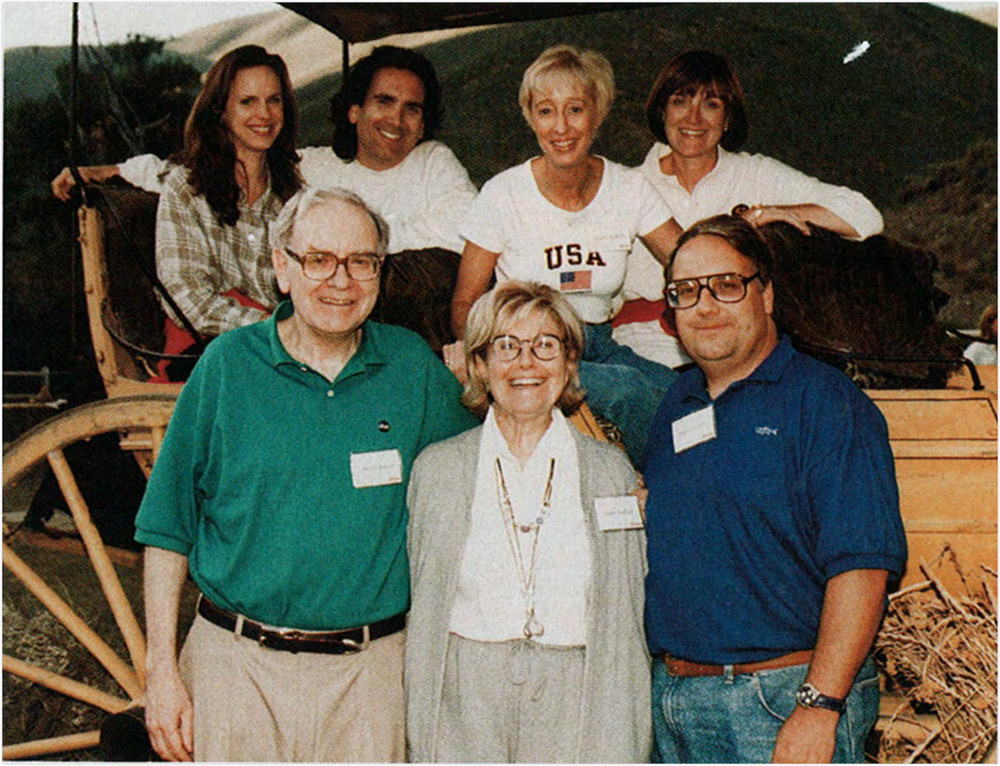
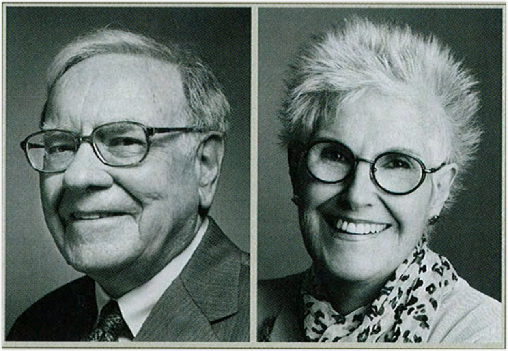
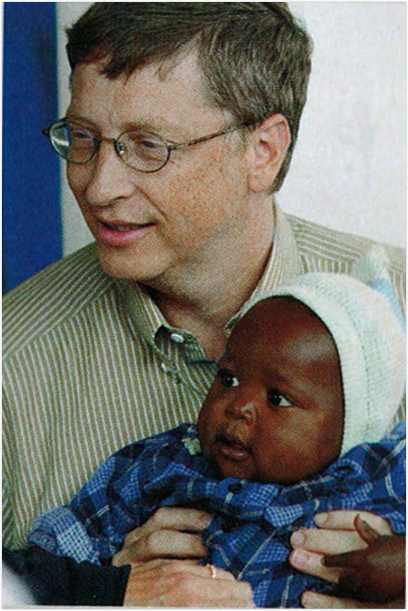

原文信息：

- 标题：Warren Buffett Gives It Away
- 作者：Carol J. Loomis
- 发表时间：2006-7-10
- 链接：[GIVES IT AWAY](https://berkshirehathaway.com/donate/fortune071006.pdf)
- 翻译：Vito
- 校对：Vito，Ponge

---

By Carol J. Loomis

作者：卡罗尔·J·卢米斯，

July 10, 2006 FORTUNE 

《财富》杂志，2006年7月10日

---

We were sitting in a Manhattan living room on a spring afternoon, and Warren Buffett had a Cherry Coke in his hand as usual. But this unremarkable scene was about to take a surprising turn. “Brace yourself,” Buffett warned with a grin. He then described a momentous change in his thinking. **Within months, he said, he would begin to give away his Berkshire Hathaway fortune, then and now worth well over $40 billion.** This news was indeed stunning. Buffett, 75, has for decades said his wealth would go to philanthropy but has just as steadily indicated the handoff would be made at his death. Now he was revising the timetable. "I know what I want to do,” he said, “and it makes sense to get going.” On that spring day his plan was uncertain in some of its details; today it is essentially complete. And it is typical Buffett: rational, original, breaking the mold of how extremely rich people donate money. 

春日午后，我们坐在曼哈顿的一间普通客厅，沃伦·巴菲特（Warren Buffett）像往常一样手里拿着一杯樱桃可乐。但这平淡无奇的一幕即将发生惊人转折。“做好准备”，巴菲特笑着提醒道。接着，他描述了自己思想上的一个重大变化。**他说，他将在几个月内开始捐出他在伯克希尔·哈撒韦公司的财富，当时和现在的价值都超过400亿美元**。这个消息确实令人震惊。现年75岁的巴菲特几十年来一直表示，他的财富将用于慈善事业，但他同样坚定地表示，将在他去世后移交财产。现在他正在修改时间表。“我知道这意味着什么，”他说，“开始行动是有意义的。”在那个春天的日子里，他的计划在某些细节上还不那么确定；如今，它基本上成型了。这是典型的巴菲特风格：理性、原创，打破了超级富豪捐款的模式。

Buffett has pledged to gradually give 85% of his Berkshire stock to five foundations. A dominant five-sixths of the shares will go to the world's largest philanthropic organization, the $30 billion Bill & Melinda Gates Foundation, whose principals are close friends of Buffett's (a connection that began in 1991, when a mutual friend introduced Buffett and Bill Gates). The Gateses credit Buffett, says Bill, with having "inspired” their thinking about giving money back to society. Their foundation's activities, internationally famous, are focused on world health — fighting such diseases as malaria, HIV/AIDS, and tuberculosis — and on improving U.S. libraries and high schools. Up to now, the two Gateses have been the only trustees of their foundation. But as his plan gets underway, Buffett will be joining them. Bill Gates says he and his wife are "thrilled" by that and by knowing that Buffett's money will allow the foundation to "both deepen and accelerate” its work. "The generosity and trust Warren has shown,” Gates adds, "is incredible." (See "Bill Gates Reboots" on page 72.)

巴菲特承诺，逐步将其85%的伯克希尔股份捐赠给五家基金会。大部分的，占总额六分之五的股份将捐给世界上最大的慈善组织——拥有300亿美元资产的比尔和梅琳达·盖茨基金会（Bill & Melinda Gates Foundation），该基金会的负责人是巴菲特的密友（这种关系始于1991年，当时一位共同的朋友介绍巴菲特和比尔·盖茨认识）。比尔说，是巴菲特“启发”了他们夫妇把钱回馈社会的想法。他们基金会的活动在国际上享有盛名，主要捐资于卫生事业，如战胜疟疾、艾滋病和结核病，以及改善美国的图书馆和高中。到目前为止，盖茨夫妇一直是他们基金会的唯一受托人。但随着他的计划开始实施，巴菲特将加入他们的行列。比尔·盖茨说，他和他的妻子对此感到“激动”，因为他们知道巴菲特的钱将使基金会“深化和加速”其工作。“沃伦所展现出的慷慨和信任，”盖茨补充道，“是无价的。”（见第72页“比尔·盖茨之重启”。）

Beginning in July and continuing every year, Buffett will give a set, annually declining number of Berkshire B shares — starting with 602,500 in 2006 and then decreasing by 5% per year — to the five foundations. The gifts to the Gates foundation will be made either by Buffett or through his estate as long as at least one of the pair—Bill, now 50, or Melinda, 41 — is active in it. Berkshire's price on the date of each gift will determine its dollar value. Were B shares, for example, to be $3,071 in July — that was their close on June 23 — Buffett's 2006 gift to the foundation, 500,000 shares, would be worth about $1.5 billion.

从今年7月开始，巴菲特将每年向这五家基金会捐赠一定数量的伯克希尔B类股，从 2006年的602,500股开始，以后每年递减5%。只要盖茨夫妇中至少有一人——现年50岁的比尔或41岁的梅琳达——仍活跃在基金会中，巴菲特本人或通过其遗产向盖茨基金会捐赠的股票就会被送出。伯克希尔公司在每笔捐赠之日的价格将决定该次捐赠的价值。例如，如果B类股在7月份的价格为3,071美元（接近6月23日的收盘价），那么巴菲特2006年赠与基金会的500,000股股票将价值约15亿美元。

With so much new money to handle, the foundation will be given two years to resize its operations. But it will then be required by the terms of Buffett's gift to annually spend the dollar amount of his contributions as well as those it is already making from its existing assets. At the moment, $1.5 billion would roughly double the foundation's yearly benefactions.

由于需要再分配如此多的新资金，基金会将被给与两年的时间来调整其项目规模。但根据巴菲特的捐赠条款，基金会每年必须用完巴菲特捐赠的金额，以及从现有资产中获得的收入。目前，15亿美元将使基金会的年捐款额翻一番。

But the $1.5 billion has little relevance to the value of Buffett's future gifts, since their amount will depend on the price of Berkshire's stock when they are made. If the stock rises yearly, on average, by even a modest amount — say, 6% — the gain will more than offset the annual 5% decline in the number of shares given. Under those circumstances, the value of Buffett's contributions will rise. Buffett himself thinks that will happen. Or to state that proposition more directly: He believes the price of Berkshire, and with it the dollar size of the contributions, will trend upward — perhaps over time increasing substantially. 

但这15亿美元与巴菲特未来捐赠的价值关系不大，因为捐赠金额将取决于捐赠做出时伯克希尔公司股票的价格。如果伯克希尔的股票每年平均上涨，哪怕涨幅不大，比如说6%，其增值也足以抵消每年5%的赠股数量下降。在这种情况下，巴菲特捐赠的价值就会上升。巴菲特本人也认为会出现这种情况。或者更直接地说：他认为伯克希尔公司的股价会上涨，随之而来的捐赠金额，也将呈上升趋势——或许随着时间的推移会大幅增加。

The other foundation gifts that Buffett is making will also occur annually and start in July. At Berkshire's current price, the combined 2006 total of these gifts will be $315 million. The contributions will go to foundations headed by Buffett's three children, Susan, Howard, and Peter, and to the Susan Thompson Buffett Foundation. This last foundation was for 40 years known simply as the Buffett Foundation and was recently renamed in honor of Buffett's late wife, Susie, who died in 2004, at 72, after a stroke. Her will bestows about $2.5 billion on the foundation, to which her husband's gifts will be added. The foundation has mainly focused on reproductive health, family planning, and prochoice causes, and on preventing the spread of nuclear weapons. 

巴菲特的其他捐赠也将于每年7月开始。按伯克希尔公司目前的股价计算，2006年这些捐赠的总额将达到3.15亿美元。这些捐赠将分配给由巴菲特的三个孩子苏珊、霍华德和彼得领导的基金会，以及苏珊-汤普森-巴菲特基金会。最后这家基金会40年来一直被称为巴菲特基金会（Buffett Foundation），最近更名是为了纪念巴菲特已故的妻子苏茜（Susie）。苏茜于2004年因中风去世，享年72岁。她依遗嘱向基金会捐赠了约25亿美元，她丈夫的捐赠也将加入其中。基金会主要关注生殖健康、计划生育、支持堕胎合法化事业，以及防止核武器扩散。

Counting the gifts to all five foundations, Buffett will gradually but sharply reduce his holdings of Berkshire stock. He now owns close to 31% of the company — worth nearly $44 billion in late June — and that proportion will ultimately be cut to around 5%. Sticking to his long-term intentions, Buffett says the residual 5%, worth about $6.8 billion today, will in time go for philanthropy also, perhaps in his lifetime and, if not, at his death.

算上对所有五家基金会的捐赠，巴菲特将逐步但大幅减持伯克希尔股票。目前，他持有伯克希尔公司近31%的股份——6月底价值近440亿美元——这一比例最终将减少到5%左右。巴菲特表示，他将坚持自己的长远打算，剩余的5%（目前价值约68亿美元）也将用于慈善事业，或许在他有生之年，或许在他去世以后。

Because the value of Buffett's gifts are tied to a future, unknowable price of Berkshire, there is no way to put a total dollar value on them. But the number of shares earmarked to be given have a huge value today: $37 billion. That alone would be the largest philanthropic gift in history. And if Buffett is right in thinking that Berkshire's price will trend upward, the eventual amount given could far exceed that figure. 

由于巴菲特捐赠的价值与伯克希尔未来尚不可知的股价挂钩，因此无法计算它们的美元总价值。但是，指定捐赠的股票现值就已高达370亿美元。仅这一条就将成为历史上最大的慈善捐赠。如果巴菲特认为伯克希尔的股价将继续上涨的看法是对的话，那么最终的捐赠金额可能远远超过这个数字。

So that's the plan. What follows is a conversation in which Buffett explains how he moved away from his original thinking and decided to begin giving now. The questioner is yours truly, FORTUNE editor-at-large Carol Loomis. I am a longtime friend of Buffett's, a Berkshire Hathaway shareholder, and a director of the Susan Thompson Buffett Foundation.

这就是巴菲特的捐赠计划。接下来的这段对话，巴菲特解释了他是如何改变最初的想法，决定从现在就开始捐赠的。提问者是《财富》杂志特约编辑卡罗尔·卢米斯。我是巴菲特的老朋友，是伯克希尔-哈撒韦公司的股东，也是苏珊·汤普森·巴菲特基金会的董事。

（译者注：下面为文中插入的补充资料）

---

**What the Legends Gave 传奇人物的贡献**

Their philanthropies were immense, given the small economic worlds of their time. But Buffett's contribution is miles bigger：

他们的慈善事业在当时经济规模较小的情况下也是巨大的。但巴菲特的贡献更加巨大：

Philanthropists 慈善家|Span of Giving 捐赠年代|Amount 捐赠金额|In Current Dollars 当前美元价值
---|---|---|---
Andrew Carnegie 安德鲁·卡内基|1902-1919|＄350 million|＄7.2 billion
John D. Rockefeller 约翰·洛克菲勒|1889-1937|＄530 million|＄7.1 billion
John D. Rockefeller Jr. 小约翰·洛克菲勒|1927-1960|＄475 million|$5.5 billion

---

（译者注：接补充资料前正文）

**Coming from you, this plan is pretty startling. Up to now you haven't been famous for giving away money. In fact, you've been roundly criticized now and then for not giving it away. So let's cut to the obvious question: Are you ill?**

**你亲口说出了这个计划，真是让人大吃一惊。到目前为止，你还没有因为慈善而出名。实际上，却时不时地因为没有捐赠而被严厉批评。所以我们得问一个下意识的问题：是因为得了什么重病吗?**

No, absolutely not. I feel terrific, and when I had my last physical, in October, my doctor gave me a clean bill of health. 

不，完全不是。我感觉棒极了。我最近的一次体检，是在去年10月，医生的结论是我很健康。

**Then what's going on here? Does your change in plans have something to do with Susie's death?**

**那是为什么呢？你改变计划和苏茜的去世有关吗？**

Yes, it does. Susie was two years younger than I, and women usually live longer than men. She and I always assumed that she would inherit my Berkshire stock and be the one who oversaw the distribution of our wealth to society, where both of us had always said it would go. And Susie would have enjoyed overseeing the process. She was a little afraid of it, in terms of scaling up. But she would have liked doing it, and would have been very good at it. And she wouldI really have stepped on the gas.

是的，确实有关。苏茜比我小两岁，而女人通常比男人长寿。她和我一直认为她会继承我的伯克希尔股份，并监督我们的财富向社会的分配，我们俩一直都相信这些财富最终会流向社会。苏茜会很乐意监督整个过程。虽然她会因为规模扩大（怕这些善款的流向不够好）而产生一点点担心。但她会喜欢这件事的，而且会做得很好。她真的是会踩油门的。

**By that you mean that she always wanted to give away more money, faster, than you did?**

**你的意思是说她总是想比你捐得更多，更快？**

Yes, she said that many times. As for me, I always had the idea that philanthropy was important today, but would be equally important in one year, ten years, 20 years, and the future generally. And someone who was compounding money at a high rate, I thought, was the better party to be taking care of the philanthropy that was to be done 20 years out, while the people compounding at a lower rate should logically take care of the current philanthropy.

是的，她说过很多次。对我来说，我一直认为慈善事业在今天很重要，但在一年、十年、二十年乃至更久的未来也同样重要。我认为，那些能够让资本更高速增值的人更适合在20年后做慈善捐赠，而那些较低速增值的人在逻辑上更应该在当前捐赠。

**But that theory also happened to fit what you wanted to do, right?**

**但这个理论恰好也符合你的想法，对吧？**

(*He laughs, hard.*) And how! No question about that. I was having fun — and still am having fun — doing what I do. And for a while I also thought in terms of control of Berkshire. I had bought effective control of Berkshire in the early 1970s, using $15 million I got when I disbanded Buffett Partnership. And I had very little money — considerably less than $1 million — outside of Berkshire. My salary was $50,000 a year. So if I had engaged in significant philanthropy back then, I would have had to give away shares of Berkshire. I hadn't bought those to immediately give them away.

（*他大笑*）是的！毫无疑问。我乐在其中——如今依然。有一段时间，我也曾考虑过伯克希尔的控制权。上世纪70年代初，我用解散巴菲特合伙公司（Buffett Partnership）时得到的1500万美元，买下了伯克希尔的控股权。在伯克希尔之外，我的钱很少——远远少于100万美元。我的年薪是5万美元。因此，如果当时我就做比较重大的慈善捐赠的话，将不得不放弃伯克希尔的股份。我买到伯克希尔的控股权不是为了马上就要送人的。

**Even so, you and Susie set up the Buffett Foundation way back in the 1960s, which means you obviously expected to be giving away money sometime. What was your thinking back then?**

**即便如此，你和苏茜早在20世纪60年代就成立了巴菲特基金会，这意味着你显然希望在某个时候捐出一些钱。你当时是怎么想的?**

Well, when we got married in 1952, I told Susie I was going to be rich. That wasn't going to be because of any special virtues of mine or even because of hard work, but simply because I was born with the right skills in the right place at the right time. I was wired at birth to allocate capital and was lucky enough to have people around me early on — my parents and teachers and Susie — who helped me to make the most of that. 

1952年我们结婚的时候，我告诉苏茜我未来会很有钱。这并不是因为我有什么特别的优点，甚至也不是因为我勤奋工作，而仅仅是因为我生来就有的正确技能，并且生在了正确的时间和正确的地点。我生来就擅长配置资本，而且很幸运，我身边的人——我的父母、老师和苏茜——很早就帮助我尽展此长。

In any case, Susie didn't get very excited when I told her we were going to get rich. She either didn't care or didn't believe me — probably both, in fact. But to the extent we did amass wealth, we were totally in sync about what to do with it — and that was to give it back to society. In that, we agreed with Andrew Carnegie, who said that huge fortunes that flow in large part from society should in large part be returned to society. In my case, the ability to allocate capital would have had little utility unless I lived in a rich, populous country in which enormous quantities of marketable securities were traded and were sometimes ridiculously mispriced. And fortunately for me, that describes the U.S. in the second half of the last century.

无论如何，当我告诉苏茜我们将来会很有钱的时候，她并没有很兴奋。她要么不在乎，要么不相信——实际上，可能兼而有之。但当我们实际积累起财富以后，我们对如何处理这些财富的看法是完全一致的——那就是把财富回馈社会。在这一点上，我们同意安德鲁·卡内基的观点，他说大部分来自社会的巨额财富应该同样大部分地回归社会。就我而言，除非我生活在一个富裕的、人口众多的国家，否则配置资本的能力几乎没有什么用处，在这个国家，大量有价证券在交易，有时被荒谬地错误定价。对我来说幸运的是，这正是描述了上世纪下半叶的美国。

Certainly neither Susie nor I ever thought we should pass huge amounts of money along to our children. Our kids are great. But I would argue that when your kids have all the advantages anyway, in terms of how they grow up and the opportunities they have for education, including what they learn at home — I would say it's neither right nor rational to be flooding them with money. In effect, they've had a gigantic headstart in a society that aspires to be a meritocracy. Dynastic mega-wealth would further tilt the playing field that we ought to be trying instead to level.

当然，苏茜和我都从未想过我们应该把大笔财富传给我们的孩子。我们的孩子都很棒。但我想说的是，当你的孩子无论如何都拥有了所有的优势，就他们的成长方式和受教育的机会而言，包括他们在家里学到的东西，我想说的是，倾财相授既不好也不理性。实际上，在一个渴望任人唯贤的社会，他们已经占据了巨大先机。家族财富帝国会使我们本应努力铲平的竞争环境进一步倾斜。

---

*The Buffetts At Sun Valley in 1996: At Susie's left, in front row, is son Howard. From left in the second row are son Peter with wife Jennifer; Howards wife, Devon; and daughter Susie.*

*1996 年，巴菲特一家在太阳谷：前排苏茜的左边是儿子霍华德。第二排左起分别是儿子彼得和妻子詹妮弗、霍华德的妻子德文和女儿苏茜。*

*Suresh Shivdasani — Allen & Co.*

*苏雷什·希夫达萨尼 - 艾伦公司*

---

**From the fact that you've given your kids money before to set up foundations and are planning to give them more now, I gather you don't think that kind of flooding them with money is wrong.**

**从你以前把钱交给孩子们让他们设立基金会，现在又打算给他们更多钱这一情况来看，我想你不会认为给他们太多钱会是错误的。**

No, I don't. What they're doing with their foundations is giving money back to society — just where Susie and I thought it should go. And they aren't just writing checks: They've put enormous thought and effort into the process. I'm very proud of them for the way they've handled it all, and I have no doubt they're going to keep on the right track.

不，我不会。他们通过他们的基金会所做的就是把钱返还给社会——这正是苏茜和我认为那些钱应该流向的地方。他们所做的不仅仅是写支票那么简单: 他们在这个过程中倾注了极大的思考和努力。我为他们处理这一切的方式感到骄傲，我毫不怀疑他们会保持在正确的轨道上。

**So what about the Susan Thompson Buffett Foundation and what all this means for it?**

**那么，苏珊·汤普森·巴菲特基金会的情况如何？这一切对这家基金会意味着什么？**

As you know, because as a director you've seen it close up, Allen Greenberg, the foundation's president, has done an excellent and thoughtful job of running it. His results-to-cost ratio is as good as I've ever seen. And he'll keep on that same path now, not just with Susie's money, but with mine too. Actually, if I had died before Susie and she had begun to distribute our wealth, this is the foundation that would have scaled up to a much bigger size — right now it has only five employees — and become her main vehicle for giving. And the foundation anchored my plans too. Until I changed my thoughts about when to give, this was to be where my fortune would go also.

正如你们所知道的，因为作为一名董事，我能近距离地观察它，艾伦·格林伯格，作为基金会的主席，做了很多出色的和深思熟虑的工作管理着它。他的投入成效比是我见过的最出色的。他会继续沿着这条成功之路走下去，不仅是为了苏茜的钱，还有我的钱。实际上，如果我在苏茜之前去世，就会是她来分配我们的财富，这家基金会就会成为她主要的捐赠工具，规模也会大得多——如今它只有五名员工。这家基金会也在我的计划之内。直到某一天我做出了何时捐赠的决定，我的财富也将流向这里。

**And what changed your mind?**

**是什么改变了你的想法?**

The short answer is that I came to realize that there was a terrific foundation that was already scaled-up — that wouldn't have to go through the real grind of getting to a megasize like the Buffett Foundation would — and that could productively use my money now. The longer answer is that over the years I had gotten to know Bill and Melinda Gates well, spent a lot of time with them having fun and, way beyond that, had grown to admire what they were doing with their foundation. I've seen them give presentations about its programs, and I'm always amazed at the enthusiasm and passion and energy they're pouring into their work. They've gone at it, you might say, with both head and heart. Bill reads many thousands of pages annually keeping up with medical advances and means of delivering help. Melinda, often with Bill along, travels the world looking at how well good intentions are being converted into good results. Life has dealt a terrible hand to literally billions of people around the world, and Bill and Melinda are bent on reducing that inequity to the extent they possibly can.

简短的回答是，我意识到已经有一家很棒的基金会实现了规模化——它不需要再经历像巴菲特基金会那样的艰难历程去扩大规模——它现在就可以让我的财富钱尽其用。更长的答案是，这些年来，我已经很了解比尔和梅琳达·盖茨夫妇，花了很多时间和他们相处，除此之外，也越来越钦佩他们用他们的基金会所做的事情。我看过他们的项目展示，我总是惊叹于他们为这项工作倾注的热情、激情和能量。你可以说，他们已经全情投入。比尔每年阅读数千页文献，以了解医学前沿和先进方法。梅琳达则经常陪着比尔一起在世界各地飞来飞去，以监督善因结出善果。不幸给全世界数十亿人民造成了可怕打击，比尔和梅林达决心尽其所能减少这种不平等。

If you think about it — if your goal is to return the money to society by attacking truly major problems that don't have a commensurate funding base — what could you find that's better than turning to a couple of people who are young, who are ungodly bright, whose ideas have been proven, who already have shown an ability to scale it up and do it right? You don't get an opportunity like that ordinarily. I'm getting two people enormously successful at something, where I've had a chance to see what they've done, where I know they will keep doing it — where they've done it with their own money, so they're not living in some fantasy world — and where in general I agree with their reasoning. If I've found the right vehicle for my goal, there's no reason to wait.

设想一下——如果你的目标是期望解决真正的重大问题来回报社会，而这些问题尚没有相应匹配的资金作为后盾，你会发现，还有什么比求助于几个年富力强的人更好的呢？这些人极其聪明，他们的主意已经得到证明，他们已经展示出了扩大规模的能力，并已正确诉诸现实。这样的机会是可遇不可求的。我遇到了两位已经在慈善事业上取得巨大成功的人，我有机会见证他们做了什么，我知道他们会继续做下去——他们花的是自己的钱，所以他们并非空想空谈——总的来说，我同意他们的设想。如果我已经为我的目的地找到了合适的交通工具，为什么还不上车呢。

Compare what I'm doing with them to my situation at Berkshire, where I have talented and proven people in charge of our businesses. They do a much better job than I could in running their operations. What can be more logical, in whatever you want done, than finding someone better equipped than you are to do it? Who wouldn't select Tiger Woods to take his place in a high-stakes golf game? That's
how I feel about this decision about my money.

与我在伯克希尔的情况相比，在那里，我选择了那些有才华和有实绩的人掌管我们的业务。他们在经营具体业务上比我做得好得多。无论你想做什么，还有什么比找一位比你更胜任的人来做更符合逻辑的呢？谁不会选择泰格·伍兹(Tiger Woods)来代替他参加一场高风险的高尔夫比赛呢？这就是我对这个关于我的捐赠决定的想法。

（译者注：下面为文中插入的补充资料）

---

**How Buffett's Giveaway Will Work**

**巴菲特的捐赠将如何运作**

*Carol J. Loomis*

*卡罗尔·J·卢米斯*

*The mind that built the fortune also came up with a complex plan to hand it off.*

*积累了那些财富的头脑也想出了一个复杂的计划，将财富拱手相让。*

Warren Buffett holds only Berkshire Hathaway A stock (474,998 shares), but his gifts are to be made in Berkshire B stock, into which each A share is convertible at a ratio of 30 to 1. He will convert A shares to obtain the B shares he needs for his gifts.

沃伦·巴菲特只持有伯克希尔·哈撒韦公司的 A 类股（474,998 股），但他的捐赠将以伯克希尔公司的 B 类股赠出，每股 A 类股可以按 1:30 的比例转换成 B 类股。他将通过转换A类股获得捐赠所需的 B 类股。

Buffett is earmarking a set number of B shares for each of the five foundations he has chosen to receive his gifts. In 2006 he will give 5% of the designated shares to each recipient. Next year the gifts will be 5% of the residual shares, and so on for every year until either Buffett's death or until certain conditions are no longer met at the foundations. At Buffett's death, his estate will distribute, in a way not yet definite, the remaining earmarked shares.

巴菲特为他选定接受捐赠的五家基金会分别指定了一定数量的B类股。2006年，他将把指定股份的 5%捐赠给每家受赠基金会。次年的捐赠将是剩余股份的5%，以后每年都如此重复，直到巴菲特去世或基金会不再满足某些受赠条件为止。巴菲特去世后，他的遗产将以某种尚未确定的方式分配剩余的指定股份。

Here are the recipients and the number of B shares to be allocated to them.

以下是受赠人以及分配给他们的B类股数量。

**Bill & Melinda Gates Foundation: Ten Million Shares**

**比尔·梅琳达·盖茨基金会：一千万股**

This foundation, the largest in world, has around $30 billion of assets right now and has given away $8 billion in its 12 years of existence. Most of its money (typically funneled through partners)has gone to world health programs and to U.S. education. Buffett's gifts to this foundation will continue only as long as either Bill or Melinda Gates is alive and active in its work.

该基金会是世界上最大的慈善基金，目前资产规模约300亿美元，成立12年来已经捐出了80亿美元。它的大部分资金（通常由合伙人筹集）都流向了世界卫生项目和美国教育事业。只要比尔·盖茨或梅琳达·盖茨健在并积极参与基金会的工作，巴菲特对基金会的捐赠就会一直持续下去。

*Susie Buffett would have approved of Warren's revised timetable.*

*苏茜·巴菲特一定会同意沃伦修订后的时间表*

**Susan Thompson Buffett Foundation: One Million Shares**

**苏珊·汤普森·巴菲特基金会：一百万股**

Once called simply the Buffett Foundation and renamed in 2004 for Buffett's wife, who died that year, this foundation has $270 million in assets. Most of its funds came from the estate of Susan T. Buffett, and $2.1 billion more is expected from that source. This foundation has focused on reproductive health, family planning, and pro-choice causes, and on preventing the spread of nuclear weapons.

该基金会曾被简称为巴菲特基金会，2004年，为了纪念在这一年去世的巴菲特的妻子而更为现名，目前资产规模2.7亿美元。其大部分资金来自苏珊·T·巴菲特的遗产，预计还将有21亿美元出自同一来源。该基金会重点关注生殖健康、计划生育、支持堕胎运动，以及防止核武器扩散。

**Susan A. Buffett Foundation: 350,000 Shares**

**苏珊·A·巴菲特基金会：35 万股**

This philanthropy is named for and chaired by Buffett's daughter, 52, who lives in Omaha (and who has also chaired the Susan Thompson Buffett Foundation since her mother's death). The daughter's foundation, which today has $118 million in assets, has funded early education for children of low-income families. With her father's new gifts, Susan Buffett expects to continue that work and expand into public-education and foster-care grants. 

该慈善机构以巴菲特52岁的女儿命名，并由她担任主席，她住在奥马哈（在母亲去世后，她还担任苏珊·汤普森·巴菲特基金会主席）。女儿的基金会目前资产规模1.18亿美元，为低收入家庭子女的早期教育提供资助。有了父亲的新捐赠，苏珊·巴菲特希望能继续这项工作，并将其扩展到公共教育和寄养补助领域。

**Howard G. Buffett Foundation: 350,000 Shares**

**霍华德·G·巴菲特基金会：35 万股**

Now holding $129 million in assets, this foundation was set up by Buffett's older son, 51, who farms 840 acres outside Decatur, Ill., and is on several corporate boards, including Berkshire's. (His middle name, by the way, is Graham — for famed investor Ben Graham.)This foundation's giving has been very international, taking in 42 countries and often aimed at conservation goals such as the protection of African wildlife habitats. But with its new money, the foundation plans to move much more heavily into clean-water projects, food relief, the plight of children entangled in illegal immigration, and other humanitarian areas. 

该基金会资产规模1.29亿美元，由巴菲特的大儿子设立，他今年51岁，在伊利诺伊州迪凯特郊外拥有840英亩的农场，是包括伯克希尔公司在内的多家公司董事会成员（顺便提一下，他的中间名是格雷厄姆，也就是著名的投资家本·格雷厄姆的名字）。该基金会的捐赠非常国际化，涉及42个国家，通常以保护为目标，如保护非洲野生动物栖息地。但有了新的资金，该基金会计划在清洁水项目、食品救济、非法移民中的困境儿童救济以及其他人道主义领域加大投入。

**NoVo Foundation: 350,000 Shares**

**诺沃基金会：35 万股**

Named for the Latin word novo(meaning "I alter"), this foundation is run by Peter Buffett, 48, a musician and composer, and his wife, Jennifer, who live in New York City. Currently holding $120 million in assets, it has focused on funding individuals and organizations working to open up education opportunities, reverse environmental degradation, up-hold human rights, and improve understanding and respect among various cultures and ethnicities.

该基金会以拉丁文novo（意为 "我改变"）命名，由48 岁的音乐家兼作曲家彼得·巴菲特和他的妻子詹妮弗管理，他们定居纽约。该基金会目前资产规模1.2亿美元，主要资助致力于开拓教育机会、扭转环境退化、维护人权以及增进不同文化和种族之间的理解和尊重的个人和组织。

---

*Times 2005 Persons of the Year were the Gateses and musician/humanitarian Bono. A photo caught Buffett too, because it was shot in Omaha, where Bono was appearing.*

*2005 年时代杂志年度人物是盖茨夫妇和音乐家/慈善家波诺。照片中也拍到了巴菲特，因为照片是在奥马哈拍摄的，波诺当时正在那里。*

---

（译者注：接补充资料前正文）

**People will be very curious, I think, as to how much your decision — and its announcement at this particular time is connected to Bill Gates' announcement in mid-June that he would phase out of his operating responsibilities at Microsoft and begin to devote most of his time to the foundation. What's the story here?**

**我想，人们会非常好奇，你的决定——以及为什么在这一时间宣布这个决定——与比尔·盖茨在6月中旬宣布他将逐步退出他在微软的经营职责，并将他的大部分时间投入到基金会有多大的联系。这里边有什么故事吗?**

I realize that the close timing of the two announcements will suggest they're related. But they aren't in the least. The timing is just happenstance. I would be disclosing my plans right now whether or not he had announced his move — and even, in fact, if he were indefinitely keeping on with all of his work at Microsoft. On the other hand, I'm pleased that he's going to be devoting more time to the foundation. And I think he and Melinda are pleased to know they're going to be working with more resources.

我知道，这两个时间间隔这么近会让人们有所联想。但事实并非如此。时间相近只是巧合。不管比尔是否宣布了他的离职，我都会立即宣布我的计划——甚至，即使他无限期继续他在微软的工作，我也会这么决定。另一方面，我很高兴他可以把更多的时间花在基金会上。我想他和梅琳达都会欣然接受他们的基金会将有更多资源用于慈善。

**Does it occur to you that it's somewhat ironic for the second-richest man in the world to be giving untold billions to the first-richest man?**

**你有没有想过，世界上第二富有的人给第一富有的人数不胜数的钱，这是不是有点滑稽?**

When you put it that way, it sounds pretty funny. But in truth, I'm giving it *through* him — and, importantly, Melinda as well — not *to* him.

当你这么描述这件事的时候，听起来是挺滑稽。但事实上，我是*借*他们的基金会把钱返还给社会——重要的是，还有梅琳达，而不仅是盖茨一人——而不是*给*他们。

**Some people say the Gates foundation is bureaucratic, and bureaucracy is just about your No. 1 dislike. So how do you react to that charge?**

**有人批评盖茨基金会的官僚主义，而官僚主义正是你最不喜欢的东西。那么你会如何回应这种批评呢？**

I would say that most large organizations — though Berkshire is a shining exception — are bureaucratic to some degree. Anyway, what some people really mean when they claim that the Gates foundation is bureaucratic is that big decisions don't get made by anybody except Bill and Melinda. That suits me fine. I want the two of them to make the big calls.

我想说，大多数大型组织——尽管伯克希尔是一个耀眼的例外——在某种程度上都存在官僚主义。不管怎样，当一些人批评盖茨基金会的官僚主义的时候，他们真正的意思是，除了比尔和梅琳达，其他人都不能做什么重大决策。那正合我意。我希望的也是由他们俩来做重大的决策（而不是什么人都能轻易决定把钱送出去）。

**What is the significance of your going on the board of the Gates foundation?**

**你加入盖茨基金会董事会意味着什么?**

Not much. The biggest reason for my doing that is if they were ever to go down on an airplane together. Beyond that, I hope to have a constructive thought now and then. But I don't think I'm as well cut out to be a philanthropist as Bill and Melinda are. The feedback on philanthropy is very slow, and that would bother me. I'd have to be too involved with a lot of people I wouldn't want to be involved with and have to listen to more opinions than I would enjoy. In philanthropy also, you have to make some big mistakes. I know that. But it would bother me more to make the mistakes myself, rather than having someone else make them whom I trust overall to do a good job. In general, Bill and Melinda will have a better batting average than I would.

没什么特别的。我这么做的最大原因是，如果他们一起遭遇空难（基金会不至于无人驾驭）。除此之外，我也希望能时不时地贡献一些建设性的想法。但我不觉得我像比尔和梅琳达那样适合做慈善。慈善事业的反馈机制特别缓慢，这会困扰我。（做慈善）要和很多我不那么喜欢的人共事，不得不听取更多的意见，这些我都不喜欢。我也知道，在慈善事业中，犯错在所难免。但是，如果是让我自己犯错，而不是让我信任的人放手去做，我会更加烦恼。总的来说，比尔和梅琳达的平均击打率会比我高。

**Did you talk this huge decision over with other people before deciding to go ahead with the plan?**

**在付诸实施之前，你和其他人商量过这个重大的决定吗?**

Yes, I talked to my children and Allen Greenberg, and to four Berkshire directors, including my son Howard and Charlie Munger. I got lots of questions, and some people had qualms about the plan initially because it was such an abrupt change from what they had been anticipating. But I'd say everybody, and that certainly includes Allen — who knows what a bear it would have been to scale up the Buffett Foundation — came around to seeing the logic of what I was proposing to do. Now all concerned can't wait to get started — particularly me.

是的，我和我的孩子们、艾伦•格林伯格（Allen Greenberg）以及伯克希尔哈撒韦公司（Berkshire）的四位董事商量过，其中包括我的儿子霍华德（Howard）和查理•芒格（Charlie Munger）。我被问了很多问题，其中的一些人一开始对这个计划感到不安，因为与他们的预期大相径庭。但我要说的是，所有人，当然包括艾伦——他知道扩大巴菲特基金会（Buffett Foundation）的规模会多么令人头疼——都逐渐意识到我想做的这件事的意义。如今，所有关心这件事的人都迫不及待了——尤其是我。

And frankly, I have some small hopes that what I'm doing might encourage other very rich people thinking about philanthropy to decide they didn't necessarily have to set up their own foundations but could look around for the best of those that were up and running and available to handle their money. People do that all the time with their investments. They put their money with people they think are going to do a better job than they could. There's some real merit to extending that thought to your wealth, rather than setting up something to be run after your death by a bunch of old business cronies or a staff that eventually comes to dictate the agenda. Some version of this plan I've got is not a crazy thing for some of the next 20 people who are going to die with $1 billion or more to adopt themselves. One problem most rich people have is that they're old, with contemporaries who are not at their peak years and who don't have much time ahead of them. I'm lucky in that respect in that I can turn to younger people.

坦率地说，我有一些小小的愿望，希望我的做法能鼓励其他富人考虑慈善捐赠，他们不一定要建立自己的慈善基金，也可以考虑那些已经在运行的基金中的佼佼者，也可以打理他们的钱。人们在投资时总是会这么做。他们会把钱投给他们认为比他们自己做得更好的人。将这一理念延伸到财富传承有很多好处，而不是在你死后再由一帮老伙计来运作某个机构，或由一帮雇员按照机械的程序照章办事。我这个计划的某些版本，对于未来将要去世的20名，死后将留下10亿美元或更多遗产的人来说，并不是什么疯狂的事情。大多数最富之人面临的问题是，他们都年事已高，他们的同侪也都巅峰已过，未来时日不多。在这方面我很幸运，因为我可以将接力棒交给年轻人。

**Okay, now what does that mean for Berkshire?**

**好吧，这对伯克希尔来说会意味着什么?**

I'd say virtually nothing. Anybody who knows me also knows how I feel about making Berkshire as good as it can be, and that goal is still going to be there. I won't do anything differently, because I'm not capable of doing things differently. The name on the stock certificates will change, but nothing else will.

我想说几乎不会有什么变化。所有了解我的人都知道，我想把伯克希尔办得尽善尽美，这一目标仍将继续。我不会做任何不同的事情，因为我没有能力做不同的事情。股票上的名字会变，其他什么都不会变。

I've always made it clear to Berkshire's shareholders that my wealth from the company would go to philanthropy, so the fact that I'm starting the process is basically a nonevent for them.

我一直向伯克希尔的股东们明确表示，我在这家公司的财富（指股份）将用于慈善事业，所以我启动这一进程对他们来说不是什么惊天大事。

And, you know, though this may surprise some people, it's a non-event for me too in some ways. Ted Turner, whose philanthropic activities I admire enormously, once told me that his hands shook when he signed a $1 billion pledge. Well, I have zero of that. To me, there's just no emotional downside to this at all.

而且，你知道，虽然这可能会让一些人感到惊讶，但在某种程度上对我来说也不是什么大事。泰德 · 特纳（CNN创始人），我非常钦佩他的捐赠善举，曾经告诉我，在他签署一份10亿美元的捐赠承诺时，手都在抖。我却一点也没有。对我来说，（捐赠这件事）没有任何情绪上的负面影响。

（译者注：下面为文中插入的补充资料）

---

**The Global Force Called The Gates Foundation**

**被称为“盖茨基金会”的环球力量**

*The philanthropy's impact, already immense, will be magnified by Buffett's billions.*

*巴菲特的数十亿美元将放大这项慈善事业本已巨大的影响力。*

It is by far the largest foundation in the world — even now, before Warren Buffett's historic gifts. And its creed is appropriately broad: "Guided by the belief that every life has equal value, the Bill Melinda Gates Foundation works to reduce inequities and improve lives around the world."

这是**目前世界上规模最大**的基金会——在沃伦·巴菲特（Warren Buffett）做出历史性捐赠之前就已经是。该基金会的宗旨非常宽泛： 比尔·梅琳达·盖茨基金会秉承 "每个生命都一样珍贵"的信念，致力于减少不平等现象，改善全世界人民的生活。

To further its work, the foundation currently has just over $30 billion in assets, a purse built up from Bill and Melinda Gates' gifts of $26 billion and appreciation in its broadly diversified investments(which at the moment contain no Microsoft). The $30 billion, of course, does not include the $8 billion in gifts that the foundation has made since 1994. Last year it gave $1.36 billion, and this year it expects to spend around $1.5 billion.

为了推动基金会的发展，基金会目前的资产规模超300亿美元，这些资产来自比尔·盖茨和梅琳达·盖茨夫妇捐赠的260亿美元，以及基金会广泛的多元化投资（目前不包括微软公司）的增值。当然，这300亿美元并不包括基金会自1994年以来已经捐出去的80亿美元。去年，基金会捐出了13.6亿美元，今年预计将捐出约15亿美元。

Now it will be Buffett and the Gateses building up the foundation together. Bill and Melinda have said that almost all their fortune will go to charity, and right now they still have an estimated net worth of $50 billion.

如今，将由巴菲特和盖茨夫妇共同发展这家基金会。比尔和梅琳达曾表示，他们几乎所有的财产都将用于慈善事业，目前他们的净资产估计仍有500亿美元。

*In Mozambique Bill meets a small client*

*在莫桑比克，比尔见到了一个小客户。*

The foundation works heavily through partners(nongovernmental organizations, usually)and has focused on big causes. Its original giving was directed at providing U.S. libraries free online access — and today more than 99% are hooked up. The foundation then broadened its efforts to global health, on which it now spends around 60% of its funds. Much of that is beamed at what Bill Gates calls "the Big Three diseases": malaria, HIV/AIDS, and tuberculosis. The foundation is both pushing to discover a preventive AIDS vaccine and to deliver antiretrovirals to people already afflicted with the disease. In other areas, spending is focused on making medical "leaps" — the discovery, say, of a chemical that would block malaria-transmitting mosquitoes from smelling humans.

该基金会主要通过合作伙伴（通常是非政府组织）开展工作，并专注于重大议题。基金会最初的捐赠目标是为美国图书馆提供免费在线访问——如今已有超过99%的图书馆接入了这一服务。随后，基金会将工作范围扩大到了全球健康领域，目前约有60%的资金投向该领域。其中大部分用于支持解决比尔·盖茨所说的 "三大疾病"：疟疾、艾滋病和肺结核。基金会既在努力寻找预防艾滋病的疫苗，也在为已经感染艾滋病的人提供抗逆转录病毒药物。在其他领域，基金会的支出重点是实现医学上的 "飞跃"——例如，发现一种化学物质，可以阻止传播疟疾的蚊子闻到人类的气味。

The Pacific Northwest receives sizable Gates grants. The national drive, meanwhile, is riveted on improving high schools, which Bill Gates has called"obsolete."The foundation and its partners have started 900 new schools and "redesigned" 700 others. The schools effort has stuttered some as the foundation has struggled to find out what works. But CEO Patty Stonesifer says roadblocks only stiffen the foundation's resolve. "We'll be stepping up our investment here,"she says, "because providing every student a quality education is key to ensuring equality of opportunity."

西北太平洋地区获得了盖茨基金会的大量赠款。与此同时，全国性的投入则集中在改善被比尔·盖茨称为"过时"的高中。基金会及其合作伙伴已经开办了900所新学校，并"重新设计"了700所其他学校。由于基金会一直在努力寻找更为行之有效的方法，学校的工作有些停滞不前。但首席执行官帕蒂·斯通西弗（Patty Stonesifer）表示，道路上的障碍只会坚定基金会的决心。"她说："我们将加大对这方面的投资，因为为每个学生提供优质教育是确保机会平等的关键。

---

*The fate of his fortune sealed, Buffett (at Omaha headquarters) will, as usual, be focusing on the job he loves: running Berkshire Hathaway.*

*他的财富终局已经确定，巴菲特（在奥马哈总部）将像往常一样，专注于他热爱的工作：经营伯克希尔哈撒韦公司。*

---

（译者注：接补充资料前正文）

**Won't the foundations that are getting your stock need to sell it?**

**获得你捐赠股票的基金会需要卖出那些股票吗?**

Yes, in some cases. The Buffett Foundation and the kids' foundations will have to sell their stock relatively soon after they get it, because it will be their only asset — and they'll need to raise cash to give away. The Gates foundation will have more options because it has lots of other assets, so it will have some flexibility to choose which it should turn into cash. Bill and Melinda will make the decisions about that. I'm going to totally insulate myself from any investment decisions their foundation makes, which leaves them free to do whatever they think makes sense. Perhaps they will decide to sell bigger portions of other assets and hang on to some Berkshire. It's a great mix of businesses and wouldn't be an inappropriate asset for a foundation to own. But I won't tie the foundation up in any shape or form.

是的，某些情况下确实需要。巴菲特基金会和孩子们的基金会在获得股票后将不得不尽快卖出，因为那些股票是他们唯一的资产——他们需要筹集现金才能对外捐赠。盖茨基金会则有更多的选择，因为它还有很多其他资产，所以可以灵活选择将哪些资产变现。比尔和梅琳达将决定卖或不卖。我将完全不参与他们基金会的任何投资决策，以使他们可以自由地做任何他们认为有意义的决策。或许他们会决定出售更多的其他资产，保留一些伯克希尔股票。伯克希尔是一系列极佳企业的组合，不会是基金会不适合持有的资产。但我不会以任何形式束缚基金会。

**So it could be that all the shares you give annually will be sold in the market?**

**也就是说，你每年捐赠的那些股份全部都会被向市场抛售对吧?**

Yes, that may well happen. And naturally people are going to be interested in whether that selling could weigh down Berkshire's price. I don't think so in the least — and that's true even though the annual turnover ratio for Berkshire has been running only about 15% a year, which is extremely low for large-cap stocks. Let's say the five foundations sell all the stock they get this year. If trading volume continues as it has, their selling will raise turnover to less than 17%. It would be ridiculous to think that much new selling could affect the price of the stock. In fact, the added supply could even be beneficial in increasing the stock's liquidity and should make it more likely that Berkshire would eventually be included in the S&P 500.

是的，这很有可能发生。人们自然会关心这种抛售是否会拖累伯克希尔的股价。我却一点都不担心——这是真的，尽管伯克希尔的年换手率每年只有 15%，对于大盘股来说已经非常低了。假设五家基金会在年内就卖出所有今年的受捐股票，如果交易量继续维持当前水平，他们的卖出将使换手率上升到不到17%。如果认为这么点新卖盘就会影响股价，那就太荒谬了。实际上，增加的供应量甚至可能有利于提高股票的流动性，并使伯克希尔公司更有可能最终被纳入标准普尔500指数。

I'd say this: I would not be making the gifts if they would in any way harm Berkshire's shareholders. And they won't.

我想说的是：如果这些捐赠会对伯克希尔的股东造成任何一点伤害的话，我就不会捐了。这事儿不会发生的。

**This plan seems to settle the fate, over the long term, of all your Berkshire shares. Does that mean you're giving *nothing* to your family in straight-out gifts?**

**从长远来看，这一计划似乎将决定你所有伯克希尔股份的归属。这是否意味着你将*不会*给家人留什么遗产？**

No, what I've always said is that my family won't receive huge amounts of my net worth. That doesn't mean they'll get nothing. My children have already received some money from me and Susie and will receive more. I still believe in the philosophy — FORTUNE quoted me saying this 20 years ago — that a very rich person should leave his kids enough to do anything but not enough to do nothing. \[The FORTUNE article was "Should You Leave It All to the Children?" Sept. 29, 1986.\]

不，我一直说的是，我的家人不会从我的净资产中继承巨额财富。但这并不意味着他们什么一无所获。我的孩子们已经从我和苏茜那里得到了一些钱，而且还会继续收到更多。我仍然信奉这样一个理念——《财富》杂志20 年前引用了我说过的这句话——一个非常富有的人应该给他的孩子们留下足够的钱能去做任何事情，却不能多到什么都可以不做。\[《财富》杂志的文章是 "你应该把一切都留给孩子吗？"1986年9月29日。\］

Remember I said that way back when I was buying Berkshire, I had less than $1 million in outside cash? Well, I've made a few decent investments with that money in the years since — taking positions that were too small for Berkshire, doing some fixed-income arbitrage, and selling my interest in a bank that was split off from Berkshire. So I'm glad to say I've got quite a bit of cash now. Overall I can — and will — use all my Berkshire shares for philanthropic purposes and will have plenty left over to provide well for all those close to me.

还记得我说过，早在买进伯克希尔时，我其余的现金不到100万美元吗？在那之后的几年里，我用这些钱做了一些不错的投资——持有了一些对伯克希尔来说太小的头寸，做了一些固定收益套利，还卖掉了从伯克希尔分拆出来的一家银行的股权。所以我很高兴地说，我现在还有不少现金。总的来说，我可以——也将会——把我所有的伯克希尔股份用于慈善事业，并仍将有足够的钱为我亲近的人提供良好的生活条件。

FEEDBACK cloomis@fortunemail.com

